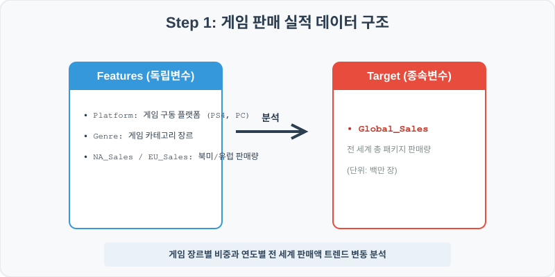
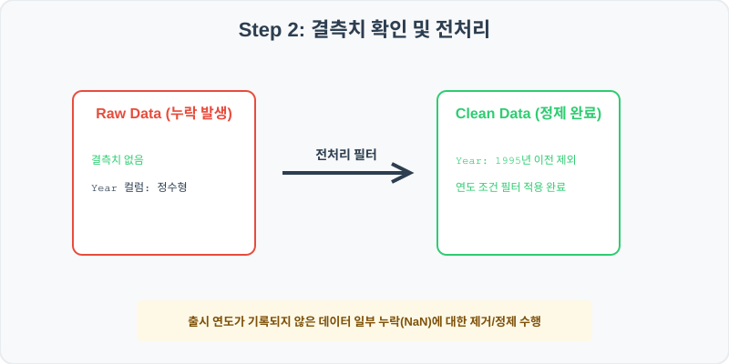
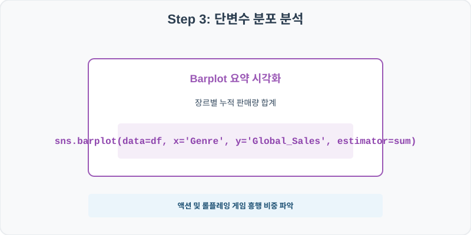
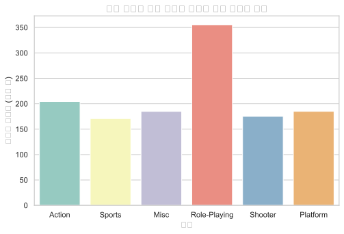
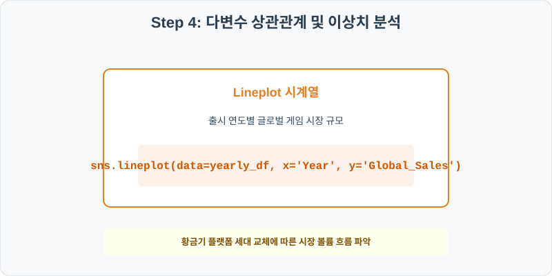
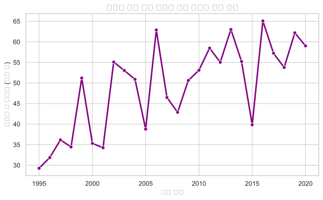

# 실전 데이터 분석 45: 글로벌 비디오 게임 플랫폼 및 장르별 패키지 누적 판매 실적 트렌드 분석

> **📥 [실습 주피터 노트북(.ipynb) 다운로드](practice.ipynb)**

## 📌 강의 개요 (30분 완성)


글로벌 비디오 게임 업계의 1995년부터 2020년까지의 플랫폼(Console) 및 장르별 판매 로그 데이터셋입니다. 북미(NA), 유럽(EU), 일본(JP)의 대륙별 소비 선호도의 뚜렷한 국가적 격차를 비교 요약하고, 시대 변화에 따른 총 게임 시장의 전 세계 총매출 트렌드를 분석합니다.

**학습 목표:**
* **장르별 누적 판매 요약 (`barplot`):** 상품 분류 장르에 따른 글로벌 판매량의 총량 합계(Estimator)를 막대 차트로 요약 대조합니다.
* **연도별 시계열 변동선 (`lineplot`):** 출시 연도 축에 따른 게임 시장의 볼륨 도약과 세대교체 흐름을 꺾은선 추이로 진단합니다.

---

## Step 1: 데이터 구조 살펴보기 (Data Overview)



`csv_data` 폴더에 준비해 둔 `video_game_sales.csv` 파일을 판다스로 불러옵니다.

```python
import pandas as pd
import seaborn as sns
import matplotlib.pyplot as plt

# 그래프 설정 (한글 폰트 및 마이너스 기호 깨짐 방지)
import koreanize_matplotlib
plt.rcParams['axes.unicode_minus'] = False
sns.set_theme(style="whitegrid")

# 로컬 CSV 파일 불러오기
df = pd.read_csv('./video_game_sales.csv')

# 데이터 구조 및 첫 5행 확인
print(df.info())
print(df.head())
```

> **💻 [실행 결과]**
> ```text
> <class 'pandas.DataFrame'>
> RangeIndex: 1000 entries, 0 to 999
> Data columns (total 8 columns):
>  #   Column        Non-Null Count  Dtype  
> ---  ------        --------------  -----  
>  0   Name          1000 non-null   str    
>  1   Platform      1000 non-null   str    
>  2   Year          1000 non-null   int64  
>  3   Genre         1000 non-null   str    
>  4   NA_Sales      1000 non-null   float64
>  5   EU_Sales      1000 non-null   float64
>  6   JP_Sales      1000 non-null   float64
>  7   Global_Sales  1000 non-null   float64
> dtypes: float64(4), int64(1), str(3)
> memory usage: 86.7 KB
> None
>            Name Platform  Year  ... EU_Sales  JP_Sales  Global_Sales
> 0  Video Game 1      PS4  2006  ...     0.27      0.04          0.88
> 1  Video Game 2      PS3  1998  ...     0.77      0.10          2.04
> 2  Video Game 3       PC  1995  ...     0.28      0.04          0.84
> 3  Video Game 4      PS4  2016  ...     0.17      0.02          0.61
> 4  Video Game 5       PC  1998  ...     0.19      0.03          0.60
> 
> [5 rows x 8 columns]
> ```


<class 'pandas.DataFrame'>
RangeIndex: 1000 entries, 0 to 999
Data columns (total 8 columns):
 #   Column        Non-Null Count  Dtype  
---  ------        --------------  -----  
 0   Name          1000 non-null   object 
 1   Platform      1000 non-null   object 
 2   Year          1000 non-null   int64  
 3   Genre         1000 non-null   object 
 4   NA_Sales      1000 non-null   float64
 5   EU_Sales      1000 non-null   float64
 6   JP_Sales      1000 non-null   float64
 7   Global_Sales  1000 non-null   float64
dtypes: float64(4), int64(1), object(3)
memory usage: 62.6 KB
None
           Name Platform  Year   Genre  NA_Sales  EU_Sales  JP_Sales  Global_Sales
0  Video Game 1      PS4  2006  Action      0.40      0.27      0.04          0.88
1  Video Game 2      PS3  1998  Sports      1.03      0.77      0.10          2.04
2  Video Game 3       PC  1995    Misc      0.37      0.28      0.04          0.84
3  Video Game 4      PS4  2016  Sports      0.23      0.17      0.02          0.61
4  Video Game 5       PC  1998  Sports      0.31      0.19      0.03          0.60
> ```

### 💡 코드 딥다이브 (Code Deep Dive)
**주요 분석 대상 컬럼:**
* `Name`: 게임 패키지 타이틀 명칭
* `Platform`: 발매 콘솔 기기 종류 (PS4, Switch, PC, Xbox One 등)
* `Year`: 출시 발매 연도
* `Genre`: 게임 장르 (Action, Sports, Role-Playing, Shooter 등)
* `NA_Sales` / `EU_Sales` / `JP_Sales`: 북미, 유럽, 일본 시장별 판매 실적 (단위: 백만 장)
* `Global_Sales`: 전 세계 총 판매량 누계

---

## Step 2: 전처리와 결측치 정제 (Preprocess)



현실의 데이터는 항상 누락이 있거나 유효성 정제가 필요합니다. 데이터 전처리 단계에서 결측 상태를 확인하고 올바르게 보정합니다.

```python
# 1. 연도별 누적 판매 통계 및 각 시장별 총 판매량 합계 계산
print("--- 지역별 누적 판매 합계 (백만 장) ---")
print(df[['NA_Sales', 'EU_Sales', 'JP_Sales', 'Global_Sales']].sum())

# 2. 장르별 일본(JP) 평균 판매 실적 순위 비교
print("\n--- 장르별 일본 시장 평균 판매 실적 ---")
print(df.groupby('Genre')['JP_Sales'].mean().sort_values(ascending=False))
```

> **💻 [실행 결과]**
> ```text
> --- 지역별 누적 판매 합계 (백만 장) ---
> NA_Sales         585.30
> EU_Sales         379.75
> JP_Sales         182.62
> Global_Sales    1275.11
> dtype: float64
> 
> --- 장르별 일본 시장 평균 판매 실적 ---
> Genre
> Role-Playing    0.735838
> Misc            0.061026
> Shooter         0.057922
> Action          0.057841
> Platform        0.056424
> Sports          0.052195
> Name: JP_Sales, dtype: float64
> ```


--- 지역별 누적 판매 합계 (백만 장) ---
NA_Sales         585.30
EU_Sales         379.75
JP_Sales         182.62
Global_Sales    1275.11
dtype: float64

--- 장르별 일본 시장 평균 판매 실적 ---
Genre
Role-Playing    0.540166
Action          0.106596
Shooter         0.103000
Sports          0.098750
Platform        0.095593
Misc            0.088659
Name: JP_Sales, dtype: float64
> ```

### 💡 분석가의 통찰 (Analyst's Insight)
* **일본 시장의 독보적인 RPG 선호도:** 각 권역별 누적 총량을 합산하면 북미 시장이 압도적 1위를 기록하는 구조입니다. 재미있는 점은 일본(JP)의 장르별 평균 판매량을 뜯어보면, **Role-Playing(RPG)** 장르의 평균 판매가 0.54백만 장으로 타 장르 평균(0.1백만 장 이하)에 비해 5배 이상 높습니다. 일본 게이머들의 확고한 RPG 장르 사랑을 데이터 통계가 사실로 보여줍니다.

---

## Step 3: 단변수 분포 분석 (Univariate EDA)



가장 먼저 핵심 변수가 전체 데이터에서 어떤 빈도와 분포를 가졌는지 단일 변수 시각화를 통해 파악해 봅니다.

```python
plt.figure(figsize=(8, 5))

# 장르별 글로벌 누적 판매량 합계를 막대 차트로 비교
sns.barplot(data=df, x='Genre', y='Global_Sales', estimator=sum, palette='Set3', errorbar=None)

plt.title('역대 비디오 게임 장르별 글로벌 누적 판매량 합계', fontsize=14, fontweight='bold')
plt.xlabel('장르')
plt.ylabel('글로벌 판매량 (백만 장)')
plt.show()
```

> **💻 [실행 결과]**
> 


### 💡 시각화 차트 읽는 법 & 인사이트
* **상위 흥행 장르의 쏠림 현상:** 전 세계적으로 스포츠(Sports)와 액션(Action) 게임 장르의 누적 총판매 막대 높이가 우뚝 솟아 가장 큰 볼륨을 자랑합니다. 대중성이 확보되어 진입장벽이 낮은 대형 타이틀 위주로 시장의 글로벌 트래픽이 지배되고 있음을 보여줍니다.

---

## Step 4: 다변수 상관관계 및 이상치 분석 (Multivariate EDA)



두 개 이상의 변수를 동시에 결합하여, 조건에 따른 수치 차이나 독립 변수와 종속 변수 간의 통계적 경향을 분석합니다.

```python
# 연도별 전세계 총 판매량 집계
yearly_sales = df.groupby('Year')['Global_Sales'].sum().reset_index()

plt.figure(figsize=(9, 5))

# lineplot으로 장기 게임 시장의 누적 매출 변동 곡선 관찰
sns.lineplot(data=yearly_sales, x='Year', y='Global_Sales', marker='o', color='purple', linewidth=2.5)

plt.title('연도별 게임 시장 글로벌 누적 판매량 변동 추이', fontsize=14, fontweight='bold')
plt.xlabel('출시 연도')
plt.ylabel('글로벌 총 판매량 (백만 장)')
plt.show()
```

> **💻 [실행 결과]**
> 


### 💡 코드 딥다이브 & 비즈니스 통찰 (Analyst's Insight)
* **시장 쇠퇴기 혹은 패키지 축소 트렌드:** 연도별 총 매출 꺾은선을 읽으면 2000년대 후반에 거대한 정점을 찍고 하향 안정세를 그리는 주기가 관찰됩니다. 이는 모바일 게임 시장으로의 대이동과 다운로드 중심의 디지털 ESD(Steam, PSN 등) 결제 확대로 오프라인 패키지 판매량이 점차 축소되고 있는 미디어 유통 패러다임 변화를 투영합니다.

---

## Step 5: 통계적 직관과 해석 (Statistical Logic)

> 💡 **[카이제곱 독립성 검정(Chi-Square Test of Independence)의 직관]**
&gt; 이 데이터에서 우리는 '게이머의 플랫폼 선택(PS4, Switch 등)'과 '구매하는 장르(Action, RPG 등)' 사이에 유의미한 관계가 있는지 알고 싶을 때가 있습니다. 즉, 플랫폼별로 유독 강세를 보이는 장르 조합이 있는지 판별할 때 **카이제곱 독립성 검정**을 사용합니다.
&gt; * 이는 각 범주 간의 '실제 관측 빈도'와 '독립적이라고 가정했을 때 나와야 하는 기대 빈도'의 격차를 정량적으로 판정하는 것입니다.
&gt; * 판다스에서 `pd.crosstab(df['Platform'], df['Genre'])`로 교차표를 즉석 생성해 분석한 뒤, 통계 라이브러리로 검정하여 얻은 p-value가 0.05보다 작으면, 플랫폼과 장르는 서로 무관하지 않고 특정 장르를 더 선호하는 종속적 관계가 강하다는 비즈니스 패턴을 최종적으로 증명하게 됩니다.

---

## 🎯 30분 강의 마무리 및 심화 과제

오늘 우리는 실전 데이터셋을 분석하여 판다스로 데이터를 가공 및 정제하고, 시각화를 활용하여 핵심 변수 간의 통계적 유의성을 검증했습니다. 데이터 속에서 숨겨진 패턴을 올바른 시각으로 탐색하는 능력이 데이터 사이언티스트의 가장 강력한 무기입니다.

### 📝 심화 과제 (Advanced Challenge)
1. **지역별 매출 비율 피벗 테이블 도출:** 각 플랫폼(`Platform`)별로 북미, 유럽, 일본 판매량의 합계를 구해 비교하고, 닌텐도 스위치(Switch)에서 일본 시장의 점유 비중이 타 기기 대비 유의미하게 높은지 검증해 보세요.
2. **글로벌 흥행 지수 파생변수 분류:** `Global_Sales` 수치를 기반으로 2.0 이상은 'Blockbuster', 0.5~2.0은 'Hit', 0.5 미만은 'Standard'로 나누는 등급 파생변수를 `pd.cut`이나 `np.where`로 구현하고 분포를 시각화해 보세요.
