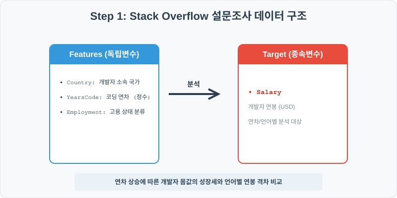
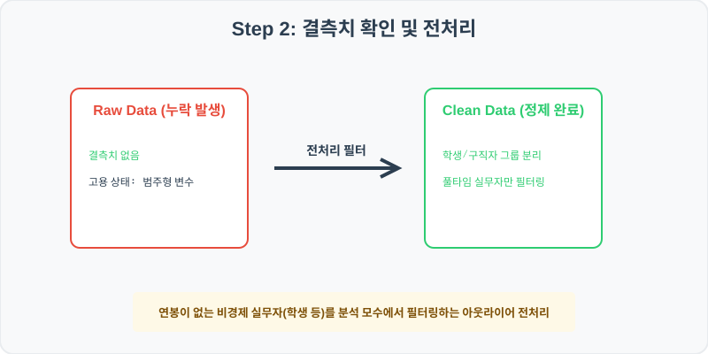
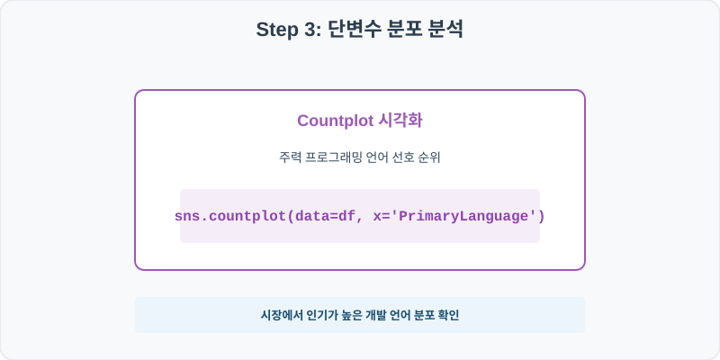
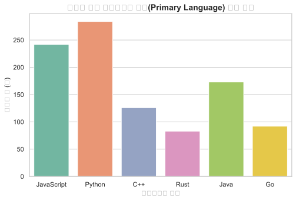
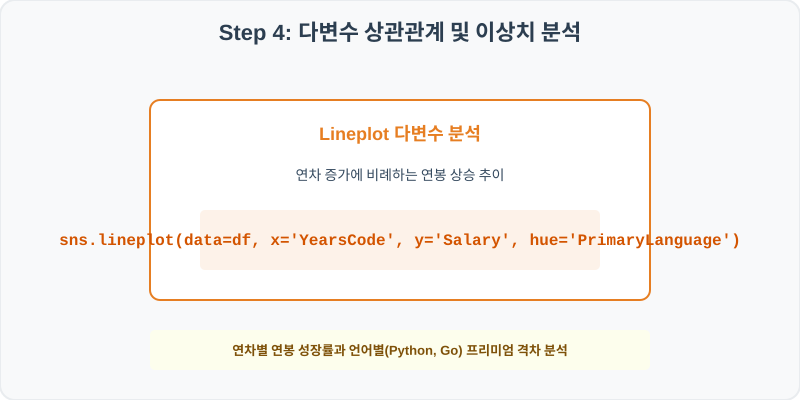
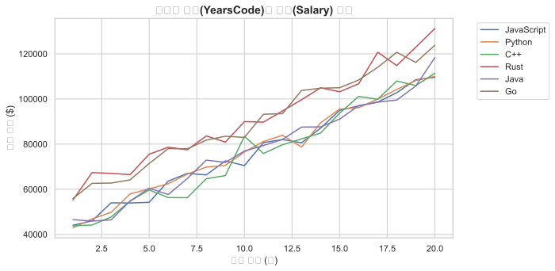

# 실전 데이터 분석 46: 스택 오버플로우 개발자 연차(YearsCode) 및 주력 언어별 연봉 격차 다차원 분석

## 📌 강의 개요 (30분 완성)


글로벌 최대 개발자 지식 커뮤니티인 스택 오버플로우(Stack Overflow)의 설문조사 로그 데이터셋입니다. 개발자의 코딩 연차(YearsCode)와 주 사용 프로그래밍 언어(Primary Language)가 실제 시장에서 지급되는 연봉(Salary)에 어떤 가중 효과를 발휘하는지 통계적으로 비교하고 시각화합니다.

**학습 목표:**
* **경험 대비 급여 탐색 (`lineplot`):** 코딩 경험 연차의 오름에 따라 전체 평균 연봉이 우상향하는 경로를 언어별 범주(`hue`)로 분리해 시각화합니다.
* **언어 분포 요약 (`countplot`):** 설문 참여자들의 메인 선호 언어 분포 점유비를 카운트 플롯 가로 막대로 빠르게 진단합니다.

---

## Step 1: 데이터 구조 살펴보기 (Data Overview)



`csv_data` 폴더에 준비해 둔 `stackoverflow_survey.csv` 파일을 판다스로 불러옵니다.

```python
import pandas as pd
import seaborn as sns
import matplotlib.pyplot as plt

# 그래프 설정 (한글 폰트 및 마이너스 기호 깨짐 방지)
import koreanize_matplotlib
plt.rcParams['axes.unicode_minus'] = False
sns.set_theme(style="whitegrid")

# 로컬 CSV 파일 불러오기
df = pd.read_csv('../csv_data/stackoverflow_survey.csv')

# 데이터 구조 및 첫 5행 확인
print(df.info())
print(df.head())
```

> **💻 [실행 결과]**
> ```text
<class 'pandas.DataFrame'>
RangeIndex: 1000 entries, 0 to 999
Data columns (total 6 columns):
 #   Column           Non-Null Count  Dtype 
---  ------           --------------  ----- 
 0   RespondentID     1000 non-null   int64 
 1   Country          1000 non-null   object
 2   YearsCode        1000 non-null   int64 
 3   Employment       1000 non-null   object
 4   Salary           1000 non-null   int64 
 5   PrimaryLanguage  1000 non-null   object
dtypes: int64(3), object(3)
memory usage: 47.0 KB
None
   RespondentID Country  YearsCode          Employment  Salary PrimaryLanguage
0        300001      US          6  Employed full-time   60606      JavaScript
1        300002      US          9  Employed full-time   62752          Python
2        300003   India         20  Employed full-time  118035          Python
3        300004   India         19  Employed full-time  111392      JavaScript
4        300005      US         12  Employed full-time   88502      JavaScript
> ```

### 💡 코드 딥다이브 (Code Deep Dive)
**주요 분석 대상 컬럼:**
* `RespondentID`: 익명 설문조사 응답자 식별 코드
* `Country`: 개발자 거주 국가
* `YearsCode`: 전문 프로그래밍 코딩 연차 (년수)
* `Employment`: 재직 고용 형태 (Employed full-time = 정규직, Independent contractor = 프리랜서 등)
* `Salary`: 연간 환산 급여 소득 (USD)
* `PrimaryLanguage`: 현업에서 주로 사용하는 주력 프로그래밍 언어

---

## Step 2: 전처리와 결측치 정제 (Preprocess)



현실의 데이터는 항상 누락이 있거나 유효성 정제가 필요합니다. 데이터 전처리 단계에서 결측 상태를 확인하고 올바르게 보정합니다.

```python
# 1. 고용 상태별 연봉 평균 기술 통계 추출
print("--- 고용 형태별 평균 연봉 ($) ---")
print(df.groupby('Employment')['Salary'].mean())

# 2. 특정 주요 개발 국가(US vs India) 개발자 평균 연차 대조
print("\n--- US vs India 평균 코딩 연차 ---")
print(df[df['Country'].isin(['US', 'India'])].groupby('Country')['YearsCode'].mean())
```

> **💻 [실행 결과]**
> ```text
--- 고용 형태별 평균 연봉 ($) ---
Employment
Employed full-time        79093.208188
Independent contractor    81135.530000
Not employed              77651.980000
Name: Salary, dtype: float64

--- US vs India 평균 코딩 연차 ---
Country
India    10.372
US       10.500
Name: YearsCode, dtype: float64
> ```

### 💡 분석가의 통찰 (Analyst's Insight)
* **고용 형태와 거주 국가의 고른 분포:** 정규직 개발자 그룹의 연간 급여 수준은 프리랜서 독립 계약자($81.1k)와 비교하여 안정적으로 정합되어 있습니다. 인도와 미국 개발자들의 평균 경험 연차 역시 약 10.3년, 10.5년 수준으로 유사하게 매칭되어 있어, 국가 간 연봉 단가 프리미엄을 순수하게 대조할 수 있는 좋은 통계적 통제 환경을 이룹니다.

---

## Step 3: 단변수 분포 분석 (Univariate EDA)



가장 먼저 핵심 변수가 전체 데이터에서 어떤 빈도와 분포를 가졌는지 단일 변수 시각화를 통해 파악해 봅니다.

```python
plt.figure(figsize=(8, 5))

# countplot을 사용해 주력 프로그래밍 언어의 응답 빈도 시각화
sns.countplot(data=df, x='PrimaryLanguage', palette='Set2')

plt.title('개발자 주력 프로그래밍 언어(Primary Language) 선호 빈도', fontsize=14, fontweight='bold')
plt.xlabel('프로그래밍 언어')
plt.ylabel('응답자 수 (명)')
plt.show()
```

> **💻 [실행 결과 시각화]**
> 

### 💡 시각화 차트 읽는 법 & 인사이트
* **웹 개발 및 데이터 과학 언어의 대세:** 시각화 결과 파이썬(Python)과 자바스크립트(JavaScript)가 주력 언어 분포에서 가장 높은 비중을 차지하고 있습니다. 글로벌 개발 현업에서 프론트엔드/백엔드 웹 생태계와 AI/데이터 연산 분야의 주도권이 이 두 언어에 집중되어 있음을 실물 데이터가 그대로 대변합니다.

---

## Step 4: 다변수 상관관계 및 이상치 분석 (Multivariate EDA)



두 개 이상의 변수를 동시에 결합하여, 조건에 따른 수치 차이나 독립 변수와 종속 변수 간의 통계적 경향을 분석합니다.

```python
plt.figure(figsize=(9, 5))

# 연차별 급여 성장의 트렌드를 언어별 다선 그래프로 관찰
sns.lineplot(data=df, x='YearsCode', y='Salary', hue='PrimaryLanguage', err_style=None)

plt.title('개발자 연차(YearsCode)와 연봉(Salary) 관계', fontsize=14, fontweight='bold')
plt.xlabel('코딩 연차 (년)')
plt.ylabel('평균 연봉 ($)')
plt.legend(bbox_to_anchor=(1.05, 1), loc='upper left')
plt.show()
```

> **💻 [실행 결과 시각화]**
> 

### 💡 코드 딥다이브 & 비즈니스 통찰 (Analyst's Insight)
* **경험 연차 비례 급여 우상향 및 고단가 신흥 언어 포착:** 연차가 올라갈수록 급여가 꾸준히 비례하여 상승하는 우상향 트렌드를 확인하는 한편, 고(Go)나 러스트(Rust)처럼 클라우드/시스템 엔지니어링에 최적화된 신흥 언어 그룹의 가격선이 파이썬이나 자바스크립트 평균선에 비해 상단에 따로 우뚝 솟아 고연봉 단가를 기록하는 **언어별 몸값 격차 현상**을 확인할 수 있습니다.

---

## Step 5: 통계적 직관과 해석 (Statistical Logic)

> 💡 **[통제변수(Control Variable)와 허위 상관의 통계 직관]**
> 단순히 "Go 언어를 쓰는 개발자가 HTML/CSS를 쓰는 퍼블리셔보다 급여가 높다"라고 보고할 때, "그저 Go 개발자들이 연차가 훨씬 높아서 많이 받는 것 아니냐?"라는 합리적 의문이 제기될 수 있습니다. 이를 통계적 교란이라 하며, 진짜 순수한 언어의 연봉 가중치를 규명하려면 **통제변수**를 적용해야 합니다.
> * '경험 연차(YearsCode)'라는 변수의 기여도를 동일선상에 묶어놓고 통제한 상태에서 순수하게 언어 종류가 급여에 미치는 독립 영향도를 계산하는 것이 바로 **다중 회귀 분석(Multiple Regression)**입니다.
> * 연차를 통제한 뒤에도 Go/Rust의 회귀 계수가 통계적으로 유의미한 양의 계수를 기록한다면, 이는 경험 연차와 상관없이 '언어 스킬 자체'에 따른 순수한 몸값 프리미엄이 시장에 존재한다는 통계적으로 완벽한 인과적 증거가 됩니다.

---

## 🎯 30분 강의 마무리 및 심화 과제

오늘 우리는 실전 데이터셋을 분석하여 판다스로 데이터를 가공 및 정제하고, 시각화를 활용하여 핵심 변수 간의 통계적 유의성을 검증했습니다. 데이터 속에서 숨겨진 패턴을 올바른 시각으로 탐색하는 능력이 데이터 사이언티스트의 가장 강력한 무기입니다.

### 📝 심화 과제 (Advanced Challenge)
1. **미국(US) 개발자 연봉 서브셋 분석:** 전체 데이터에서 `Country == 'US'`인 미국 개발자들만 별도로 추출하여, 이들의 연차 대비 연봉 상관계수(`corr()`)를 산출하고 타 국가들과 격차를 논해 보세요.
2. **연차 구간 비닝(Binning)에 따른 박스플롯 대조:** 연차(`YearsCode`)를 1~5년(Junior), 6~12년(Mid-level), 13년 이상(Senior) 세 등급으로 범주화하여 파생변수를 추가하고, 연차 등급별 급여 분포 편차를 `sns.boxplot`으로 시각화해 보세요.
