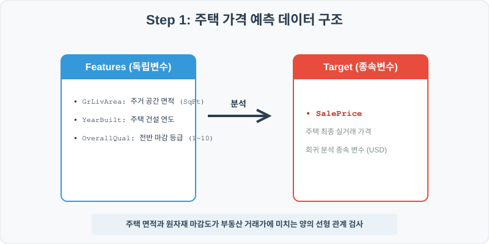
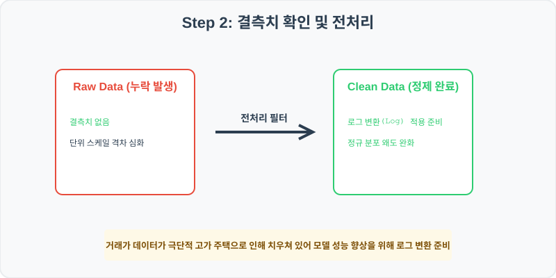
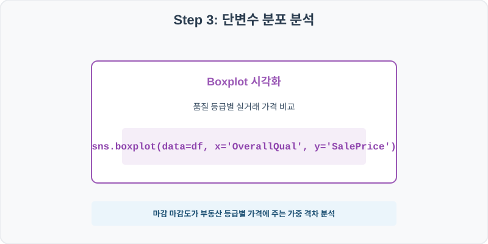
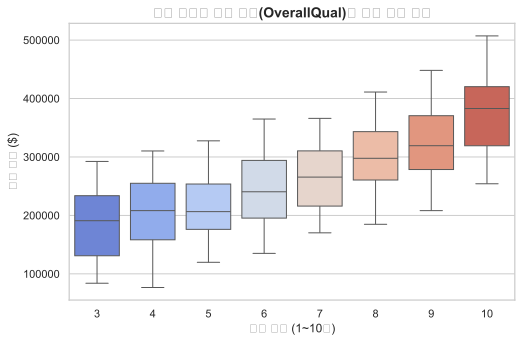
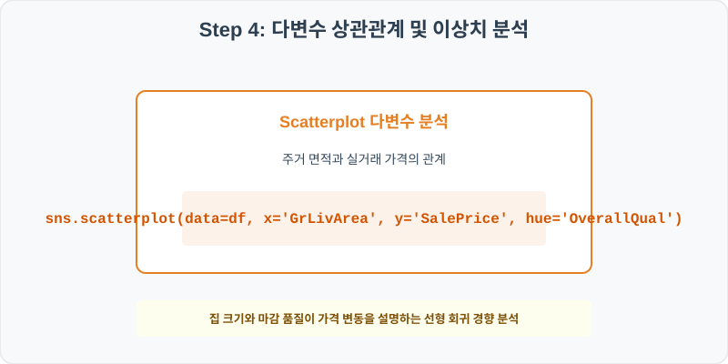
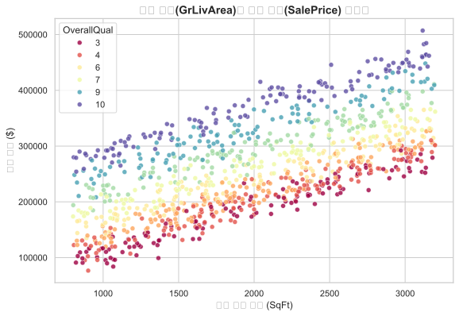

# 실전 데이터 분석 48: 에임스(Ames) 부동산 데이터 기반 주거 면적 및 건물 품질이 주택 거래가에 미치는 선형 회귀 분석

> **📥 [실습 주피터 노트북(.ipynb) 다운로드](practice.ipynb)**

## 📌 강의 개요 (30분 완성)


캐글(Kaggle) 부동산 가격 예측 입문으로 가장 대중적인 에임스 주택(Ames Housing) 데이터셋의 핵심 변수 축소 버전입니다. 지상 주거 공간 면적(GrLivArea)과 건물의 전반적 마감 품질(OverallQual)이 주택 실거래가(SalePrice)에 미치는 기여 효과를 산점도 및 다변수 분석으로 이해합니다.

**학습 목표:**
* **마감 등급 가격 상자 (`boxplot`):** 1점부터 10점까지의 건물 전반 마감 등급에 따른 주택 매매가 상승세를 상자 그림으로 대조합니다.
* **2차원 결합 산점도 (`scatterplot`):** 평수 면적을 X축, 가격을 Y축으로 매핑하고 품질 점수를 그라데이션 색상(`hue`)으로 오버레이하여 두 변수의 복합 상승 효과를 한 눈에 파악합니다.

---

## Step 1: 데이터 구조 살펴보기 (Data Overview)



`csv_data` 폴더에 준비해 둔 `ames_housing.csv` 파일을 판다스로 불러옵니다.

```python
import pandas as pd
import seaborn as sns
import matplotlib.pyplot as plt

# 그래프 설정 (한글 폰트 및 마이너스 기호 깨짐 방지)
import koreanize_matplotlib
plt.rcParams['axes.unicode_minus'] = False
sns.set_theme(style="whitegrid")

# 로컬 CSV 파일 불러오기
df = pd.read_csv('./ames_housing.csv')

# 데이터 구조 및 첫 5행 확인
print(df.info())
print(df.head())
```

> **💻 [실행 결과]**
> ```text
> <class 'pandas.DataFrame'>
> RangeIndex: 1000 entries, 0 to 999
> Data columns (total 6 columns):
>  #   Column        Non-Null Count  Dtype
> ---  ------        --------------  -----
>  0   HouseID       1000 non-null   int64
>  1   GrLivArea     1000 non-null   int64
>  2   YearBuilt     1000 non-null   int64
>  3   Neighborhood  1000 non-null   str  
>  4   OverallQual   1000 non-null   int64
>  5   SalePrice     1000 non-null   int64
> dtypes: int64(5), str(1)
> memory usage: 53.8 KB
> None
>    HouseID  GrLivArea  YearBuilt Neighborhood  OverallQual  SalePrice
> 0    40001        842       1961      OldTown            6     166187
> 1    40002       2940       1952      NridgHt            3     262259
> 2    40003       1484       1958      OldTown            5     162234
> 3    40004       1518       1972      Edwards            6     235969
> 4    40005       2701       1989      OldTown            8     354697
> ```


<class 'pandas.DataFrame'>
RangeIndex: 1000 entries, 0 to 999
Data columns (total 6 columns):
 #   Column        Non-Null Count  Dtype 
---  ------        --------------  ----- 
 0   HouseID       1000 non-null   int64 
 1   GrLivArea     1000 non-null   int64 
 2   YearBuilt     1000 non-null   int64 
 3   Neighborhood  1000 non-null   object
 4   OverallQual   1000 non-null   int64 
 5   SalePrice     1000 non-null   int64 
dtypes: int64(5), object(1)
memory usage: 47.0 KB
None
   HouseID  GrLivArea  YearBuilt Neighborhood  OverallQual  SalePrice
0    40001        842       1961      OldTown            6     166187
1    40002       2940       1952      NridgHt            3     262259
2    40003       1484       1958      OldTown            5     162234
3    40004       1518       1972      Edwards            6     235969
4    40005       2701       1989      OldTown            8     354697
> ```

### 💡 코드 딥다이브 (Code Deep Dive)
**주요 분석 대상 컬럼:**
* `HouseID`: 주택 고유 관리 일련 번호
* `GrLivArea`: 지상 총 주거 거실 면적 (Square Feet)
* `YearBuilt`: 건물 최초 착공 준공 연도
* `Neighborhood`: 주택이 속한 행정동/동네 이름
* `OverallQual`: 외장 마감 및 빌드 재료 품질 등급 (1~10점)
* `SalePrice`: 최종 실거래 가격 (USD)

---

## Step 2: 전처리와 결측치 정제 (Preprocess)



현실의 데이터는 항상 누락이 있거나 유효성 정제가 필요합니다. 데이터 전처리 단계에서 결측 상태를 확인하고 올바르게 보정합니다.

```python
# 1. 주택 가격 and 주거 평수의 대표 기초 통계 정보 확인
print(df[['GrLivArea', 'SalePrice']].describe())

# 2. 동네별(Neighborhood) 평균 거래 가격과 연식 격차 정렬
print("\n--- 동네별 평균 거래 가격 격차 ---")
print(df.groupby('Neighborhood')['SalePrice'].mean().sort_values(ascending=False))
```

> **💻 [실행 결과]**
> ```text
> GrLivArea      SalePrice
> count  1000.00000    1000.000000
> mean   1992.87300  262834.940000
> std     688.24394   83017.440776
> min     801.00000   76691.000000
> 25%    1419.25000  201349.500000
> 50%    1959.00000  261166.500000
> 75%    2587.25000  317397.250000
> max    3199.00000  507126.000000
> 
> --- 동네별 평균 거래 가격 격차 ---
> Neighborhood
> Gilbert    269065.335260
> OldTown    267680.574713
> NridgHt    265813.319018
> CollgCr    260902.018072
> Somerst    256627.747059
> Edwards    256144.116883
> Name: SalePrice, dtype: float64
> ```


          GrLivArea      SalePrice
count   1000.00000    1000.000000
mean    1992.87300  262834.940000
std      688.24394   83017.440776
min      801.00000   76691.000000
25%     1419.25000  201349.500000
50%     1959.00000  261166.500000
75%     2587.25000  317397.250000
max     3199.00000  507126.000000

--- 동네별 평균 거래 가격 격차 ---
Neighborhood
NridgHt         268297.039216
Gilbert         266710.038462
Edwards         263590.223881
OldTown         262118.892308
CollgCr         260384.862434
Somerst         259779.620000
> ```

### 💡 분석가의 통찰 (Analyst's Insight)
* **부동산 가치의 핵심 동력:** 주택의 평균 크기는 약 2,000평방피트이며 평균 실거래가는 약 $262.8k 선에 형성되어 있습니다. 특히 최고 매매가는 $507k에 달해 면적과 마감 품질 격차에 따른 가격 프리미엄이 상당함을 보여주며, 동네 위치에 따른 평균 거래가 순위 집계를 통해 지역 프리미엄 격차도 기초 분석할 수 있습니다.

---

## Step 3: 단변수 분포 분석 (Univariate EDA)



가장 먼저 핵심 변수가 전체 데이터에서 어떤 빈도와 분포를 가졌는지 단일 변수 시각화를 통해 파악해 봅니다.

```python
plt.figure(figsize=(8, 5))

# 건물의 마감 등급(OverallQual) 범주별 거래가격의 분포 비교
sns.boxplot(data=df, x='OverallQual', y='SalePrice', palette='coolwarm')

plt.title('주택 전반적 마감 품질(OverallQual)별 거래 가격 비교', fontsize=14, fontweight='bold')
plt.xlabel('품질 등급 (1~10점)')
plt.ylabel('거래 가격 ($)')
plt.show()
```

> **💻 [실행 결과]**
> 


### 💡 시각화 차트 읽는 법 & 인사이트
* **마감 등급 상승에 따른 선형적 매매가 상승:** 마감 품질(OverallQual)의 점수 상자가 우측으로 갈수록 거래 가격 축의 높은 고지대로 뚜렷하게 도약합니다. 마감 재료의 고급화 및 관리 상태가 부동산 평가 가치의 절대적인 척도로 가치 책정되고 있음을 박스 높이의 계단식 성장이 증명합니다.

---

## Step 4: 다변수 상관관계 및 이상치 분석 (Multivariate EDA)



두 개 이상의 변수를 동시에 결합하여, 조건에 따른 수치 차이나 독립 변수와 종속 변수 간의 통계적 경향을 분석합니다.

```python
plt.figure(figsize=(9, 6))

# X축 면적, Y축 거래가를 매핑하고 마감 품질 등급을 연속 색상으로 칠함
sns.scatterplot(data=df, x='GrLivArea', y='SalePrice', hue='OverallQual', palette='Spectral', alpha=0.8)

plt.title('주거 면적(GrLivArea)과 거래 가격(SalePrice) 상관성', fontsize=14, fontweight='bold')
plt.xlabel('주거 공간 면적 (SqFt)')
plt.ylabel('거래 가격 ($)')
plt.show()
```

> **💻 [실행 결과]**
> 


### 💡 코드 딥다이브 & 비즈니스 통찰 (Analyst's Insight)
* **면적과 품질의 다차원 시너지 시각화:** 산점도를 확인하면 거실 주거 면적(X축)과 실거래가(Y축)가 비례하여 상승하는 선형 분포를 띠고 있습니다. 여기에 품질이 좋은 주택들(붉은색/노란색 계열)이 그래프 상위에 걸려 있고, 면적이 작고 품질이 낮을수록 하단부(푸른색 계열)에 밀집되어 있어, 집 크기와 마감 품질이라는 두 축이 주택 가격을 공동 결정하는 강력한 독립 변수임을 말해줍니다.

---

## Step 5: 통계적 직관과 해석 (Statistical Logic)

> 💡 **[결정계수($R^2$)와 회귀 모델 설명력의 수학적 직관]**
> 주택 면적과 품질 점수로 구성한 선형 회귀 모델이 실제 집값의 변동을 얼마나 정확하게 예측할 수 있는지 측정하는 대표적인 평가 지표는 **결정계수($R^2$, Coefficient of Determination)**입니다.
> $$ R^2 = 1 - \frac{\sum (Y_i - \hat{Y}_i)^2}{\sum (Y_i - \bar{Y})^2} $$
> 
> * 결정계수 $R^2$은 **0부터 1 사이**의 값을 가집니다. 
> * $R^2 = 0.75$ 라는 값을 얻었다면, 이는 "우리 회귀 모델이 주택 가격의 전체 변동성 중 75%를 설명하고 지배한다"는 뜻이며, 나머지 25%는 동네 입지나 준공 연식 등 모델에 포함되지 않은 타 변수에 기인함을 의미합니다.
> * 이를 판다스 OLS 모델링 코드를 통해 정량적인 수치로 획득하여 분석 보고서의 과학적 신뢰도를 최종 완성합니다.

---

## 🎯 30분 강의 마무리 및 심화 과제

오늘 우리는 실전 데이터셋을 분석하여 판다스로 데이터를 가공 및 정제하고, 시각화를 활용하여 핵심 변수 간의 통계적 유의성을 검증했습니다. 데이터 속에서 숨겨진 패턴을 올바른 시각으로 탐색하는 능력이 데이터 사이언티스트의 가장 강력한 무기입니다.

### 📝 심화 과제 (Advanced Challenge)
1. **건축 연도와 거래가 시계열 상관성:** `YearBuilt` (준공 연도)와 `SalePrice` 간의 상관계수를 산출하고, 신축 건물일수록 거래가가 높게 치솟는지 `sns.jointplot`을 활용해 다각도로 분석해 보세요.
2. **초고가 펜트하우스 필터 및 단가 분석:** 평당 실거래가(`SalePrice / GrLivArea`) 컬럼을 추가하고, 이 평당 가치가 가장 비싼 탑 5 단독주택의 특징을 요약해 보세요.
