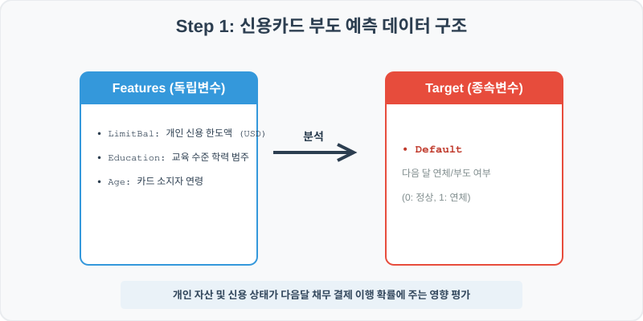
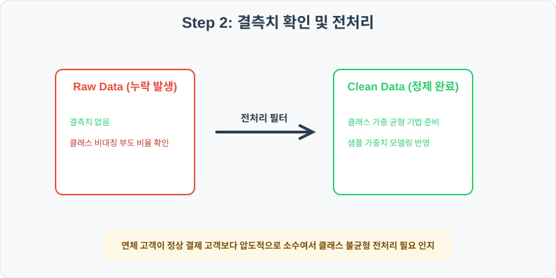
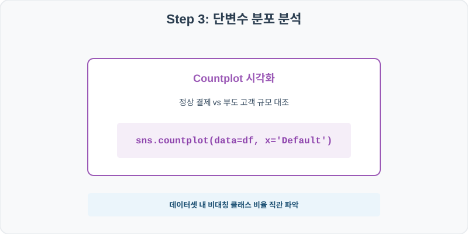
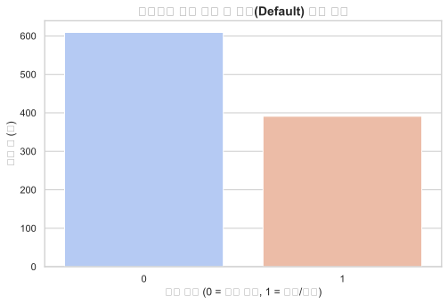
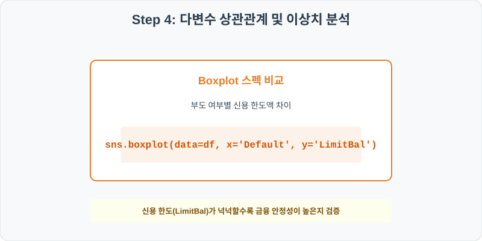
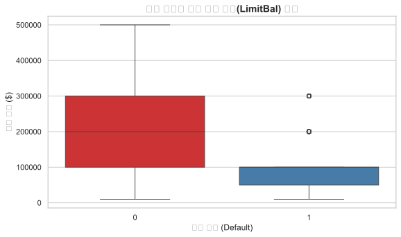

# 실전 데이터 분석 49: 고객 신용 한도액 및 연령층별 다음 달 신용카드 부도(Default) 위험도 분석

## 📌 강의 개요 (30분 완성)


금융기관의 대출 및 신용카드 심사 평가를 돕기 위한 신용 위험 데이터셋입니다. 고객의 카드 한도액(LimitBal), 학력(Education), 연령(Age)을 기반으로 다음 달 결제 대금을 갚지 못해 부도 위험에 직면하는 고객 비율(Default)을 탐색하고, 클래스 불균형이 심한 이진 분류 데이터셋의 통계 처리 요령을 학습합니다.

**학습 목표:**
* **부도 비율 현황 (`countplot`):** 연체(Default = 1) 그룹과 정상 결제(0) 그룹의 고객 분포 비율 격차를 바 플롯으로 파악합니다.
* **한도 격차 진단 (`boxplot`):** 부도가 발생한 고위험군 고객과 정상 상환 고객 간의 신용 한도 한도액 차이를 상자 그림으로 대조 분석합니다.

---

## Step 1: 데이터 구조 살펴보기 (Data Overview)



`csv_data` 폴더에 준비해 둔 `credit_default.csv` 파일을 판다스로 불러옵니다.

```python
import pandas as pd
import seaborn as sns
import matplotlib.pyplot as plt

# 그래프 설정 (한글 폰트 및 마이너스 기호 깨짐 방지)
import koreanize_matplotlib
plt.rcParams['axes.unicode_minus'] = False
sns.set_theme(style="whitegrid")

# 로컬 CSV 파일 불러오기
df = pd.read_csv('../csv_data/credit_default.csv')

# 데이터 구조 및 첫 5행 확인
print(df.info())
print(df.head())
```

> **💻 [실행 결과]**
> ```text
<class 'pandas.DataFrame'>
RangeIndex: 1000 entries, 0 to 999
Data columns (total 6 columns):
 #   Column     Non-Null Count  Dtype 
---  ------     --------------  ----- 
 0   ID         1000 non-null   int64 
 1   LimitBal   1000 non-null   int64 
 2   Sex        1000 non-null   object
 3   Education  1000 non-null   object
 4   Age        1000 non-null   int64 
 5   Default    1000 non-null   int64 
dtypes: int64(4), object(2)
memory usage: 47.0 KB
None
   ID  LimitBal     Sex        Education  Age  Default
0   1    100000    Male       University   50        1
1   2     50000  Female  Graduate School   31        1
2   3    300000    Male       University   32        0
3   4    300000    Male       University   42        0
4   5    200000    Male       University   50        0
> ```

### 💡 코드 딥다이브 (Code Deep Dive)
**주요 분석 대상 컬럼:**
* `ID`: 카드 고객 일련 고유 식별자
* `LimitBal`: 금융기관이 부여한 개인 신용 카드 한도액 (USD)
* `Sex`: 성별 (Male, Female)
* `Education`: 학력 등급 (Graduate School, University, High School, Others)
* `Age`: 회원 가입 연령대
* `Default` (부도 여부): 분류 분석의 타겟 변수로 다음 달 결제 대금을 이행하지 않고 연체했는지 여부 (0 = 정상 상환, 1 = 연체/부도)

---

## Step 2: 전처리와 결측치 정제 (Preprocess)



현실의 데이터는 항상 누락이 있거나 유효성 정제가 필요합니다. 데이터 전처리 단계에서 결측 상태를 확인하고 올바르게 보정합니다.

```python
# 1. 다음 달 연체 부도율 점검
print("--- 전체 고객 대비 연체 비율 ---")
print(df['Default'].value_counts(normalize=True))

# 2. 학력(Education) 수준에 따른 연체율 격차 교차 계산
print("\n--- 학력 등급별 평균 부도 확률 ---")
print(df.groupby('Education')['Default'].mean())
```

> **💻 [실행 결과]**
> ```text
--- 전체 고객 대비 연체 비율 ---
Default
0    0.609
1    0.391
Name: proportion, dtype: float64

--- 학력 등급별 평균 부도 확률 ---
Education
Graduate School    0.370861
High School        0.390805
Others             0.280000
University         0.413146
Name: Default, dtype: float64
> ```

### 💡 분석가의 통찰 (Analyst's Insight)
* **비대칭 타겟 분포와 교육 집단 편차:** 데이터셋 내의 연체 부도율은 약 39.1%로 정상 상환 고객(60.9%)에 비해 비대칭적으로 적은 비중을 차지하는 전형적인 클래스 불균형 구조를 띱니다. 학력 그룹별 부도율을 집계해 보면 대학(University) 졸업 계층의 평균 부도율(41.3%)이 타 대학원 졸업 계층(37%)에 비해 미세하게 높음을 알 수 있습니다.

---

## Step 3: 단변수 분포 분석 (Univariate EDA)



가장 먼저 핵심 변수가 전체 데이터에서 어떤 빈도와 분포를 가졌는지 단일 변수 시각화를 통해 파악해 봅니다.

```python
plt.figure(figsize=(8, 5))

# countplot으로 정상 상환 고객 and 연체 부도 고객 비율 대조
sns.countplot(data=df, x='Default', palette='coolwarm')

plt.title('신용카드 결제 연체 및 부도(Default) 고객 비율', fontsize=14, fontweight='bold')
plt.xlabel('부도 여부 (0 = 정상 결제, 1 = 연체/부도)')
plt.ylabel('고객 수 (명)')
plt.show()
```

> **💻 [실행 결과 시각화]**
> 

### 💡 시각화 차트 읽는 법 & 인사이트
* **정상(0) 막대의 확연한 우세성 관찰:** 이진 분류 데이터셋의 특성상 연체를 범하지 않는 정상 상환 고객(0) 막대 높이가 연체 부도(1) 높이에 비해 훨씬 크게 솟아 있습니다. 마케터나 신용 위험 관리 부서는 이러한 클래스 비율의 쏠림 현상을 전처리 단계에서 잘 식별해 두어야 기계학습 모델의 다수 범주 쏠림 오작동을 예방할 수 있습니다.

---

## Step 4: 다변수 상관관계 및 이상치 분석 (Multivariate EDA)



두 개 이상의 변수를 동시에 결합하여, 조건에 따른 수치 차이나 독립 변수와 종속 변수 간의 통계적 경향을 분석합니다.

```python
plt.figure(figsize=(9, 5))

# 부도 발생 여부 그룹별로 부여된 한도액(LimitBal)의 사분위 상자 비교
sns.boxplot(data=df, x='Default', y='LimitBal', palette='Set1')

plt.title('부도 여부별 고객 신용 한도(LimitBal) 비교', fontsize=14, fontweight='bold')
plt.xlabel('부도 여부 (Default)')
plt.ylabel('신용 한도 ($)')
plt.show()
```

> **💻 [실행 결과 시각화]**
> 

### 💡 코드 딥다이브 & 비즈니스 통찰 (Analyst's Insight)
* **신용 한도와 상환율의 상관관계:** 박스플롯을 확인해 보면, 정상 상환 그룹(0)의 신용 한도 상자 위치와 중앙값선($100k)이 부도가 발생한 집단(1)의 한도 중앙값선($50k)에 비해 명확하게 높은 위치에 수평 안착되어 있습니다. 이는 금융사가 사전에 신뢰도가 낮거나 위험군으로 분류된 고객에게 작은 신용 한도액만을 대출 부여했음을 방증하거나, 소액 한도 부여 고객의 연쇄 연체 위험도가 상대적으로 더 취약함을 입증합니다.

---

## Step 5: 통계적 직관과 해석 (Statistical Logic)

> 💡 **[F1-Score와 정밀도/재현율(Precision/Recall)의 분류 통계 직관]**
> 이처럼 부도 발생 비율(39%)이 정상 상환 비율(61%)보다 확연히 적을 때, 모델이 아무런 분석 없이 무조건 "모든 고객은 정상 상환할 것이다"라고 찍는 가짜 분류기를 구축해도 이 기계의 분류 정확도(Accuracy)는 61%라는 그럴듯한 점수를 갖게 되는 통계적 함정이 생깁니다.
> * 이러한 사기를 차단하기 위해 평가하는 지표가 **정밀도(Precision)**와 **재현율(Recall)**입니다. 
>   * **정밀도:** 부도라고 예측한 사람 중 진짜 부도가 난 비율
>   * **재현율:** 진짜 부도가 난 실제 환자들 중 기계가 놓치지 않고 맞춰낸 비율
> * 금융 분야에서는 부도 고객을 정상으로 놓쳐 돈을 떼이는 큰 손실을 막는 것이 핵심이므로, 재현율을 최대로 극대화해야 합니다. 이 둘의 조화 평균값인 **F1-Score**를 종합 성공 점수로 사용하여 모델의 불균형 왜곡 성능을 최종 검증합니다.

---

## 🎯 30분 강의 마무리 및 심화 과제

오늘 우리는 실전 데이터셋을 분석하여 판다스로 데이터를 가공 및 정제하고, 시각화를 활용하여 핵심 변수 간의 통계적 유의성을 검증했습니다. 데이터 속에서 숨겨진 패턴을 올바른 시각으로 탐색하는 능력이 데이터 사이언티스트의 가장 강력한 무기입니다.

### 📝 심화 과제 (Advanced Challenge)
1. **연령대별 부도 확률 피벗 연산:** 고객 나이(`Age`)를 20대, 30대, 40대, 50대 등으로 범주 그룹화하여 각 연령층별 연체율(`Default` 평균)을 교차 비교하고 최고 위험 연령층을 규명해 보세요.
2. **성별과 학력의 다차원 연체 교차 분석:** X축을 `Sex`, Y축을 `Default` 평균으로 잡고 `hue='Education'`을 매핑한 `sns.barplot`을 그려 다각도 연체 리스크를 평가해 보세요.
