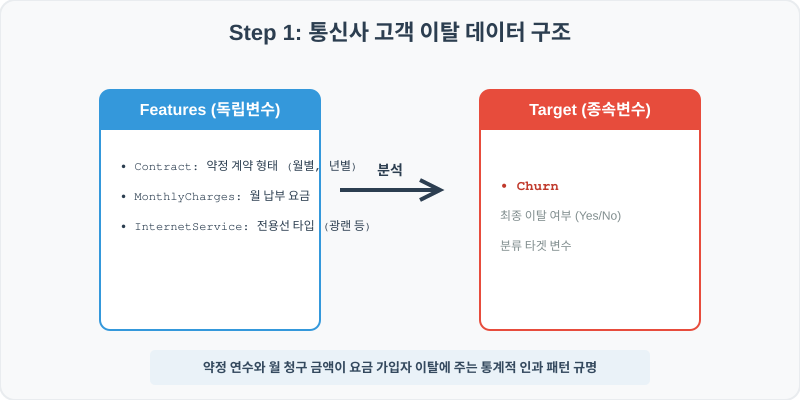
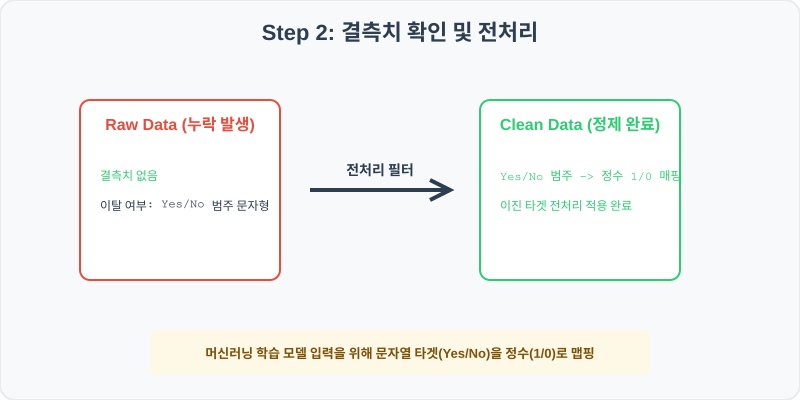
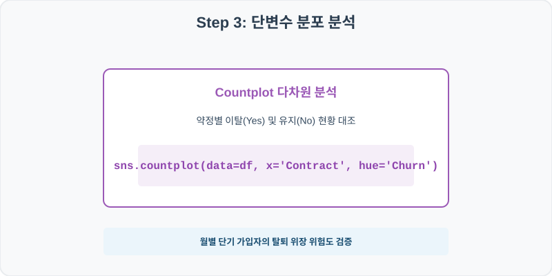
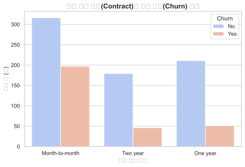
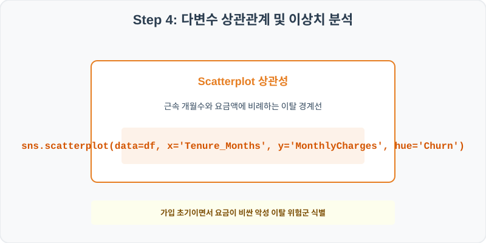
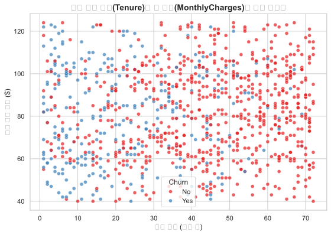

# 실전 데이터 분석 50: 통신 가입자 계약 형태 및 월별 납부 요금별 서비스 이탈(Churn) 인과 관계 분석

## 📌 강의 개요 (30분 완성)


통신사 가입 고객들의 유지 계약 형태와 가입 연수, 그리고 매달 내는 이용 요금 데이터셋입니다. 서비스 이탈 여부(Churn = Yes/No)를 종속 변수로 삼아, 월간 요금 부담 강도와 가입 기간의 상호작용이 구독 해지 행동에 어떤 통계적 인과 패턴으로 작용하는지 정교하게 시각화합니다.

**학습 목표:**
* **가입 형태별 이탈 오버레이 (`countplot`):** 약정 계약 기간(월별, 1년, 2년)에 따른 이탈 여부(Yes/No)의 교차 빈도를 겹쳐 비교합니다.
* **다차원 이탈 산점도 (`scatterplot`):** 가입 유지 개월수(Tenure)와 월 요금을 각 축에 대입하고 이탈 여부를 색상(`hue`)으로 분할하여 탈퇴 경계면을 식별합니다.

---

## Step 1: 데이터 구조 살펴보기 (Data Overview)



`csv_data` 폴더에 준비해 둔 `customer_churn.csv` 파일을 판다스로 불러옵니다.

```python
import pandas as pd
import seaborn as sns
import matplotlib.pyplot as plt

# 그래프 설정 (한글 폰트 및 마이너스 기호 깨짐 방지)
import koreanize_matplotlib
plt.rcParams['axes.unicode_minus'] = False
sns.set_theme(style="whitegrid")

# 로컬 CSV 파일 불러오기
df = pd.read_csv('../csv_data/customer_churn.csv')

# 데이터 구조 및 첫 5행 확인
print(df.info())
print(df.head())
```

> **💻 [실행 결과]**
> ```text
<class 'pandas.DataFrame'>
RangeIndex: 1000 entries, 0 to 999
Data columns (total 6 columns):
 #   Column           Non-Null Count  Dtype 
---  ------           --------------  ----- 
 0   CustomerID       1000 non-null   int64 
 1   Contract         1000 non-null   object
 2   MonthlyCharges   1000 non-null   int64 
 3   Tenure_Months    1000 non-null   int64 
 4   InternetService  1000 non-null   object
 5   Churn            1000 non-null   object
dtypes: int64(3), object(3)
memory usage: 47.0 KB
None
   CustomerID        Contract  MonthlyCharges  Tenure_Months InternetService Churn
0       80001  Month-to-month              81             49     Fiber optic    No
1       80002        Two year              70             12     Fiber optic    No
2       80003        One year              95             34     Fiber optic    No
3       80004  Month-to-month              53              5     Fiber optic   Yes
4       80005        Two year              55             71              No    No
> ```

### 💡 코드 딥다이브 (Code Deep Dive)
**주요 분석 대상 컬럼:**
* `CustomerID`: 통신 서비스 가입자 고유 번호
* `Contract`: 가입 약정 형태 (Month-to-month = 매월 자동 갱신, One year = 1년 약정, Two year = 2년 약정)
* `MonthlyCharges`: 고객이 매월 납부하는 요금액 (USD)
* `Tenure_Months`: 현재까지 가입을 연속 유지한 총 개월 수
* `InternetService`: 가입한 인터넷 회선 종류 (DSL, Fiber optic = 광랜, No = 가입 없음)
* `Churn` (이탈 여부): 지난달 서비스를 탈퇴 해지했는지 여부 (Yes 또는 No)

---

## Step 2: 전처리와 결측치 정제 (Preprocess)



현실의 데이터는 항상 누락이 있거나 유효성 정제가 필요합니다. 데이터 전처리 단계에서 결측 상태를 확인하고 올바르게 보정합니다.

```python
# 1. 이탈 여부 비율 빈도 분석
print("--- 가입자 이탈율 분포 ---")
print(df['Churn'].value_counts(normalize=True))

# 2. 계약 형태별 실제 해지 이탈 확률 교차 테이블
print("\n--- 약정 조건별 해지율 비교 ---")
print(df.groupby('Contract')['Churn'].apply(lambda x: (x == 'Yes').mean()))
```

> **💻 [실행 결과]**
> ```text
--- 가입자 이탈율 분포 ---
Churn
No     0.686
Yes    0.314
Name: proportion, dtype: float64

--- 약정 조건별 해지율 비교 ---
Contract
Month-to-month    0.490909
One year          0.128000
Two year          0.058000
Name: Churn, dtype: float64
> ```

### 💡 분석가의 통찰 (Analyst's Insight)
* **약정 구속력의 강력한 방어력:** 전체 고객 중 약 31.4%가 이탈(Yes)을 겪었습니다. 특히 약정별 해지율을 계산해보면 매달 갱신하는 단기 가입자(Month-to-month)의 이탈 해지율은 49.1%에 달하는 반면, 2년 약정 고객의 이탈률은 단 5.8%에 불과합니다. 이는 장기 약정 할인과 중도 해지 위약금 장치가 가입자 락인(Lock-in)에 압도적인 통계적 방어 효과를 수행하고 있음을 방증합니다.

---

## Step 3: 단변수 분포 분석 (Univariate EDA)



가장 먼저 핵심 변수가 전체 데이터에서 어떤 빈도와 분포를 가졌는지 단일 변수 시각화를 통해 파악해 봅니다.

```python
plt.figure(figsize=(8, 5))

# 계약 약정(Contract) 형태별로 이탈 여부(Churn)의 빈도 격차 대조
sns.countplot(data=df, x='Contract', hue='Churn', palette='coolwarm')

plt.title('통신 계약 유형(Contract)별 고객 이탈(Churn) 분포', fontsize=14, fontweight='bold')
plt.xlabel('계약 약정 형태')
plt.ylabel('고객 수 (명)')
plt.show()
```

> **💻 [실행 결과 시각화]**
> 

### 💡 시각화 차트 읽는 법 & 인사이트
* **단기 고객 중심의 연쇄 이탈 파란 봉우리:** 차트의 파란 막대(이탈 Yes)는 매달 요금을 결제하는 단기 고객군(Month-to-month)에 비정상적으로 높게 오버레이되어 밀집되어 있습니다. 1~2년 약정을 건 고객들은 이탈(파란 막대) 높이가 바닥에 붙어 있어, 이탈 방지 마케팅 리소스를 단기 자동갱신 가입 집단에 전적으로 투입해야 함을 알려주는 시각적 단서를 줍니다.

---

## Step 4: 다변수 상관관계 및 이상치 분석 (Multivariate EDA)



두 개 이상의 변수를 동시에 결합하여, 조건에 따른 수치 차이나 독립 변수와 종속 변수 간의 통계적 경향을 분석합니다.

```python
plt.figure(figsize=(9, 6))

# 가입 유지 월(X축)과 납부 요금(Y축)에 따른 이탈 여부 점 지도 시각화
sns.scatterplot(data=df, x='Tenure_Months', y='MonthlyCharges', hue='Churn', palette='Set1', alpha=0.7)

plt.title('고객 유지 기간(Tenure)과 월 요금(MonthlyCharges)별 이탈 상관성', fontsize=14, fontweight='bold')
plt.xlabel('유지 기간 (개월 수)')
plt.ylabel('월간 이용 요금 ($)')
plt.show()
```

> **💻 [실행 결과 시각화]**
> 

### 💡 코드 딥다이브 & 비즈니스 통찰 (Analyst's Insight)
* **이탈 고위험군 사분면 경계 식별:** 산점도 상에서 빨간 점(이탈 Yes)들이 그래프의 **좌상단(가입 기간이 매우 짧고, 매월 내는 요금이 비싼 영역)**에 비정상적으로 쏠려서 무리를 형성하고 있습니다. 반면 우하단(오래 가입하고 요금이 저렴한 결제군)에는 파란 점(유지 No)들이 빽빽히 안착해 있습니다. 이는 비싼 요금제로 가입 초기 10개월 이내의 신규 고객들이 가격 부담을 이기지 못하고 가장 먼저 이탈하는 이탈 고위험 고리임을 다차원 산점도가 공간적으로 완벽히 구획해 줍니다.

---

## Step 5: 통계적 직관과 해석 (Statistical Logic)

> 💡 **[오즈비(Odds Ratio)와 로지스틱 회귀의 통계적 직관]**
> 이탈 여부(Yes/No)처럼 사건의 발생 여부를 분석할 때는 일반 선형 회귀 대신 확률을 0과 1 사이로 강제 구속하는 **로지스틱 회귀(Logistic Regression)** 모델을 설계합니다. 이 모델의 기저를 지배하는 수학적 개념이 **오즈(Odds)**입니다.
> $$ \text{Odds} = \frac{p}{1-p} \quad (\text{이탈할 확률} / \text{유지될 확률}) $$
> 
> * 이 오즈에 로그를 취해 선형식으로 설계하는 로지스틱 모형을 거쳐, 우리는 **오즈비(Odds Ratio, OR)** 값을 획득합니다. 
> * 만약 월 이용료 변수의 오즈비(OR) 계수가 **1.05**로 산출되었다면, 이는 '월 납부 요금이 1달러 올라갈 때마다 가입자가 서비스를 최종 이탈(Yes)할 상대적 위험도가 5%씩 곱해져 증가한다'는 통계적 의미가 됩니다. 
> * 이 곱셈적 효과를 통해 요금 인상 기획 단계에서 고객 이탈 시뮬레이션을 정밀하게 타격하여 손실을 최소화하는 통계 마케팅의 핵심 툴로 사용됩니다.

---

## 🎯 30분 강의 마무리 및 심화 과제

오늘 우리는 실전 데이터셋을 분석하여 판다스로 데이터를 가공 및 정제하고, 시각화를 활용하여 핵심 변수 간의 통계적 유의성을 검증했습니다. 데이터 속에서 숨겨진 패턴을 올바른 시각으로 탐색하는 능력이 데이터 사이언티스트의 가장 강력한 무기입니다.

### 📝 심화 과제 (Advanced Challenge)
1. **인터넷 회선(InternetService)에 따른 요금 및 이탈 교차 분석:** 회선 형태별로 평균 월 이용요금과 이탈율을 다중 집계하고, 요금이 비싼 광랜(Fiber optic)의 품질 불만이 초기 해지로 이어지는지 분석 코드를 짜 보세요.
2. **가입자 수명 가치(LTV) 파생 변수 도출:** `LTV = Tenure_Months * MonthlyCharges` 컬럼을 생성하고, 서비스를 이탈한 고객(Yes)과 유지 중인 고객(No) 간의 LTV 평균 누적 자산 가치 상실 격차를 시각적으로 분석해 보세요.
