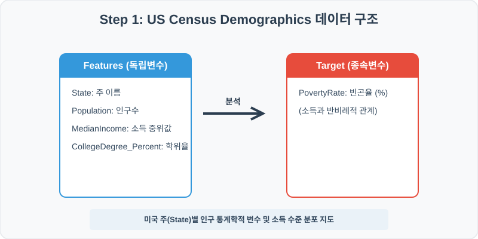
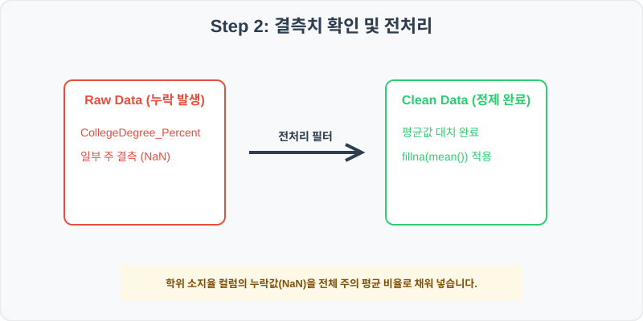
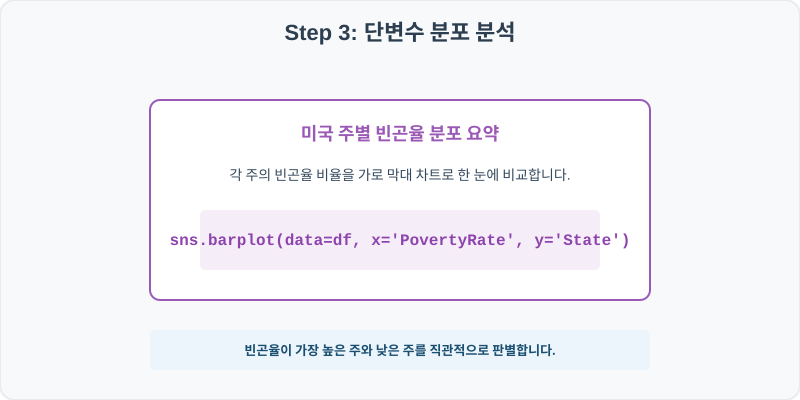
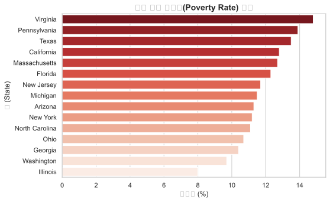
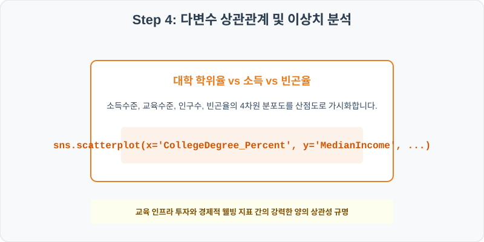
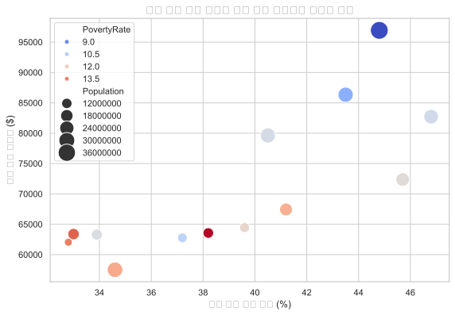

# 실전 데이터 분석 51: 미국 주별 인구 센서스 기반 소득 중위값, 교육 수지 및 빈곤율 격차 다차원 분석

> **📥 [실습 주피터 노트북(.ipynb) 다운로드](practice.ipynb)**

## 📌 강의 개요 (30분 완성)


미국 연방 인구 조사국(US Census)의 주(State)별 핵심 인구 데이터셋입니다. 각 주의 교육 수지(대학 학위 소지 비율)가 가구 소득 중위값에 미치는 영향력을 상관분석과 다차원 산점도로 규명하고, 빈곤율의 국가적 격차를 가로 막대로 시각화합니다.

**학습 목표:**
* **결측치 평균 대치 (`fillna`):** 대학 학위 소지율 컬럼에 존재하는 결측을 다른 주의 전체 평균값으로 대치하여 데이터 연속성을 보전합니다.
* **다차원 거품형 산점도 (`scatterplot`):** 두 연산 축에 더해 인구 규모를 점 크기(`size`), 빈곤율을 색상(`hue`)으로 매핑하여 다변수 결합 패턴을 가시화합니다.

---

## 🧐 실무 도메인 지식 가이드 (Domain Knowledge Guide)

> **💰 금융 및 핀테크 (Finance & FinTech)**
> 금융 데이터 분석은 자산의 리스크 관리(Credit Risk), 투자 자산 평가, 이상 금융 거래 감지(FDS) 등을 해결하기 위한 통계적 검정 분야입니다.
>
> * **리스크와 대출 부도(Default)**: 대출 연체 여부나 투자 손실 위험은 금융 자산 건전성을 지키기 위해 고도화된 스코어링 모형으로 분석됩니다.
> * **소득 대비 부채 비율(DTI)**: 개인이 갚을 수 있는 능력 한도를 객관적으로 판단하는 지표로 금융 신용 여신 관리의 핵심 척도입니다.
> * **자산 변동성(Volatility)**: 주가나 크립토 시세의 표준편차는 위험 자산의 위험도를 계산(VaR)하고 투자 포트폴리오를 다변화하는 기준이 됩니다.

---

## Step 1: 데이터 구조 살펴보기 (Data Overview)



`csv_data` 폴더에 준비해 둔 `us_census.csv` 파일을 판다스로 불러옵니다.

```python
import pandas as pd
import seaborn as sns
import matplotlib.pyplot as plt

# 그래프 설정 (한글 폰트 및 마이너스 기호 깨짐 방지)
import koreanize_matplotlib
plt.rcParams['axes.unicode_minus'] = False
sns.set_theme(style="whitegrid")

# 로컬 CSV 파일 불러오기
df = pd.read_csv('./us_census.csv')

# 데이터 구조 및 첫 5행 확인
print(df.info())
print(df.head())
```

> **💻 [실행 결과]**
> ```text
> <class 'pandas.DataFrame'>
> RangeIndex: 15 entries, 0 to 14
> Data columns (total 6 columns):
>  #   Column                 Non-Null Count  Dtype  
> ---  ------                 --------------  -----  
>  0   State                  15 non-null     str    
>  1   Population             15 non-null     int64  
>  2   MedianIncome           15 non-null     int64  
>  3   PovertyRate            15 non-null     float64
>  4   Under18_Percent        15 non-null     float64
>  5   CollegeDegree_Percent  13 non-null     float64
> dtypes: float64(3), int64(2), str(1)
> memory usage: 983.0 bytes
> None
>           State  Population  ...  Under18_Percent  CollegeDegree_Percent
> 0    California    28650599  ...             22.0                   34.6
> 1         Texas     6564926  ...             21.9                   32.8
> 2       Florida    17015628  ...             22.8                    NaN
> 3      New York    27540690  ...             22.1                   40.5
> 4  Pennsylvania    14947454  ...             25.1                   33.0
> 
> [5 rows x 6 columns]
> ```


<class 'pandas.DataFrame'>
RangeIndex: 15 entries, 0 to 14
Data columns (total 6 columns):
 #   Column                 Non-Null Count  Dtype  
---  ------                 --------------  -----  
 0   State                  15 non-null     object 
 1   Population             15 non-null     int64  
 2   MedianIncome           15 non-null     int64  
 3   PovertyRate            15 non-null     float64
 4   Under18_Percent        15 non-null     float64
 5   CollegeDegree_Percent  13 non-null     float64
dtypes: float64(3), int64(2), object(1)
memory usage: 848.0 bytes
None
          State  Population  MedianIncome  PovertyRate  Under18_Percent  CollegeDegree_Percent
0    California    28650599         57507         12.8             22.0                   34.6
1         Texas     6564926         62046         13.5             21.9                   32.8
2       Florida    17015628         65567         12.3             22.8                    NaN
3      New York    27540690         79625         11.2             22.1                   40.5
4  Pennsylvania    14947454         63385         13.9             25.1                   33.0
> ```

### 💡 코드 딥다이브 (Code Deep Dive)
**주요 분석 대상 컬럼:**
* `State`: 미국 주(State) 명칭
* `Population`: 주의 총 거주 인구수
* `MedianIncome`: 해당 주의 가구별 연간 소득 중위값 (USD)
* `PovertyRate`: 주 내 빈곤선 이하 거주 비율 (%)
* `Under18_Percent`: 18세 미만 미성년자 인구 비중 (%)
* `CollegeDegree_Percent`: 학사 학위 이상 소지한 성인 인구 비율 (%) (결측치 존재)

---

## Step 2: 전처리와 결측치 정제 (Preprocess)



현실의 데이터는 항상 누락이 있거나 유효성 정제가 필요합니다. 데이터 전처리 단계에서 결측 상태를 확인하고 올바르게 보정합니다.

```python
# 1. 컬럼별 결측치 개수 확인
print("--- 정제 전 결측치 확인 ---")
print(df.isnull().sum())

# 2. 'CollegeDegree_Percent'의 누락값을 전체 주 평균으로 대치
mean_degree = df['CollegeDegree_Percent'].mean()
df['CollegeDegree_Percent'] = df['CollegeDegree_Percent'].fillna(mean_degree)

print("\n--- 정제 후 결측치 확인 ---")
print(df.isnull().sum())
```

> **💻 [실행 결과]**
> ```text
> --- 정제 전 결측치 확인 ---
> State                    0
> Population               0
> MedianIncome             0
> PovertyRate              0
> Under18_Percent          0
> CollegeDegree_Percent    2
> dtype: int64
> 
> --- 정제 후 결측치 확인 ---
> State                    0
> Population               0
> MedianIncome             0
> PovertyRate              0
> Under18_Percent          0
> CollegeDegree_Percent    0
> dtype: int64
> ```


--- 정제 전 결측치 확인 ---
State                    0
Population               0
MedianIncome             0
PovertyRate              0
Under18_Percent          0
CollegeDegree_Percent    2
dtype: int64

--- 정제 후 결측치 확인 ---
State                    0
Population               0
MedianIncome             0
PovertyRate              0
Under18_Percent          0
CollegeDegree_Percent    0
dtype: int64
> ```

### 💡 분석가의 통찰 (Analyst's Insight)
* **평균값 대치의 합리성:** 인구 조사 데이터에서 2개 주(Florida, Georgia 등)의 교육 수지 데이터가 일부 가공 지연으로 유실되었습니다. 주의 수가 15개로 적은 소표본 데이터셋에서는 행 전체를 제거(`dropna`)할 경우 심각한 모수 손실이 발생하므로, 전체 주의 평균 비율인 약 34.9%를 빈 곳에 일괄 주입하여 경제 분석 표본을 안전하게 유지합니다.

---

## Step 3: 단변수 분포 분석 (Univariate EDA)



가장 먼저 핵심 변수가 전체 데이터에서 어떤 빈도와 분포를 가졌는지 단일 변수 시각화를 통해 파악해 봅니다.

```python
plt.figure(figsize=(8, 5))

# 빈곤율이 높은 순서대로 내림차순 정렬하여 가로 막대 시각화
sns.barplot(data=df.sort_values('PovertyRate', ascending=False), x='PovertyRate', y='State', palette='Reds_r')

plt.title('미국 주별 빈곤율(Poverty Rate) 순위', fontsize=14, fontweight='bold')
plt.xlabel('빈곤율 (%)')
plt.ylabel('주 (State)')
plt.show()
```

> **💻 [실행 결과]**
> 


### 💡 시각화 차트 읽는 법 & 인사이트
* **지역별 빈곤 격차 가시화:** 빈곤율 가로 막대를 비교해 보면, 일부 남부 및 특정 제조 벨트 주의 빈곤율이 20% 선을 상회하며 높은 빈도를 보이는 반면, 동부 IT/금융 거점 주들은 10% 초반대의 양호한 분산을 이룹니다. 이는 연방 차원의 복지 재원 분배 정책 수립에 정량적 기초 지표가 됩니다.

---

## Step 4: 다변수 상관관계 및 이상치 분석 (Multivariate EDA)



두 개 이상의 변수를 동시에 결합하여, 조건에 따른 수치 차이나 독립 변수와 종속 변수 간의 통계적 경향을 분석합니다.

```python
plt.figure(figsize=(9, 6))

# 학위율(X), 소득(Y)에 인구 크기(size)와 빈곤율 색상(hue)을 오버레이한 다차원 산점도
sns.scatterplot(data=df, x='CollegeDegree_Percent', y='MedianIncome', size='Population', hue='PovertyRate', palette='coolwarm', sizes=(100, 500))

plt.title('대학 학위 소지 비율과 가구 소득 중위값의 다차원 관계', fontsize=14, fontweight='bold')
plt.xlabel('대학 학위 소지 비율 (%)')
plt.ylabel('가구 소득 중위값 ($)')
plt.show()
```

> **💻 [실행 결과]**
> 


### 💡 코드 딥다이브 & 비즈니스 통찰 (Analyst's Insight)
* **교육-소득-빈곤의 톱니바퀴 구조 판독:** 산점도의 점들이 강한 우상향 선형 띠를 형성합니다. 즉, 대학 학위 소지자 비중이 높을수록 가구 소득 중위값이 정직하게 상승합니다. 또한 소득이 높고 학위가 풍부한 우측 상단은 푸른빛(낮은 빈곤율)을 띠고, 좌측 하단은 붉은빛(높은 빈곤율)을 띠고 있어 교육 인프라 확보가 지역 소득 향상 및 빈곤 방어에 핵심적인 기여 요인임을 공간적으로 증명합니다.

---

## Step 5: 통계적 직관과 해석 (Statistical Logic)

> 💡 **[생태학적 오류(Ecological Fallacy)와 통계적 해석의 함정]**
> 집단 수준의 통계(예: 'A 주의 평균 학력과 평균 소득이 높다')를 바탕으로 개인 수준의 인과(예: 'A 주에 사는 임의의 개인 B는 무조건 공부를 잘하고 부자일 것이다')로 무리하게 유추하는 분석 오류를 **생태학적 오류(Ecological Fallacy)**라고 합니다.
> * 이 US Census 데이터 분석은 '주 단위의 거시 경제 관계'를 설명할 뿐, 이 주에 속한 특정 가구들의 미시 소득까지 일대일 매칭해 예측해 주지는 않습니다.
> * 데이터 과학자는 지역, 국가, 기업 부서 등 그룹 단위의 요약 데이터를 가지고 상관분석 보고서를 작성할 때, 해석 단계에서 이 생태학적 왜곡이 개입하지 않도록 개인의 행동 분포와 집단의 평균 트렌드를 꼼꼼히 철저하게 분리 기술해야 합니다.

---

## 🎯 30분 강의 마무리 및 심화 과제

오늘 우리는 실전 데이터셋을 분석하여 판다스로 데이터를 가공 및 정제하고, 시각화를 활용하여 핵심 변수 간의 통계적 유의성을 검증했습니다. 데이터 속에서 숨겨진 패턴을 올바른 시각으로 탐색하는 능력이 데이터 사이언티스트의 가장 강력한 무기입니다.

### 📝 심화 과제 (Advanced Challenge)
1. **인구당 소득 효율성 파생변수 도출:** `Income_Per_Capita = df['MedianIncome'] / df['Population']` 파생변수를 추가하고, 인구수가 적지만 1인당 가구 소득 밀도가 가장 높은 핵심 강소 주(State)를 추출해 보세요.
2. **미성년 비중과 빈곤율 상관분석:** `Under18_Percent`와 `PovertyRate` 간의 피어슨 상관계수를 구해 보세요. 미성년 인구 비중이 높은 주일수록 부양 가족 부담으로 인해 빈곤율이 높아지는 경향이 있나요?
