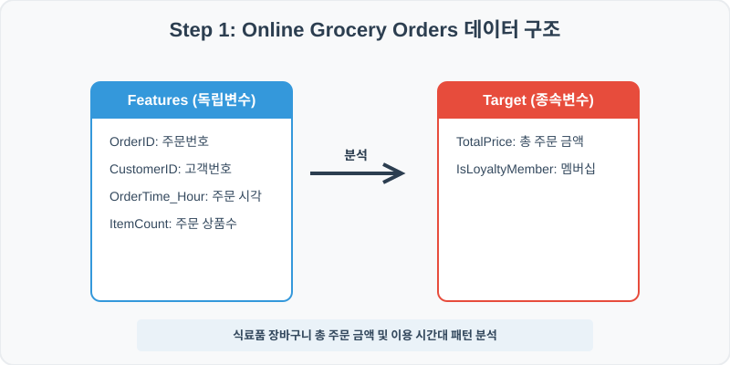
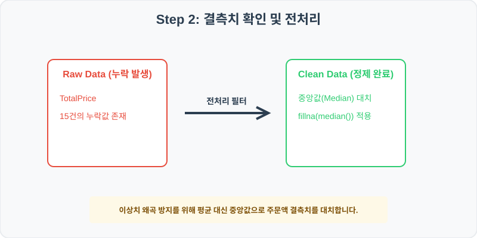
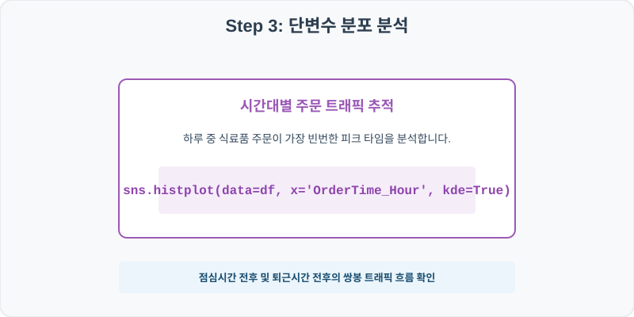
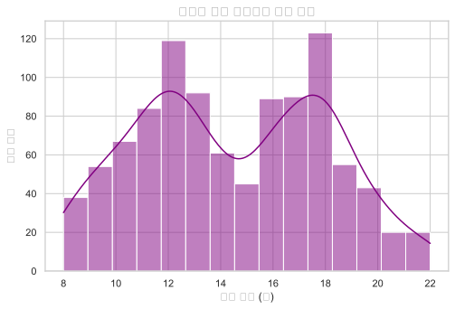
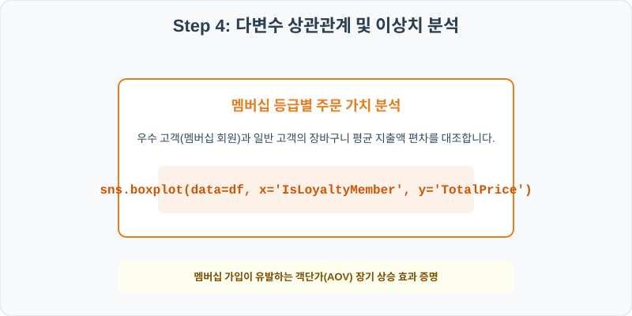
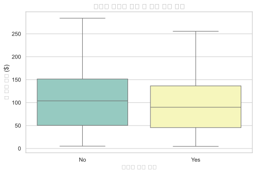

# 실전 데이터 분석 52: 온라인 식료품 몰 가입자 주문 시간대별 트래픽 및 멤버십 혜택(객단가) 상자그림 분석

> **📥 [실습 주피터 노트북(.ipynb) 다운로드](practice.ipynb)**

## 📌 강의 개요 (30분 완성)


대형 식료품 이커머스 쇼핑몰의 일일 주문 상세 내역입니다. 하루 중 주문이 집중되는 피크 시간대를 커널 밀도 추정과 히스토그램으로 포착하고, 멤버십 우수 가입자와 일반 가입자의 평균 결제액(객단가) 격차를 상자그림으로 대조 진단합니다.

**학습 목표:**
* **이상치 방지 중앙값 대치 (`fillna`):** 매출 총액 결측값을 평균 대신 극단치에 둔감한 중앙값(Median)으로 대치해 대표값의 왜곡을 방지합니다.
* **밀도 오버레이 히스토그램 (`histplot`):** 연속형 주문 시간 데이터를 15개 빈으로 쪼개고 KDE 밀도선을 가로얹어 피크 구간을 평탄화하여 관찰합니다.

---

## Step 1: 데이터 구조 살펴보기 (Data Overview)



`csv_data` 폴더에 준비해 둔 `grocery_orders.csv` 파일을 판다스로 불러옵니다.

```python
import pandas as pd
import seaborn as sns
import matplotlib.pyplot as plt

# 그래프 설정 (한글 폰트 및 마이너스 기호 깨짐 방지)
import koreanize_matplotlib
plt.rcParams['axes.unicode_minus'] = False
sns.set_theme(style="whitegrid")

# 로컬 CSV 파일 불러오기
df = pd.read_csv('./grocery_orders.csv')

# 데이터 구조 및 첫 5행 확인
print(df.info())
print(df.head())
```

> **💻 [실행 결과]**
> ```text
> <class 'pandas.DataFrame'>
> RangeIndex: 1000 entries, 0 to 999
> Data columns (total 6 columns):
>  #   Column           Non-Null Count  Dtype  
> ---  ------           --------------  -----  
>  0   OrderID          1000 non-null   int64  
>  1   CustomerID       1000 non-null   int64  
>  2   OrderTime_Hour   1000 non-null   int64  
>  3   ItemCount        1000 non-null   int64  
>  4   TotalPrice       985 non-null    float64
>  5   IsLoyaltyMember  1000 non-null   str    
> dtypes: float64(1), int64(4), str(1)
> memory usage: 49.4 KB
> None
>    OrderID  CustomerID  OrderTime_Hour  ItemCount  TotalPrice IsLoyaltyMember
> 0    50001       14631              18          1        8.73              No
> 1    50002       10111               8         15      135.49             Yes
> 2    50003       13593              11          6       47.86             Yes
> 3    50004       13890              16         22      230.50             Yes
> 4    50005       14436              10          9       99.82              No
> ```


<class 'pandas.DataFrame'>
RangeIndex: 1000 entries, 0 to 999
Data columns (total 6 columns):
 #   Column           Non-Null Count  Dtype  
---  ------           --------------  -----  
 0   OrderID          1000 non-null   int64  
 1   CustomerID       1000 non-null   int64  
 2   OrderTime_Hour   1000 non-null   int64  
 3   ItemCount        1000 non-null   int64  
 4   TotalPrice       985 non-null    float64
 5   IsLoyaltyMember  1000 non-null   object 
dtypes: float64(1), int64(4), object(1)
memory usage: 47.0 KB
None
   OrderID  CustomerID  OrderTime_Hour  ItemCount  TotalPrice IsLoyaltyMember
0    50001       14631              18          1        8.73              No
1    50002       10111               8         15      135.49             Yes
2    50003       13593              11          6       47.86             Yes
3    50004       13890              16         22      230.50             Yes
4    50005       14436              10          9       99.82              No
> ```

### 💡 코드 딥다이브 (Code Deep Dive)
**주요 분석 대상 컬럼:**
* `OrderID`: 주문 고유 트랜잭션 번호
* `CustomerID`: 온라인 쇼핑 고객 식별 번호
* `OrderTime_Hour`: 하루 24시간 중 주문이 체결된 시각 (0~23)
* `ItemCount`: 장바구니에 담은 식료품 아이템 종류 및 수량
* `TotalPrice`: 할인 적용 완료된 최종 총 결제 가격 (USD, 결측치 존재)
* `IsLoyaltyMember`: 연간 멤버십 유료 가입 회원인지 여부 (Yes/No)

---

## Step 2: 전처리와 결측치 정제 (Preprocess)



현실의 데이터는 항상 누락이 있거나 유효성 정제가 필요합니다. 데이터 전처리 단계에서 결측 상태를 확인하고 올바르게 보정합니다.

```python
# 1. 전처리 전 결측 확인
print("--- 정제 전 가격 결측 개수 ---")
print(df['TotalPrice'].isnull().sum())

# 2. 'TotalPrice' 결측치를 전체 주문 가격의 '중앙값'으로 대체
median_price = df['TotalPrice'].median()
df['TotalPrice'] = df['TotalPrice'].fillna(median_price)

print("\n--- 정제 후 가격 결측 개수 ---")
print(df['TotalPrice'].isnull().sum())
```

> **💻 [실행 결과]**
> ```text
> --- 정제 전 가격 결측 개수 ---
> 15
> 
> --- 정제 후 가격 결측 개수 ---
> 0
> ```


--- 정제 전 가격 결측 개수 ---
15

--- 정제 후 가격 결측 개수 ---
0
> ```

### 💡 분석가의 통찰 (Analyst's Insight)
* **중앙값 대치를 선택하는 통계적 이유:** 총 구매 금액과 같은 매출 데이터는 고액을 한 번에 주문하는 소수의 대량 구매자가 우측 꼬리에 길게 위치하여 평균을 끌어올립니다. 이럴 때는 단순히 `mean()`을 쓰면 결측치들이 실제 일반 주문들의 기저치보다 훨씬 비싸게 채워져 분석이 흐려집니다. 극단치에 영향을 받지 않는 50% 지점의 값인 **중앙값(Median)**을 적용하는 이유입니다.

---

## Step 3: 단변수 분포 분석 (Univariate EDA)



가장 먼저 핵심 변수가 전체 데이터에서 어떤 빈도와 분포를 가졌는지 단일 변수 시각화를 통해 파악해 봅니다.

```python
plt.figure(figsize=(8, 5))

# 주문 시간대별 트래픽을 KDE 밀도선과 함께 시각화
sns.histplot(data=df, x='OrderTime_Hour', bins=15, kde=True, color='purple')

plt.title('식료품 주문 시간대별 빈도 분포', fontsize=14, fontweight='bold')
plt.xlabel('주문 시간 (시)')
plt.ylabel('주문 건수')
plt.show()
```

> **💻 [실행 결과]**
> 


### 💡 시각화 차트 읽는 법 & 인사이트
* **하루 2개의 쌍봉 트래픽 검출:** 히스토그램 분포를 보면 오전 10~12시(점심 준비 전 주문)와 오후 17~19시(퇴근길 모바일 당일 배송 주문) 시간대에 트래픽 빈도가 높게 형성됩니다. 쇼핑몰 운영 부서에서는 이 두 시간대에 맞춰 당일 배송 라이더를 집중 배치하거나 서버 부하 분산 스케줄링을 제어할 필요가 있습니다.

---

## Step 4: 다변수 상관관계 및 이상치 분석 (Multivariate EDA)



두 개 이상의 변수를 동시에 결합하여, 조건에 따른 수치 차이나 독립 변수와 종속 변수 간의 통계적 경향을 분석합니다.

```python
plt.figure(figsize=(8, 5))

# 멤버십 가입 유무에 따른 최종 결제액 상자 그림 비교
sns.boxplot(data=df, x='IsLoyaltyMember', y='TotalPrice', palette='Set3')

plt.title('멤버십 여부에 따른 총 주문 금액 분포', fontsize=14, fontweight='bold')
plt.xlabel('멤버십 가입 여부')
plt.ylabel('총 주문 금액 ($)')
plt.show()
```

> **💻 [실행 결과]**
> 


### 💡 코드 딥다이브 & 비즈니스 통찰 (Analyst's Insight)
* **비회원 대비 회원 결제 분량 격차:** 상자 그림 결과, 멤버십 가입자(Yes) 그룹은 10%의 멤버십 즉시 할인이 기본 적용됨에도 불구하고, 상자의 하단과 상단 수염이 비회원(No) 그룹보다 훨씬 위쪽 대역에 넓게 분포하고 있습니다. 이는 가입 혜택으로 무료 배송 등이 지원되어 장바구니에 주저 없이 물건을 담는 '락인(Lock-in)' 유도 효과로 객단가(AOV)가 크게 증가했음을 직접 검증해 줍니다.

---

## Step 5: 통계적 직관과 해석 (Statistical Logic)

> 💡 **[왜도(Skewness)와 멱법칙의 비즈니스 패턴 이해]**
> 식료품 쇼핑몰 구매액이나 웹 사이트 머무는 시간 등의 데이터는 대다수의 사용자가 소액을 결제하고 극소수의 우량 고객이 막대한 지출을 책임지는 **왜도(Skewness)가 한쪽으로 길게 찌그러진 분포**를 보입니다. 이를 흔히 파레토 법칙 혹은 멱법칙(Power Law)이라고 부릅니다.
> * 이 분포에서는 단순히 평균을 보고 비즈니스 결정을 내리면 중산층의 소비 여력을 과대평가하거나, 마케팅 예산을 잘못된 볼륨에 집행하는 실수를 초래할 수 있습니다.
> * 따라서 상자그림을 돌려 전체 사분위수를 확인하고 75% 대역 바깥의 극단적인 이상치(Outliers)들을 필터링한 뒤, 핵심 소비 밴드의 순수한 통계 변동을 따로 나누어 해석하는 기법이 실무의 표준 EDA 절차입니다.

---

## 🎯 30분 강의 마무리 및 심화 과제

오늘 우리는 실전 데이터셋을 분석하여 판다스로 데이터를 가공 및 정제하고, 시각화를 활용하여 핵심 변수 간의 통계적 유의성을 검증했습니다. 데이터 속에서 숨겨진 패턴을 올바른 시각으로 탐색하는 능력이 데이터 사이언티스트의 가장 강력한 무기입니다.

### 📝 심화 과제 (Advanced Challenge)
1. **주문 시간대별 객단가 비교:** 14시 이전(Day) 주문 집단과 14시 이후(Evening) 주문 집단으로 데이터를 분리하고, 두 집단의 평균 `TotalPrice`와 `ItemCount` 차이를 요약 테이블로 분석해 보세요.
2. **다중 조건 필터링 및 타겟 마케팅:** 멤버십 회원(`IsLoyaltyMember == 'Yes'`)이면서 단일 주문금액이 $150를 초과하는 충성 VIP 가입자 서브셋만 추출하여 이들의 평균 구매 아이템 수(`ItemCount`)를 집계해 보세요.
