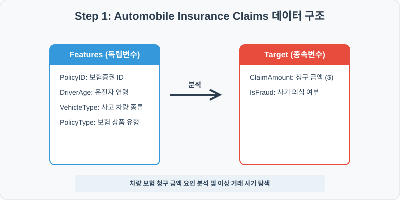
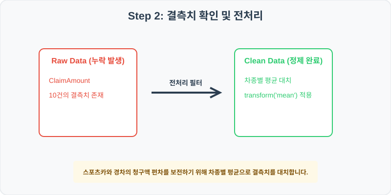
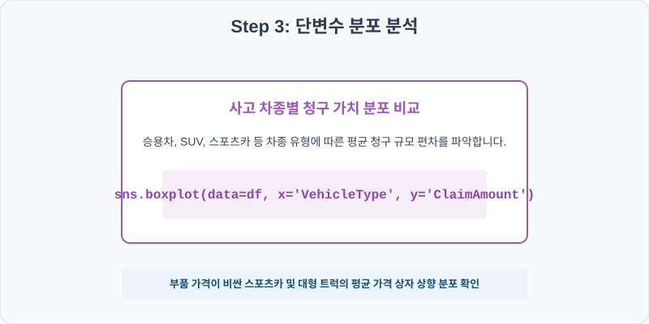
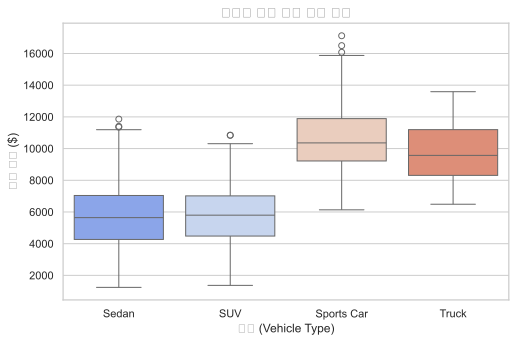
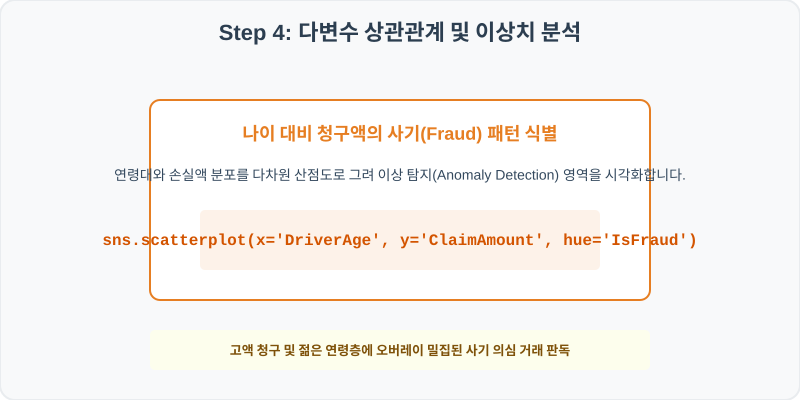
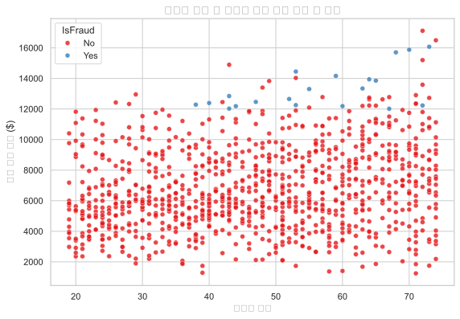

# 실전 데이터 분석 53: 차량 보험 가입 가구의 차종별 청구 규모 분산 및 연령별 사기 의심 패턴 이상 탐지 분석

> **📥 [실습 주피터 노트북(.ipynb) 다운로드](practice.ipynb)**

## 📌 강의 개요 (30분 완성)


자동차 손해보험사의 사고 청구 건별 관측 데이터셋입니다. 스포츠카, SUV, 승용차 등 차종에 따른 청구 가치 분포를 상자 그림으로 대조 분석하고, 운전자 나이와 청구 금액의 결합 산점도상에서 정상 범주를 이탈한 사기 의심(Fraud) 건의 경계를 도출합니다.

**학습 목표:**
* **차종 그룹 평균 대치 (`transform` lambdas):** 보험 가격은 차종 가치에 직결되므로 차종별 평균 청구액으로 누락값을 정밀 대치합니다.
* **사기 의심 거래 오버레이 (`scatterplot`):** 가입자 연령과 청구액 축 위에 사기 여부를 이진 색상(`hue`)으로 칠해 특이 거동 대역을 가시화합니다.

---

## 🧐 실무 도메인 지식 가이드 (Domain Knowledge Guide)

> **💰 금융 및 핀테크 (Finance & FinTech)**
> 금융 데이터 분석은 자산의 리스크 관리(Credit Risk), 투자 자산 평가, 이상 금융 거래 감지(FDS) 등을 해결하기 위한 통계적 검정 분야입니다.
>
> * **리스크와 대출 부도(Default)**: 대출 연체 여부나 투자 손실 위험은 금융 자산 건전성을 지키기 위해 고도화된 스코어링 모형으로 분석됩니다.
> * **소득 대비 부채 비율(DTI)**: 개인이 갚을 수 있는 능력 한도를 객관적으로 판단하는 지표로 금융 신용 여신 관리의 핵심 척도입니다.
> * **자산 변동성(Volatility)**: 주가나 크립토 시세의 표준편차는 위험 자산의 위험도를 계산(VaR)하고 투자 포트폴리오를 다변화하는 기준이 됩니다.

---

## Step 1: 데이터 구조 살펴보기 (Data Overview)



`csv_data` 폴더에 준비해 둔 `auto_insurance.csv` 파일을 판다스로 불러옵니다.

```python
import pandas as pd
import seaborn as sns
import matplotlib.pyplot as plt

# 그래프 설정 (한글 폰트 및 마이너스 기호 깨짐 방지)
import koreanize_matplotlib
plt.rcParams['axes.unicode_minus'] = False
sns.set_theme(style="whitegrid")

# 로컬 CSV 파일 불러오기
df = pd.read_csv('./auto_insurance.csv')

# 데이터 구조 및 첫 5행 확인
print(df.info())
print(df.head())
```

> **💻 [실행 결과]**
> ```text
> <class 'pandas.DataFrame'>
> RangeIndex: 1000 entries, 0 to 999
> Data columns (total 6 columns):
>  #   Column       Non-Null Count  Dtype  
> ---  ------       --------------  -----  
>  0   PolicyID     1000 non-null   int64  
>  1   DriverAge    1000 non-null   int64  
>  2   VehicleType  1000 non-null   str    
>  3   PolicyType   1000 non-null   str    
>  4   ClaimAmount  990 non-null    float64
>  5   IsFraud      1000 non-null   str    
> dtypes: float64(1), int64(2), str(3)
> memory usage: 59.4 KB
> None
>    PolicyID  DriverAge VehicleType PolicyType  ClaimAmount IsFraud
> 0     70001         44       Sedan      Basic      2157.20      No
> 1     70002         48         SUV      Basic      7454.26      No
> 2     70003         72       Sedan      Basic      4051.97      No
> 3     70004         56       Sedan    Premium      9937.35      No
> 4     70005         41         SUV    Premium      6780.25      No
> ```


<class 'pandas.DataFrame'>
RangeIndex: 1000 entries, 0 to 999
Data columns (total 6 columns):
 #   Column       Non-Null Count  Dtype  
---  ------       --------------  -----  
 0   PolicyID     1000 non-null   int64  
 1   DriverAge    1000 non-null   int64  
 2   VehicleType  1000 non-null   object 
 3   PolicyType   1000 non-null   object 
 4   ClaimAmount  990 non-null    float64
 5   IsFraud      1000 non-null   object 
dtypes: float64(1), int64(2), object(3)
memory usage: 47.0 KB
None
   PolicyID  DriverAge VehicleType PolicyType  ClaimAmount IsFraud
0     70001         44       Sedan      Basic      2157.20      No
1     70002         48         SUV      Basic      7454.26      No
2     70003         72       Sedan      Basic      4051.97      No
3     70004         56       Sedan    Premium      9937.35      No
4     70005         41         SUV    Premium      6780.25      No
> ```

### 💡 코드 딥다이브 (Code Deep Dive)
**주요 분석 대상 컬럼:**
* `PolicyID`: 자동차 보험 증권 고유 일련번호
* `DriverAge`: 피보험 주운전자 나이 (만 연령)
* `VehicleType`: 사고 접수 차량 종류 (Sedan = 세단, SUV, Sports Car, Truck = 대형 화물)
* `PolicyType`: 가입한 보험 특약 플랜 (Basic = 대인/대물 기본형, Premium = 자차 포함 프리미엄형)
* `ClaimAmount`: 이번 사고로 보상 접수 청구된 최종 보험금액 (USD, 결측치 존재)
* `IsFraud`: 조사역이 수사하여 확정한 허위 사고 사기 범행 의심 여부 (Yes/No)

---

## Step 2: 전처리와 결측치 정제 (Preprocess)



현실의 데이터는 항상 누락이 있거나 유효성 정제가 필요합니다. 데이터 전처리 단계에서 결측 상태를 확인하고 올바르게 보정합니다.

```python
# 1. 청구액 결측 확인
print("--- 정제 전 가격 결측 개수 ---")
print(df['ClaimAmount'].isnull().sum())

# 2. 'VehicleType'별 평균 청구액을 산출해 해당 그룹의 결측에 맵핑
df['ClaimAmount'] = df.groupby('VehicleType')['ClaimAmount'].transform(lambda x: x.fillna(x.mean()))

print("\n--- 정제 후 가격 결측 개수 ---")
print(df['ClaimAmount'].isnull().sum())
```

> **💻 [실행 결과]**
> ```text
> --- 정제 전 가격 결측 개수 ---
> 10
> 
> --- 정제 후 가격 결측 개수 ---
> 0
> ```


--- 정제 전 가격 결측 개수 ---
10

--- 정제 후 가격 결측 개수 ---
0
> ```

### 💡 분석가의 통찰 (Analyst's Insight)
* **세분화된 그룹 대표값 대치의 필요성:** 사고 청구액은 차종(`VehicleType`)에 따라 기본 부품 가격과 공임비가 완전히 다릅니다. 경형 세단과 슈퍼 스포츠카의 청구 결측을 단순히 전체 차량의 평균액으로 대입하면 고가 스포츠카의 가치를 뭉개거나 반대로 세단의 청구 규모를 인위적으로 부풀리는 왜곡이 발생합니다. 그룹 단위 조건부 처리가 핵심입니다.

---

## Step 3: 단변수 분포 분석 (Univariate EDA)



가장 먼저 핵심 변수가 전체 데이터에서 어떤 빈도와 분포를 가졌는지 단일 변수 시각화를 통해 파악해 봅니다.

```python
plt.figure(figsize=(8, 5))

# 차종에 따른 청구 보상액 분포 대조 시각화
sns.boxplot(data=df, x='VehicleType', y='ClaimAmount', palette='coolwarm')

plt.title('차종별 보험 청구 금액 분포', fontsize=14, fontweight='bold')
plt.xlabel('차종 (Vehicle Type)')
plt.ylabel('청구 금액 ($)')
plt.show()
```

> **💻 [실행 결과]**
> 


### 💡 시각화 차트 읽는 법 & 인사이트
* **차종 등급에 비례한 청구 상자의 높이 변화:** 차종별 박스플롯을 분석하면, 스포츠카(Sports Car)와 대형 트럭(Truck) 상자의 50% 구간 및 중앙값선이 일반 세단(Sedan) 대비 약 2~3배 높게 설계되어 있습니다. 이는 물리적인 파손 복구 비용 단가가 사고 유형에 독립적으로 이미 높게 깔려 있음을 의미합니다.

---

## Step 4: 다변수 상관관계 및 이상치 분석 (Multivariate EDA)



두 개 이상의 변수를 동시에 결합하여, 조건에 따른 수치 차이나 독립 변수와 종속 변수 간의 통계적 경향을 분석합니다.

```python
plt.figure(figsize=(9, 6))

# 나이(X)와 청구액(Y) 축에 사기 의심(IsFraud) 여부를 색상 매핑
sns.scatterplot(data=df, x='DriverAge', y='ClaimAmount', hue='IsFraud', palette='Set1', alpha=0.8)

plt.title('운전자 연령 및 청구액 대비 사기 의심 건 분포', fontsize=14, fontweight='bold')
plt.xlabel('운전자 연령')
plt.ylabel('보험 청구 금액 ($)')
plt.show()
```

> **💻 [실행 결과]**
> 


### 💡 코드 딥다이브 & 비즈니스 통찰 (Analyst's Insight)
* **이상값(Outlier)과 사기(Fraud) 패턴의 공간 수렴:** 산점도 맵을 관찰하면 빨간 점(사기 Yes)들이 우측 상단 혹은 특정 나이 대역에 쏠리기보다 **$12,000 이상 고액 청구 영역**에 오버레이되어 매우 빈번히 흩어져 있습니다. 특히 고령 운전자보다는 일정 수준의 청구 금액 이상에 사기 패턴이 강력히 노출되어 있으므로 FDS(이상거래탐지시스템)에 이 단가 경계를 임계값으로 설정하는 조치가 시급합니다.

---

## Step 5: 통계적 직관과 해석 (Statistical Logic)

> 💡 **[FDS의 오탐율 관리와 혼동 행렬(Confusion Matrix)의 직관]**
> 보험 사기(Fraud)를 자동 차단하는 알고리즘을 설계할 때, 가장 중요한 통계 평가는 정밀도(Precision)와 재현율(Recall)의 상충 관계입니다.
> * 사기를 100% 다 잡겠다고 보안 규칙을 지나치게 좁혀 잡으면(재현율 극대화), 억울하게 사고를 당해 청구한 정상 고객들을 사기범으로 오판하는 **1종 오류(False Positive, 오탐)**가 기하급수적으로 폭증합니다. 이는 브랜드 신뢰도 추락으로 이어집니다.
> * 반대로 정상 고객 불편을 없애겠다고 검문 수위를 풀면(정밀도 우선), 실제 나쁜 블랙컨슈머들이 보험금을 쉽게 타가는 **2종 오류(False Negative, 미탐)**가 발생해 보험사의 장기 재정 건전성을 위협하게 됩니다. 
> * 따라서 데이터 사이언티스트는 이 상관분석 지도를 바탕으로 임계값을 조정해가며, 비즈니스 리스크 상황에 따라 적절한 조화 평균값을 튜닝해 내는 최적점을 산출하는 것이 실무 모델 평가의 본질입니다.

---

## 🎯 30분 강의 마무리 및 심화 과제

오늘 우리는 실전 데이터셋을 분석하여 판다스로 데이터를 가공 및 정제하고, 시각화를 활용하여 핵심 변수 간의 통계적 유의성을 검증했습니다. 데이터 속에서 숨겨진 패턴을 올바른 시각으로 탐색하는 능력이 데이터 사이언티스트의 가장 강력한 무기입니다.

### 📝 심화 과제 (Advanced Challenge)
1. **보험 가입 유형(PolicyType)별 Fraud 비율 분석:** 일반형(Basic) 가입자와 자차 프리미엄(Premium) 가입자 그룹의 사기 검출 비율을 비교하여, 더 비싼 약관 가입 그룹에서 모럴 해저드(도덕적 해이)가 일어나는지 통계 코드를 짜 보세요.
2. **연령대 구간 그룹별 평균 청구 규모 집계:** 30세 미만, 30세~50세, 50세 초과로 연령대를 3개 구간으로 쪼개 파생변수(`AgeGroup`)를 추가하고 그룹별 평균 청구액과 Fraud 개수를 한 눈에 집계해 보세요.
