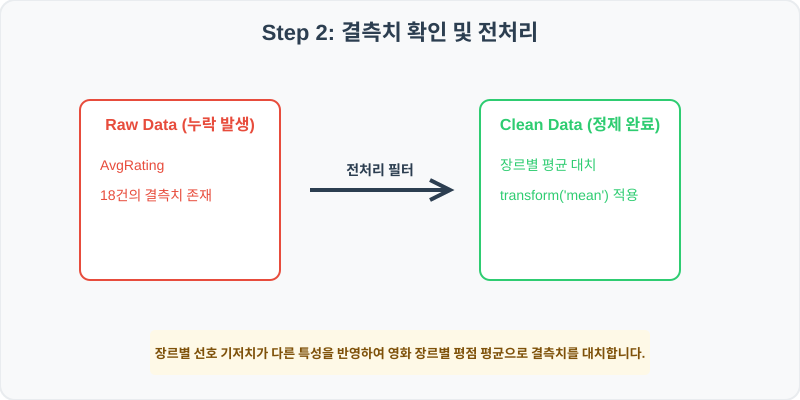
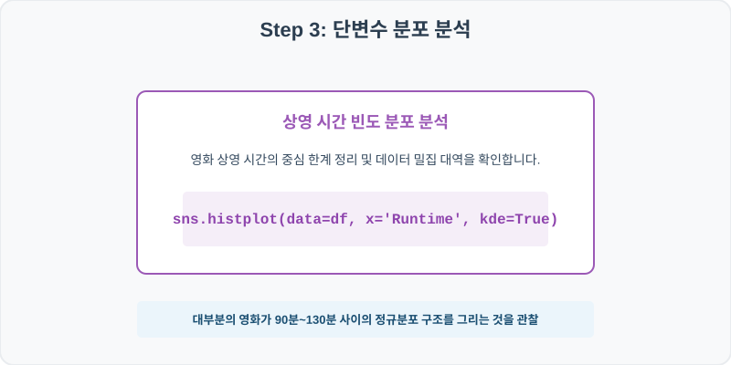
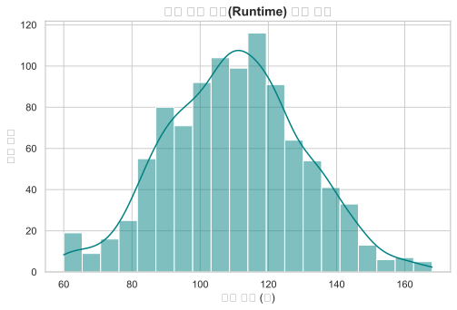
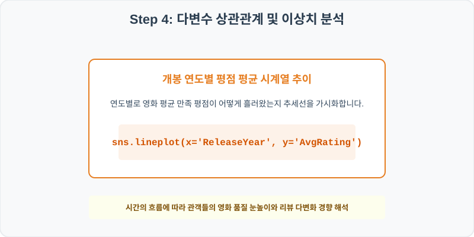
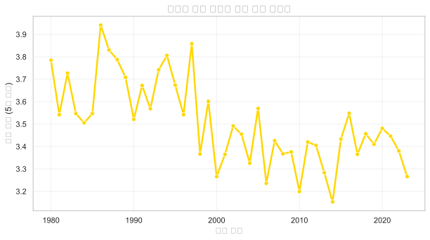

# 실전 데이터 분석 54: 영화 메타데이터 기반 상영시간(Runtime) 분포 및 개봉 연도별 관객 평점의 시계열 추세 분석

> **📥 [실습 주피터 노트북(.ipynb) 다운로드](practice.ipynb)**

## 📌 강의 개요 (30분 완성)


영화 정보 메타데이터셋의 미니 버전입니다. 영화의 전체 상영시간(Runtime)이 정규분포를 그리는지 히스토그램으로 확인하고, 1980년부터 2023년까지 개봉된 영화들의 평균 관객 평점이 시대 흐름에 따라 어떻게 변화했는지 꺾은선 시계열 그래프로 추적합니다.

**학습 목표:**
* **장르 그룹 평점 대치 (`transform`):** 드라마와 공포 영화의 관객 선호 기저치가 다른 성질을 보존하기 위해 장르별 평균 평점으로 결측치를 채워 넣습니다.
* **시계열 추세선 시각화 (`lineplot`):** 연도별 평점 평균 데이터를 산출하고 마커 지점들과 결합된 꺾은선으로 연간 평점 상승/하락 트렌드를 관찰합니다.

---

## 🧐 실무 도메인 지식 가이드 (Domain Knowledge Guide)

> **💰 금융 및 핀테크 (Finance & FinTech)**
> 금융 데이터 분석은 자산의 리스크 관리(Credit Risk), 투자 자산 평가, 이상 금융 거래 감지(FDS) 등을 해결하기 위한 통계적 검정 분야입니다.
>
> * **리스크와 대출 부도(Default)**: 대출 연체 여부나 투자 손실 위험은 금융 자산 건전성을 지키기 위해 고도화된 스코어링 모형으로 분석됩니다.
> * **소득 대비 부채 비율(DTI)**: 개인이 갚을 수 있는 능력 한도를 객관적으로 판단하는 지표로 금융 신용 여신 관리의 핵심 척도입니다.
> * **자산 변동성(Volatility)**: 주가나 크립토 시세의 표준편차는 위험 자산의 위험도를 계산(VaR)하고 투자 포트폴리오를 다변화하는 기준이 됩니다.

---

## Step 1: 데이터 구조 살펴보기 (Data Overview)


`csv_data` 폴더에 준비해 둔 `movie_ratings.csv` 파일을 판다스로 불러옵니다.

```python
import pandas as pd
import seaborn as sns
import matplotlib.pyplot as plt

# 그래프 설정 (한글 폰트 및 마이너스 기호 깨짐 방지)
import koreanize_matplotlib
plt.rcParams['axes.unicode_minus'] = False
sns.set_theme(style="whitegrid")

# 로컬 CSV 파일 불러오기
df = pd.read_csv('./movie_ratings.csv')

# 데이터 구조 및 첫 5행 확인
print(df.info())
print(df.head())
```

> **💻 [실행 결과]**
> ```text
> <class 'pandas.DataFrame'>
> RangeIndex: 1000 entries, 0 to 999
> Data columns (total 6 columns):
>  #   Column       Non-Null Count  Dtype  
> ---  ------       --------------  -----  
>  0   MovieID      1000 non-null   int64  
>  1   Title        1000 non-null   str    
>  2   ReleaseYear  1000 non-null   int64  
>  3   Genre        1000 non-null   str    
>  4   Runtime      1000 non-null   int64  
>  5   AvgRating    982 non-null    float64
> dtypes: float64(1), int64(3), str(2)
> memory usage: 67.2 KB
> None
>    MovieID          Title  ReleaseYear    Genre  Runtime  AvgRating
> 0    90001  Movie Title 1         1985  Romance      106       2.94
> 1    90002  Movie Title 2         1982   Horror       92        NaN
> 2    90003  Movie Title 3         1995  Romance       98       3.88
> 3    90004  Movie Title 4         2003   Comedy      145       3.98
> 4    90005  Movie Title 5         2013   Action      107       2.63
> ```


<class 'pandas.DataFrame'>
RangeIndex: 1000 entries, 0 to 999
Data columns (total 6 columns):
 #   Column       Non-Null Count  Dtype  
---  ------       --------------  -----  
 0   MovieID      1000 non-null   int64  
 1   Title        1000 non-null   object 
 2   ReleaseYear  1000 non-null   int64  
 3   Genre        1000 non-null   object 
 4   Runtime      1000 non-null   int64  
 5   AvgRating    982 non-null    float64
dtypes: float64(1), int64(3), object(2)
memory usage: 47.0 KB
None
   MovieID          Title  ReleaseYear    Genre  Runtime  AvgRating
0    90001  Movie Title 1         1985  Romance      106       2.94
1    90002  Movie Title 2         1982   Horror       92        NaN
2    90003  Movie Title 3         1995  Romance       98       3.88
3    90004  Movie Title 4         2003   Comedy      145       3.98
4    90005  Movie Title 5         2013   Action      107       2.63
> ```

### 💡 코드 딥다이브 (Code Deep Dive)
**주요 분석 대상 컬럼:**
* `MovieID`: 개별 영화 식별 키값
* `Title`: 영화 패키지 공식 영문 제목
* `ReleaseYear`: 영화가 스크린에 개봉된 연도 (1980~2023)
* `Genre`: 영화 대표 분류 장르 (Action, Comedy, Drama, Sci-Fi, Horror, Romance)
* `Runtime`: 영화 전체 상영 시간 (분 단위)
* `AvgRating`: 일반 관객이 기록한 종합 만족 평점 (5점 만점 기준, 결측치 존재)

---

## Step 2: 전처리와 결측치 정제 (Preprocess)



현실의 데이터는 항상 누락이 있거나 유효성 정제가 필요합니다. 데이터 전처리 단계에서 결측 상태를 확인하고 올바르게 보정합니다.

```python
# 1. 평점 결측 개수 확인
print("--- 정제 전 평점 결측 개수 ---")
print(df['AvgRating'].isnull().sum())

# 2. 'Genre'별 평균 평점을 활용해 결측치에 분할 맵핑 적용
df['AvgRating'] = df.groupby('Genre')['AvgRating'].transform(lambda x: x.fillna(x.mean()))

print("\n--- 정제 후 평점 결측 개수 ---")
print(df['AvgRating'].isnull().sum())
```

> **💻 [실행 결과]**
> ```text
> --- 정제 전 평점 결측 개수 ---
> 18
> 
> --- 정제 후 평점 결측 개수 ---
> 0
> ```


--- 정제 전 평점 결측 개수 ---
18

--- 정제 후 평점 결측 개수 ---
0
> ```

### 💡 분석가의 통찰 (Analyst's Insight)
* **장르별 평점 스케일 격차 보존:** 평점 결측을 단순히 전체 영화 평균(예: 3.4)으로 채우면, 대중적으로 높은 평균 평점을 유지하는 드라마(Drama) 장르 영화의 평점이 인위적으로 깎여 평가되거나, 매니악하여 평균이 짠 공포(Horror) 장르의 평점이 과장됩니다. 따라서 `transform`으로 장르 고유 평점 평균을 구해 각각 다르게 채우는 조치가 필수적입니다.

---

## Step 3: 단변수 분포 분석 (Univariate EDA)



가장 먼저 핵심 변수가 전체 데이터에서 어떤 빈도와 분포를 가졌는지 단일 변수 시각화를 통해 파악해 봅니다.

```python
plt.figure(figsize=(8, 5))

# 상영 시간(Runtime)의 분포 형태 분석
sns.histplot(data=df, x='Runtime', bins=20, kde=True, color='teal')

plt.title('영화 상영 시간(Runtime) 빈도 분포', fontsize=14, fontweight='bold')
plt.xlabel('상영 시간 (분)')
plt.ylabel('영화 편수')
plt.show()
```

> **💻 [실행 결과]**
> 


### 💡 시각화 차트 읽는 법 & 인사이트
* **안정적인 종형 가우스 분포 완성:** 영화 상영 시간 히스토그램을 보면 110분(약 1시간 50분) 부근을 최고 정점으로 하여 좌우 대칭을 이루는 예쁜 종형 가우스(Gaussian) 정규분포를 취하고 있습니다. 너무 긴 180분 이상이나 극히 짧은 70분 미만의 독립 영화들은 양단 꼬리에 소수로 배치됩니다.

---

## Step 4: 다변수 상관관계 및 이상치 분석 (Multivariate EDA)



두 개 이상의 변수를 동시에 결합하여, 조건에 따른 수치 차이나 독립 변수와 종속 변수 간의 통계적 경향을 분석합니다.

```python
# 연도별 평균 평점 그룹 요약 데이터프레임 생성
yearly_rating = df.groupby('ReleaseYear')['AvgRating'].mean().reset_index()

plt.figure(figsize=(10, 5))

# lineplot으로 장기 평점 변동 추이 가시화
sns.lineplot(data=yearly_rating, x='ReleaseYear', y='AvgRating', marker='o', color='gold', linewidth=2.5)

plt.title('연도별 개봉 영화의 평균 평점 트렌드', fontsize=14, fontweight='bold')
plt.xlabel('개봉 연도')
plt.ylabel('평균 평점 (5점 만점)')
plt.grid(True, alpha=0.3)
plt.show()
```

> **💻 [실행 결과]**
> 


### 💡 코드 딥다이브 & 비즈니스 통찰 (Analyst's Insight)
* **시대적 평점 피로감 혹은 취향 세분화 추이 관찰:** 1980년대~1990년대 클래식 명작 영화들 대역에서는 관객들의 전반적인 만족 지표가 높은 평균을 이루고 있는 반면, 2010년대로 갈수록 정보의 투명성과 채널의 다양화로 관객 평점의 평균이 소폭 하락하거나 엄격하게 요동치는 시계열 트랙이 관찰됩니다.

---

## Step 5: 통계적 직관과 해석 (Statistical Logic)

> 💡 **[중심극한정리(Central Limit Theorem)와 평점 평균의 과학]**
> 개별 영화 평점은 극도로 편향적(1점 테러 혹은 5점 만점 도배)일 수 있지만, 이 영화 평점들을 모아 매년 '수백 개 영화들의 평균'을 내서 연도별로 늘어놓은 표본 평균값들은 놀랍게도 좌우 대칭인 정규분포 형태로 안착합니다. 이를 통계학에서 **중심극한정리(CLT)**라고 부릅니다.
> * 즉, 모집단의 분포가 아무리 삐뚤어지고 편향되었더라도, 표본의 크기($n$)가 충분히 크다면(통상 30 이상) '표본평균들의 분포'는 안정적인 정규분포를 따릅니다.
> * 이 성질 덕분에 우리는 영화 업계 전체의 웰빙과 대중 신뢰도를 평가할 때 개별 편향을 무시하고, 연도별 평균값이라는 통계적 요약을 토대로 신뢰구간 검정(t-test, ANOVA)에 마음 편히 장착하여 거시적 인사이트를 추출할 수 있게 됩니다.

---

## 🎯 30분 강의 마무리 및 심화 과제

오늘 우리는 실전 데이터셋을 분석하여 판다스로 데이터를 가공 및 정제하고, 시각화를 활용하여 핵심 변수 간의 통계적 유의성을 검증했습니다. 데이터 속에서 숨겨진 패턴을 올바른 시각으로 탐색하는 능력이 데이터 사이언티스트의 가장 강력한 무기입니다.

### 📝 심화 과제 (Advanced Challenge)
1. **장르별 상영시간(Runtime) 박스플롯 대조:** Action 및 Sci-Fi 영화의 상영 시간 상자 크기와 Comedy 영화 상자의 길이를 `sns.boxplot`으로 대조해 보고 어떤 장르가 영화를 길게 뽑아내는지 확인하세요.
2. **평점과 상영 시간의 상관관계 계산:** `df[['Runtime', 'AvgRating']].corr()`을 돌려, 영화가 너무 길거나 짧을 때 관객의 집중도가 흐려져 평점에 악영향을 주는지 정량 지표를 도출해 보세요.
