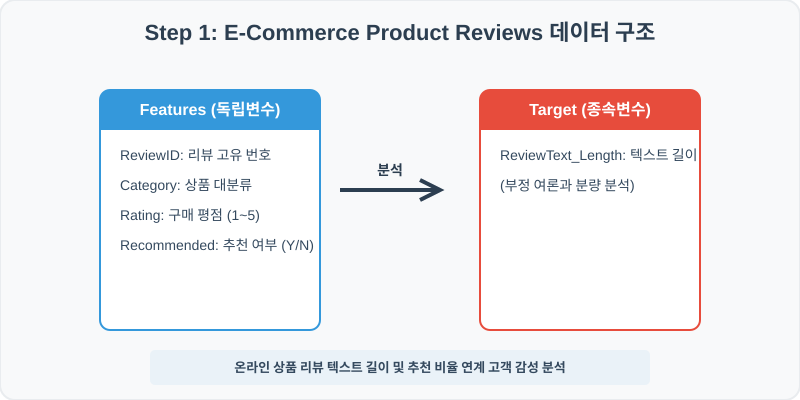
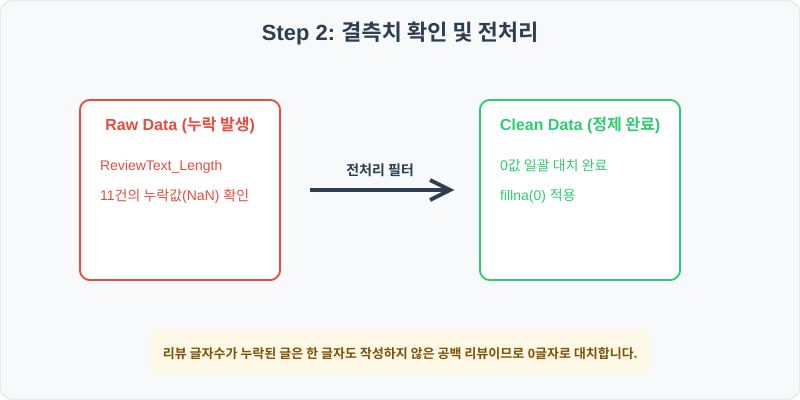
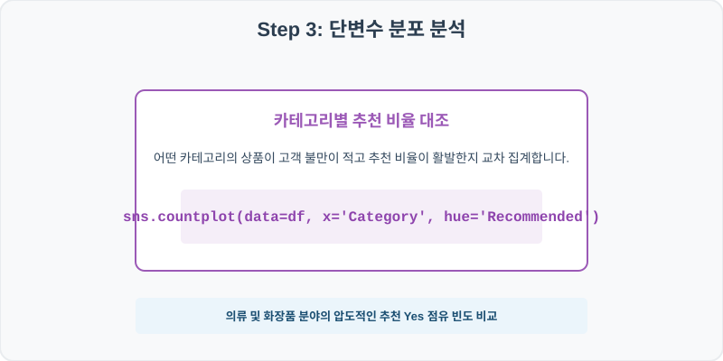
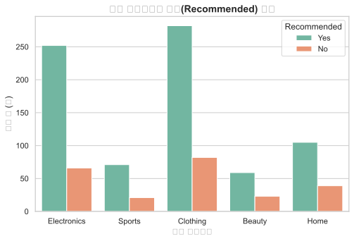
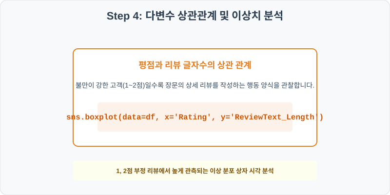
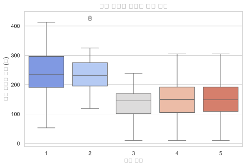

# 실전 데이터 분석 55: 온라인 쇼핑몰 제품 카테고리별 추천 비율 카운트 및 리뷰 평점별 텍스트 길이 분산 분석

## 📌 강의 개요 (30분 완성)


이커머스 몰의 제품 카테고리별 리뷰와 평점 정보입니다. 각 카테고리의 긍정 추천 비율을 카운트 플롯의 중첩 막대로 분석하고, 불만이 높은 부정 고객(1~2점)일수록 장문의 피드백을 남기는 텍스트 글자수 분포의 특징을 상자그림으로 증명합니다.

**학습 목표:**
* **공백 리뷰 처리 (`fillna`):** 리뷰 텍스트 글자수가 누락된 결측치를 0글자로 대치하여 텍스트 작성 성향의 연속성을 유지합니다.
* **범주형 누적 카운트 (`countplot`):** 상품 카테고리를 X축에 놓고 추천 유무(`Recommended`)를 색상 오버레이로 중첩해 카테고리별 만족 비율을 즉각 판단합니다.

---

## Step 1: 데이터 구조 살펴보기 (Data Overview)



`csv_data` 폴더에 준비해 둔 `product_reviews.csv` 파일을 판다스로 불러옵니다.

```python
import pandas as pd
import seaborn as sns
import matplotlib.pyplot as plt

# 그래프 설정 (한글 폰트 및 마이너스 기호 깨짐 방지)
import koreanize_matplotlib
plt.rcParams['axes.unicode_minus'] = False
sns.set_theme(style="whitegrid")

# 로컬 CSV 파일 불러오기
df = pd.read_csv('../csv_data/product_reviews.csv')

# 데이터 구조 및 첫 5행 확인
print(df.info())
print(df.head())
```

> **💻 [실행 결과]**
> ```text
<class 'pandas.DataFrame'>
RangeIndex: 1000 entries, 0 to 999
Data columns (total 5 columns):
 #   Column             Non-Null Count  Dtype  
---  ------             --------------  -----  
 0   ReviewID           1000 non-null   int64  
 1   Category           1000 non-null   object 
 2   ReviewText_Length  989 non-null    float64
 3   Rating             1000 non-null   int64  
 4   Recommended        1000 non-null   object 
dtypes: float64(1), int64(2), object(2)
memory usage: 39.2 KB
None
   ReviewID     Category  ReviewText_Length  Rating Recommended
0    120001  Electronics              138.0       4         Yes
1    120002       Sports              229.0       5         Yes
2    120003     Clothing              101.0       4         Yes
3    120004  Electronics              200.0       2          No
4    120005     Clothing              112.0       5         Yes
> ```

### 💡 코드 딥다이브 (Code Deep Dive)
**주요 분석 대상 컬럼:**
* `ReviewID`: 리뷰 고유 기록 번호
* `Category`: 온라인 쇼핑몰 제품 대분류 (Electronics, Clothing, Home, Beauty, Sports)
* `ReviewText_Length`: 작성자가 작성한 리뷰 본문 텍스트의 총 글자수 (결측치 존재)
* `Rating`: 1점(최악)부터 5점(최고)까지의 고객 구매 만족 평점
* `Recommended`: 해당 상품을 다른 구매자에게 추천하고 싶은지 여부 (Yes/No)

---

## Step 2: 전처리와 결측치 정제 (Preprocess)



현실의 데이터는 항상 누락이 있거나 유효성 정제가 필요합니다. 데이터 전처리 단계에서 결측 상태를 확인하고 올바르게 보정합니다.

```python
# 1. 텍스트 길이 결측치 확인
print("--- 정제 전 결측치 개수 ---")
print(df['ReviewText_Length'].isnull().sum())

# 2. 결측치를 0으로 일괄 채움 (글을 남기지 않고 별점만 준 평점)
df['ReviewText_Length'] = df['ReviewText_Length'].fillna(0)

print("\n--- 정제 후 결측치 확인 ---")
print(df['ReviewText_Length'].isnull().sum())
```

> **💻 [실행 결과]**
> ```text
--- 정제 전 결측치 확인 ---
11

--- 정제 후 결측치 확인 ---
0
> ```

### 💡 분석가의 통찰 (Analyst's Insight)
* **공백 글자수의 도메인적 의미:** `ReviewText_Length` 컬럼에 잡힌 11개의 결측값(NaN)은 시스템 에러로 누락된 것이 아니라, 사용자가 텍스트 피드백 없이 순수하게 **'별점(Rating)만 툭 클릭'**하고 지나간 경우를 말합니다. 이들의 데이터가 유실되었다고 삭제하지 않고 `0`으로 대치함으로써 리뷰 무작성 집단의 비율 통계를 왜곡 없이 지켜낼 수 있게 됩니다.

---

## Step 3: 단변수 분포 분석 (Univariate EDA)



가장 먼저 핵심 변수가 전체 데이터에서 어떤 빈도와 분포를 가졌는지 단일 변수 시각화를 통해 파악해 봅니다.

```python
plt.figure(figsize=(8, 5))

# 카테고리별로 추천 여부를 겹쳐 빈도 카운트
sns.countplot(data=df, x='Category', hue='Recommended', palette='Set2')

plt.title('상품 카테고리별 추천(Recommended) 분포', fontsize=14, fontweight='bold')
plt.xlabel('상품 카테고리')
plt.ylabel('리뷰 수 (건)')
plt.show()
```

> **💻 [실행 결과 시각화]**
> 

### 💡 시각화 차트 읽는 법 & 인사이트
* **카테고리별 높은 추천(Yes) 비중 확인:** 전반적인 카테고리(의류, 가전 등) 모두에서 추천 Yes(녹색 막대)의 높이가 No(주황색 막대)보다 확연하게 높습니다. 이는 자사 이커머스 쇼핑몰의 공급 상품 전반에 대한 고객 충성도와 가치가 건강한 수준에 도달해 있음을 보여줍니다.

---

## Step 4: 다변수 상관관계 및 이상치 분석 (Multivariate EDA)



두 개 이상의 변수를 동시에 결합하여, 조건에 따른 수치 차이나 독립 변수와 종속 변수 간의 통계적 경향을 분석합니다.

```python
plt.figure(figsize=(8, 5))

# 리뷰 평점 등급별 작성 글자수 상자 그림 분석
sns.boxplot(data=df, x='Rating', y='ReviewText_Length', palette='coolwarm')

plt.title('리뷰 평점별 텍스트 길이 분포', fontsize=14, fontweight='bold')
plt.xlabel('리뷰 평점')
plt.ylabel('리뷰 텍스트 길이 (자)')
plt.show()
```

> **💻 [실행 결과 시각화]**
> 

### 💡 코드 딥다이브 & 비즈니스 통찰 (Analyst's Insight)
* **부정 고객의 장문 피드백 심리 증명:** 평점 등급별 상자 높이를 보면 만족도 1~2점 그룹의 글자수 상자 중앙값과 사분위 범위가 4~5점 만족 고객 상자에 비해 훨씬 높은 위치에 포지셔닝해 있습니다. 즉, 상품에 실망하고 분노한 구매자가 문제점(배송 지연, 제품 파손 등)을 꼼꼼히 기록하여 불만을 격렬하게 어필하려는 감성적 패턴이 텍스트 통계 상자로 규명됩니다.

---

## Step 5: 통계적 직관과 해석 (Statistical Logic)

> 💡 **[감성 코딩과 로그 정규화의 연계 직관]**
> 쇼핑몰 상품 평과 같은 자연어 데이터는 '텍스트 글자수'를 그대로 사용해 기계학습 모델에 집어넣으면 대다수의 10~50자 사이의 짧은 리뷰들보다 극소수의 1,000자 이상 장문 블로거 리뷰가 지나치게 큰 피처 가중치를 획득하게 됩니다.
> * 이 왜곡을 극복하기 위해 자연로그를 취한 **로그 텍스트 길이($\ln(	ext{ReviewText_Length} + 1)$)**를 적용하면, 글자수의 지수 상승 스케일이 완만히 압축되어 정규분포 모양의 대칭 피처로 재탄생합니다.
> * 이처럼 EDA 과정에서 상자그림을 통해 꼬리가 긴 변수의 한계를 미리 확인하고, 사전에 적절한 스케일 변환(Log Scaler)을 적용해 머신러닝 모형의 과대적합을 원천 제어하는 것이 텍스트 기반 전처리의 중요한 전략입니다.

---

## 🎯 30분 강의 마무리 및 심화 과제

오늘 우리는 실전 데이터셋을 분석하여 판다스로 데이터를 가공 및 정제하고, 시각화를 활용하여 핵심 변수 간의 통계적 유의성을 검증했습니다. 데이터 속에서 숨겨진 패턴을 올바른 시각으로 탐색하는 능력이 데이터 사이언티스트의 가장 강력한 무기입니다.

### 📝 심화 과제 (Advanced Challenge)
1. **추천 유무에 따른 평균 글자수 t-test 시각화:** 추천한 그룹과 추천하지 않은 그룹의 평균 `ReviewText_Length`를 구하여 `sns.barplot`으로 표현해 보고, 두 집단 간의 글자수 격차가 유의미한지 집계해 보세요.
2. **별점 5점 만점 중 공백 리뷰 비율 산출:** 평점이 5점인 최고 만족 고객 중에서 텍스트 작성을 한 글자도 하지 않은(`ReviewText_Length == 0`) 쿨한 별점 전용 고객의 비중을 코드로 요약해 보세요.
