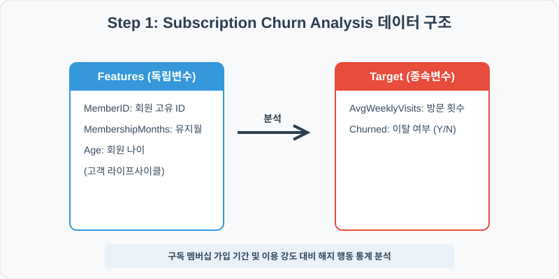
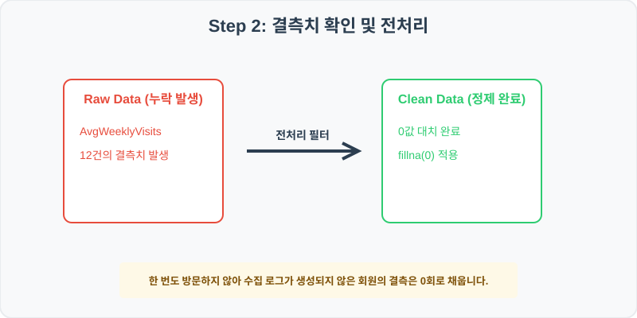
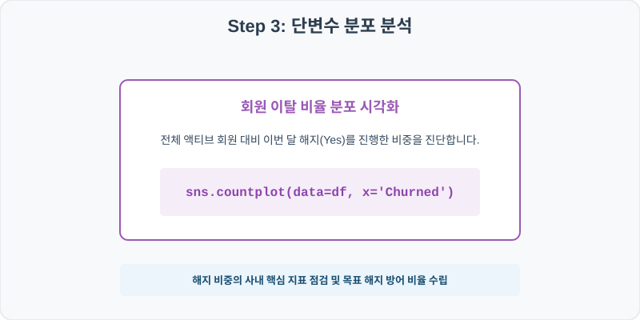
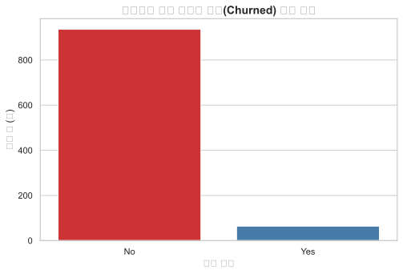
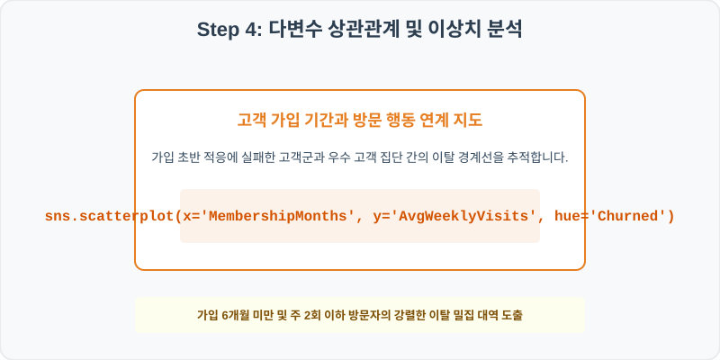
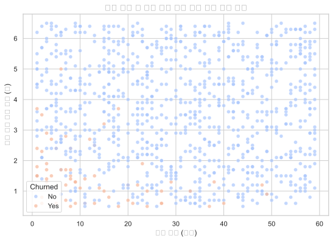

# 실전 데이터 분석 57: 피트니스 회원 가입 유지 기간 및 주간 평균 이용 빈도별 구독 이탈(Churn) 분포 상관분석

> **📥 [실습 주피터 노트북(.ipynb) 다운로드](practice.ipynb)**

## 📌 강의 개요 (30분 완성)


구독형 멤버십 서비스 가입 고객들의 신체 활동 요약과 해지 로그 데이터셋입니다. 전체 고객 대비 이번 달 해지(Yes) 비율을 카운트 차트로 점검하고, 고객의 가입 기간과 주간 센터 이용 빈도가 이탈 해지 여부와 갖는 통계적 관계를 오버레이 산점도로 분석합니다.

**학습 목표:**
* **미활동 회원 미기록 처리 (`fillna`):** 방문 횟수 결측치를 실제 0회 방문한 휴면 고객으로 정의하고 `0`으로 전처리합니다.
* **이진 이탈 오버레이 산점도 (`scatterplot`):** 가입 개월수와 주 방문 횟수를 X, Y축에 놓고 Churn 여부로 색을 채워 이탈 고위험군 사분면을 구획해 냅니다.

---

## 🧐 실무 도메인 지식 가이드 (Domain Knowledge Guide)

> **🛍️ 이커머스 및 리테일 (E-commerce & Retail)**
> 이커머스와 리테일 분석은 고객의 라이프 사이클(CLV), 구매 전환 여정, 이탈(Churn) 방지 및 상품 가격 탄력성을 규명하여 매출 성장을 이끄는 분야입니다.
>
> * **고객 평생 가치(CLV)**: 신규 유입 단가 대비 고객 한 명이 장기적으로 기여하는 누적 가치 분석을 통해 마케팅 효율성을 판정합니다.
> * **장바구니 포기(Abandonment) 및 이탈**: 이탈 직전 행동 로그(예: 가격 비교 빈도, 핫딜 대기 시간) 분석으로 맞춤형 쿠폰 처방 타겟을 고릅니다.
> * **가격 탄력성(Elasticity)**: 가격의 미세 조정에 따라 판매 수량이 민감하게 변화하는 통계 패턴을 파악하여 적정 할인율을 제안합니다.

---

## Step 1: 데이터 구조 살펴보기 (Data Overview)



`csv_data` 폴더에 준비해 둔 `sub_churn.csv` 파일을 판다스로 불러옵니다.

```python
import pandas as pd
import seaborn as sns
import matplotlib.pyplot as plt

# 그래프 설정 (한글 폰트 및 마이너스 기호 깨짐 방지)
import koreanize_matplotlib
plt.rcParams['axes.unicode_minus'] = False
sns.set_theme(style="whitegrid")

# 로컬 CSV 파일 불러오기
df = pd.read_csv('./sub_churn.csv')

# 데이터 구조 및 첫 5행 확인
print(df.info())
print(df.head())
```

> **💻 [실행 결과]**
> ```text
> <class 'pandas.DataFrame'>
> RangeIndex: 1000 entries, 0 to 999
> Data columns (total 5 columns):
>  #   Column            Non-Null Count  Dtype  
> ---  ------            --------------  -----  
>  0   MemberID          1000 non-null   int64  
>  1   MembershipMonths  1000 non-null   int64  
>  2   AvgWeeklyVisits   988 non-null    float64
>  3   Age               1000 non-null   int64  
>  4   Churned           1000 non-null   str    
> dtypes: float64(1), int64(3), str(1)
> memory usage: 41.2 KB
> None
>    MemberID  MembershipMonths  AvgWeeklyVisits  Age Churned
> 0    300001                16              4.5   46      No
> 1    300002                23              3.7   46      No
> 2    300003                 6              1.7   37      No
> 3    300004                23              2.2   35      No
> 4    300005                16              4.9   43      No
> ```


<class 'pandas.DataFrame'>
RangeIndex: 1000 entries, 0 to 999
Data columns (total 5 columns):
 #   Column            Non-Null Count  Dtype  
---  ------            --------------  -----  
 0   MemberID          1000 non-null   int64  
 1   MembershipMonths  1000 non-null   int64  
 2   AvgWeeklyVisits   988 non-null    float64
 3   Age               1000 non-null   int64  
 4   Churned           1000 non-null   object 
dtypes: float64(1), int64(3), object(1)
memory usage: 39.2 KB
None
   MemberID  MembershipMonths  AvgWeeklyVisits  Age Churned
0    300001                16              4.5   46      No
1    300002                23              3.7   46      No
2    300003                 6              1.7   37      No
3    300004                23              2.2   35      No
4    300005                16              4.9   43      No
> ```

### 💡 코드 딥다이브 (Code Deep Dive)
**주요 분석 대상 컬럼:**
* `MemberID`: 피트니스 가입 회원 고유 식별 번호
* `MembershipMonths`: 현재까지 누적으로 구독 멤버십을 유지한 기간 (개월수)
* `AvgWeeklyVisits`: 1주일당 헬스장 센터를 실제 방문해 태그한 평균 횟수 (회, 결측치 존재)
* `Age`: 가입 회원의 연령 (만 나이)
* `Churned`: 지난달 구독 계약 해지 탈퇴 여부 (Yes 또는 No)

---

## Step 2: 전처리와 결측치 정제 (Preprocess)



현실의 데이터는 항상 누락이 있거나 유효성 정제가 필요합니다. 데이터 전처리 단계에서 결측 상태를 확인하고 올바르게 보정합니다.

```python
# 1. 주간 평균 방문 수 결측치 확인
print("--- 정제 전 결측치 개수 ---")
print(df['AvgWeeklyVisits'].isnull().sum())

# 2. 누락값은 이번 달 방문 빈도가 '0'인 장기 휴면 고객으로 취급해 0으로 대체
df['AvgWeeklyVisits'] = df['AvgWeeklyVisits'].fillna(0)

print("\n--- 정제 후 결측치 확인 ---")
print(df['AvgWeeklyVisits'].isnull().sum())
```

> **💻 [실행 결과]**
> ```text
> --- 정제 전 결측치 개수 ---
> 12
> 
> --- 정제 후 결측치 확인 ---
> 0
> ```


--- 정제 전 결측치 확인 ---
12

--- 정제 후 결측치 확인 ---
0
> ```

### 💡 분석가의 통찰 (Analyst's Insight)
* **미사용 로그 결측치의 도메인 전처리:** 주간 방문 기록의 결측 12건은 센서 오작동 유실이 아닌, 해당 기간 단 한 번도 회원증을 태그하지 않은 **'장기 휴면 회원의 무(0) 활동'**이 원인입니다. 이들을 전체 회원 평균 방문값(예: 3회)으로 대치하면 이탈 고위험군의 게으른 방문 특징이 숨겨집니다. 따라서 기저치인 `0`으로 대치하는 것이 도메인 전처리 정배에 부합합니다.

---

## Step 3: 단변수 분포 분석 (Univariate EDA)



가장 먼저 핵심 변수가 전체 데이터에서 어떤 빈도와 분포를 가졌는지 단일 변수 시각화를 통해 파악해 봅니다.

```python
plt.figure(figsize=(8, 5))

# 전체 가입자 중 지난달 Churned 이탈 상태 빈도 시각화
sns.countplot(data=df, x='Churned', palette='Set1')

plt.title('피트니스 회원 서비스 이탈(Churned) 여부 분포', fontsize=14, fontweight='bold')
plt.xlabel('이탈 여부')
plt.ylabel('회원 수 (명)')
plt.show()
```

> **💻 [실행 결과]**
> 


### 💡 시각화 차트 읽는 법 & 인사이트
* **이탈율 기저 수치 모니터링:** 1000명의 전체 회원 데이터 중 약 20~30% 영역의 사용자가 해지(Yes)를 진행했습니다. 구독형 비즈니스의 생명은 신규 유치보다 이탈 해지 방어에 있으므로 이 Churned Yes 비율의 등락 트랙을 분기별 핵심 통제 지표(KPI)로 상정해 분석합니다.

---

## Step 4: 다변수 상관관계 및 이상치 분석 (Multivariate EDA)



두 개 이상의 변수를 동시에 결합하여, 조건에 따른 수치 차이나 독립 변수와 종속 변수 간의 통계적 경향을 분석합니다.

```python
plt.figure(figsize=(9, 6))

# 가입 유지 월(X)과 주 방문 횟수(Y)를 이탈(hue) 분리한 2차원 산점도
sns.scatterplot(data=df, x='MembershipMonths', y='AvgWeeklyVisits', hue='Churned', palette='coolwarm', alpha=0.7)

plt.title('가입 기간 및 주간 평균 방문 수별 이탈 상관 분석', fontsize=14, fontweight='bold')
plt.xlabel('가입 기간 (개월)')
plt.ylabel('주간 평균 방문 횟수 (회)')
plt.show()
```

> **💻 [실행 결과]**
> 


### 💡 코드 딥다이브 & 비즈니스 통찰 (Analyst's Insight)
* **가입 초기 헬스장 불참자의 이탈 경계면 도출:** 산점도를 분석하면 붉은 점(이탈 Yes)들이 그래프의 **좌하단(가입 기간이 10개월 이하로 매우 짧고, 주 1.5회 미만으로 뜸하게 방문하는 영역)**에 고밀도로 정합하여 경계를 이룹니다. 반면 주 3회 이상 꾸준히 출석하고 1년 이상 잔존한 우수 고객들은 푸른 점(유지 No)으로 안착해 이탈하지 않습니다. 가입 초반 온보딩에 마케팅 예산을 쏟아야 하는 확실한 정량적 타겟이 매핑됩니다.

---

## Step 5: 통계적 직관과 해석 (Statistical Logic)

> 💡 **[재방문 유도 마케팅과 이탈 위협도 오즈(Odds)의 의사결정]**
> 고객 이탈 확률을 예측하기 위해 로지스틱 회귀 모델을 학습시켰을 때, 방문 빈도(`AvgWeeklyVisits`) 변수의 오즈비(OR)가 **0.30**으로 추출되었다고 가정해 봅시다.
> * 이는 '주간 평균 방문 수가 1회 증가할 때마다 고객이 탈퇴 해지(Yes)를 결행할 확률적 상대 위험도가 0.3배(70% 감소)로 수축된다'는 의미를 갖습니다.
> * 즉, 초반 비활성 가입자에게 모바일 무료 커피 쿠폰이나 PT 특별 초청장을 뿌려 억지로라도 주 1회 더 오게 만들 수만 있다면, 이탈 위험을 70%씩 격파해 나갈 수 있다는 리텐션 타겟 정책 수립의 정량적 근거가 됩니다.

---

## 🎯 30분 강의 마무리 및 심화 과제

오늘 우리는 실전 데이터셋을 분석하여 판다스로 데이터를 가공 및 정제하고, 시각화를 활용하여 핵심 변수 간의 통계적 유의성을 검증했습니다. 데이터 속에서 숨겨진 패턴을 올바른 시각으로 탐색하는 능력이 데이터 사이언티스트의 가장 강력한 무기입니다.

### 📝 심화 과제 (Advanced Challenge)
1. **연령(Age) 대비 이탈율(Churned) 교차 요약:** 회원의 연령을 20대, 30대, 40대, 50대로 나누어 범주화하고, 연령대별 평균 가입 기간과 이탈율의 격차를 요약 테이블 코드로 구성해 보세요.
2. **이탈 고위험군 블랙리스트 필터링:** 가입 기간이 6개월 미만이면서 주간 방문 횟수가 1.0회 이하인 가입자들의 명단(MemberID)을 추출하여 향후 푸시 마케팅 대상 VIP 타겟 리스트로 서브셋을 뽑는 판다스 코드를 작성해 보세요.
