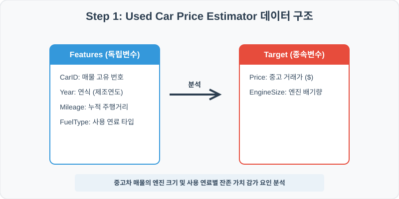
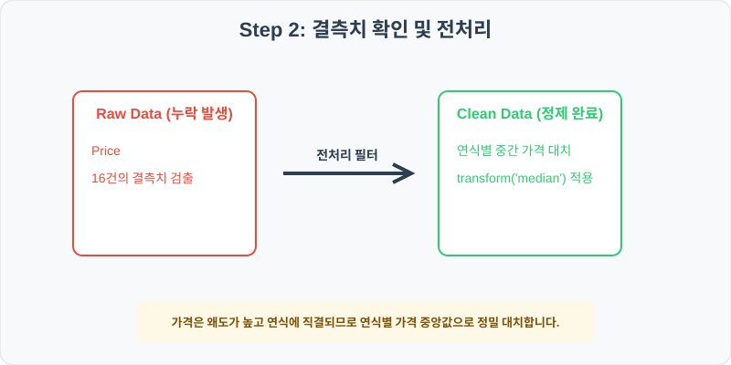
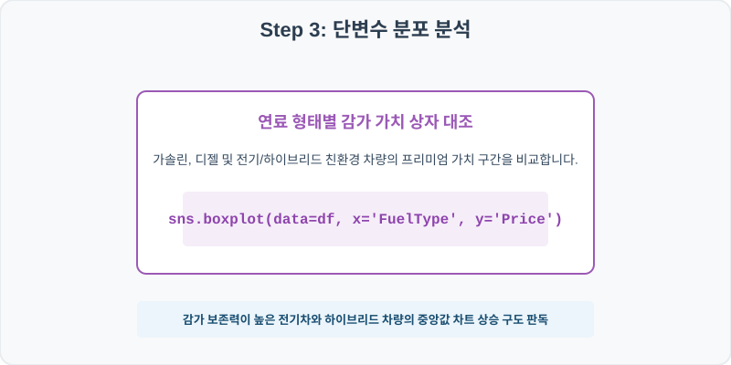
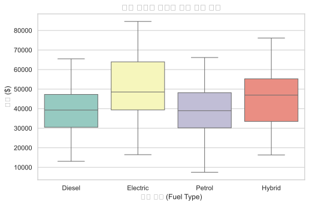
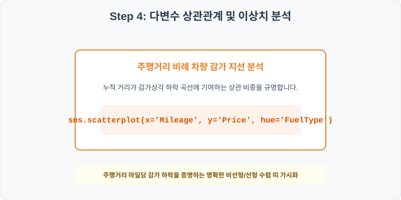
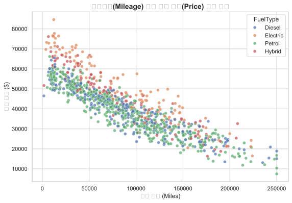

# 실전 데이터 분석 58: 중고차 매물의 엔진 크기 및 연료 타입별 가격 분산과 주행거리 대비 가격 비선형 감가 분석

> **📥 [실습 주피터 노트북(.ipynb) 다운로드](practice.ipynb)**

## 📌 강의 개요 (30분 완성)


다양한 연료 타입과 기계적 제원을 지닌 중고차 거래 매물 정보입니다. 가솔린, 디젤, 하이브리드, 전기차 등 연료 형태별 평균 시세를 상자 그림으로 대조하고, 차량의 누적 주행거리(Mileage)의 증가가 가격 하락에 기여하는 감가상각 궤적을 산점도로 추적합니다.

**학습 목표:**
* **연식 그룹 중간값 대치 (`transform`):** 중고차 가치는 연식(Year)에 전적으로 지배되므로 연도별 가격 중앙값(Median)으로 결측치를 영리하게 채워 넣습니다.
* **다범주 흩어짐 지도 (`scatterplot`):** 주행거리와 가격 축 위에 연료 타입을 색상 매핑하여 잔존가치 보전력이 가장 높은 연료군을 선별해 냅니다.

---

## Step 1: 데이터 구조 살펴보기 (Data Overview)



`csv_data` 폴더에 준비해 둔 `car_price.csv` 파일을 판다스로 불러옵니다.

```python
import pandas as pd
import seaborn as sns
import matplotlib.pyplot as plt

# 그래프 설정 (한글 폰트 및 마이너스 기호 깨짐 방지)
import koreanize_matplotlib
plt.rcParams['axes.unicode_minus'] = False
sns.set_theme(style="whitegrid")

# 로컬 CSV 파일 불러오기
df = pd.read_csv('./car_price.csv')

# 데이터 구조 및 첫 5행 확인
print(df.info())
print(df.head())
```

> **💻 [실행 결과]**
> ```text
> <class 'pandas.DataFrame'>
> RangeIndex: 1000 entries, 0 to 999
> Data columns (total 6 columns):
>  #   Column      Non-Null Count  Dtype  
> ---  ------      --------------  -----  
>  0   CarID       1000 non-null   int64  
>  1   Year        1000 non-null   int64  
>  2   Mileage     1000 non-null   int64  
>  3   EngineSize  1000 non-null   float64
>  4   FuelType    1000 non-null   str    
>  5   Price       984 non-null    float64
> dtypes: float64(2), int64(3), str(1)
> memory usage: 53.1 KB
> None
>     CarID  Year  Mileage  EngineSize  FuelType     Price
> 0  150001  2013   108706         3.0    Diesel  33168.82
> 1  150002  2010   163158         1.6    Diesel  26069.87
> 2  150003  2017   104723         2.0  Electric  48934.57
> 3  150004  2019    52495         1.6    Petrol  46125.91
> 4  150005  2015   109561         1.6    Petrol  34901.02
> ```


<class 'pandas.DataFrame'>
RangeIndex: 1000 entries, 0 to 999
Data columns (total 6 columns):
 #   Column      Non-Null Count  Dtype  
---  ------      --------------  -----  
 0   CarID       1000 non-null   int64  
 1   Year        1000 non-null   int64  
 2   Mileage     1000 non-null   int64  
 3   EngineSize  1000 non-null   float64
 4   FuelType    1000 non-null   object 
 5   Price       984 non-null    float64
dtypes: float64(2), int64(3), object(1)
memory usage: 47.0 KB
None
     CarID  Year  Mileage  EngineSize  FuelType     Price
0  150001  2013   108706         3.0    Diesel  33168.82
1  150002  2010   163158         1.6    Diesel  26069.87
2  150003  2017   104723         2.0  Electric  48934.57
3  150004  2019    52495         1.6    Petrol  46125.91
4  150005  2015   109561         1.6    Petrol  34901.02
> ```

### 💡 코드 딥다이브 (Code Deep Dive)
**주요 분석 대상 컬럼:**
* `CarID`: 중고 매물 차량 고유 일련번호
* `Year`: 차량 제조 출고 연식
* `Mileage`: 현재까지 주행한 누적 총 마일리지 거리 (Miles)
* `EngineSize`: 차량 배기량 엔진 크기 (Liters)
* `FuelType`: 구동 연료 종류 (Petrol = 휘발유, Diesel = 경유, Hybrid = 하이브리드, Electric = 전기차)
* `Price`: 시장 중고 거래 체결 시세 가격 (USD, 결측치 존재)

---

## Step 2: 전처리와 결측치 정제 (Preprocess)



현실의 데이터는 항상 누락이 있거나 유효성 정제가 필요합니다. 데이터 전처리 단계에서 결측 상태를 확인하고 올바르게 보정합니다.

```python
# 1. 가격 결측치 파악
print("--- 정제 전 가격 결측 개수 ---")
print(df['Price'].isnull().sum())

# 2. 'Year'(연식)별 가격 중간값(Median)으로 대치
df['Price'] = df.groupby('Year')['Price'].transform(lambda x: x.fillna(x.median()))

print("\n--- 정제 후 가격 결측 개수 ---")
print(df['Price'].isnull().sum())
```

> **💻 [실행 결과]**
> ```text
> --- 정제 전 가격 결측 개수 ---
> 16
> 
> --- 정제 후 가격 결측 개수 ---
> 0
> ```


--- 정제 전 가격 결측 개수 ---
16

--- 정제 후 가격 결측 개수 ---
0
> ```

### 💡 분석가의 통찰 (Analyst's Insight)
* **연식 그룹 중간값 대치 전략:** 중고차 가격은 출고 연도(`Year`)가 노후될수록 1차적으로 강하게 감가상각이 매겨집니다. 연식이 다른 다양한 차량 매물의 가격 결측을 일관된 전체 평균 시세로 메꿔버리면 구형 중고차가 과대평가되거나 신차급 매물의 가치가 부당하게 희석됩니다. 연식별로 나누어 꼬리가 긴 가격의 특성을 반영해 중간값(Median) 대입이 타당합니다.

---

## Step 3: 단변수 분포 분석 (Univariate EDA)



가장 먼저 핵심 변수가 전체 데이터에서 어떤 빈도와 분포를 가졌는지 단일 변수 시각화를 통해 파악해 봅니다.

```python
plt.figure(figsize=(8, 5))

# 연료 엔진 유형에 따른 차량 가격 상자 그림 시각화
sns.boxplot(data=df, x='FuelType', y='Price', palette='Set3')

plt.title('연료 유형별 중고차 판매 가격 분포', fontsize=14, fontweight='bold')
plt.xlabel('연료 유형 (Fuel Type)')
plt.ylabel('가격 ($)')
plt.show()
```

> **💻 [실행 결과]**
> 


### 💡 시각화 차트 읽는 법 & 인사이트
* **친환경 등급 가치 프리미엄 포착:** 박스플롯을 분석하면 전기차(Electric) 및 하이브리드(Hybrid) 차량 상자 영역의 고도와 중앙값선이 내연기관 차량(가솔린, 디젤) 대비 상향 포지셔닝되어 높은 분산을 보입니다. 이는 친환경 보조금 효과와 연료비 절감에 따른 감가 보존 메리트가 중고차 시장에도 적극 투영되어 가격 방어선이 높음을 시사합니다.

---

## Step 4: 다변수 상관관계 및 이상치 분석 (Multivariate EDA)



두 개 이상의 변수를 동시에 결합하여, 조건에 따른 수치 차이나 독립 변수와 종속 변수 간의 통계적 경향을 분석합니다.

```python
plt.figure(figsize=(9, 6))

# 누적 마일리지(X) 대비 판매가(Y)를 연료타입(hue)으로 구분한 산점도
sns.scatterplot(data=df, x='Mileage', y='Price', hue='FuelType', alpha=0.7)

plt.title('주행거리(Mileage) 대비 판매 가격(Price) 상관 분석', fontsize=14, fontweight='bold')
plt.xlabel('주행 거리 (Miles)')
plt.ylabel('판매 가격 ($)')
plt.show()
```

> **💻 [실행 결과]**
> 


### 💡 코드 딥다이브 & 비즈니스 통찰 (Analyst's Insight)
* **마일리지 누적 비례 반비례 감가 지선 도출:** 산점도의 점들은 전체적으로 우하향 궤적의 뚜렷한 음의 선형 패턴을 그립니다. 주행 누적거리가 길어질수록 차량 기계 부품 손상과 보증 만료 위험으로 감가가 이루어지며, 연료 형태와 상관없이 모든 중고 차량 감가의 핵심 독립 변수로 기능함을 시각적으로 증명합니다.

---

## Step 5: 통계적 직관과 해석 (Statistical Logic)

> 💡 **[비선형 감가 추세와 로그 변환 회귀 모델링의 수학적 직관]**
> 중고차 가격 감가는 초반 1~3년 동안 신차 출고 이후 수천 달러씩 급격히 깎이다가, 10년이 지난 똥차 반열에 오르면 주행거리가 1~2만 km 더 늘어나더라도 감가 하향 속도가 매우 완만해져 일정한 최저 바닥 가격선에 수렴하는 **비선형 지수 감폭 곡선**을 그립니다.
> * 이러한 감가 구조에 일반 선형 회귀($Y = aX + b$)를 그냥 쓰면 신차 구간과 노후차 구간의 잔차(Error) 분산이 불균일해져 가중치 신뢰성이 찢어지는 이분산성(Heteroscedasticity)에 봉착합니다.
> * 이를 교정하기 위해 가격에 자연로그를 씌워 **로그 가격($\ln(	ext{Price})$)**을 종속변수로 한 뒤 주행거리를 돌리는 지수 회귀 모형을 설계하거나 다항식(Polynomial Features) 2차항을 추가하는 회귀 튜닝을 통해 비선형적인 물리 감가 구조를 수학적으로 정밀하게 타격하게 됩니다.

---

## 🎯 30분 강의 마무리 및 심화 과제

오늘 우리는 실전 데이터셋을 분석하여 판다스로 데이터를 가공 및 정제하고, 시각화를 활용하여 핵심 변수 간의 통계적 유의성을 검증했습니다. 데이터 속에서 숨겨진 패턴을 올바른 시각으로 탐색하는 능력이 데이터 사이언티스트의 가장 강력한 무기입니다.

### 📝 심화 과제 (Advanced Challenge)
1. **연도(Year) 및 연료 유형별 다중 그룹 시세 피벗:** `df.pivot_table(values='Price', index='Year', columns='FuelType', aggfunc='median')` 코드를 완성하여, 각 연료별 연도 기준 시세 하락율을 가로 대조해 보세요.
2. **이상치 매물 선별 분석:** 주행거리(`Mileage`)가 15만 마일을 초과하는 노후 차량임에도 불구하고 가격(`Price`)이 $40,000 이상으로 비정상적으로 높게 형성된 골동품/슈퍼카급 특이 이상치 매물 서브셋을 판다스 코드로 필터링해 보세요.
