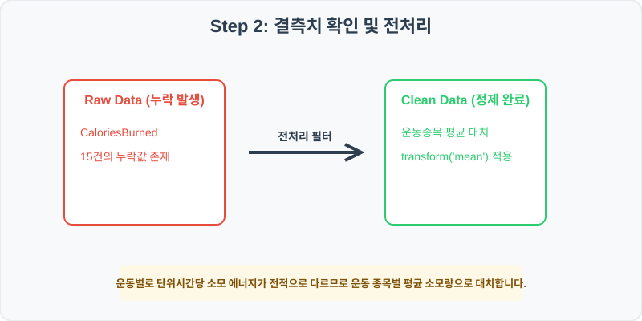
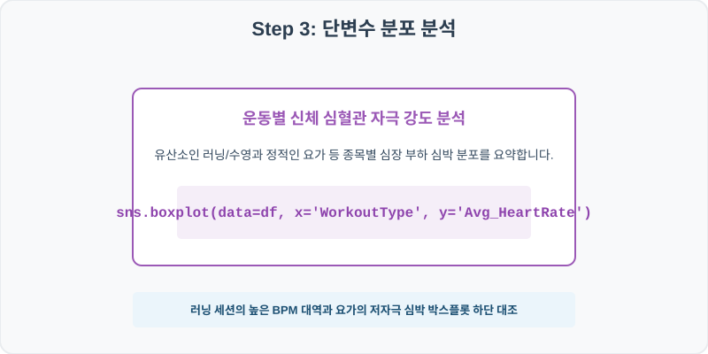
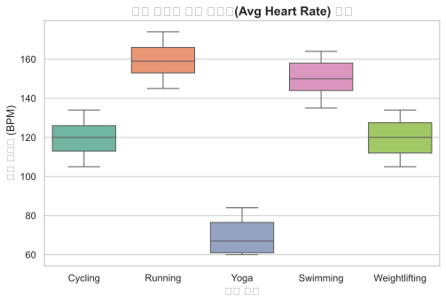
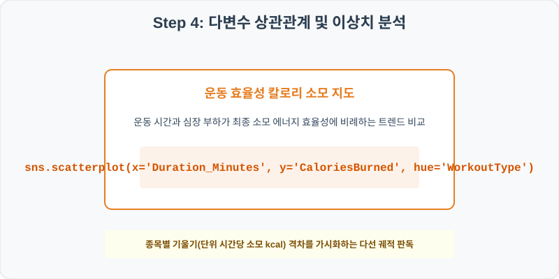
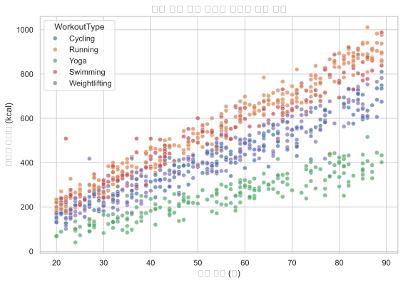

# 실전 데이터 분석 60: 피트니스 세션별 운동 종목에 따른 평균 심박수 분산 및 운동 시간 대비 칼로리 소소 효율성 다선 분석

> **📥 [실습 주피터 노트북(.ipynb) 다운로드](practice.ipynb)**

## 📌 강의 개요 (30분 완성)


스마트 피트니스 트래커가 측정한 운동 세션 로그 데이터셋입니다. 러닝, 수영, 사이클, 요가, 웨이트 등 각 종목별 평균 심박수(Avg Heart Rate)의 부하 분포를 상자 그림으로 비교 대조하고, 실제 운동 시간(Duration)의 증가에 따른 칼로리 소모량의 상관성을 종목별 선형 기울기로 시각화합니다.

**학습 목표:**
* **종목 조건부 칼로리 대치 (`transform`):** 운동별 소모량 기저가 완벽히 다른 특징을 유지하기 위해 운동 종목별 평균 소모량으로 결측을 대치합니다.
* **종목 분할 산점도 (`scatterplot`):** 운동 시간과 소모 칼로리 축 위에 종목 범주를 다르게 채색하여 종목별 칼로리 소모 가중 속도를 분석합니다.

---

## Step 1: 데이터 구조 살펴보기 (Data Overview)


`csv_data` 폴더에 준비해 둔 `fitness_tracker.csv` 파일을 판다스로 불러옵니다.

```python
import pandas as pd
import seaborn as sns
import matplotlib.pyplot as plt

# 그래프 설정 (한글 폰트 및 마이너스 기호 깨짐 방지)
import koreanize_matplotlib
plt.rcParams['axes.unicode_minus'] = False
sns.set_theme(style="whitegrid")

# 로컬 CSV 파일 불러오기
df = pd.read_csv('./fitness_tracker.csv')

# 데이터 구조 및 첫 5행 확인
print(df.info())
print(df.head())
```

> **💻 [실행 결과]**
> ```text
> <class 'pandas.DataFrame'>
> RangeIndex: 1000 entries, 0 to 999
> Data columns (total 6 columns):
>  #   Column            Non-Null Count  Dtype  
> ---  ------            --------------  -----  
>  0   SessionID         1000 non-null   int64  
>  1   WorkoutType       1000 non-null   str    
>  2   Duration_Minutes  1000 non-null   int64  
>  3   Avg_HeartRate     1000 non-null   int64  
>  4   CaloriesBurned    985 non-null    float64
>  5   Gender            1000 non-null   str    
> dtypes: float64(1), int64(3), str(2)
> memory usage: 59.3 KB
> None
>    SessionID WorkoutType  ...  CaloriesBurned  Gender
> 0     600001     Cycling  ...           459.4    Male
> 1     600002     Running  ...           607.8  Female
> 2     600003     Cycling  ...           185.9    Male
> 3     600004        Yoga  ...            70.2    Male
> 4     600005    Swimming  ...           815.6    Male
> 
> [5 rows x 6 columns]
> ```


<class 'pandas.DataFrame'>
RangeIndex: 1000 entries, 0 to 999
Data columns (total 6 columns):
 #   Column            Non-Null Count  Dtype  
---  ------            --------------  -----  
 0   SessionID         1000 non-null   int64  
 1   WorkoutType       1000 non-null   object 
 2   Duration_Minutes  1000 non-null   int64  
 3   Avg_HeartRate     1000 non-null   int64  
 4   CaloriesBurned    985 non-null    float64
 5   Gender            1000 non-null   object 
dtypes: float64(1), int64(3), object(2)
memory usage: 47.0 KB
None
   SessionID WorkoutType  Duration_Minutes  Avg_HeartRate  CaloriesBurned  Gender
0     600001     Cycling                62            113           459.4    Male
1     600002     Running                59            156           607.8  Female
2     600003     Cycling                22            122           185.9    Male
3     600004        Yoga                20             79            70.2    Male
4     600005    Swimming                87            149           815.6    Male
> ```

### 💡 코드 딥다이브 (Code Deep Dive)
**주요 분석 대상 컬럼:**
* `SessionID`: 운동 측정 개별 기록 일련번호
* `WorkoutType`: 운동 종류 (Running, Cycling, Swimming, Yoga, Weightlifting)
* `Duration_Minutes`: 운동을 지속한 총 시간 (분)
* `Avg_HeartRate`: 운동 세션 도중 기록된 평균 심박수 (BPM)
* `CaloriesBurned`: 피트니스 밴드가 계산한 추정 에너지 소모량 (kcal, 결측치 존재)
* `Gender`: 사용자 성별 (Male/Female)

---

## Step 2: 전처리와 결측치 정제 (Preprocess)



현실의 데이터는 항상 누락이 있거나 유효성 정제가 필요합니다. 데이터 전처리 단계에서 결측 상태를 확인하고 올바르게 보정합니다.

```python
# 1. 칼로리 소모 결측 확인
print("--- 정제 전 칼로리 결측 개수 ---")
print(df['CaloriesBurned'].isnull().sum())

# 2. 운동 종목(WorkoutType)별 칼로리 평균값을 구해 결측 대입
df['CaloriesBurned'] = df.groupby('WorkoutType')['CaloriesBurned'].transform(lambda x: x.fillna(x.mean()))

print("\n--- 정제 후 칼로리 결측 개수 ---")
print(df['CaloriesBurned'].isnull().sum())
```

> **💻 [실행 결과]**
> ```text
> --- 정제 전 칼로리 결측 개수 ---
> 15
> 
> --- 정제 후 칼로리 결측 개수 ---
> 0
> ```


--- 정제 전 칼로리 결측 개수 ---
15

--- 정제 후 칼로리 결측 개수 ---
0
> ```

### 💡 분석가의 통찰 (Analyst's Insight)
* **생체 에너지 대치 시 종목 분류의 타당성:** 격렬한 러닝(Running) 1시간 소모 칼로리와 정적인 스트레칭인 요가(Yoga) 1시간 소모 칼로리는 생체학적으로 수배의 배율 격차가 납니다. 이 결측치를 전체 운동의 종합 평균 칼로리값으로 대치해 버리면, 요가 세션의 소모 칼로리가 실제보다 과대 팽창되어 다이어트 식단 계획에 교란을 초래합니다. 반드시 종목 그룹별로 분류하여 대치해야 하는 강력한 도메인 이유가 여기에 있습니다.

---

## Step 3: 단변수 분포 분석 (Univariate EDA)



가장 먼저 핵심 변수가 전체 데이터에서 어떤 빈도와 분포를 가졌는지 단일 변수 시각화를 통해 파악해 봅니다.

```python
plt.figure(figsize=(8, 5))

# 운동 종목에 따른 평균 심박수 분포 상자 그림 비교
sns.boxplot(data=df, x='WorkoutType', y='Avg_HeartRate', palette='Set2')

plt.title('운동 종류별 평균 심박수(Avg Heart Rate) 분포', fontsize=14, fontweight='bold')
plt.xlabel('운동 종류')
plt.ylabel('평균 심박수 (BPM)')
plt.show()
```

> **💻 [실행 결과]**
> 


### 💡 시각화 차트 읽는 법 & 인사이트
* **종목 고유의 유산소 자극 역치 차이 규명:** 상자 그림을 분석하면 러닝(Running)과 수영(Swimming) 상자는 130~160BPM 고부하 대역에 높게 분포해 강력한 유산소 운동 효과를 입증합니다. 반면 요가(Yoga) 상자는 60~80BPM의 안정 안정 시 대역 근방에 머물고 있어, 각 종목의 심폐 자극 특성이 기기 센서 데이터를 통해 완전히 차별화된 상자로 증명됩니다.

---

## Step 4: 다변수 상관관계 및 이상치 분석 (Multivariate EDA)



두 개 이상의 변수를 동시에 결합하여, 조건에 따른 수치 차이나 독립 변수와 종속 변수 간의 통계적 경향을 분석합니다.

```python
plt.figure(figsize=(9, 6))

# 시간 대비 소모 칼로리 산점도를 운동 종목(hue)별로 시각화
sns.scatterplot(data=df, x='Duration_Minutes', y='CaloriesBurned', hue='WorkoutType', alpha=0.7)

plt.title('운동 시간 대비 칼로리 소모량 상관 분석', fontsize=14, fontweight='bold')
plt.xlabel('운동 시간 (분)')
plt.ylabel('칼로리 소모량 (kcal)')
plt.show()
```

> **💻 [실행 결과]**
> 


### 💡 코드 딥다이브 & 비즈니스 통찰 (Analyst's Insight)
* **종목별 에너지 연소 효율 기울기 격차:** 시간(X)과 칼로리(Y)의 산점도를 보면, 모든 종목이 우상향 선형 관계를 가지지만 **종목 색상별로 기울기의 두께와 경사각이 뚜렷하게 갈라져** 있습니다. 가장 경사각이 가파르게 뻗은 붉은 점(Running)은 시간당 연소 효율이 가장 우수함을 보이고, 경사각이 가장 누워 있는 녹색 점(Yoga)은 장시간 운동하더라도 칼로리 연소 속도가 느림을 명확히 대조해 줍니다.

---

## Step 5: 통계적 직관과 해석 (Statistical Logic)

> 💡 **[대사당량(MET) 개념과 다중 회귀 모델의 기울기 매칭]**
> 우리가 일상에서 활동할 때 소모되는 산소량과 에너지를 수치화한 단위를 **대사당량(MET, Metabolic Equivalent of Task)**이라고 합니다. 
> * 가만히 앉아 숨 쉬는 상태를 1 MET로 두며, 요가는 약 2.5 MET, 가벼운 사이클은 6 MET, 전력 질주 러닝은 10~12 MET의 계수를 갖습니다.
> * 이 MET 개념은 다변수 선형 회귀 모델의 기울기 계수($eta$)와 정확히 일치합니다.
> * 식을 $ 	ext{CaloriesBurned} = eta_0 + eta_1(	ext{Duration}) + eta_2(	ext{Avg\_HeartRate}) $ 로 설계하고 학습시켰을 때, 특정 운동 종목의 기울기 계수 $eta_1$은 '나이와 심박수가 고정일 때 해당 운동을 1분 지속할 때마다 추가로 타오르는 칼로리 연소율'을 설명해 줍니다. 
> * 데이터 과학자가 이 통계 모델의 계수를 추출해 스포츠 밴드 소프트웨어 연산 엔진에 이식하면, 자이로 센서와 심박 정보를 융합해 실시간으로 정밀 칼로리를 추정하는 생체 역학 알고리즘을 견고히 확립하게 됩니다.

---

## 🎯 30분 강의 마무리 및 심화 과제

오늘 우리는 실전 데이터셋을 분석하여 판다스로 데이터를 가공 및 정제하고, 시각화를 활용하여 핵심 변수 간의 통계적 유의성을 검증했습니다. 데이터 속에서 숨겨진 패턴을 올바른 시각으로 탐색하는 능력이 데이터 사이언티스트의 가장 강력한 무기입니다.

### 📝 심화 과제 (Advanced Challenge)
1. **심박수와 칼로리 소모의 피어슨 상관분석:** `df[['Avg_HeartRate', 'CaloriesBurned']].corr()` 코드를 통해 심장 박동의 강도 상승이 칼로리 연소량과 어떤 상관 크기를 갖는지 확인해 보세요.
2. **고효율 운동 세션 VIP 필터링:** 운동 시간이 45분 이하로 짧지만 칼로리는 500 kcal 이상 초고속으로 태운 고강도 파워 트레이닝 세션들만 추출하여 그들의 주된 `WorkoutType` 비율을 집계해 보세요.
