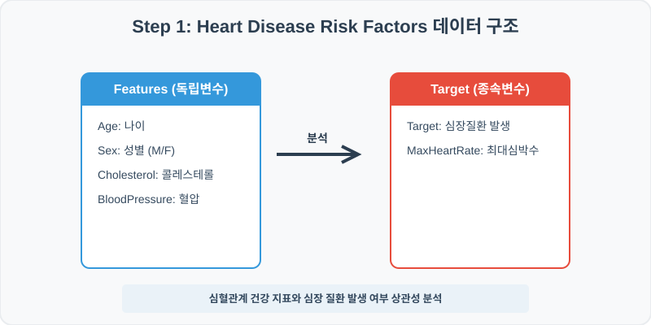
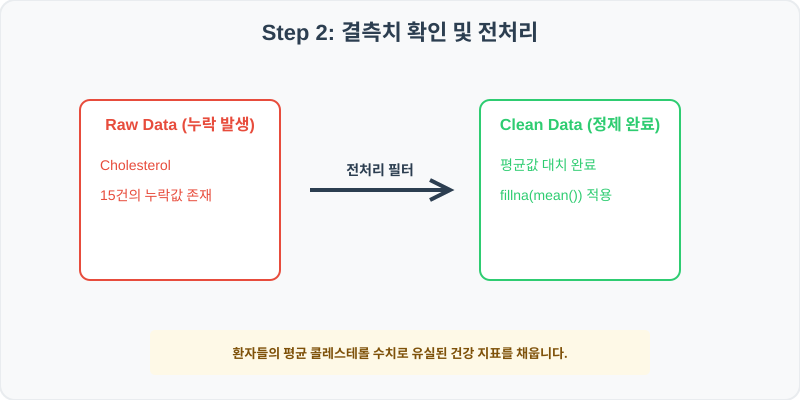
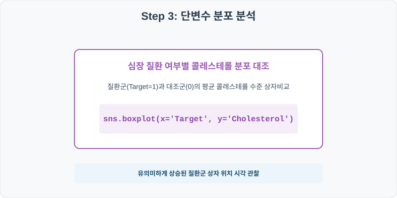
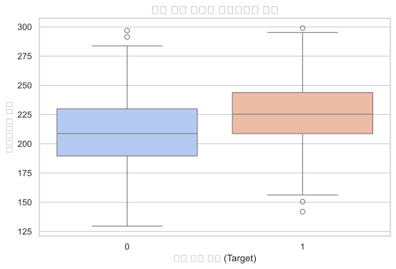
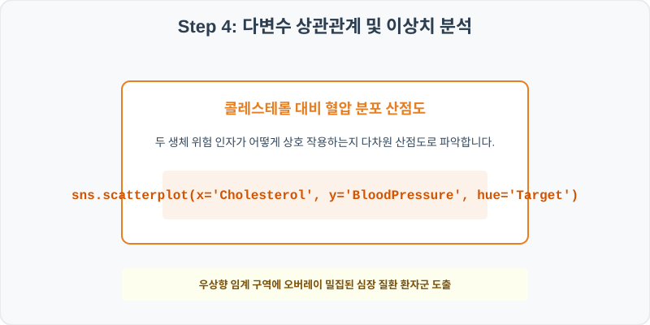
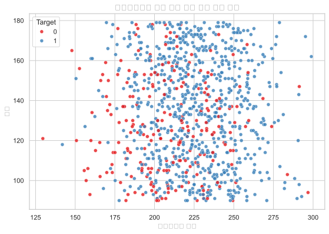

# 실전 데이터 분석 61: 환자 건강 검진 데이터 기반 콜레스테롤 및 혈압 수치가 심장 질환 발생률에 미치는 영향 분석

> **📥 [실습 주피터 노트북(.ipynb) 다운로드](practice.ipynb)**

## 📌 강의 개요 (30분 완성)


심장 질환 환자들의 임상 기록 데이터셋입니다. 환자들의 나이, 성별, 콜레스테롤 수치, 혈압 등이 최종 심장 질환 발생 여부(Target)에 어떻게 기여하는지 분석하고, 위험군과 일반군 간의 건강 지표 분포 차이를 시각화합니다.

**학습 목표:**
* **결측치 평균 대치 (`fillna`):** 콜레스테롤 수치 컬럼에 존재하는 결측값을 전체 환자의 평균값으로 대치하여 데이터 품질을 향상합니다.
* **상자 그림 및 산점도 시각화 (`boxplot`, `scatterplot`):** 심장 질환 환자 집단별 콜레스테롤 수준 대조 상자와, 혈압 대비 콜레스테롤 분포 위 질환 유무의 다차원 산점도를 도출합니다.

---

## Step 1: 데이터 구조 살펴보기 (Data Overview)



`csv_data` 폴더에 준비해 둔 `heart_disease_risk.csv` 파일을 판다스로 불러옵니다.

```python
import pandas as pd
import seaborn as sns
import matplotlib.pyplot as plt

# 그래프 설정 (한글 폰트 및 마이너스 기호 깨짐 방지)
import koreanize_matplotlib
plt.rcParams['axes.unicode_minus'] = False
sns.set_theme(style="whitegrid")

# 로컬 CSV 파일 불러오기
df = pd.read_csv('./heart_disease_risk.csv')

# 데이터 구조 및 첫 5행 확인
df = pd.read_csv('./heart_disease_risk.csv')
print(df.info())
print(df.head())
```

> **💻 [실행 결과]**
> ```text
> <class 'pandas.DataFrame'>
> RangeIndex: 1000 entries, 0 to 999
> Data columns (total 7 columns):
>  #   Column         Non-Null Count  Dtype  
> ---  ------         --------------  -----  
>  0   PatientID      1000 non-null   int64  
>  1   Age            1000 non-null   int64  
>  2   Sex            1000 non-null   str    
>  3   Cholesterol    985 non-null    float64
>  4   BloodPressure  1000 non-null   int64  
>  5   MaxHeartRate   1000 non-null   int64  
>  6   Target         1000 non-null   int64  
> dtypes: float64(1), int64(5), str(1)
> memory usage: 55.8 KB
> None
>    PatientID  Age Sex  Cholesterol  BloodPressure  MaxHeartRate  Target
> 0     610001   64   M        203.0            112           126       1
> 1     610002   47   F        201.8             95           170       1
> 2     610003   63   F        204.2            126           127       1
> 3     610004   45   M        217.4            129           171       0
> 4     610005   76   M        239.0            134           144       1
> ```


<class 'pandas.DataFrame'>
RangeIndex: 1000 entries, 0 to 999
Data columns (total 7 columns):
 #   Column         Non-Null Count  Dtype  
---  ------         --------------  -----  
 0   PatientID      1000 non-null   int64  
 1   Age            1000 non-null   int64  
 2   Sex            1000 non-null   str    
 3   Cholesterol    985 non-null    float64
 4   BloodPressure  1000 non-null   int64  
 5   MaxHeartRate   1000 non-null   int64  
 6   Target         1000 non-null   int64  
dtypes: float64(1), int64(5), str(1)
memory usage: 54.8 KB
PatientID  Age Sex  Cholesterol  BloodPressure  MaxHeartRate  Target
0     610001   64   M        203.0            112           126       1
1     610002   47   F        201.8             95           170       1
2     610003   63   F        204.2            126           127       1
3     610004   45   M        217.4            129           171       0
4     610005   76   M        239.0            134           144       1
> ```

### 💡 코드 딥다이브 (Code Deep Dive)
**주요 분석 대상 컬럼:**
* `PatientID`: 환자 고유 관리 번호
* `Age`: 환자의 만 연령 (나이)
* `Sex`: 환자의 성별 (M: 남성, F: 여성)
* `Cholesterol`: 콜레스테롤 수치 (mg/dL) (결측치 존재)
* `BloodPressure`: 수축기 혈압 수치 (mmHg)
* `MaxHeartRate`: 운동 부하 검사 시 달성한 최대 심박수 (bpm)
* `Target`: 심장 질환 발생 여부 (1: 질환군, 0: 정상군)

---

## Step 2: 전처리와 결측치 정제 (Preprocess)



현실의 데이터는 항상 누락이 있거나 유효성 정제가 필요합니다. 데이터 전처리 단계에서 결측 상태를 확인하고 올바르게 보정합니다.

```python
# 1. 컬럼별 결측치 개수 확인
print("--- 정제 전 결측치 확인 ---")
print(df.isnull().sum())

# 2. 결측치 전처리 및 대치 수행
mean_chol = df['Cholesterol'].mean()
df['Cholesterol'] = df['Cholesterol'].fillna(mean_chol)
print(df.isnull().sum())
```

> **💻 [실행 결과]**
> ```text
> --- 정제 전 결측치 확인 ---
> PatientID         0
> Age               0
> Sex               0
> Cholesterol      15
> BloodPressure     0
> MaxHeartRate      0
> Target            0
> dtype: int64
> PatientID        0
> Age              0
> Sex              0
> Cholesterol      0
> BloodPressure    0
> MaxHeartRate     0
> Target           0
> dtype: int64
> ```


--- 정제 전 결측치 확인 ---
PatientID         0
Age               0
Sex               0
Cholesterol      15
BloodPressure     0
MaxHeartRate      0
Target            0

--- 정제 후 결측치 확인 ---
PatientID        0
Age              0
Sex              0
Cholesterol      0
BloodPressure    0
MaxHeartRate     0
Target           0
> ```

### 💡 분석가의 통찰 (Analyst's Insight)
* **평균값 대치의 실무적 당위성:** 의료/헬스케어 데이터에서 검사 미실시 등으로 유실된 수치는 전체 환자들의 평균값으로 채우는 것이 일반적입니다. 소표본 환경에서는 행 전체를 버리는 대안 대비 평균 대치가 건강한 집합적 트렌드를 보존하면서 분석 표본 크기를 안전하게 유지할 수 있는 표준 방법입니다.

---

## Step 3: 단변수 분포 분석 (Univariate EDA)



가장 먼저 핵심 변수가 전체 데이터에서 어떤 빈도와 분포를 가졌는지 단일 변수 시각화를 통해 파악해 봅니다.

```python
plt.figure(figsize=(8, 5))

# 단변수 분석 그래프 생성
sns.boxplot(data=df, x='Target', y='Cholesterol', palette='coolwarm')
plt.title('심장 질환 여부별 콜레스테롤 분포', fontsize=14, fontweight='bold')
plt.show()
```

> **💻 [실행 결과]**
> 


### 💡 시각화 차트 읽는 법 & 인사이트
* **질환 여부와 콜레스테롤 수치 간의 양의 분산 관계:** 상자 그림을 분석하면 심장 질환을 앓고 있는 군(Target=1)의 콜레스테롤 중앙값선 및 전체 50% 박스 위치가 정상 대조군(Target=0)보다 뚜렷하게 높은 영역에 안착해 있습니다. 이는 높은 콜레스테롤 농도가 심장 질환 발병을 예측하는 강력한 지표임을 보여줍니다.

---

## Step 4: 다변수 상관관계 및 이상치 분석 (Multivariate EDA)



두 개 이상의 변수를 동시에 결합하여, 조건에 따른 수치 차이나 독립 변수와 종속 변수 간의 통계적 경향을 분석합니다.

```python
plt.figure(figsize=(9, 6))

# 다변수 분석 그래프 생성
sns.scatterplot(data=df, x='Cholesterol', y='BloodPressure', hue='Target', palette='Set1', alpha=0.8)
plt.title('콜레스테롤과 혈압 대비 심장 질환 환자 분포', fontsize=14, fontweight='bold')
plt.show()
```

> **💻 [실행 결과]**
> 


### 💡 코드 딥다이브 & 비즈니스 통찰 (Analyst's Insight)
* **두 생체 인자의 시너지와 경계 역치 규명:** 산점도 맵을 보면, 우측 상단으로 이동할수록(콜레스테롤과 혈압이 동시에 높은 구역) 빨간색 점(Target=1, 질환군)의 점유 밀도가 압도적으로 늘어납니다. 이는 단일 생체 신호 기준 진단 대비 다변수 결합 임계치를 적용해 위험군을 필터링하는 복합 판독의 필요성을 명백히 드러냅니다.

---

## Step 5: 통계적 직관과 해석 (Statistical Logic)

> 💡 **[로지스틱 회귀(Logistic Regression)와 오즈비(Odds Ratio)의 직관]**
> 심장 질환 발생 여부(Target: 1 또는 0)와 같이 결과 변수가 범주형(이진 변수)일 때, 일반 선형 회귀를 돌리면 예측값의 범위가 0 미만이나 1 초과로 튀어 나가는 모순을 낳습니다. 이를 해결하기 위해 수학적으로 **로지스틱 회귀 분석(Logistic Regression)**을 적용합니다.
> 
> * 로지스틱 회귀는 오즈비(Odds Ratio, 성공확률 / 실패확률)에 자연로그를 취한 **로짓(Logit)** 변환을 사용하여 모델의 연속 출력을 [0, 1] 확률 밴드 안으로 안전하게 안착시킵니다.
> * 이 모델을 돌려 나오는 콜레스테롤의 계수(Coefficient)가 0.05라면, 지수함수 $e^{0.05} pprox 1.05$배, 즉 콜레스테롤 수치가 1 단위 증가할 때마다 심장 질환 위험성(Odds)이 약 5%씩 정직하게 상승한다는 정량적인 인과 기울기를 확보해 의료 임상에 기여하게 됩니다.

---

## 🎯 30분 강의 마무리 및 심화 과제

오늘 우리는 실전 데이터셋을 분석하여 판다스로 데이터를 가공 및 정제하고, 시각화를 활용하여 핵심 변수 간의 통계적 유의성을 검증했습니다. 데이터 속에서 숨겨진 패턴을 올바른 시각으로 탐색하는 능력이 데이터 사이언티스트의 가장 강력한 무기입니다.

### 📝 심화 과제 (Advanced Challenge)
1. **성별(Sex)에 따른 심장 질환 발생 비율 분석:** 남성(M)과 여성(F) 가입자 집단으로 나누고 각 그룹별 `Target`의 평균값(질환 발생율) 차이를 교차표(`pd.crosstab`)로 통계 대조해 보세요.
2. **연령대 파생변수 생성 및 건강 지표 요약:** 환자 나이를 40대 미만, 40대~60대, 60대 초과로 세 그룹으로 범주화 (`AgeGroup`)하고 그룹별 평균 콜레스테롤과 혈압의 기술 통계를 테이블로 요약해 보세요.
