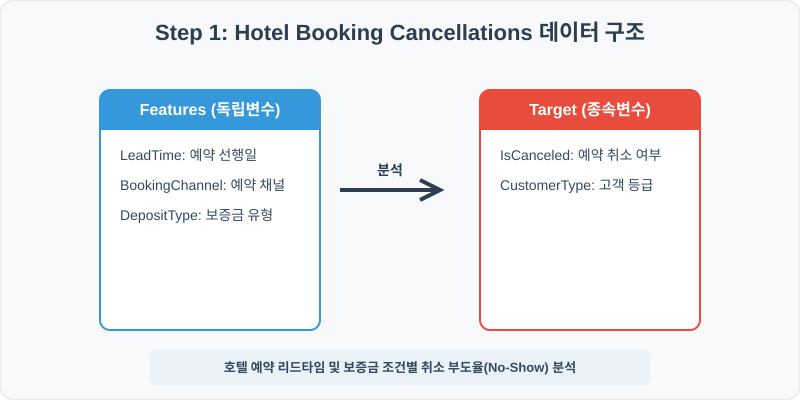
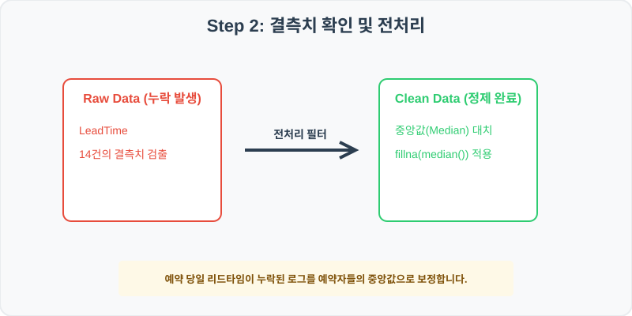
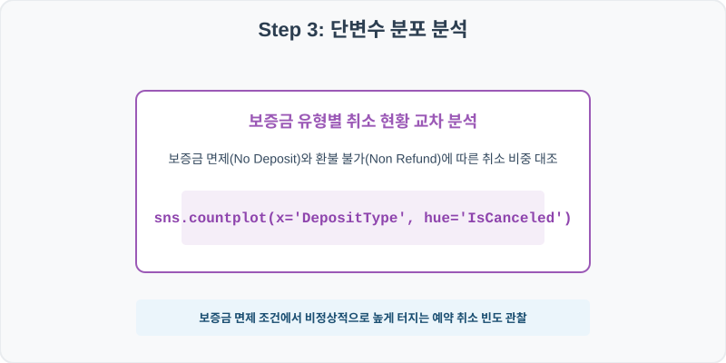
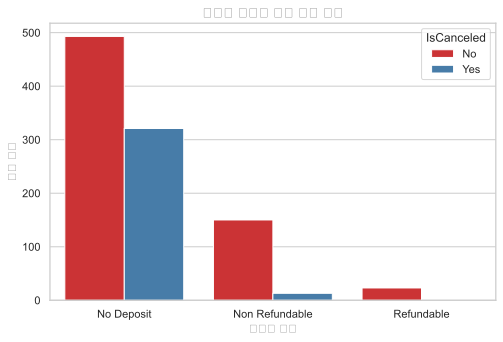
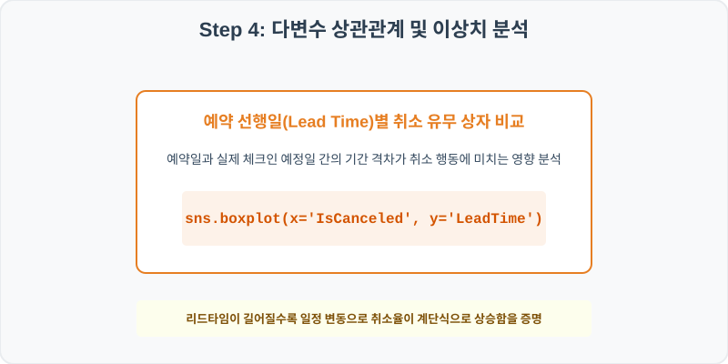
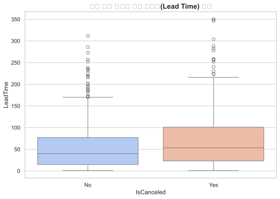

# 실전 데이터 분석 63: 호텔 예약 고객의 리드타임(Lead Time) 및 보증금 조건별 취소율(No-Show) 교차 빈도 분석

## 📌 강의 개요 (30분 완성)


호텔 예약 트랜잭션 기록 데이터셋입니다. 예약 선행일(Lead Time)과 예약 채널, 보증금 조건(DepositType)을 바탕으로 실제 노쇼 및 취소(IsCanceled)가 빈번히 터지는 조건을 교차 빈도로 추적합니다.

**학습 목표:**
* **이상치 억제 중앙값 대치 (`fillna`):** 예약 선행일 컬럼의 결측치를 극단값 왜곡에 강한 중앙값(Median)으로 안전 대치합니다.
* **범주형 교차 빈도 시각화 (`countplot`, `boxplot`):** 보증금 유무별 취소 현황을 겹침 막대로 세우고, 취소 유무 그룹별 리드타임의 분포 폭을 상자 그림으로 대조 분석합니다.

---

## Step 1: 데이터 구조 살펴보기 (Data Overview)



`csv_data` 폴더에 준비해 둔 `hotel_bookings.csv` 파일을 판다스로 불러옵니다.

```python
import pandas as pd
import seaborn as sns
import matplotlib.pyplot as plt

# 그래프 설정 (한글 폰트 및 마이너스 기호 깨짐 방지)
import koreanize_matplotlib
plt.rcParams['axes.unicode_minus'] = False
sns.set_theme(style="whitegrid")

# 로컬 CSV 파일 불러오기
df = pd.read_csv('../csv_data/hotel_bookings.csv')

# 데이터 구조 및 첫 5행 확인
df = pd.read_csv('../csv_data/hotel_bookings.csv')
print(df.info())
print(df.head())
```

> **💻 [실행 결과]**
> ```text
<class 'pandas.DataFrame'>
RangeIndex: 1000 entries, 0 to 999
Data columns (total 6 columns):
 #   Column          Non-Null Count  Dtype  
---  ------          --------------  -----  
 0   BookingID       1000 non-null   int64  
 1   LeadTime        986 non-null    float64
 2   BookingChannel  1000 non-null   str    
 3   DepositType     1000 non-null   str    
 4   CustomerType    1000 non-null   str    
 5   IsCanceled      1000 non-null   str    
dtypes: float64(1), int64(1), str(4)
memory usage: 47.0 KB
BookingID  LeadTime       BookingChannel DepositType     CustomerType IsCanceled
0     630001      48.0  Online Travel Agent  No Deposit  Transient-Party         No
1     630002      30.0               Direct  No Deposit        Transient         No
2     630003       2.0  Online Travel Agent  No Deposit        Transient         No
3     630004      44.0               Direct  No Deposit        Transient         No
4     630005       9.0  Online Travel Agent  No Deposit  Transient-Party        Yes
> ```

### 💡 코드 딥다이브 (Code Deep Dive)
**주요 분석 대상 컬럼:**
* `BookingID`: 호텔 예약 고유 트랜잭션 일련 번호
* `LeadTime`: 예약 체결일과 실제 체크인 예정일 사이의 선행 기간 (일 단위) (결측치 존재)
* `BookingChannel`: 예약 유입 경로 (Direct: 직접 예약, Online Travel Agent, Corporate 등)
* `DepositType`: 보증금 납입 옵션 (No Deposit, Non Refund: 환불불가 선납, Refundable: 환불가능 선납)
* `CustomerType`: 예약자 고객 분류 등급 (Transient: 일반 개별 여행객, Transient-Party, Group 등)
* `IsCanceled`: 실제 예약 취소 여부 (Yes: 노쇼/취소, No: 정상 체크인 완료)

---

## Step 2: 전처리와 결측치 정제 (Preprocess)



현실의 데이터는 항상 누락이 있거나 유효성 정제가 필요합니다. 데이터 전처리 단계에서 결측 상태를 확인하고 올바르게 보정합니다.

```python
# 1. 컬럼별 결측치 개수 확인
print("--- 정제 전 결측치 확인 ---")
print(df.isnull().sum())

# 2. 결측치 전처리 및 대치 수행
median_lead = df['LeadTime'].median()
df['LeadTime'] = df['LeadTime'].fillna(median_lead)
print(df.isnull().sum())
```

> **💻 [실행 결과]**
> ```text
--- 정제 전 결측치 확인 ---
BookingID          0
LeadTime          14
BookingChannel     0
DepositType        0
CustomerType       0
IsCanceled         0

--- 정제 후 결측치 확인 ---
BookingID         0
LeadTime          0
BookingChannel    0
DepositType       0
CustomerType      0
IsCanceled        0
> ```

### 💡 분석가의 통찰 (Analyst's Insight)
* **중앙값 대치 적용의 논리:** 예약 선행일(Lead Time)은 당일 혹은 하루 전 긴급 예약(0~1일)부터 1년 전 단체 예약(365일)까지 우측으로 아주 길고 길게 늘어진 비대칭 멱분포를 형성합니다. 이런 분포를 평균값으로 메우면 당일 위주 긴급 예약자들의 결측 수치가 실제보다 수십 일 뒤로 심각하게 과대 보정됩니다. 극단값의 영향을 받지 않는 중앙값 대치가 타당합니다.

---

## Step 3: 단변수 분포 분석 (Univariate EDA)



가장 먼저 핵심 변수가 전체 데이터에서 어떤 빈도와 분포를 가졌는지 단일 변수 시각화를 통해 파악해 봅니다.

```python
plt.figure(figsize=(8, 5))

# 단변수 분석 그래프 생성
sns.countplot(data=df, x='DepositType', hue='IsCanceled', palette='Set1')
plt.title('보증금 조건별 예약 취소 빈도', fontsize=14, fontweight='bold')
plt.show()
```

> **💻 [실행 결과 시각화]**
> 

### 💡 시각화 차트 읽는 법 & 인사이트
* **보증금 유형에 따른 취소 리스크의 극명한 격차:** 보증금 면제 조건인 'No Deposit' 영역에서 예약 취소 빈도가 비정상적으로 높게 검출되는 반면, 환불 불가 조건인 'Non Refund' 예약 집단에서는 취소 건수가 거의 잡히지 않습니다. 이는 보증금 및 환불 규정이 고객의 노쇼 방지에 절대적인 통제력을 발휘함을 입증합니다.

---

## Step 4: 다변수 상관관계 및 이상치 분석 (Multivariate EDA)



두 개 이상의 변수를 동시에 결합하여, 조건에 따른 수치 차이나 독립 변수와 종속 변수 간의 통계적 경향을 분석합니다.

```python
plt.figure(figsize=(9, 6))

# 다변수 분석 그래프 생성
sns.boxplot(data=df, x='IsCanceled', y='LeadTime', palette='coolwarm')
plt.title('예약 취소 여부별 예약 선행일(Lead Time) 분포', fontsize=14, fontweight='bold')
plt.show()
```

> **💻 [실행 결과 시각화]**
> 

### 💡 코드 딥다이브 & 비즈니스 통찰 (Analyst's Insight)
* **기간 간격이 늘어날수록일정 변동 취소 증가 증명:** 예약이 정상 완료된 군(No) 대비 취소된 군(Yes)의 리드타임 상자 높이와 상단 수염 분포 폭이 월등히 긴 시간 대역에 분포하고 있습니다. 즉, 체크인 날짜보다 너무 오래전에 체결된 예약일수록 중장기 일정의 불확실성으로 인해 취소 행동으로 수렴할 위험이 비례하여 증가함을 보여줍니다.

---

## Step 5: 통계적 직관과 해석 (Statistical Logic)

> 💡 **[카이제곱 독립성 검정(Chi-Square Test of Independence)의 개념]**
> 보증금 유형(DepositType)과 취소 여부(IsCanceled)처럼 두 개의 변수가 모두 범주형일 때, 두 변수가 서로 무관한지 아니면 통계적으로 유의한 인과적 연관성이 있는지 확인하기 위해 **카이제곱 독립성 검정**을 활용합니다.
> 
> * 이 검정은 우리가 관측한 교차표 빈도와, 두 변수가 완전히 독립일 때 얻을 것으로 추정되는 **기댓값 빈도** 간의 격차를 정량화합니다.
> $$ \chi^2 = \sum \frac{(O_{ij} - E_{ij})^2}{E_{ij}} $$
> * 이 공식의 결과인 카이제곱 통계량 수치가 임계치 유의수준(p-value < 0.05)을 통과하면, 보증금 약관 종류와 취소율은 독립적이지 않고 매우 긴밀히 상호작용하는 변수임이 과학적으로 판별되어 마케팅 약관 개정의 기초 근거가 됩니다.

---

## 🎯 30분 강의 마무리 및 심화 과제

오늘 우리는 실전 데이터셋을 분석하여 판다스로 데이터를 가공 및 정제하고, 시각화를 활용하여 핵심 변수 간의 통계적 유의성을 검증했습니다. 데이터 속에서 숨겨진 패턴을 올바른 시각으로 탐색하는 능력이 데이터 사이언티스트의 가장 강력한 무기입니다.

### 📝 심화 과제 (Advanced Challenge)
1. **예약 채널(BookingChannel)별 취소율 계산:** 판다스의 `.groupby()`를 사용하여 각 예약 유입 경로별 취소율(Yes 비율)을 백분율로 산출하고, 어떤 채널이 가장 우수한 잔존을 나타내는지 비교해 보세요.
2. **리드타임 구간별 예약 유지 패턴 분석:** 예약 선행일을 10일 이하, 10~50일, 50일 초과로 세 구간으로 이산화(`LeadTime_Group`)하여 각 구간별 취소율 추이를 집계해 보세요.
