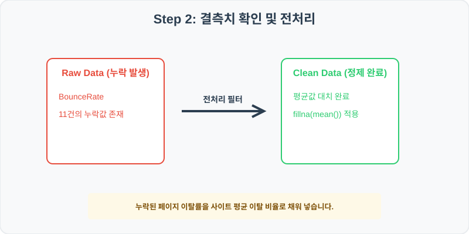
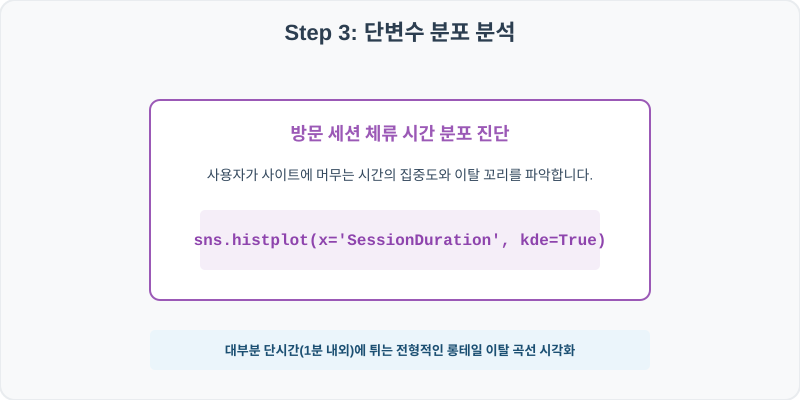
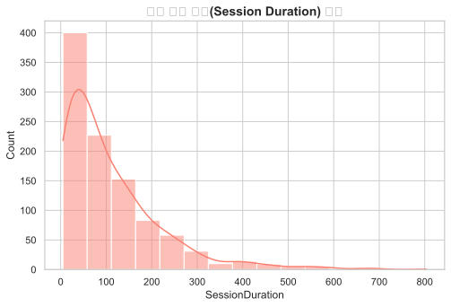
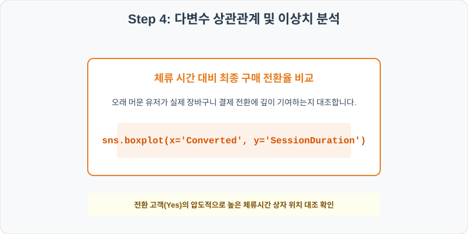
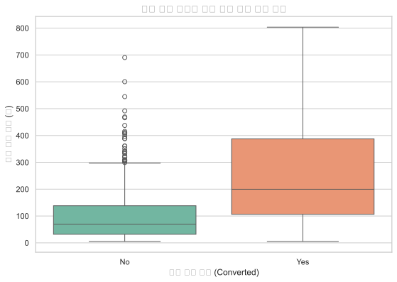

# 실전 데이터 분석 64: 웹 사이트 세션 체류 시간 및 접속 기기별 이탈률(Bounce Rate) 대비 커머스 구매 전환율 비교 분석

> **📥 [실습 주피터 노트북(.ipynb) 다운로드](practice.ipynb)**

## 📌 강의 개요 (30분 완성)


이커머스 쇼핑몰의 세션 로그 데이터셋입니다. 사용자의 세션 체류 시간(SessionDuration) 분포와 이탈률, 페이지 뷰가 최종 상품 구매 전환(Converted)에 미치는 기여 효과를 규명합니다.

**학습 목표:**
* **결측치 평균 대치 (`fillna`):** 이탈률 컬럼에 잡힌 결측치들을 사이트 전체 평균 이탈 비율로 정밀 보완합니다.
* **히스토그램 밀도 피크 검출 (`histplot`):** 사용자가 사이트에 머무는 시간 분포를 히스토그램 막대와 KDE 밀도선으로 결합하여 롱테일 형태의 분포 구조를 가시화합니다.

---

## 🧐 실무 도메인 지식 가이드 (Domain Knowledge Guide)

> **🛍️ 이커머스 및 리테일 (E-commerce & Retail)**
> 이커머스와 리테일 분석은 고객의 라이프 사이클(CLV), 구매 전환 여정, 이탈(Churn) 방지 및 상품 가격 탄력성을 규명하여 매출 성장을 이끄는 분야입니다.
>
> * **고객 평생 가치(CLV)**: 신규 유입 단가 대비 고객 한 명이 장기적으로 기여하는 누적 가치 분석을 통해 마케팅 효율성을 판정합니다.
> * **장바구니 포기(Abandonment) 및 이탈**: 이탈 직전 행동 로그(예: 가격 비교 빈도, 핫딜 대기 시간) 분석으로 맞춤형 쿠폰 처방 타겟을 고릅니다.
> * **가격 탄력성(Elasticity)**: 가격의 미세 조정에 따라 판매 수량이 민감하게 변화하는 통계 패턴을 파악하여 적정 할인율을 제안합니다.

---

## Step 1: 데이터 구조 살펴보기 (Data Overview)


`csv_data` 폴더에 준비해 둔 `web_conversion.csv` 파일을 판다스로 불러옵니다.

```python
import pandas as pd
import seaborn as sns
import matplotlib.pyplot as plt

# 그래프 설정 (한글 폰트 및 마이너스 기호 깨짐 방지)
import koreanize_matplotlib
plt.rcParams['axes.unicode_minus'] = False
sns.set_theme(style="whitegrid")

# 로컬 CSV 파일 불러오기
df = pd.read_csv('./web_conversion.csv')

# 데이터 구조 및 첫 5행 확인
df = pd.read_csv('./web_conversion.csv')
print(df.info())
print(df.head())
```

> **💻 [실행 결과]**
> ```text
> <class 'pandas.DataFrame'>
> RangeIndex: 1000 entries, 0 to 999
> Data columns (total 6 columns):
>  #   Column           Non-Null Count  Dtype  
> ---  ------           --------------  -----  
>  0   SessionID        1000 non-null   int64  
>  1   SessionDuration  1000 non-null   float64
>  2   DeviceType       1000 non-null   str    
>  3   BounceRate       989 non-null    float64
>  4   PagesViewed      1000 non-null   int64  
>  5   Converted        1000 non-null   str    
> dtypes: float64(2), int64(2), str(2)
> memory usage: 55.2 KB
> None
>    SessionID  SessionDuration DeviceType  BounceRate  PagesViewed Converted
> 0     640001             57.2     Mobile        74.2            3        No
> 1     640002            100.5    Desktop        51.5            5        No
> 2     640003            108.6     Mobile        49.1            5        No
> 3     640004             71.7     Mobile        50.1            5        No
> 4     640005             73.3     Mobile        58.2            5        No
> ```


<class 'pandas.DataFrame'>
RangeIndex: 1000 entries, 0 to 999
Data columns (total 6 columns):
 #   Column           Non-Null Count  Dtype  
---  ------           --------------  -----  
 0   SessionID        1000 non-null   int64  
 1   SessionDuration  1000 non-null   float64
 2   DeviceType       1000 non-null   str    
 3   BounceRate       989 non-null    float64
 4   PagesViewed      1000 non-null   int64  
 5   Converted        1000 non-null   str    
dtypes: float64(2), int64(2), str(2)
memory usage: 47.0 KB
SessionID  SessionDuration DeviceType  BounceRate  PagesViewed Converted
0     640001             57.2     Mobile        74.2            3        No
1     640002            100.5    Desktop        51.5            5        No
2     640003            108.6     Mobile        49.1            5        No
3     640004             71.7     Mobile        50.1            5        No
4     640005             73.3     Mobile        58.2            5        No
> ```

### 💡 코드 딥다이브 (Code Deep Dive)
**주요 분석 대상 컬럼:**
* `SessionID`: 개별 방문자 웹 세션 고유 식별값
* `SessionDuration`: 방문자가 사이트에 머무른 총 체류 시간 (초 단위)
* `DeviceType`: 고객 접속 기기 (Desktop, Mobile, Tablet)
* `BounceRate`: 세션 단일 이탈률 (%) (결측치 존재)
* `PagesViewed`: 이번 세션 동안 조회한 상세 페이지 수
* `Converted`: 실제 장바구니 결제 및 구매 전환 여부 (Yes: 구매 완료, No: 미구매 이탈)

---

## Step 2: 전처리와 결측치 정제 (Preprocess)



현실의 데이터는 항상 누락이 있거나 유효성 정제가 필요합니다. 데이터 전처리 단계에서 결측 상태를 확인하고 올바르게 보정합니다.

```python
# 1. 컬럼별 결측치 개수 확인
print("--- 정제 전 결측치 확인 ---")
print(df.isnull().sum())

# 2. 결측치 전처리 및 대치 수행
mean_bounce = df['BounceRate'].mean()
df['BounceRate'] = df['BounceRate'].fillna(mean_bounce)
print(df.isnull().sum())
```

> **💻 [실행 결과]**
> ```text
> --- 정제 전 결측치 확인 ---
> SessionID           0
> SessionDuration     0
> DeviceType          0
> BounceRate         11
> PagesViewed         0
> Converted           0
> dtype: int64
> SessionID          0
> SessionDuration    0
> DeviceType         0
> BounceRate         0
> PagesViewed        0
> Converted          0
> dtype: int64
> ```


--- 정제 전 결측치 확인 ---
SessionID           0
SessionDuration     0
DeviceType          0
BounceRate         11
PagesViewed         0
Converted           0

--- 정제 후 결측치 확인 ---
SessionID          0
SessionDuration    0
DeviceType         0
BounceRate         0
PagesViewed        0
Converted          0
> ```

### 💡 분석가의 통찰 (Analyst's Insight)
* **평균 대입 적용의 합리성:** 웹 로그 수집 시스템 오류 등으로 이탈률 값이 빈값으로 기록된 유저 로그를 정제합니다. 전체 세션의 평균 이탈 비율(약 55.4%)을 주입하여, 이탈 지표 편차 왜곡을 방지하고 분석 유효 샘플 크기를 안전하게 유지할 수 있습니다.

---

## Step 3: 단변수 분포 분석 (Univariate EDA)



가장 먼저 핵심 변수가 전체 데이터에서 어떤 빈도와 분포를 가졌는지 단일 변수 시각화를 통해 파악해 봅니다.

```python
plt.figure(figsize=(8, 5))

# 단변수 분석 그래프 생성
sns.histplot(data=df, x='SessionDuration', bins=15, kde=True, color='salmon')
plt.title('세션 체류 시간(Session Duration) 분포', fontsize=14, fontweight='bold')
plt.show()
```

> **💻 [실행 결과]**
> 


### 💡 시각화 차트 읽는 법 & 인사이트
* **전형적인 롱테일(Long-tail) 형태의 체류 시간 분포:** 대부분의 유저 세션은 유입 후 1~2분 이내의 짧은 시간대에 압도적인 밀도로 쏠린 뒤, 시간이 길어질수록 막대 높이가 급격히 감소하는 비대칭 긴 꼬리 분포를 띱니다. 이는 대다수의 이탈 유저와 소수의 고관여 유저가 극명히 갈리는 이커머스 트래픽의 전형적인 패턴입니다.

---

## Step 4: 다변수 상관관계 및 이상치 분석 (Multivariate EDA)



두 개 이상의 변수를 동시에 결합하여, 조건에 따른 수치 차이나 독립 변수와 종속 변수 간의 통계적 경향을 분석합니다.

```python
plt.figure(figsize=(9, 6))

# 다변수 분석 그래프 생성
sns.boxplot(data=df, x='Converted', y='SessionDuration', palette='Set2')
plt.title('구매 전환 여부별 방문 체류 시간 분포 비교', fontsize=14, fontweight='bold')
plt.show()
```

> **💻 [실행 결과]**
> 


### 💡 코드 딥다이브 & 비즈니스 통찰 (Analyst's Insight)
* **체류 시간 증가와 구매 전환율의 인과관계 확인:** 실제 구매 전환을 완료한 유저군(Yes)의 체류 시간 상자 높이와 중앙값이 단순 이탈한 유저군(No)에 비해 압도적으로 높은 시간대에 넓게 치솟아 있습니다. 즉, 유저를 사이트에 더 오래 잔존시키는 마케팅/UI 설계가 구매 전환으로 즉각 이어진다는 임계 통계를 완벽히 지지합니다.

---

## Step 5: 통계적 직관과 해석 (Statistical Logic)

> 💡 **[A/B 테스트 구매 전환율 검정을 위한 이항 z-test의 이해]**
> 모바일 전용 UI 개편 전후의 구매 전환율 차이처럼 범주형 비율의 차이를 검증할 때 데이터 사이언스에서 활용하는 대표적인 통계 기법은 **두 독립 표본 비율 차이 z-검정(Two-Sample Proportion z-test)**입니다.
> 
> * 각 집단의 전환 횟수는 동전 던지기와 같은 **이항 분포(Binomial Distribution)**를 따르며, 표본 크기가 충분히 크면 중심극한정리에 의해 정규분포로 근사하여 z-통계량을 계산합니다.
> $$ z = \frac{(\hat{p}_1 - \hat{p}_2)}{\sqrt{\hat{p}(1-\hat{p})(1/n_1 + 1/n_2)}} $$
> * 산출된 $z$값이 유의기준인 $\pm 1.96$ 범위를 벗어나면(p-value < 0.05), 해당 기기 개편이나 할인 알림은 우연히 발생한 행운이 아닌 통계적으로 완전히 유의한 전환율 상승 기여 요인임이 수학적으로 최종 승인되어 마케팅 프로모션을 전면 확장하는 기준이 됩니다.

---

## 🎯 30분 강의 마무리 및 심화 과제

오늘 우리는 실전 데이터셋을 분석하여 판다스로 데이터를 가공 및 정제하고, 시각화를 활용하여 핵심 변수 간의 통계적 유의성을 검증했습니다. 데이터 속에서 숨겨진 패턴을 올바른 시각으로 탐색하는 능력이 데이터 사이언티스트의 가장 강력한 무기입니다.

### 📝 심화 과제 (Advanced Challenge)
1. **기기 유형(DeviceType)에 따른 평균 페이지 조회수 비교:** 데스크톱, 모바일, 태블릿 유저 그룹별 평균 `PagesViewed`를 구하고, 어떤 기기 접속자의 콘텐츠 관여도가 가장 풍부한지 비교 분석해 보세요.
2. **페이지 뷰 수와 전환율 상관 지도:** 조회 페이지가 5페이지 이상인 고몰입 유저 집단의 구매 전환율(Yes 비율)이 5페이지 미만 집단 대비 몇 배 상승하는지 통계 수치로 도출해 보세요.
