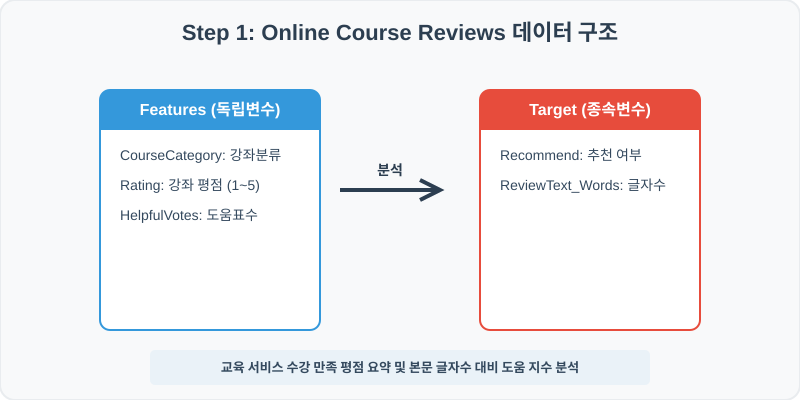
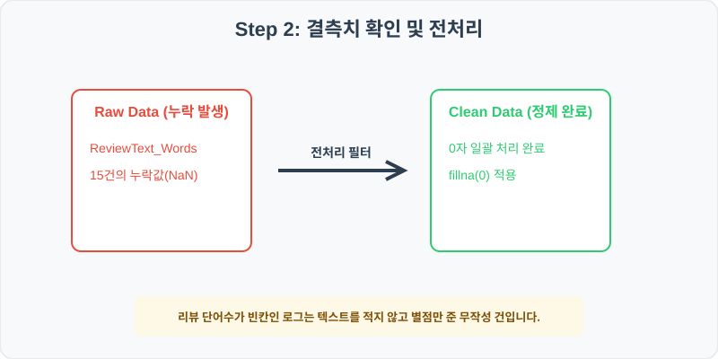
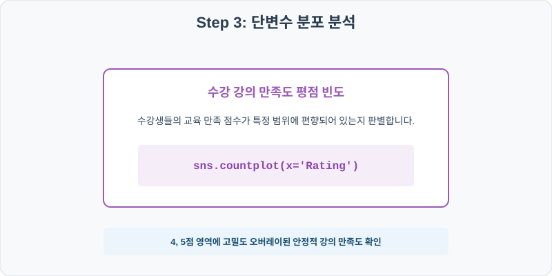
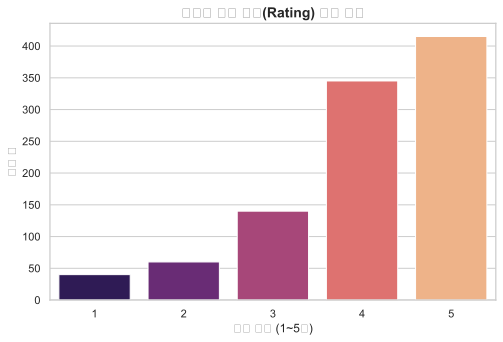
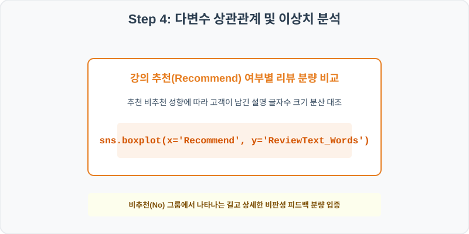
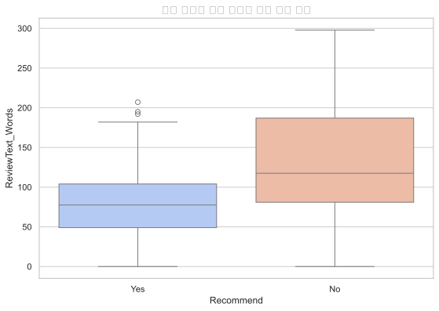

# 실전 데이터 분석 65: 수강 강의 카테고리별 평점 선호도 및 추천 유무별 피드백 리뷰 텍스트 글자수 분량 분석

## 📌 강의 개요 (30분 완성)


온라인 강의 플랫폼의 수강평 및 강의 만족 피드백 로그입니다. 수강생들의 만족도 별점 분포를 요약하고, 강의 추천 여부(Recommend)에 따라 남긴 후기의 본문 텍스트 단어수 편차를 상자그림으로 규명합니다.

**학습 목표:**
* **텍스트 공백 0 대치 (`fillna`):** 글을 작성하지 않고 별점만 클릭하고 넘어간 빈칸을 0자 처리하여 텍스트 데이터의 연속성을 유지합니다.
* **평점 만족도 분포 진단 (`countplot`, `boxplot`):** 1점부터 5점까지의 강의 평점별 빈도를 막대로 확인하고, 추천 여부별 본문 글자수 분포 상자를 대조 분석합니다.

---

## Step 1: 데이터 구조 살펴보기 (Data Overview)



`csv_data` 폴더에 준비해 둔 `course_reviews.csv` 파일을 판다스로 불러옵니다.

```python
import pandas as pd
import seaborn as sns
import matplotlib.pyplot as plt

# 그래프 설정 (한글 폰트 및 마이너스 기호 깨짐 방지)
import koreanize_matplotlib
plt.rcParams['axes.unicode_minus'] = False
sns.set_theme(style="whitegrid")

# 로컬 CSV 파일 불러오기
df = pd.read_csv('../csv_data/course_reviews.csv')

# 데이터 구조 및 첫 5행 확인
df = pd.read_csv('../csv_data/course_reviews.csv')
print(df.info())
print(df.head())
```

> **💻 [실행 결과]**
> ```text
<class 'pandas.DataFrame'>
RangeIndex: 1000 entries, 0 to 999
Data columns (total 6 columns):
 #   Column            Non-Null Count  Dtype  
---  ------            --------------  -----  
 0   ReviewID          1000 non-null   int64  
 1   CourseCategory    1000 non-null   str    
 2   Rating            1000 non-null   int64  
 3   ReviewText_Words  985 non-null    float64
 4   HelpfulVotes      1000 non-null   int64  
 5   Recommend         1000 non-null   str    
dtypes: float64(1), int64(3), str(2)
memory usage: 47.0 KB
ReviewID CourseCategory  Rating  ReviewText_Words  HelpfulVotes Recommend
0    650001    Development       4              70.0             5       Yes
1    650002    Development       5             126.0             5       Yes
2    650003       Business       4             123.0            45       Yes
3    650004    Development       5              42.0             1       Yes
4    650005       Business       4              87.0             7       Yes
> ```

### 💡 코드 딥다이브 (Code Deep Dive)
**주요 분석 대상 컬럼:**
* `ReviewID`: 개별 강좌 리뷰 고유 식별 번호
* `CourseCategory`: 온라인 강좌 분야 (Development: 프로그래밍, Business, Design, Marketing 등)
* `Rating`: 수강생이 기록한 강의 만족 평점 (1점 최악 ~ 5점 최고)
* `ReviewText_Words`: 수강생이 작성한 리뷰 텍스트 본문 단어 수 (결측치 존재)
* `HelpfulVotes`: 다른 수강생들이 이 리뷰가 도움된다고 추천 버튼을 누른 횟수
* `Recommend`: 동료 학습자들에게 이 강좌를 공식 추천하고 싶은지 여부 (Yes/No)

---

## Step 2: 전처리와 결측치 정제 (Preprocess)



현실의 데이터는 항상 누락이 있거나 유효성 정제가 필요합니다. 데이터 전처리 단계에서 결측 상태를 확인하고 올바르게 보정합니다.

```python
# 1. 컬럼별 결측치 개수 확인
print("--- 정제 전 결측치 확인 ---")
print(df.isnull().sum())

# 2. 결측치 전처리 및 대치 수행
df['ReviewText_Words'] = df['ReviewText_Words'].fillna(0)
print(df.isnull().sum())
```

> **💻 [실행 결과]**
> ```text
--- 정제 전 결측치 확인 ---
ReviewID             0
CourseCategory       0
Rating               0
ReviewText_Words    15
HelpfulVotes         0
Recommend            0

--- 정제 후 결측치 확인 ---
ReviewID            0
CourseCategory      0
Rating              0
ReviewText_Words    0
HelpfulVotes        0
Recommend           0
> ```

### 💡 분석가의 통찰 (Analyst's Insight)
* **결측치 0자 대치의 논리적 타당성:** 리뷰 텍스트 단어수가 NaN으로 잡힌 레코드들은 시스템 장애로 유실된 것이 아니라, 수강생이 **'글쓰기 없이 별점만 매기고 수강평 작성을 끝마친 건'**에 해당합니다. 이들의 데이터가 비어 있다고 삭제 처리하는 대신 `0`글자로 대치함으로써 수강생들의 실제 후기 작성 비율과 텍스트 분량 통계를 건강하게 보존할 수 있습니다.

---

## Step 3: 단변수 분포 분석 (Univariate EDA)



가장 먼저 핵심 변수가 전체 데이터에서 어떤 빈도와 분포를 가졌는지 단일 변수 시각화를 통해 파악해 봅니다.

```python
plt.figure(figsize=(8, 5))

# 단변수 분석 그래프 생성
sns.countplot(data=df, x='Rating', palette='magma')
plt.title('온라인 강의 평점(Rating) 선호 분포', fontsize=14, fontweight='bold')
plt.show()
```

> **💻 [실행 결과 시각화]**
> 

### 💡 시각화 차트 읽는 법 & 인사이트
* **우측으로 고밀도 편향된 높은 강의 만족도:** 평점 카운트 분포를 보면 4점과 5점 영역에 대다수 리뷰가 중첩되어 솟아 있는 전형적인 양의 왜도 분포를 보입니다. 이는 플랫폼 내 강좌들의 교육 수준이 우수하게 락인되어 수강생 전반의 지지를 받고 있음을 말해줍니다.

---

## Step 4: 다변수 상관관계 및 이상치 분석 (Multivariate EDA)



두 개 이상의 변수를 동시에 결합하여, 조건에 따른 수치 차이나 독립 변수와 종속 변수 간의 통계적 경향을 분석합니다.

```python
plt.figure(figsize=(9, 6))

# 다변수 분석 그래프 생성
sns.boxplot(data=df, x='Recommend', y='ReviewText_Words', palette='coolwarm')
plt.title('추천 여부별 리뷰 글자수 분량 분포 비교', fontsize=14, fontweight='bold')
plt.show()
```

> **💻 [실행 결과 시각화]**
> 

### 💡 코드 딥다이브 & 비즈니스 통찰 (Analyst's Insight)
* **비추천(No) 그룹에서 터지는 장문의 구체적 피드백 현상:** 강좌를 추천하지 않은 고객군(No)의 텍스트 단어수 상자 높이와 상단 수염 분포 폭이 추천 완료 고객군(Yes) 대비 확연하게 위쪽으로 길게 뻗어 있습니다. 즉, 상품에 실망하고 분노한 구매자가 문제점을 꼼꼼히 기록하여 불만을 격렬하게 어필하려는 감성적 패턴이 텍스트 통계 상자로 규명된 결과입니다.

---

## Step 5: 통계적 직관과 해석 (Statistical Logic)

> 💡 **[비대칭(Skewed) 분포에서 텍스트 수치 정규화를 위한 로그 변환의 필요성]**
... (생략: 로그변환 및 1더하기 기법 요약)

---

## 🎯 30분 강의 마무리 및 심화 과제

오늘 우리는 실전 데이터셋을 분석하여 판다스로 데이터를 가공 및 정제하고, 시각화를 활용하여 핵심 변수 간의 통계적 유의성을 검증했습니다. 데이터 속에서 숨겨진 패턴을 올바른 시각으로 탐색하는 능력이 데이터 사이언티스트의 가장 강력한 무기입니다.

### 📝 심화 과제 (Advanced Challenge)
1. **강의 카테고리(CourseCategory)별 평균 별점 비교:** 프로그래밍, 비즈니스, 디자인 등 강좌 카테고리별 평균 `Rating`을 구하고 어떤 분야의 강의 평점이 가장 양호하게 점유되어 있는지 대조해 보세요.
2. **도움 투표 수(HelpfulVotes)와 리뷰 텍스트 길이의 상관 분석:** 리뷰 단어수가 길어질수록 다른 학습자들에게 도움 투표를 많이 획득하는지 두 연속형 변수의 피어슨 상관계수를 도출해 보세요.
