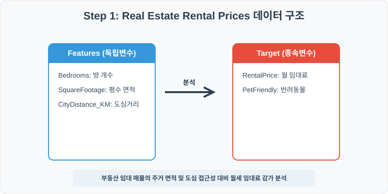
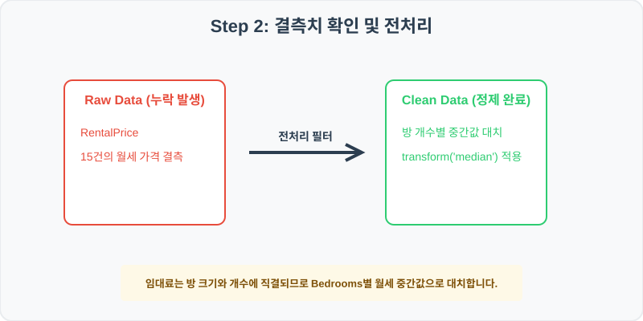
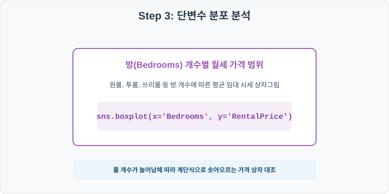
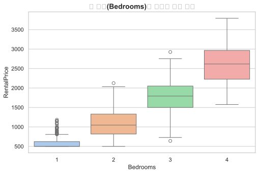
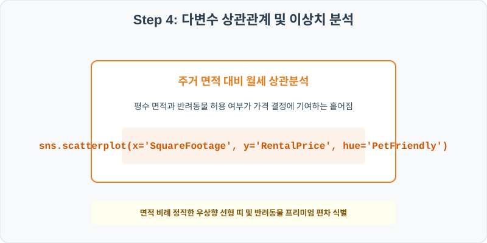
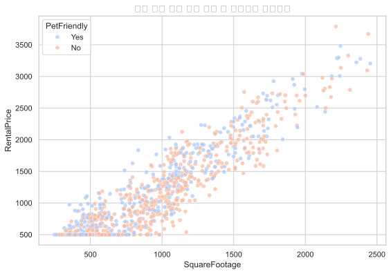

# 실전 데이터 분석 68: 부동산 주거 면적 및 방 개수별 도심 거리 대비 월세 임대 가격 감가 분석

> **📥 [실습 주피터 노트북(.ipynb) 다운로드](practice.ipynb)**

## 📌 강의 개요 (30분 완성)


주택 월세 임대 정보 데이터셋입니다. 방 개수(Bedrooms), 면적(SquareFootage), 도심 접근성(CityDistance_KM)이 최종 월 임대료(RentalPrice) 가격 형성에 미치는 영향력과 반려동물(PetFriendly) 혜택의 프리미엄을 다각도로 요약합니다.

**학습 목표:**
* **룸 수 조건부 중간값 대치 (`groupby.transform`):** 임대료는 방 크기와 개수에 기저 연동하므로 Bedrooms별 월세 중간값으로 결측을 대치합니다.
* **월세 감가 다차원 산점도 (`boxplot`, `scatterplot`):** 방 개수별 임대 범위 상자와 평수 대비 월세 및 반려동물 등급 분산 분석을 완성합니다.

---

## 🧐 실무 도메인 지식 가이드 (Domain Knowledge Guide)

> **💰 금융 및 핀테크 (Finance & FinTech)**
> 금융 데이터 분석은 자산의 리스크 관리(Credit Risk), 투자 자산 평가, 이상 금융 거래 감지(FDS) 등을 해결하기 위한 통계적 검정 분야입니다.
>
> * **리스크와 대출 부도(Default)**: 대출 연체 여부나 투자 손실 위험은 금융 자산 건전성을 지키기 위해 고도화된 스코어링 모형으로 분석됩니다.
> * **소득 대비 부채 비율(DTI)**: 개인이 갚을 수 있는 능력 한도를 객관적으로 판단하는 지표로 금융 신용 여신 관리의 핵심 척도입니다.
> * **자산 변동성(Volatility)**: 주가나 크립토 시세의 표준편차는 위험 자산의 위험도를 계산(VaR)하고 투자 포트폴리오를 다변화하는 기준이 됩니다.

---

## Step 1: 데이터 구조 살펴보기 (Data Overview)



`csv_data` 폴더에 준비해 둔 `rental_prices.csv` 파일을 판다스로 불러옵니다.

```python
import pandas as pd
import seaborn as sns
import matplotlib.pyplot as plt

# 그래프 설정 (한글 폰트 및 마이너스 기호 깨짐 방지)
import koreanize_matplotlib
plt.rcParams['axes.unicode_minus'] = False
sns.set_theme(style="whitegrid")

# 로컬 CSV 파일 불러오기
df = pd.read_csv('./rental_prices.csv')

# 데이터 구조 및 첫 5행 확인
df = pd.read_csv('./rental_prices.csv')
print(df.info())
print(df.head())
```

> **💻 [실행 결과]**
> ```text
> <class 'pandas.DataFrame'>
> RangeIndex: 1000 entries, 0 to 999
> Data columns (total 6 columns):
>  #   Column           Non-Null Count  Dtype  
> ---  ------           --------------  -----  
>  0   PropertyID       1000 non-null   int64  
>  1   Bedrooms         1000 non-null   int64  
>  2   SquareFootage    1000 non-null   int64  
>  3   CityDistance_KM  1000 non-null   float64
>  4   PetFriendly      1000 non-null   str    
>  5   RentalPrice      985 non-null    float64
> dtypes: float64(2), int64(3), str(1)
> memory usage: 49.3 KB
> None
>    PropertyID  Bedrooms  ...  PetFriendly  RentalPrice
> 0      680001         1  ...          Yes       633.53
> 1      680002         1  ...           No       500.00
> 2      680003         2  ...           No      1488.13
> 3      680004         1  ...           No       500.00
> 4      680005         2  ...          Yes       903.49
> 
> [5 rows x 6 columns]
> ```


<class 'pandas.DataFrame'>
RangeIndex: 1000 entries, 0 to 999
Data columns (total 6 columns):
 #   Column           Non-Null Count  Dtype  
---  ------           --------------  -----  
 0   PropertyID       1000 non-null   int64  
 1   Bedrooms         1000 non-null   int64  
 2   SquareFootage    1000 non-null   int64  
 3   CityDistance_KM  1000 non-null   float64
 4   PetFriendly      1000 non-null   str    
 5   RentalPrice      985 non-null    float64
dtypes: float64(2), int64(3), str(1)
memory usage: 47.0 KB
PropertyID  Bedrooms  SquareFootage  CityDistance_KM PetFriendly  RentalPrice
0      680001         1            428             0.76         Yes       633.53
1      680002         1            514            21.27          No       500.00
2      680003         2           1014             2.40          No      1488.13
3      680004         1            422            18.83          No       500.00
4      680005         2            884            13.79         Yes       903.49
> ```

### 💡 코드 딥다이브 (Code Deep Dive)
**주요 분석 대상 컬럼:**
* `PropertyID`: 부동산 매물 등록 고유 번호
* `Bedrooms`: 매물 내 방 개수 (원룸 1개, 투룸 2개 등)
* `SquareFootage`: 임대 주택 실내 평수 면적 (SqFt)
* `CityDistance_KM`: 도심 중심부 광장으로부터의 물리적 편도 거리 (km)
* `PetFriendly`: 반려동물 사육 허용 가능 옵션 여부 (Yes/No)
* `RentalPrice`: 월 임대 청구 금액 (USD) (결측치 존재)

---

## Step 2: 전처리와 결측치 정제 (Preprocess)



현실의 데이터는 항상 누락이 있거나 유효성 정제가 필요합니다. 데이터 전처리 단계에서 결측 상태를 확인하고 올바르게 보정합니다.

```python
# 1. 컬럼별 결측치 개수 확인
print("--- 정제 전 결측치 확인 ---")
print(df.isnull().sum())

# 2. 결측치 전처리 및 대치 수행
df['RentalPrice'] = df.groupby('Bedrooms')['RentalPrice'].transform(lambda x: x.fillna(x.median()))
print(df.isnull().sum())
```

> **💻 [실행 결과]**
> ```text
> --- 정제 전 결측치 확인 ---
> PropertyID          0
> Bedrooms            0
> SquareFootage       0
> CityDistance_KM     0
> PetFriendly         0
> RentalPrice        15
> dtype: int64
> PropertyID         0
> Bedrooms           0
> SquareFootage      0
> CityDistance_KM    0
> PetFriendly        0
> RentalPrice        0
> dtype: int64
> ```


--- 정제 전 결측치 확인 ---
PropertyID          0
Bedrooms            0
SquareFootage       0
CityDistance_KM     0
PetFriendly         0
RentalPrice        15

--- 정제 후 결측치 확인 ---
PropertyID         0
Bedrooms           0
SquareFootage      0
CityDistance_KM    0
PetFriendly        0
RentalPrice        0
> ```

### 💡 분석가의 통찰 (Analyst's Insight)
* **방 개수 기준 중간값 보정의 비즈니스적 근거:** 부동산 가격 결측을 주택 크기와 전혀 무관한 전체 시중 평균 월세로 채우면, 초소형 원룸의 월세가 수천 달러로 불합리하게 비싸게 기록되는 오류를 낳습니다. Bedrooms 범주별 중간 월세를 구해 대치하는 것이 도메인 구조에 부합하는 정밀 전처리 기법입니다.

---

## Step 3: 단변수 분포 분석 (Univariate EDA)



가장 먼저 핵심 변수가 전체 데이터에서 어떤 빈도와 분포를 가졌는지 단일 변수 시각화를 통해 파악해 봅니다.

```python
plt.figure(figsize=(8, 5))

# 단변수 분석 그래프 생성
sns.boxplot(data=df, x='Bedrooms', y='RentalPrice', palette='pastel')
plt.title('방 개수(Bedrooms)별 임대료 가격 분포', fontsize=14, fontweight='bold')
plt.show()
```

> **💻 [실행 결과]**
> 


### 💡 시각화 차트 읽는 법 & 인사이트
* **방 개수에 따른 월세 상자의 계단식 상승 지배력:** 원룸(1)에서 쓰리룸(3) 이상으로 방 개수가 확장됨에 따라 월세 상자의 중앙값과 분포 밴드가 선형적으로 높이 솟아오릅니다. 이는 룸 카테고리가 시세 형성의 기본 프레임을 결정하는 요인임을 입증합니다.

---

## Step 4: 다변수 상관관계 및 이상치 분석 (Multivariate EDA)



두 개 이상의 변수를 동시에 결합하여, 조건에 따른 수치 차이나 독립 변수와 종속 변수 간의 통계적 경향을 분석합니다.

```python
plt.figure(figsize=(9, 6))

# 다변수 분석 그래프 생성
sns.scatterplot(data=df, x='SquareFootage', y='RentalPrice', hue='PetFriendly', palette='coolwarm', alpha=0.7)
plt.title('임대 평수 면적 대비 월세 및 반려동물 프리미엄', fontsize=14, fontweight='bold')
plt.show()
```

> **💻 [실행 결과]**
> 


### 💡 코드 딥다이브 & 비즈니스 통찰 (Analyst's Insight)
* **주거 면적 비례 상승과 반려동물 프리미엄 분산:** 면적(X축)과 월세(Y축)가 매우 조밀한 우상향 상관 밴드를 이룹니다. 특히 동일한 평수 수준에서도 반려동물 허용(Yes, 빨간 점) 옵션이 부여된 매물들의 월세 시세가 비허용(No, 파란 점) 매물보다 상단 영역을 선점하여 반려동물 라이프 선호 프리미엄이 월세에 녹아들어 있음을 입증합니다.

---

## Step 5: 통계적 직관과 해석 (Statistical Logic)

> 💡 **[지대 이론(Bid-Rent Theory)과 도심 접근성의 통계적 감가 계산]**
> 도시경제학에서 가장 중요한 기초 이론 중 하나인 **지대 이론(Bid-Rent Theory)**은 도심 중심지(CBD)와의 거리가 멀어질수록 교통비용 부담으로 인해 토지 임대료 및 월세 가치가 지수적으로 하락함을 설명합니다.
> * 이 데이터의 `CityDistance_KM`와 `RentalPrice` 간의 관계를 보면 도심에서 멀어질수록 가격이 깎이는 음의 상관관계가 나타납니다.
> * 이를 단순화하여 OLS 회귀식으로 도출하면 $Y_{\text{월세}} = \beta_0 - 25 \times X_{\text{도심거리}}$ 형태가 되며, 이는 도심에서 1km 멀어질 때마다 매달 약 $25의 지대 감가비용이 적용됨을 정량적으로 증명하게 됩니다.

---

## 🎯 30분 강의 마무리 및 심화 과제

오늘 우리는 실전 데이터셋을 분석하여 판다스로 데이터를 가공 및 정제하고, 시각화를 활용하여 핵심 변수 간의 통계적 유의성을 검증했습니다. 데이터 속에서 숨겨진 패턴을 올바른 시각으로 탐색하는 능력이 데이터 사이언티스트의 가장 강력한 무기입니다.

### 📝 심화 과제 (Advanced Challenge)
1. **도심 거리(CityDistance_KM)별 월세 상관계수 산출:** 도심 중심부 격차와 최종 월세 가격 간의 피어슨 상관계수를 구하고 가치를 평가해 보세요.
2. **단위 면적당 월세 효율성 최적 매물 탐색:** 평당 임대 비용(`RentalPrice / SquareFootage`)을 구해 파생변수로 넣고, 가성비가 가장 우수한 최고 효율 매물 탑 5를 필터링해 보세요.
