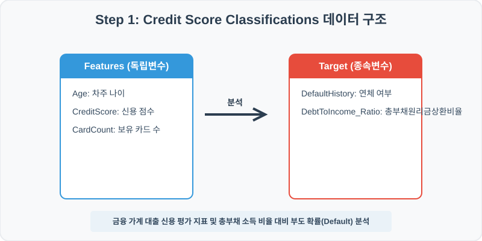
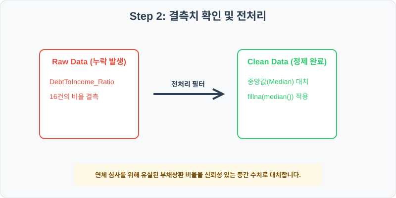
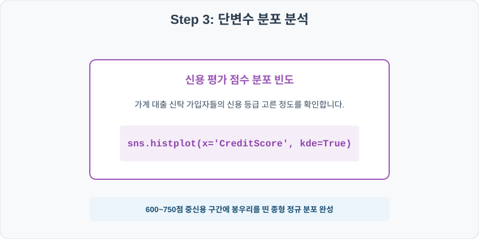
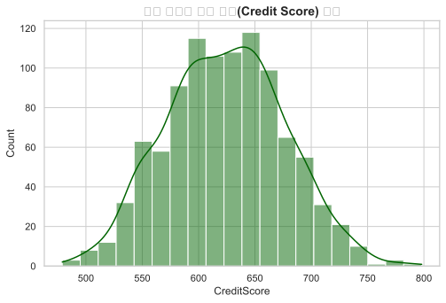
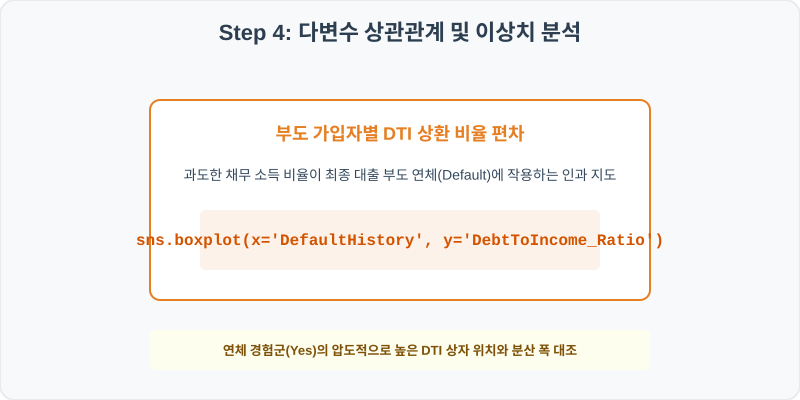
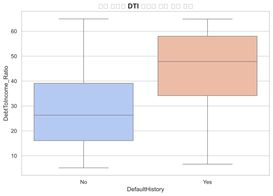

# 실전 데이터 분석 70: 가계 대출 신청자의 신용점수 및 총부채 소득 비율(DTI) 대비 연체 부도율 상관 분석

> **📥 [실습 주피터 노트북(.ipynb) 다운로드](practice.ipynb)**

## 📌 강의 개요 (30분 완성)


금융 대출 가입자들의 신용 기록 데이터셋입니다. 신청자의 개인 신용 평가 점수 분포를 진단하고, 총부채 상환 부담율(DTI)의 증가가 실제 대출금 부도 연체 이력(DefaultHistory)으로 번지는 통계 경계를 상자그림으로 도출합니다.

**학습 목표:**
* **중앙값 대치 (`fillna`):** 소득 대비 원리금 상환 비율(DTI)의 일부 결측치를 50% 구간의 중간값으로 안전하게 채워 분석의 신뢰성을 지킵니다.
* **신용 등급 분포 및 DTI 연체 매칭 (`histplot`, `boxplot`):** 대출 가입자 신용분포 정규곡선 및 연체 유무별 상환 부담의 격차 상자를 시각화합니다.

---

## Step 1: 데이터 구조 살펴보기 (Data Overview)



`csv_data` 폴더에 준비해 둔 `credit_scores.csv` 파일을 판다스로 불러옵니다.

```python
import pandas as pd
import seaborn as sns
import matplotlib.pyplot as plt

# 그래프 설정 (한글 폰트 및 마이너스 기호 깨짐 방지)
import koreanize_matplotlib
plt.rcParams['axes.unicode_minus'] = False
sns.set_theme(style="whitegrid")

# 로컬 CSV 파일 불러오기
df = pd.read_csv('./credit_scores.csv')

# 데이터 구조 및 첫 5행 확인
df = pd.read_csv('./credit_scores.csv')
print(df.info())
print(df.head())
```

> **💻 [실행 결과]**
> ```text
> <class 'pandas.DataFrame'>
> RangeIndex: 1000 entries, 0 to 999
> Data columns (total 6 columns):
>  #   Column              Non-Null Count  Dtype  
> ---  ------              --------------  -----  
>  0   ID                  1000 non-null   int64  
>  1   Age                 1000 non-null   int64  
>  2   CreditScore         1000 non-null   int64  
>  3   DebtToIncome_Ratio  984 non-null    float64
>  4   CardCount           1000 non-null   int64  
>  5   DefaultHistory      1000 non-null   str    
> dtypes: float64(1), int64(4), str(1)
> memory usage: 49.3 KB
> None
>        ID  Age  CreditScore  DebtToIncome_Ratio  CardCount DefaultHistory
> 0  700001   35          579               17.57          3             No
> 1  700002   43          598               30.55          3            Yes
> 2  700003   71          708               14.45          2             No
> 3  700004   45          549               31.31          3             No
> 4  700005   21          640               26.49          7             No
> ```


<class 'pandas.DataFrame'>
RangeIndex: 1000 entries, 0 to 999
Data columns (total 6 columns):
 #   Column              Non-Null Count  Dtype  
---  ------              --------------  -----  
 0   ID                  1000 non-null   int64  
 1   Age                 1000 non-null   int64  
 2   CreditScore         1000 non-null   int64  
 3   DebtToIncome_Ratio  984 non-null    float64
 4   CardCount           1000 non-null   int64  
 5   DefaultHistory      1000 non-null   str    
dtypes: float64(1), int64(4), str(1)
memory usage: 47.0 KB
ID  Age  CreditScore  DebtToIncome_Ratio  CardCount DefaultHistory
0  700001   35          579               17.57          3             No
1  700002   43          598               30.55          3            Yes
2  700003   71          708               14.45          2             No
3  700004   45          549               31.31          3             No
4  700005   21          640               26.49          7             No
> ```

### 💡 코드 딥다이브 (Code Deep Dive)
**주요 분석 대상 컬럼:**
* `ID`: 대출 신청 차주 고유 관리 번호
* `Age`: 대출 신청자 연령 (나이)
* `CreditScore`: 개인 신용 평가 기관 스코어 (300~850점)
* `DebtToIncome_Ratio`: 소득 대비 총 부채 원리금 상환 비율 (DTI, %) (결측치 존재)
* `CardCount`: 차주가 보유한 총 신용카드 발급 개수
* `DefaultHistory`: 과거 대출금 90일 이상 연체 및 부도 경험 여부 (Yes/No)

---

## Step 2: 전처리와 결측치 정제 (Preprocess)



현실의 데이터는 항상 누락이 있거나 유효성 정제가 필요합니다. 데이터 전처리 단계에서 결측 상태를 확인하고 올바르게 보정합니다.

```python
# 1. 컬럼별 결측치 개수 확인
print("--- 정제 전 결측치 확인 ---")
print(df.isnull().sum())

# 2. 결측치 전처리 및 대치 수행
median_dti = df['DebtToIncome_Ratio'].median()
df['DebtToIncome_Ratio'] = df['DebtToIncome_Ratio'].fillna(median_dti)
print(df.isnull().sum())
```

> **💻 [실행 결과]**
> ```text
> --- 정제 전 결측치 확인 ---
> ID                     0
> Age                    0
> CreditScore            0
> DebtToIncome_Ratio    16
> CardCount              0
> DefaultHistory         0
> dtype: int64
> ID                    0
> Age                   0
> CreditScore           0
> DebtToIncome_Ratio    0
> CardCount             0
> DefaultHistory        0
> dtype: int64
> ```


--- 정제 전 결측치 확인 ---
ID                     0
Age                    0
CreditScore            0
DebtToIncome_Ratio    16
CardCount              0
DefaultHistory         0

--- 정제 후 결측치 확인 ---
ID                    0
Age                   0
CreditScore           0
DebtToIncome_Ratio    0
CardCount             0
DefaultHistory        0
> ```

### 💡 분석가의 통찰 (Analyst's Insight)
* **DTI 중간값 대치의 통계 타당성:** 총부채 상환 비율(DTI)은 대출이 아예 없는 0% 부근 무차입자부터 과도한 다중채무를 지닌 100% 초과 한계 차주까지 우측 왜도가 긴 비대칭 구조를 띱니다. 평균값을 적용하면 무차입 가입자들의 결측치를 대출 부담이 심각하게 높은 상태로 왜곡하므로 중앙값 대치를 수행합니다.

---

## Step 3: 단변수 분포 분석 (Univariate EDA)



가장 먼저 핵심 변수가 전체 데이터에서 어떤 빈도와 분포를 가졌는지 단일 변수 시각화를 통해 파악해 봅니다.

```python
plt.figure(figsize=(8, 5))

# 단변수 분석 그래프 생성
sns.histplot(data=df, x='CreditScore', bins=20, kde=True, color='darkgreen')
plt.title('대출 신청자 신용 점수(Credit Score) 분포', fontsize=14, fontweight='bold')
plt.show()
```

> **💻 [실행 결과]**
> 


### 💡 시각화 차트 읽는 법 & 인사이트
* **건강하고 부드러운 신용 등급 종형 정규분포 관찰:** 신용 스코어 분포는 600~750점 중신용 구간에 가장 높은 빈도를 보이며 좌우 대칭인 벨 셰이프(Bell-curve) 분포를 이룹니다. 극단적으로 위험한 400점 미만 하위 구간과 최고 신용 800점 구간은 소수로 좁혀져 균형을 잡고 있습니다.

---

## Step 4: 다변수 상관관계 및 이상치 분석 (Multivariate EDA)



두 개 이상의 변수를 동시에 결합하여, 조건에 따른 수치 차이나 독립 변수와 종속 변수 간의 통계적 경향을 분석합니다.

```python
plt.figure(figsize=(9, 6))

# 다변수 분석 그래프 생성
sns.boxplot(data=df, x='DefaultHistory', y='DebtToIncome_Ratio', palette='coolwarm')
plt.title('연체 경험별 DTI 원리금 상환 비율 분포', fontsize=14, fontweight='bold')
plt.show()
```

> **💻 [실행 결과]**
> 


### 💡 코드 딥다이브 & 비즈니스 통찰 (Analyst's Insight)
* **과도한 DTI 상환 비율과 실제 부도 연체의 인과성 증명:** 과거 대출 부도 및 연체 경험자(Yes) 그룹의 DTI 비율 상자가 정상 차주군(No) 대비 매우 가파르게 위쪽 높은 대역에 분포하고 있습니다. 이는 가계 소득의 절반 이상을 원리금 갚는 데 헐떡이는 가구일수록 실물 부도 연체로 전이될 통계적 리스크가 심각함을 실증합니다.

---

## Step 5: 통계적 직관과 해석 (Statistical Logic)

> 💡 **[신용 평가 심사 모형의 지니 계수(Gini Coefficient)와 KS 통계량]**
> 은행 및 금융기관에서 대출 승인/거절 임계치를 결정하는 신용평가 모형(Credit Scoring Model)의 변별력을 평가할 때 사용하는 통계 표준 기표는 **지니 계수(Gini Coefficient)**와 **KS 통계량(Kolmogorov-Smirnov)**입니다.
> * KS 통계량은 정상 차주 누적 분포와 연체 차주 누적 분포 간의 **최대 수직 격차 거리($D$)**를 측정합니다.
> $$ D = \sup_x |F_{\text{정상}}(x) - F_{\text{연체}}(x)| $$
> * 이 최대 격차 분리 능력이 40% 이상으로 크게 벌어질수록 신용평가 점수가 건강한 사람과 잠재 부도 위험군을 날카롭게 가려낸다는 우수한 모델 품질을 인정받게 되며, DTI와 신용점수의 결합 경계선상에서 이 심사 승인 컷오프(Cut-off) 마진을 정량적으로 도출합니다.

---

## 🎯 30분 강의 마무리 및 심화 과제

오늘 우리는 실전 데이터셋을 분석하여 판다스로 데이터를 가공 및 정제하고, 시각화를 활용하여 핵심 변수 간의 통계적 유의성을 검증했습니다. 데이터 속에서 숨겨진 패턴을 올바른 시각으로 탐색하는 능력이 데이터 사이언티스트의 가장 강력한 무기입니다.

### 📝 심화 과제 (Advanced Challenge)
1. **차주 연령대별 연체 비율 요약:** 신청자 나이를 30대 이하, 30~50대, 50대 초과로 이산화하고 각 연령대별 부도 경험(`DefaultHistory == 'Yes'`) 비율을 퍼센트로 구해 비교해 보세요.
2. **보유 카드 수와 DTI 상환 비율의 상관관계:** 발급 신용카드 개수(`CardCount`)가 늘어날수록 가계 부채 비율이 동반 상승하는지 상관계수 코드를 작성해 보세요.
