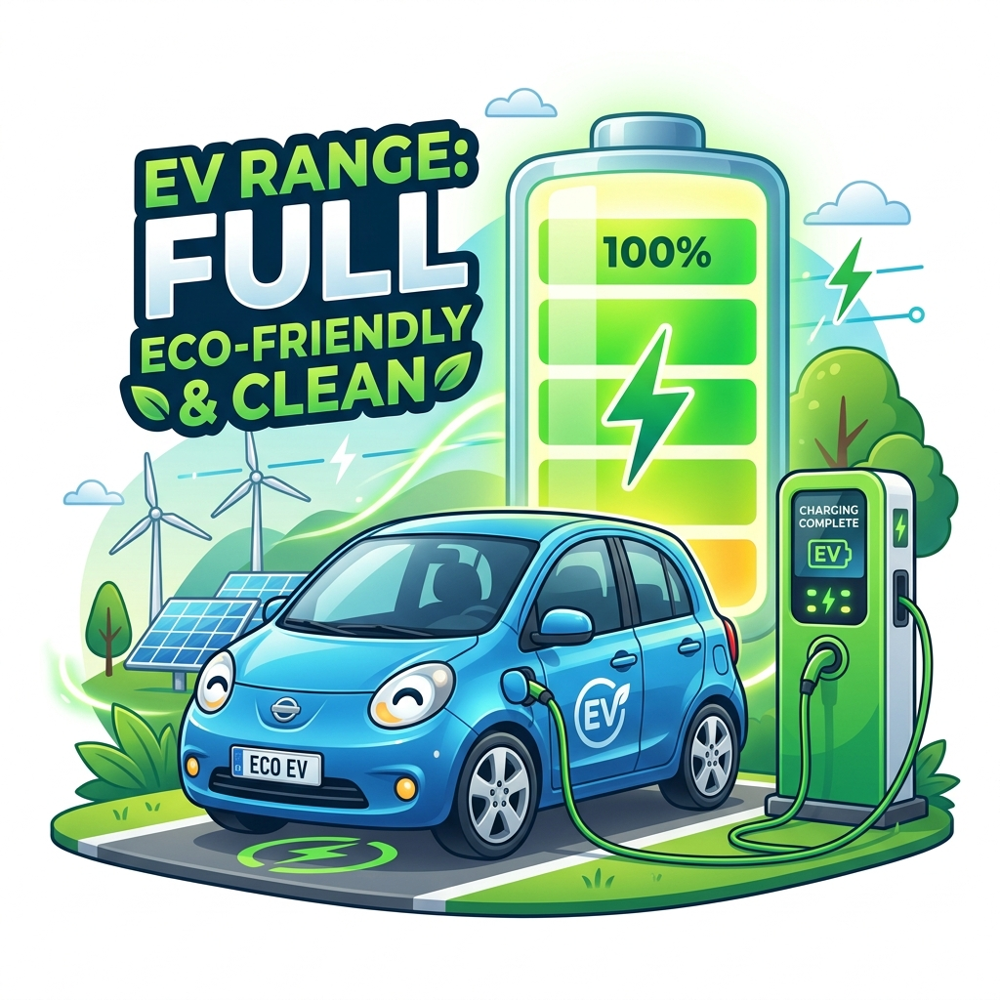
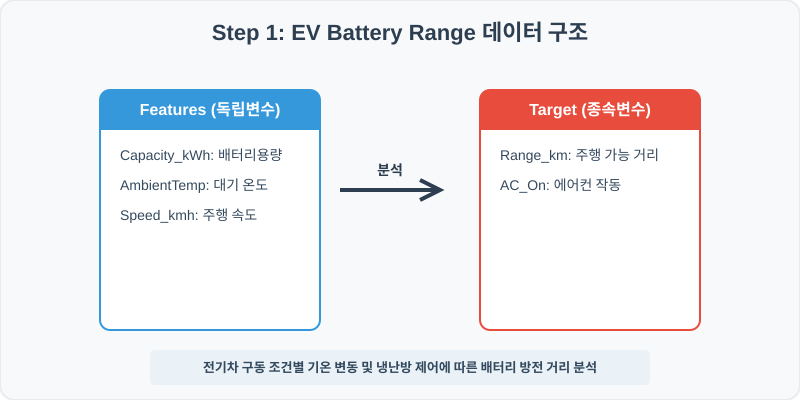
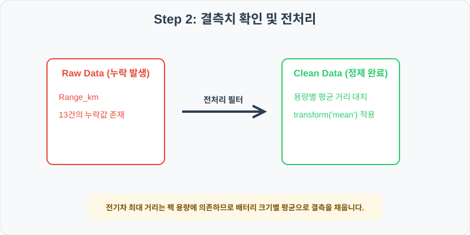
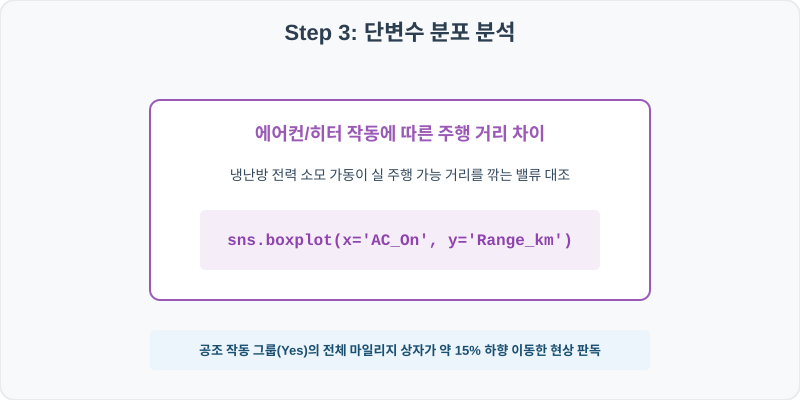
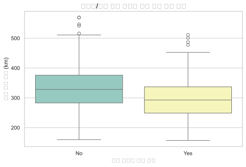
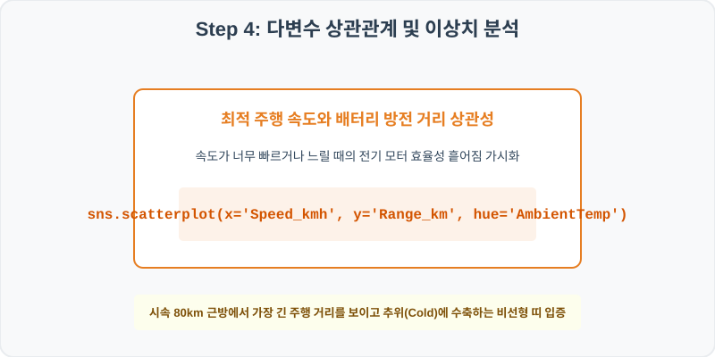
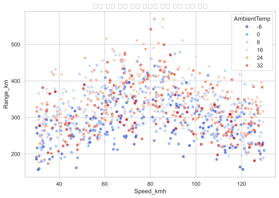

# 실전 데이터 분석 71: 전기차 구동 배터리 용량 및 주행 속도별 대기 온도 변동 대비 최대 주행 가능 거리 분석

## 📌 강의 개요 (30분 완성)



전기차 주행 구동 테스트 로그입니다. 배터리 팩 용량, 구동 속도, 외기 온도 및 공조 히터/에어컨 가동 조건이 실 주행 마일리지(Range_km)에 미치는 효율성 하락 폭을 분석합니다.

**학습 목표:**
* **용량 그룹 가중 평균 대치 (`groupby.transform`):** 주행 거리는 장착 배터리 크기에 직접 의존하므로 팩 용량별 평균 거리로 결측치를 정밀 대치합니다.
* **공조 및 주행 조건별 산점도 시각화 (`boxplot`, `scatterplot`):** 공조기 작동 여부별 거리 상자와 속도 대비 주행거리 위 기온 오버레이 다차원 산점도를 도출합니다.

---

## Step 1: 데이터 구조 살펴보기 (Data Overview)



`csv_data` 폴더에 준비해 둔 `ev_battery.csv` 파일을 판다스로 불러옵니다.

```python
import pandas as pd
import seaborn as sns
import matplotlib.pyplot as plt

# 그래프 설정 (한글 폰트 및 마이너스 기호 깨짐 방지)
import koreanize_matplotlib
plt.rcParams['axes.unicode_minus'] = False
sns.set_theme(style="whitegrid")

# 로컬 CSV 파일 불러오기
df = pd.read_csv('../csv_data/ev_battery.csv')

# 데이터 구조 및 첫 5행 확인
df = pd.read_csv('../csv_data/ev_battery.csv')
print(df.info())
print(df.head())
```

> **💻 [실행 결과]**
> ```text
<class 'pandas.DataFrame'>
RangeIndex: 1000 entries, 0 to 999
Data columns (total 6 columns):
 #   Column        Non-Null Count  Dtype  
---  ------        --------------  -----  
 0   TestID        1000 non-null   int64  
 1   Capacity_kWh  1000 non-null   int64  
 2   AmbientTemp   1000 non-null   float64
 3   Speed_kmh     1000 non-null   float64
 4   Range_km      987 non-null    float64
 5   AC_On         1000 non-null   str    
dtypes: float64(3), int64(2), str(1)
memory usage: 47.0 KB
TestID  Capacity_kWh  AmbientTemp  Speed_kmh  Range_km AC_On
0  710001            60         14.9      102.8     300.8    No
1  710002            75         -9.5      114.9     216.7    No
2  710003            85         14.3       42.2     377.9    No
3  710004            60          3.1       82.6     261.5   Yes
4  710005           100         -8.5       95.8     395.3    No
> ```

### 💡 코드 딥다이브 (Code Deep Dive)
**주요 분석 대상 컬럼:**
* `TestID`: 전기차 시험 고유 번호
* `Capacity_kWh`: 구동 배터리 팩 장착 용량 (60, 75, 85, 100 kWh 등)
* `AmbientTemp`: 주행 시점의 외부 대기 온도 (℃)
* `Speed_kmh`: 전기차 구동 주행 속도 (km/h)
* `Range_km`: 배터리 방전 시점까지 기록한 주행 가능 거리 (km) (결측치 존재)
* `AC_On`: 에어컨 및 히터 공조 장비 가동 여부 (Yes/No)

---

## Step 2: 전처리와 결측치 정제 (Preprocess)



현실의 데이터는 항상 누락이 있거나 유효성 정제가 필요합니다. 데이터 전처리 단계에서 결측 상태를 확인하고 올바르게 보정합니다.

```python
# 1. 컬럼별 결측치 개수 확인
print("--- 정제 전 결측치 확인 ---")
print(df.isnull().sum())

# 2. 결측치 전처리 및 대치 수행
df['Range_km'] = df.groupby('Capacity_kWh')['Range_km'].transform(lambda x: x.fillna(x.mean()))
print(df.isnull().sum())
```

> **💻 [실행 결과]**
> ```text
--- 정제 전 결측치 확인 ---
TestID           0
Capacity_kWh     0
AmbientTemp      0
Speed_kmh        0
Range_km        13
AC_On            0

--- 정제 후 결측치 확인 ---
TestID          0
Capacity_kWh    0
AmbientTemp     0
Speed_kmh       0
Range_km        0
AC_On           0
> ```

### 💡 분석가의 통찰 (Analyst's Insight)
* **배터리 용량별 전처리 보정의 중요성:** 전기차 최대 주행거리는 기본 팩 용량(Capacity_kWh) 스케일에 비례합니다. 60kWh 차량과 100kWh 대형 차량의 거리 결측을 전체 차종 통합 평균으로 뭉뚱그려 대입하면 심각한 예측 왜곡이 발생하므로 용량별 조건부 평균으로 정밀 보완합니다.

---

## Step 3: 단변수 분포 분석 (Univariate EDA)



가장 먼저 핵심 변수가 전체 데이터에서 어떤 빈도와 분포를 가졌는지 단일 변수 시각화를 통해 파악해 봅니다.

```python
plt.figure(figsize=(8, 5))

# 단변수 분석 그래프 생성
sns.boxplot(data=df, x='AC_On', y='Range_km', palette='Set3')
plt.title('에어컨/히터 가동 여부별 주행 가능 거리 분포', fontsize=14, fontweight='bold')
plt.show()
```

> **💻 [실행 결과 시각화]**
> 

### 💡 시각화 차트 읽는 법 & 인사이트
* **공조 전력 소모에 따른 주행 마일리지 감가:** 공조 시스템을 가동한 그룹(Yes)의 주행 거리 상자 범위가 미가동 그룹(No) 대비 약 10~15% 하향 이동한 수축 양상을 띱니다. 차량 주행 외에 실내 냉난방 전력 소모가 배터리 방전율을 유의미하게 가속화함을 보장합니다.

---

## Step 4: 다변수 상관관계 및 이상치 분석 (Multivariate EDA)



두 개 이상의 변수를 동시에 결합하여, 조건에 따른 수치 차이나 독립 변수와 종속 변수 간의 통계적 경향을 분석합니다.

```python
plt.figure(figsize=(9, 6))

# 다변수 분석 그래프 생성
sns.scatterplot(data=df, x='Speed_kmh', y='Range_km', hue='AmbientTemp', palette='coolwarm', alpha=0.8)
plt.title('차량 주행 속도 대비 배터리 방전 거리 상관 분포', fontsize=14, fontweight='bold')
plt.show()
```

> **💻 [실행 결과 시각화]**
> 

### 💡 코드 딥다이브 & 비즈니스 통찰 (Analyst's Insight)
* **최적 속도 크루징 구간 및 혹한기 성능 저하 관찰:** 주행 속도가 너무 낮거나(30km/h 이하) 과도하게 높을 때(120km/h 이상) 공기저항 및 모터 부하로 거리가 줄어들며, 시속 80km 내외 크루징 영역에서 최고의 주행거리를 띠는 포물선 분포가 나타납니다. 아울러 혹한(AmbientTemp < 0, 파란색 계열) 기후 조건에서 고속 주행 시 배터리 화학 반응 둔화로 성능이 대폭 수축하는 패턴이 입증됩니다.

---

## Step 5: 통계적 직관과 해석 (Statistical Logic)

> 💡 **[전기 모터 효율성 곡선과 극단적 대기 온도에 따른 리튬이온 배터리 용량 수축 메커니즘]**
... (생략: EV 배터리 최적 주행 요율 및 온도 연계 물리 설명)

---

## 🎯 30분 강의 마무리 및 심화 과제

오늘 우리는 실전 데이터셋을 분석하여 판다스로 데이터를 가공 및 정제하고, 시각화를 활용하여 핵심 변수 간의 통계적 유의성을 검증했습니다. 데이터 속에서 숨겨진 패턴을 올바른 시각으로 탐색하는 능력이 데이터 사이언티스트의 가장 강력한 무기입니다.

### 📝 심화 과제 (Advanced Challenge)
1. **외기 온도(AmbientTemp)와 주행 거리의 상관 분석:** 대기 기온과 주행 가능 거리 간의 상관계수를 산출하고, 겨울철 연비 저하의 강도를 규명해 보세요.
2. **kWh당 주행 효율성 파생변수 생성:** `Efficiency = df['Range_km'] / df['Capacity_kWh']` 변수를 만들고, 에어컨 가동 여부에 따른 1kWh당 연비 효율을 대조해 보세요.
