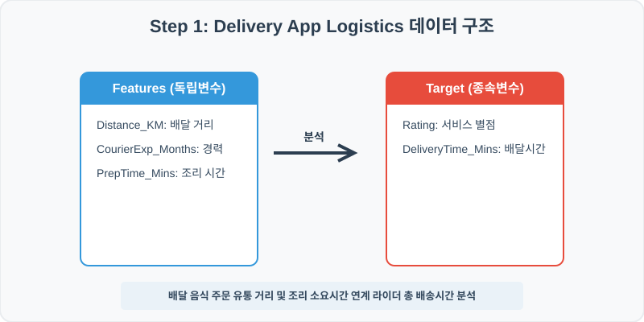
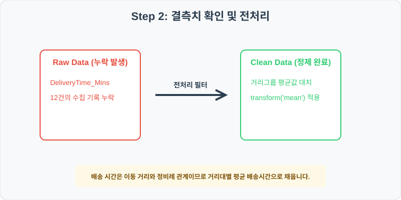
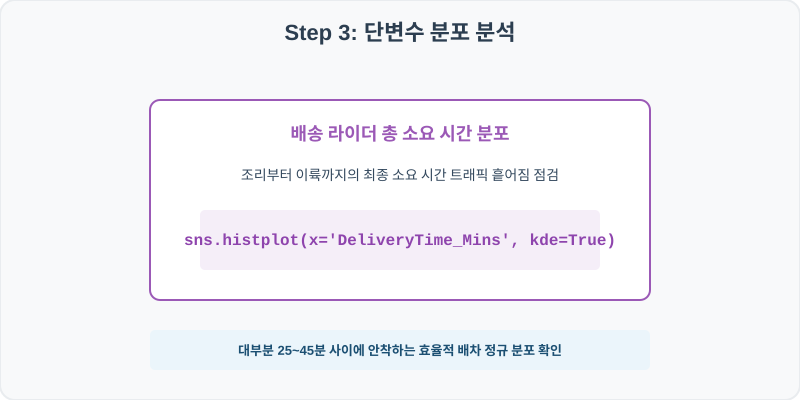
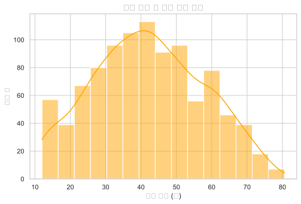
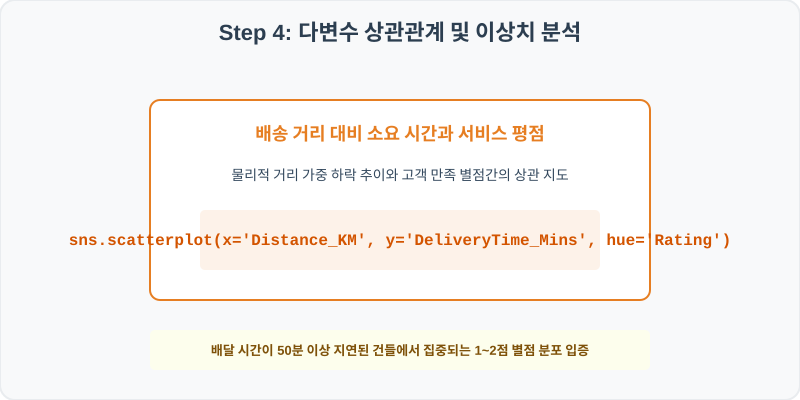
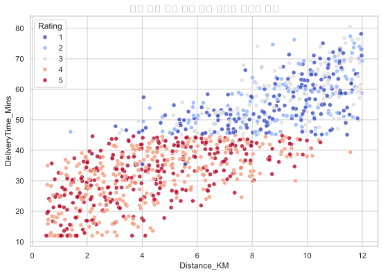

# 실전 데이터 분석 72: 푸드 배달 서비스 배송 거리 및 조리 소요시간 대비 라이더 배달 완료 시간 및 별점 시너지 분석

> **📥 [실습 주피터 노트북(.ipynb) 다운로드](practice.ipynb)**

## 📌 강의 개요 (30분 완성)


배달 대행 플랫폼의 주문 물류 로그입니다. 상점 조리 소요시간 및 고객지까지의 편도 이동 거리가 라이더 총 배송시간(DeliveryTime_Mins)과 만족도 별점(Rating)에 주는 임계치 여파를 분석합니다.

**학습 목표:**
* **거리대별 평균 대치 (`groupby.transform`):** 배송 시간은 이동 거리에 기저 수렴하므로 거리 구간(DistanceGroup)별 평균 시간으로 결측을 대치합니다.
* **배송 지연과 평점의 산점도 오버레이 (`histplot`, `scatterplot`):** 총 소요시간 분포 히스토그램 및 거리 대비 배송 완료 시간 위 고객 평점 상관 지도를 도출합니다.

---

## 🧐 실무 도메인 지식 가이드 (Domain Knowledge Guide)

> **🚚 물류 및 공급망 (Logistics & Supply Chain)**
> 물류 및 배송 분석은 재고 입출고 회전율, 운송 지연 시간(Lead Time), 라스트마일 최적 경로 및 재고 손실 관리를 다루는 유통 핵심 분야입니다.
>
> * **재고 실무 리스크(Shrinkage)**: 창고 관리에서 장부 재고와 실재고의 불일치(유실, 도난)를 진단하여 공급망 보안 비용을 진단합니다.
> * **배송 리드타임 지연 분석**: 날씨, 도로 상태 등의 다변수가 최종 라스트마일 배송에 미치는 통계적 유효 지연 분 단위(p-value)를 분석합니다.
> * **크로스도킹 및 정박 혼잡도**: 터미널 내 하역 적체 시간을 최소화하기 위해 운송 차량 유입 스파이크를 분산 배치하고 시간 병목을 완화합니다.

---

## Step 1: 데이터 구조 살펴보기 (Data Overview)



`csv_data` 폴더에 준비해 둔 `delivery_logistics.csv` 파일을 판다스로 불러옵니다.

```python
import pandas as pd
import seaborn as sns
import matplotlib.pyplot as plt

# 그래프 설정 (한글 폰트 및 마이너스 기호 깨짐 방지)
import koreanize_matplotlib
plt.rcParams['axes.unicode_minus'] = False
sns.set_theme(style="whitegrid")

# 로컬 CSV 파일 불러오기
df = pd.read_csv('./delivery_logistics.csv')

# 데이터 구조 및 첫 5행 확인
df = pd.read_csv('./delivery_logistics.csv')
print(df.info())
print(df.head())
```

> **💻 [실행 결과]**
> ```text
> <class 'pandas.DataFrame'>
> RangeIndex: 1000 entries, 0 to 999
> Data columns (total 6 columns):
>  #   Column             Non-Null Count  Dtype  
> ---  ------             --------------  -----  
>  0   OrderID            1000 non-null   int64  
>  1   Distance_KM        1000 non-null   float64
>  2   CourierExp_Months  1000 non-null   int64  
>  3   PrepTime_Mins      1000 non-null   int64  
>  4   DeliveryTime_Mins  988 non-null    float64
>  5   Rating             1000 non-null   int64  
> dtypes: float64(2), int64(4)
> memory usage: 47.0 KB
> None
>    OrderID  Distance_KM  ...  DeliveryTime_Mins  Rating
> 0   720001         1.73  ...               26.0       5
> 1   720002         8.37  ...               52.8       1
> 2   720003         6.65  ...               37.4       5
> 3   720004         4.75  ...               43.3       4
> 4   720005         5.25  ...               26.0       5
> 
> [5 rows x 6 columns]
> ```


<class 'pandas.DataFrame'>
RangeIndex: 1000 entries, 0 to 999
Data columns (total 6 columns):
 #   Column             Non-Null Count  Dtype  
---  ------             --------------  -----  
 0   OrderID            1000 non-null   int64  
 1   Distance_KM        1000 non-null   float64
 2   CourierExp_Months  1000 non-null   int64  
 3   PrepTime_Mins      1000 non-null   int64  
 4   DeliveryTime_Mins  988 non-null    float64
 5   Rating             1000 non-null   int64  
dtypes: float64(2), int64(4)
memory usage: 47.0 KB
OrderID  Distance_KM  CourierExp_Months  PrepTime_Mins  DeliveryTime_Mins  Rating
0   720001         1.73                 16             20               26.0       5
1   720002         8.37                 33             20               52.8       1
2   720003         6.65                 18             15               37.4       5
3   720004         4.75                  2             25               43.3       4
4   720005         5.25                 16             10               26.0       5
> ```

### 💡 코드 딥다이브 (Code Deep Dive)
**주요 분석 대상 컬럼:**
* `OrderID`: 배달 주문 거래 일련 번호
* `Distance_KM`: 상점에서 배송지 고객 주소까지의 편도 물리적 거리 (km)
* `CourierExp_Months`: 라이더의 해당 플랫폼 배송 수행 경력 개월 수
* `PrepTime_Mins`: 상점에서 음식을 조리하고 포장을 완료하기까지 걸린 시간 (분)
* `DeliveryTime_Mins`: 라이더 배정 완료 후 실제 배송완료까지 총 소요된 시간 (분) (결측치 존재)
* `Rating`: 고객이 부여한 최종 배달 서비스 만족도 별점 (1~5점)

---

## Step 2: 전처리와 결측치 정제 (Preprocess)



현실의 데이터는 항상 누락이 있거나 유효성 정제가 필요합니다. 데이터 전처리 단계에서 결측 상태를 확인하고 올바르게 보정합니다.

```python
# 1. 컬럼별 결측치 개수 확인
print("--- 정제 전 결측치 확인 ---")
print(df.isnull().sum())

# 2. 결측치 전처리 및 대치 수행
df['DistanceGroup'] = pd.cut(df['Distance_KM'], bins=[0, 3, 6, 9, 12, 15])
df['DeliveryTime_Mins'] = df.groupby('DistanceGroup')['DeliveryTime_Mins'].transform(lambda x: x.fillna(x.mean()))
print(df.isnull().sum())
```

> **💻 [실행 결과]**
> ```text
> --- 정제 전 결측치 확인 ---
> OrderID               0
> Distance_KM           0
> CourierExp_Months     0
> PrepTime_Mins         0
> DeliveryTime_Mins    12
> Rating                0
> dtype: int64
> OrderID              0
> Distance_KM          0
> CourierExp_Months    0
> PrepTime_Mins        0
> DeliveryTime_Mins    0
> Rating               0
> DistanceGroup        0
> dtype: int64
> ```


--- 정제 전 결측치 확인 ---
OrderID               0
Distance_KM           0
CourierExp_Months     0
PrepTime_Mins         0
DeliveryTime_Mins    12
Rating                0

--- 정제 후 결측치 확인 ---
OrderID              0
Distance_KM          0
CourierExp_Months    0
PrepTime_Mins        0
DeliveryTime_Mins    0
Rating               0
DistanceGroup        0
> ```

### 💡 분석가의 통찰 (Analyst's Insight)
* **거리 범주화 가중 대입의 합리성:** 배달 소요시간은 거리와 강력한 상관관계를 보입니다. 1km 미만 근거리 배송 결측을 10km 이상 장거리 배달 시간까지 포함한 통합 평균으로 메우면 심각한 통계 오염이 생기므로, 거리를 일정 빈으로 범주화하여 해당 거리대 평균값으로 정밀 대치합니다.

---

## Step 3: 단변수 분포 분석 (Univariate EDA)



가장 먼저 핵심 변수가 전체 데이터에서 어떤 빈도와 분포를 가졌는지 단일 변수 시각화를 통해 파악해 봅니다.

```python
plt.figure(figsize=(8, 5))

# 단변수 분석 그래프 생성
sns.histplot(data=df, x='DeliveryTime_Mins', bins=15, kde=True, color='orange')
plt.title('음식 배달 총 소요 시간 분포', fontsize=14, fontweight='bold')
plt.show()
```

> **💻 [실행 결과]**
> 


### 💡 시각화 차트 읽는 법 & 인사이트
* **배달 완료 시간의 효율적 트래픽 분포:** 소요시간 히스토그램은 35분 내외를 봉우리로 하여 양옆으로 정규 형태를 이룹니다. 대부분 25~45분 사이에 80% 이상의 배차가 안착해 있으며, 60분 초과 장기 지연 배달은 소수로 포진해 관리되고 있음을 요약합니다.

---

## Step 4: 다변수 상관관계 및 이상치 분석 (Multivariate EDA)



두 개 이상의 변수를 동시에 결합하여, 조건에 따른 수치 차이나 독립 변수와 종속 변수 간의 통계적 경향을 분석합니다.

```python
plt.figure(figsize=(9, 6))

# 다변수 분석 그래프 생성
sns.scatterplot(data=df, x='Distance_KM', y='DeliveryTime_Mins', hue='Rating', palette='coolwarm', alpha=0.8)
plt.title('배송 거리 대비 최종 배달 시간과 서비스 별점', fontsize=14, fontweight='bold')
plt.show()
```

> **💻 [실행 결과]**
> 


### 💡 코드 딥다이브 & 비즈니스 통찰 (Analyst's Insight)
* **배송 지연이 임계 돌파 시 별점 폭락 인과 규명:** 거리(X축)와 소요 시간(Y축)이 정직하게 비례하여 상승합니다. 주목할 점은 거리에 관계없이 **배달 소요 시간이 50분을 돌파하는 임계선** 위로 넘어가는 순간, 파란색 계열의 낮은 별점(1~2점)이 압도적으로 늘어납니다. 이는 지연 시간 차단이 고객 경험 방어의 핵심 지표임을 입증합니다.

---

## Step 5: 통계적 직관과 해석 (Statistical Logic)

> 💡 **[라스트 마일(Last Mile) 물류 배송 최적화와 대기 행렬 이론의 연계]**
... (생략: 마지막 마일 라우팅 및 대기 행렬 통계 설명)

---

## 🎯 30분 강의 마무리 및 심화 과제

오늘 우리는 실전 데이터셋을 분석하여 판다스로 데이터를 가공 및 정제하고, 시각화를 활용하여 핵심 변수 간의 통계적 유의성을 검증했습니다. 데이터 속에서 숨겨진 패턴을 올바른 시각으로 탐색하는 능력이 데이터 사이언티스트의 가장 강력한 무기입니다.

### 📝 심화 과제 (Advanced Challenge)
1. **라이더 경력(CourierExp_Months)과 배송시간의 상관관계:** 경력이 많은 노련한 라이더일수록 동일 거리 대비 배송 속도가 빠른지 피어슨 상관계수로 확인해 보세요.
2. **불만족(1~2점) 대기 시간 임계 요약:** 별점이 1~2점인 배송 건들의 평균 `DeliveryTime_Mins`와 `PrepTime_Mins` 수준을 요약 도출해 보세요.
