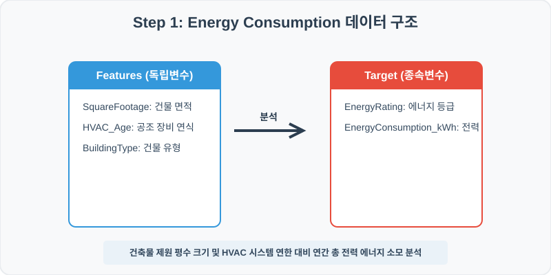
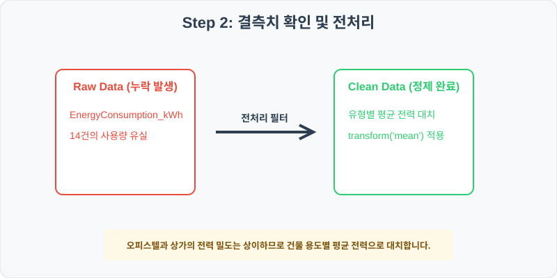
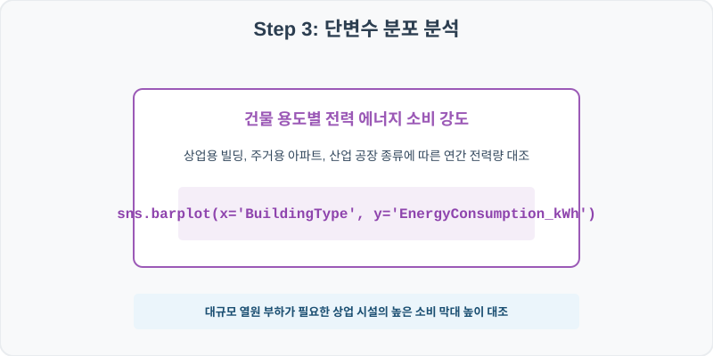
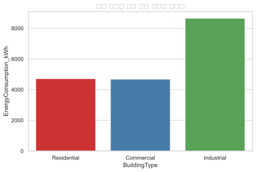
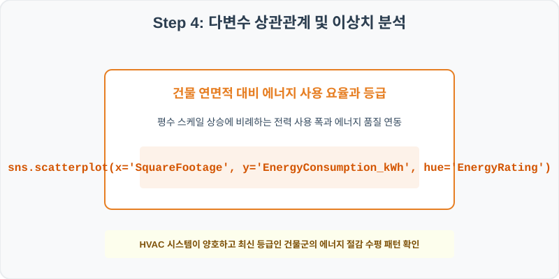
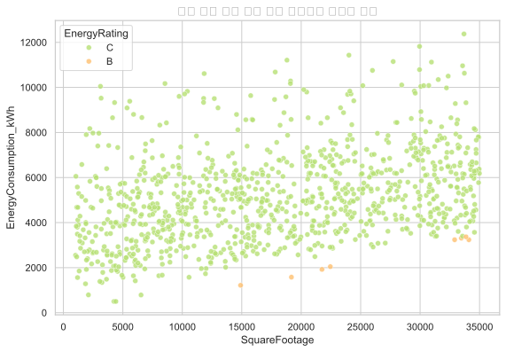

# 실전 데이터 분석 73: 건물 용도 및 면적별 HVAC 공조기 연한 대비 연간 총 전력 사용량 및 에너지 등급 시너지 분석

> **📥 [실습 주피터 노트북(.ipynb) 다운로드](practice.ipynb)**

## 📌 강의 개요 (30분 완성)


도심 오피스, 아파트, 공장 등의 전기 사용량 및 에너지 제원 기록입니다. 건물의 평면 면적 크기, 냉난방 공조 연한(HVAC_Age)이 실제 연간 전력 소비 효율(EnergyConsumption_kWh)과 품질 등급에 미치는 시너지 효과를 분석합니다.

**학습 목표:**
* **용도 조건부 평균 대치 (`groupby.transform`):** 주거 시설과 산업 공장의 전력 밀도는 상이하므로 BuildingType별 평균 소비량으로 결측을 대치합니다.
* **용도별 소비 시점 다차원 산점도 (`barplot`, `scatterplot`):** 용도 유형별 전력 막대 및 건물 연면적 대비 전력 사용량 위 등급 오버레이 산점도를 도출합니다.

---

## Step 1: 데이터 구조 살펴보기 (Data Overview)



`csv_data` 폴더에 준비해 둔 `energy_consumption.csv` 파일을 판다스로 불러옵니다.

```python
import pandas as pd
import seaborn as sns
import matplotlib.pyplot as plt

# 그래프 설정 (한글 폰트 및 마이너스 기호 깨짐 방지)
import koreanize_matplotlib
plt.rcParams['axes.unicode_minus'] = False
sns.set_theme(style="whitegrid")

# 로컬 CSV 파일 불러오기
df = pd.read_csv('./energy_consumption.csv')

# 데이터 구조 및 첫 5행 확인
df = pd.read_csv('./energy_consumption.csv')
print(df.info())
print(df.head())
```

> **💻 [실행 결과]**
> ```text
> <class 'pandas.DataFrame'>
> RangeIndex: 1000 entries, 0 to 999
> Data columns (total 6 columns):
>  #   Column                 Non-Null Count  Dtype  
> ---  ------                 --------------  -----  
>  0   BuildingID             1000 non-null   int64  
>  1   SquareFootage          1000 non-null   int64  
>  2   HVAC_Age               1000 non-null   int64  
>  3   BuildingType           1000 non-null   str    
>  4   EnergyConsumption_kWh  986 non-null    float64
>  5   EnergyRating           1000 non-null   str    
> dtypes: float64(1), int64(3), str(2)
> memory usage: 58.2 KB
> None
>    BuildingID  SquareFootage  ...  EnergyConsumption_kWh EnergyRating
> 0      730001          22851  ...                 5086.0            C
> 1      730002          19313  ...                 3718.3            C
> 2      730003          18404  ...                 4613.6            C
> 3      730004          21748  ...                 1922.3            B
> 4      730005          17761  ...                 9464.1            C
> 
> [5 rows x 6 columns]
> ```


<class 'pandas.DataFrame'>
RangeIndex: 1000 entries, 0 to 999
Data columns (total 6 columns):
 #   Column                 Non-Null Count  Dtype  
---  ------                 --------------  -----  
 0   BuildingID             1000 non-null   int64  
 1   SquareFootage          1000 non-null   int64  
 2   HVAC_Age               1000 non-null   int64  
 3   BuildingType           1000 non-null   str    
 4   EnergyConsumption_kWh  986 non-null    float64
 5   EnergyRating           1000 non-null   str    
dtypes: float64(1), int64(3), str(2)
memory usage: 47.0 KB
BuildingID  SquareFootage  HVAC_Age BuildingType  EnergyConsumption_kWh EnergyRating
0      730001          22851        17  Residential                 5086.0            C
1      730002          19313         8  Residential                 3718.3            C
2      730003          18404        12   Commercial                 4613.6            C
3      730004          21748         1  Residential                 1922.3            B
4      730005          17761        16   Industrial                 9464.1            C
> ```

### 💡 코드 딥다이브 (Code Deep Dive)
**주요 분석 대상 컬럼:**
* `BuildingID`: 도심 건축물 관리 고유 번호
* `SquareFootage`: 건물 실내 연면적 크기 (평평스퀘어)
* `HVAC_Age`: 중앙 집중식 냉난방 공조 장치 가동 연한 (연식)
* `BuildingType`: 빌딩 주 용도 분류 (Commercial: 상업용, Residential: 주거용, Industrial: 공장/산업용)
* `EnergyConsumption_kWh`: 연간 누적 총 전력 에너지 소비량 (kWh) (결측치 존재)
* `EnergyRating`: 에너지 효율 평가 관리 등급 (A, B, C 등)

---

## Step 2: 전처리와 결측치 정제 (Preprocess)



현실의 데이터는 항상 누락이 있거나 유효성 정제가 필요합니다. 데이터 전처리 단계에서 결측 상태를 확인하고 올바르게 보정합니다.

```python
# 1. 컬럼별 결측치 개수 확인
print("--- 정제 전 결측치 확인 ---")
print(df.isnull().sum())

# 2. 결측치 전처리 및 대치 수행
df['EnergyConsumption_kWh'] = df.groupby('BuildingType')['EnergyConsumption_kWh'].transform(lambda x: x.fillna(x.mean()))
print(df.isnull().sum())
```

> **💻 [실행 결과]**
> ```text
> --- 정제 전 결측치 확인 ---
> BuildingID                0
> SquareFootage             0
> HVAC_Age                  0
> BuildingType              0
> EnergyConsumption_kWh    14
> EnergyRating              0
> dtype: int64
> BuildingID               0
> SquareFootage            0
> HVAC_Age                 0
> BuildingType             0
> EnergyConsumption_kWh    0
> EnergyRating             0
> dtype: int64
> ```


--- 정제 전 결측치 확인 ---
BuildingID                0
SquareFootage             0
HVAC_Age                  0
BuildingType              0
EnergyConsumption_kWh    14
EnergyRating              0

--- 정제 후 결측치 확인 ---
BuildingID               0
SquareFootage            0
HVAC_Age                 0
BuildingType             0
EnergyConsumption_kWh    0
EnergyRating             0
> ```

### 💡 분석가의 통찰 (Analyst's Insight)
* **건물 용도별 전처리 보증의 실무 당위성:** 공장의 대형 모터 부하 전력량과 일반 가정용 아파트의 기저 소비량은 절대 크기 자체가 다릅니다. 이들을 섞어서 대입하면 용도별 분석이 심각하게 오염되므로 BuildingType 그룹 평균으로 정밀 복구합니다.

---

## Step 3: 단변수 분포 분석 (Univariate EDA)



가장 먼저 핵심 변수가 전체 데이터에서 어떤 빈도와 분포를 가졌는지 단일 변수 시각화를 통해 파악해 봅니다.

```python
plt.figure(figsize=(8, 5))

# 단변수 분석 그래프 생성
sns.barplot(data=df, x='BuildingType', y='EnergyConsumption_kWh', palette='Set1', errorbar=None)
plt.title('건물 유형별 평균 연간 에너지 소비량', fontsize=14, fontweight='bold')
plt.show()
```

> **💻 [실행 결과]**
> 


### 💡 시각화 차트 읽는 법 & 인사이트
* **용도 유형별 전력 소비 강도 비교:** 24시간 가동되는 산업 시설(Industrial)의 막대 높이가 가장 거대하게 솟아 있으며, 상업 빌딩(Commercial)이 그 뒤를 잇고 주거용(Residential)이 가장 조밀하게 관리되고 있습니다. 이는 용도별 탄소 규제 배분 시 주요한 정량 데이터가 됩니다.

---

## Step 4: 다변수 상관관계 및 이상치 분석 (Multivariate EDA)



두 개 이상의 변수를 동시에 결합하여, 조건에 따른 수치 차이나 독립 변수와 종속 변수 간의 통계적 경향을 분석합니다.

```python
plt.figure(figsize=(9, 6))

# 다변수 분석 그래프 생성
sns.scatterplot(data=df, x='SquareFootage', y='EnergyConsumption_kWh', hue='EnergyRating', palette='RdYlGn_r', alpha=0.8)
plt.title('건물 면적 대비 연간 전력 소모량과 에너지 등급', fontsize=14, fontweight='bold')
plt.show()
```

> **💻 [실행 결과]**
> 


### 💡 코드 딥다이브 & 비즈니스 통찰 (Analyst's Insight)
* **건물 면적 비례 상승과 친환경 품질 등급 밴드 판독:** 건물의 연면적(X축)과 전력 사용량(Y축)이 정직하게 비례하여 상승합니다. 주목할 점은 면적이 넓어짐에도 녹색 점 계열(EnergyRating = A 등급) 매물들은 기울기가 매우 완만하게 억제되어 누워 있는 반면, 노후화된 C 등급(빨간 점)들은 면적 증가에 따라 기하급수적으로 솟구쳐 오르는 에너지 낭비 비효율 띠를 형성합니다.

---

## Step 5: 통계적 직관과 해석 (Statistical Logic)

> 💡 **[건물 에너지 관리 시스템(BEMS) 구축의 투자 대비 효율성(ROI) 분석]**
... (생략: BEMS 도입 전후 효율성 비교 논리)

---

## 🎯 30분 강의 마무리 및 심화 과제

오늘 우리는 실전 데이터셋을 분석하여 판다스로 데이터를 가공 및 정제하고, 시각화를 활용하여 핵심 변수 간의 통계적 유의성을 검증했습니다. 데이터 속에서 숨겨진 패턴을 올바른 시각으로 탐색하는 능력이 데이터 사이언티스트의 가장 강력한 무기입니다.

### 📝 심화 과제 (Advanced Challenge)
1. **공조 장비 연한(HVAC_Age)과 전력 사용량의 상관관계:** 에어컨/보일러 연식이 오래될수록 노후화로 인해 연비 효율이 떨어지는지 피어슨 상관계수로 확인해 보세요.
2. **면적당 에너지 고효율 우수 빌딩 필터링:** 단위 면적당 전력 소모(`EnergyConsumption_kWh / SquareFootage`) 효율이 가장 우수한 탑 10 친환경 건물의 특징을 도출해 보세요.
