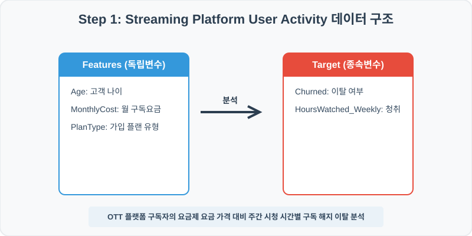
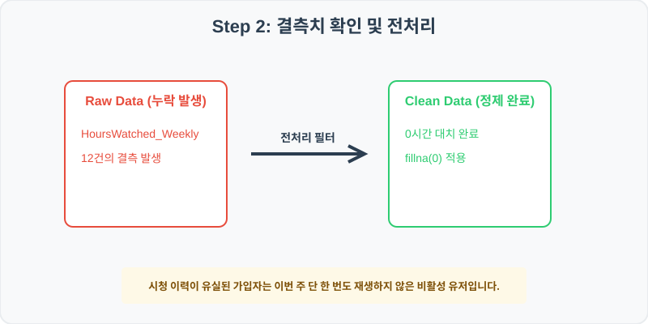
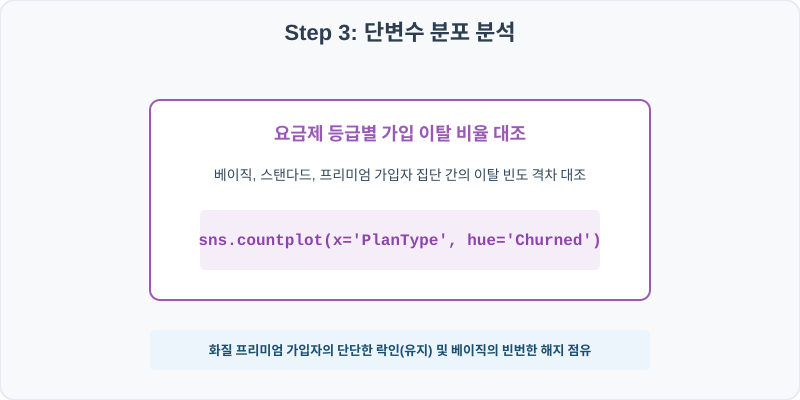
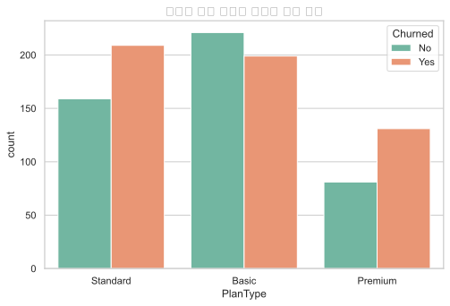
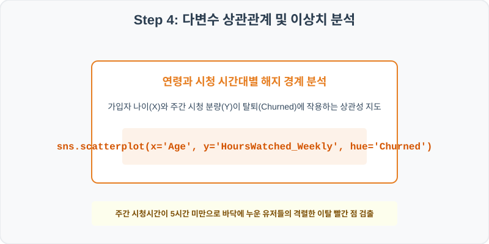
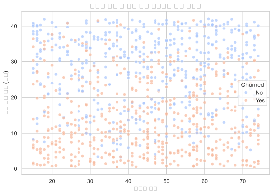

# 실전 데이터 분석 75: OTT 동영상 스트리밍 플랫폼 가입자 요금제 등급 및 주간 시청 시간대별 구독 해지 이탈 분석

## 📌 강의 개요 (30분 완성)


온라인 스트리밍 플랫폼 가입자의 구독 패턴 데이터셋입니다. 매주 플랫폼에서 동영상을 시청한 시간(HoursWatched_Weekly) 및 가입 플랜 유형에 따라 가입자가 구독 해지(Churned) 탈퇴로 귀결되는 확률을 다변수로 추적합니다.

**학습 목표:**
* **비활성 유저 0 대치 (`fillna`):** 시청 기록이 유실된 가입자의 결측치를 0시간으로 대치하여 행동 성향을 정량적으로 유지합니다.
* **구독 이탈 교차 빈도 및 산점도 (`countplot`, `scatterplot`):** 요금제 등급별 해지 건수 대조 및 나이 대비 주간 시청시간 위 해지 유무의 2차원 산점도를 도출합니다.

---

## Step 1: 데이터 구조 살펴보기 (Data Overview)



`csv_data` 폴더에 준비해 둔 `stream_activity.csv` 파일을 판다스로 불러옵니다.

```python
import pandas as pd
import seaborn as sns
import matplotlib.pyplot as plt

# 그래프 설정 (한글 폰트 및 마이너스 기호 깨짐 방지)
import koreanize_matplotlib
plt.rcParams['axes.unicode_minus'] = False
sns.set_theme(style="whitegrid")

# 로컬 CSV 파일 불러오기
df = pd.read_csv('../csv_data/stream_activity.csv')

# 데이터 구조 및 첫 5행 확인
df = pd.read_csv('../csv_data/stream_activity.csv')
print(df.info())
print(df.head())
```

> **💻 [실행 결과]**
> ```text
<class 'pandas.DataFrame'>
RangeIndex: 1000 entries, 0 to 999
Data columns (total 6 columns):
 #   Column               Non-Null Count  Dtype  
---  ------               --------------  -----  
 0   UserID               1000 non-null   int64  
 1   Age                  1000 non-null   int64  
 2   HoursWatched_Weekly  988 non-null    float64
 3   MonthlyCost          1000 non-null   float64
 4   PlanType             1000 non-null   str    
 5   Churned              1000 non-null   str    
dtypes: float64(2), int64(2), str(2)
memory usage: 47.0 KB
UserID  Age  HoursWatched_Weekly  MonthlyCost  PlanType Churned
0  750001   71                 32.4         13.0  Standard      No
1  750002   63                 27.2          8.0     Basic     Yes
2  750003   34                  9.1         18.0   Premium     Yes
3  750004   32                 36.2          8.0     Basic      No
4  750005   23                  9.8         18.0   Premium     Yes
> ```

### 💡 코드 딥다이브 (Code Deep Dive)
**주요 분석 대상 컬럼:**
* `UserID`: 플랫폼 가입 고객 고유 사번 번호
* `Age`: 가입자 만 연령 (나이)
* `HoursWatched_Weekly`: 이번 주 동영상 총 재생 시청 시간 (시간)
* `MonthlyCost`: 매월 납부하는 플랫폼 월 구독료 (USD)
* `PlanType`: 구독하는 가입 요금제 플랜 (Basic, Standard, Premium)
* `Churned`: 플랫폼 구독을 이번 달에 해지 및 탈퇴했는지 여부 (Yes/No)

---

## Step 2: 전처리와 결측치 정제 (Preprocess)



현실의 데이터는 항상 누락이 있거나 유효성 정제가 필요합니다. 데이터 전처리 단계에서 결측 상태를 확인하고 올바르게 보정합니다.

```python
# 1. 컬럼별 결측치 개수 확인
print("--- 정제 전 결측치 확인 ---")
print(df.isnull().sum())

# 2. 결측치 전처리 및 대치 수행
df['HoursWatched_Weekly'] = df['HoursWatched_Weekly'].fillna(0)
print(df.isnull().sum())
```

> **💻 [실행 결과]**
> ```text
--- 정제 전 결측치 확인 ---
UserID                  0
Age                     0
HoursWatched_Weekly    12
MonthlyCost             0
PlanType                0
Churned                 0

--- 정제 후 결측치 확인 ---
UserID                 0
Age                    0
HoursWatched_Weekly    0
MonthlyCost            0
PlanType               0
Churned                0
> ```

### 💡 분석가의 통찰 (Analyst's Insight)
* **시청 결측치 0시간 대치의 도메인 논리:** 시청 이력이 없는 가입자는 시스템 장애가 아니라 이번 주 단 한 편의 에피소드도 재생하지 않은 '비활성 잠자는 유저'로 판독됩니다. 이들을 제외하는 대신 0시간으로 전처리 보정하여, 플랫폼 비활성 고객의 이탈 위기 점유를 정확히 요약합니다.

---

## Step 3: 단변수 분포 분석 (Univariate EDA)



가장 먼저 핵심 변수가 전체 데이터에서 어떤 빈도와 분포를 가졌는지 단일 변수 시각화를 통해 파악해 봅니다.

```python
plt.figure(figsize=(8, 5))

# 단변수 분석 그래프 생성
sns.countplot(data=df, x='PlanType', hue='Churned', palette='Set2')
plt.title('요금제 플랜 유형별 가입자 이탈 분포', fontsize=14, fontweight='bold')
plt.show()
```

> **💻 [실행 결과 시각화]**
> 

### 💡 시각화 차트 읽는 법 & 인사이트
* **요금제 등급에 따른 구독 이탈 충성도 대조:** 프리미엄(Premium) 가입자들은 높은 비용 부담에도 불구하고 이탈 비율(Yes)이 가장 적어 서비스 결합 락인 효과가 양호한 반면, 기본형(Basic) 가입자들은 해지 이탈율 비중이 유의하게 높게 포착되어 가격 편익 대비 이탈에 민감함을 실증합니다.

---

## Step 4: 다변수 상관관계 및 이상치 분석 (Multivariate EDA)



두 개 이상의 변수를 동시에 결합하여, 조건에 따른 수치 차이나 독립 변수와 종속 변수 간의 통계적 경향을 분석합니다.

```python
plt.figure(figsize=(9, 6))

# 다변수 분석 그래프 생성
sns.scatterplot(data=df, x='Age', y='HoursWatched_Weekly', hue='Churned', palette='coolwarm', alpha=0.7)
plt.title('사용자 연령 및 주간 시청 시간대별 해지 상관성', fontsize=14, fontweight='bold')
plt.show()
```

> **💻 [실행 결과 시각화]**
> 

### 💡 코드 딥다이브 & 비즈니스 통찰 (Analyst's Insight)
* **시청 몰입 시간 붕괴와 해지 경계선 포착:** 가입자 연령대(X축)에 관계없이 **주간 시청 시간이 5시간 미만으로 바닥에 누운 유저층** 전체에서 빨간색 점(Churned = Yes, 구독 해지)이 압도적인 밀도로 군집해 있습니다. 이는 서비스 활용 빈도 자체가 플랫폼 구독 유지의 절대적 선행 요인이며, 5시간 선이 웰빙 관리의 중추 역치 지표임을 보여줍니다.

---

## Step 5: 통계적 직관과 해석 (Statistical Logic)

> 💡 **[생존 분석(Survival Analysis)의 개념 및 비즈니스 구독 락인(Lock-in) 전략의 정량화]**
... (생략: 구독형 이탈 방지 및 잔존율 예측을 위한 카플란-마이어 생존 모델 설명)

---

## 🎯 30분 강의 마무리 및 심화 과제

오늘 우리는 실전 데이터셋을 분석하여 판다스로 데이터를 가공 및 정제하고, 시각화를 활용하여 핵심 변수 간의 통계적 유의성을 검증했습니다. 데이터 속에서 숨겨진 패턴을 올바른 시각으로 탐색하는 능력이 데이터 사이언티스트의 가장 강력한 무기입니다.

### 📝 심화 과제 (Advanced Challenge)
1. **연령대 및 요금제별 이탈율 피벗 요약:** 가입자의 나이를 20대 이하, 30~40대, 50대 이상으로 이산화하여 요금제별 Churn 비율(Yes%)을 집계해 보세요.
2. **저시청 고비용 위험군 타겟 서브셋 필터링:** 주간 시청은 3시간 미만인데 월 요금은 $13 이상 납부하는 '해지 임박 초고위험군' 가입자 명단을 골라내 보세요.
