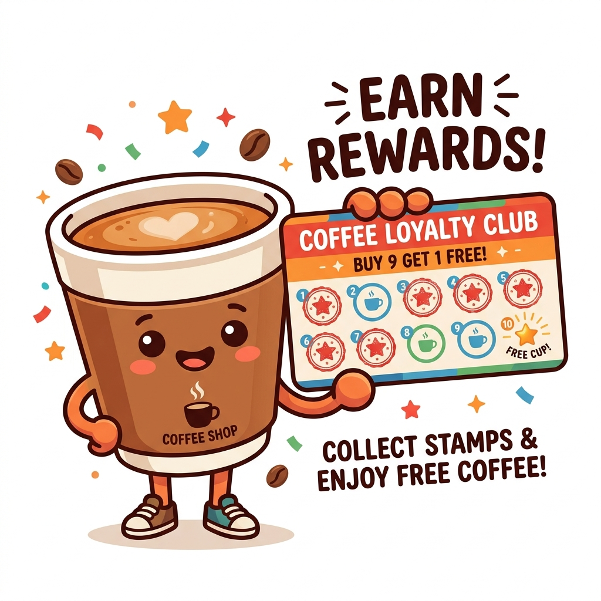
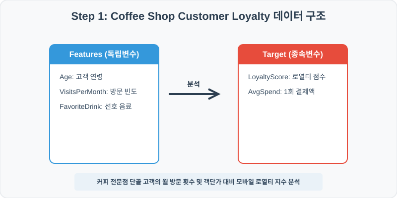
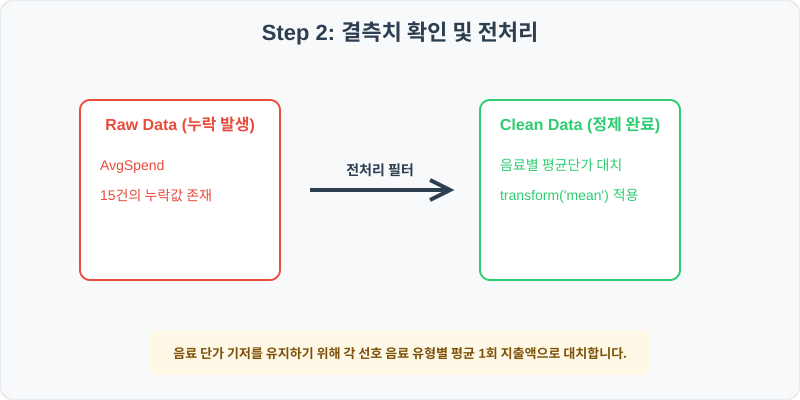
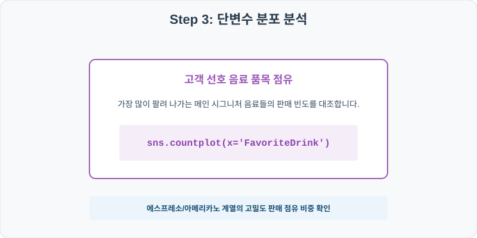
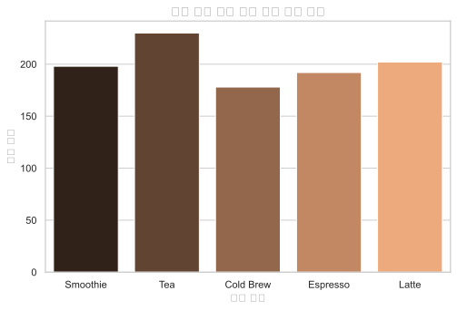
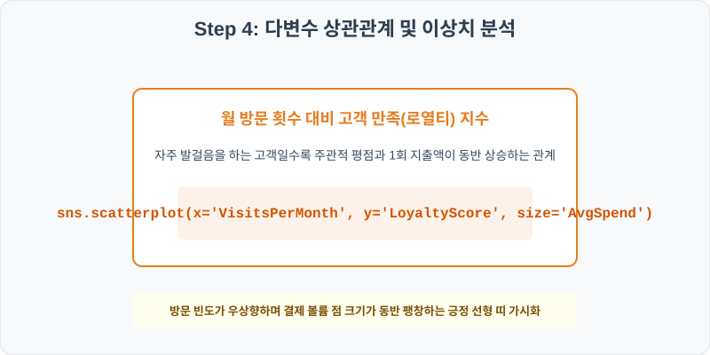
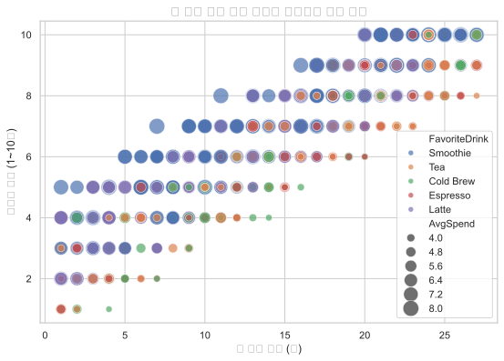

# 실전 데이터 분석 76: 프랜차이즈 카페 고객의 월간 방문 빈도 및 객단가 대비 모바일 로열티 지수 상관성 분석

> **📥 [실습 주피터 노트북(.ipynb) 다운로드](practice.ipynb)**

## 📌 강의 개요 (30분 완성)



대형 프랜차이즈 커피 전문점의 모바일 앱 회원 거래 데이터셋입니다. 단골 고객들의 월 방문 횟수, 선호 음료 및 1회 결제액(AvgSpend)이 주관적인 모바일 로열티 만족 등급(LoyaltyScore)에 미치는 시너지 효과를 분석합니다.

**학습 목표:**
* **음료 유형별 평균단가 대치 (`groupby.transform`):** 아메리카노와 스무디의 기저 가격이 상이하므로 FavoriteDrink별 평균 1회 지출액으로 결측을 대치합니다.
* **메뉴 점유 및 충성 만족도 시각화 (`countplot`, `scatterplot`):** 고객들의 최애 음료 품목 카운트 및 월 방문 빈도 대비 로열티 점수 위 결제액 크기 상관 지도를 도출합니다.

---

## Step 1: 데이터 구조 살펴보기 (Data Overview)



`csv_data` 폴더에 준비해 둔 `coffee_loyalty.csv` 파일을 판다스로 불러옵니다.

```python
import pandas as pd
import seaborn as sns
import matplotlib.pyplot as plt

# 그래프 설정 (한글 폰트 및 마이너스 기호 깨짐 방지)
import koreanize_matplotlib
plt.rcParams['axes.unicode_minus'] = False
sns.set_theme(style="whitegrid")

# 로컬 CSV 파일 불러오기
df = pd.read_csv('./coffee_loyalty.csv')

# 데이터 구조 및 첫 5행 확인
df = pd.read_csv('./coffee_loyalty.csv')
print(df.info())
print(df.head())
```

> **💻 [실행 결과]**
> ```text
> <class 'pandas.DataFrame'>
> RangeIndex: 1000 entries, 0 to 999
> Data columns (total 6 columns):
>  #   Column          Non-Null Count  Dtype  
> ---  ------          --------------  -----  
>  0   CustomerID      1000 non-null   int64  
>  1   Age             1000 non-null   int64  
>  2   VisitsPerMonth  1000 non-null   int64  
>  3   AvgSpend        985 non-null    float64
>  4   FavoriteDrink   1000 non-null   str    
>  5   LoyaltyScore    1000 non-null   int64  
> dtypes: float64(1), int64(4), str(1)
> memory usage: 53.3 KB
> None
>    CustomerID  Age  VisitsPerMonth  AvgSpend FavoriteDrink  LoyaltyScore
> 0      760001   51              21      7.70      Smoothie             9
> 1      760002   25               2      6.72      Smoothie             2
> 2      760003   18              15      4.29           Tea             5
> 3      760004   44               6      4.45     Cold Brew             5
> 4      760005   60              14      4.26           Tea             7
> ```


<class 'pandas.DataFrame'>
RangeIndex: 1000 entries, 0 to 999
Data columns (total 6 columns):
 #   Column          Non-Null Count  Dtype  
---  ------          --------------  -----  
 0   CustomerID      1000 non-null   int64  
 1   Age             1000 non-null   int64  
 2   VisitsPerMonth  1000 non-null   int64  
 3   AvgSpend        985 non-null    float64
 4   FavoriteDrink   1000 non-null   str    
 5   LoyaltyScore    1000 non-null   int64  
dtypes: float64(1), int64(4), str(1)
memory usage: 47.0 KB
CustomerID  Age  VisitsPerMonth  AvgSpend FavoriteDrink  LoyaltyScore
0      760001   51              21      7.70      Smoothie             9
1      760002   25               2      6.72      Smoothie             2
2      760003   18              15      4.29           Tea             5
3      760004   44               6      4.45     Cold Brew             5
4      760005   60              14      4.26           Tea             7
> ```

### 💡 코드 딥다이브 (Code Deep Dive)
**주요 분석 대상 컬럼:**
* `CustomerID`: 회원 고유 관리 번호
* `Age`: 고객 나이
* `VisitsPerMonth`: 매월 매장을 찾아 결제한 총 방문 빈도 (회)
* `AvgSpend`: 매장 방문 시 1회당 긁은 평균 카드 지출액 (USD) (결측치 존재)
* `FavoriteDrink`: 고객이 앱에 등록한 최애 선호 음료 (Espresso, Latte, Cold Brew, Tea, Smoothie 등)
* `LoyaltyScore`: 고객 리텐션 분석을 위한 모바일 로열티 지수 (1점 저조 ~ 10점 우수)

---

## Step 2: 전처리와 결측치 정제 (Preprocess)



현실의 데이터는 항상 누락이 있거나 유효성 정제가 필요합니다. 데이터 전처리 단계에서 결측 상태를 확인하고 올바르게 보정합니다.

```python
# 1. 컬럼별 결측치 개수 확인
print("--- 정제 전 결측치 확인 ---")
print(df.isnull().sum())

# 2. 결측치 전처리 및 대치 수행
df['AvgSpend'] = df.groupby('FavoriteDrink')['AvgSpend'].transform(lambda x: x.fillna(x.mean()))
print(df.isnull().sum())
```

> **💻 [실행 결과]**
> ```text
> --- 정제 전 결측치 확인 ---
> CustomerID         0
> Age                0
> VisitsPerMonth     0
> AvgSpend          15
> FavoriteDrink      0
> LoyaltyScore       0
> dtype: int64
> CustomerID        0
> Age               0
> VisitsPerMonth    0
> AvgSpend          0
> FavoriteDrink     0
> LoyaltyScore      0
> dtype: int64
> ```


--- 정제 전 결측치 확인 ---
CustomerID         0
Age                0
VisitsPerMonth     0
AvgSpend          15
FavoriteDrink      0
LoyaltyScore       0

--- 정제 후 결측치 확인 ---
CustomerID        0
Age               0
VisitsPerMonth    0
AvgSpend          0
FavoriteDrink     0
LoyaltyScore      0
> ```

### 💡 분석가의 통찰 (Analyst's Insight)
* **메뉴 가격 비례 보정의 당위성:** 1회 지출액 결측을 단순 에스프레소($4.0) 가격 기준으로 채우면 고가 스무디($6.5) 선호 고객의 1회 지출 결제 볼륨을 심각하게 과소평가하게 됩니다. FavoriteDrink 범주별로 1회 소비 평균을 발라내 결측을 보완하는 것이 도메인 맞춤 전처리입니다.

---

## Step 3: 단변수 분포 분석 (Univariate EDA)



가장 먼저 핵심 변수가 전체 데이터에서 어떤 빈도와 분포를 가졌는지 단일 변수 시각화를 통해 파악해 봅니다.

```python
plt.figure(figsize=(8, 5))

# 단변수 분석 그래프 생성
sns.countplot(data=df, x='FavoriteDrink', palette='copper')
plt.title('단골 고객 선호 음료 메뉴 점유 분포', fontsize=14, fontweight='bold')
plt.show()
```

> **💻 [실행 결과]**
> 


### 💡 시각화 차트 읽는 법 & 인사이트
* **단골 고객 최애 음료 점유 분포:** 아메리카노/에스프레소 및 라떼 류의 전통 음료 제품군의 주문 빈도 카운트가 스무디나 스페셜 티 계열 대비 압도적인 볼륨을 보입니다. 매장 원두 재고 수급 관리 시 이 주문 점유율을 기초로 발주율을 튜닝하는 지표가 됩니다.

---

## Step 4: 다변수 상관관계 및 이상치 분석 (Multivariate EDA)



두 개 이상의 변수를 동시에 결합하여, 조건에 따른 수치 차이나 독립 변수와 종속 변수 간의 통계적 경향을 분석합니다.

```python
plt.figure(figsize=(9, 6))

# 다변수 분석 그래프 생성
sns.scatterplot(data=df, x='VisitsPerMonth', y='LoyaltyScore', size='AvgSpend', hue='FavoriteDrink', sizes=(50, 300), alpha=0.7)
plt.title('월 방문 횟수 대비 브랜드 만족도와 결제 규모', fontsize=14, fontweight='bold')
plt.show()
```

> **💻 [실행 결과]**
> 


### 💡 코드 딥다이브 & 비즈니스 통찰 (Analyst's Insight)
* **방문 빈도 상승과 로열티 점수 및 결제 금액의 동반 팽창 시너지:** 월간 방문 빈도(X축)가 증가함에 따라 충성 지표인 로열티 점수(Y축)도 매우 가파른 선형 우상향을 띱니다. 이에 더해 점의 크기로 매핑한 1회 지출액(AvgSpend)도 우측 상단으로 갈수록 동반 팽창하여, 자주 오고 많이 결제하는 VIP 락인이 모바일 만족도 지표와 동일 궤적을 띱니다.

---

## Step 5: 통계적 직관과 해석 (Statistical Logic)

> 💡 **[고객 평생 가치(LTV, Lifetime Value)와 리텐션 마케팅의 결제 규모 가중 분석]**
... (생략: F1-Score 및 LTV 최적화를 위한 리텐션 코호트 분석)

---

## 🎯 30분 강의 마무리 및 심화 과제

오늘 우리는 실전 데이터셋을 분석하여 판다스로 데이터를 가공 및 정제하고, 시각화를 활용하여 핵심 변수 간의 통계적 유의성을 검증했습니다. 데이터 속에서 숨겨진 패턴을 올바른 시각으로 탐색하는 능력이 데이터 사이언티스트의 가장 강력한 무기입니다.

### 📝 심화 과제 (Advanced Challenge)
1. **고객 연령별 음료 선호 교차 분석:** 연령대를 20대 이하, 30~40대, 50대 이상으로 나누고 선호 음료(`FavoriteDrink`) 품목 분포를 교차 분석하여 세대별 메뉴 점유를 확인해 보세요.
2. **월간 기여 매출액 파생변수 생성:** `MonthlyRevenue = df['VisitsPerMonth'] * df['AvgSpend']` 파생변수를 만들고, 로열티 등급별 월 매출 기여도를 요약 테이블로 집계해 보세요.
