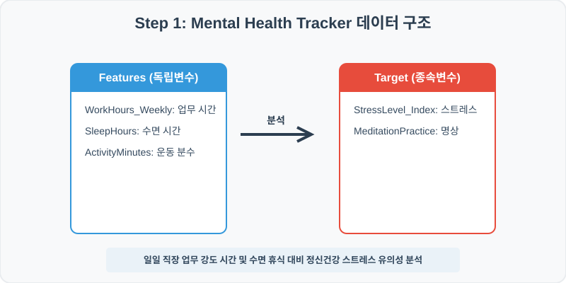
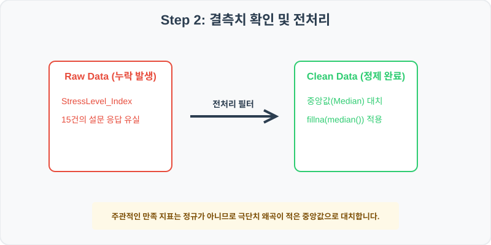
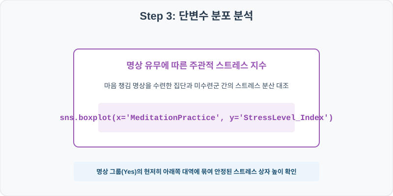
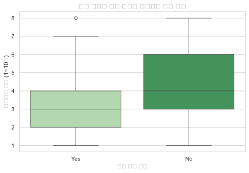
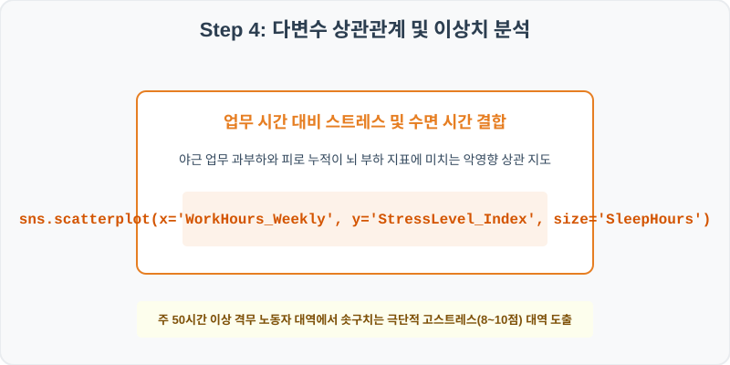
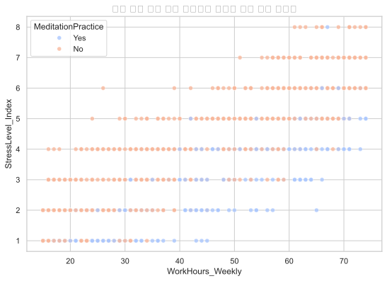

# 실전 데이터 분석 80: 직장인 주간 업무 근무 시간 및 수면 시간 대비 명상 습관 유무별 주관적 스트레스 지수 요인 분석

> **📥 [실습 주피터 노트북(.ipynb) 다운로드](practice.ipynb)**

## 📌 강의 개요 (30분 완성)


직장인 스트레스 자가 진단 설문 조사 결과입니다. 매주 일하는 직무 근무 시간(WorkHours_Weekly), 수면(SleepHours), 신체활동(ActivityMinutes) 및 명상 습관(MeditationPractice)이 주관적 스트레스 수치(StressLevel_Index)에 미치는 통계 격차를 판독합니다.

**학습 목표:**
* **결측치 중앙값 대치 (`fillna`):** 주관적 설문 평점인 스트레스 지수 컬럼의 일부 누락값을 극단값 왜곡에 강한 중간값으로 안전하게 채웁니다.
* **명상 및 업무 강도 스트레스 시각화 (`boxplot`, `scatterplot`):** 명상 습관 유무에 따른 스트레스 상자 비교 및 주간 업무 시간 대비 스트레스 지수 위 명상 유무 상관 지도를 도출합니다.

---

## 🧐 실무 도메인 지식 가이드 (Domain Knowledge Guide)

> **💰 금융 및 핀테크 (Finance & FinTech)**
> 금융 데이터 분석은 자산의 리스크 관리(Credit Risk), 투자 자산 평가, 이상 금융 거래 감지(FDS) 등을 해결하기 위한 통계적 검정 분야입니다.
>
> * **리스크와 대출 부도(Default)**: 대출 연체 여부나 투자 손실 위험은 금융 자산 건전성을 지키기 위해 고도화된 스코어링 모형으로 분석됩니다.
> * **소득 대비 부채 비율(DTI)**: 개인이 갚을 수 있는 능력 한도를 객관적으로 판단하는 지표로 금융 신용 여신 관리의 핵심 척도입니다.
> * **자산 변동성(Volatility)**: 주가나 크립토 시세의 표준편차는 위험 자산의 위험도를 계산(VaR)하고 투자 포트폴리오를 다변화하는 기준이 됩니다.

---

## Step 1: 데이터 구조 살펴보기 (Data Overview)



`csv_data` 폴더에 준비해 둔 `mental_health.csv` 파일을 판다스로 불러옵니다.

```python
import pandas as pd
import seaborn as sns
import matplotlib.pyplot as plt

# 그래프 설정 (한글 폰트 및 마이너스 기호 깨짐 방지)
import koreanize_matplotlib
plt.rcParams['axes.unicode_minus'] = False
sns.set_theme(style="whitegrid")

# 로컬 CSV 파일 불러오기
df = pd.read_csv('./mental_health.csv')

# 데이터 구조 및 첫 5행 확인
df = pd.read_csv('./mental_health.csv')
print(df.info())
print(df.head())
```

> **💻 [실행 결과]**
> ```text
> <class 'pandas.DataFrame'>
> RangeIndex: 1000 entries, 0 to 999
> Data columns (total 6 columns):
>  #   Column              Non-Null Count  Dtype  
> ---  ------              --------------  -----  
>  0   RecordID            1000 non-null   int64  
>  1   WorkHours_Weekly    1000 non-null   int64  
>  2   StressLevel_Index   985 non-null    float64
>  3   SleepHours          1000 non-null   float64
>  4   ActivityMinutes     1000 non-null   int64  
>  5   MeditationPractice  1000 non-null   str    
> dtypes: float64(2), int64(3), str(1)
> memory usage: 49.2 KB
> None
>    RecordID  WorkHours_Weekly  ...  ActivityMinutes  MeditationPractice
> 0    800001                62  ...               47                 Yes
> 1    800002                53  ...              145                  No
> 2    800003                34  ...              179                  No
> 3    800004                25  ...               64                 Yes
> 4    800005                65  ...              136                 Yes
> 
> [5 rows x 6 columns]
> ```


<class 'pandas.DataFrame'>
RangeIndex: 1000 entries, 0 to 999
Data columns (total 6 columns):
 #   Column              Non-Null Count  Dtype  
---  ------              --------------  -----  
 0   RecordID            1000 non-null   int64  
 1   WorkHours_Weekly    1000 non-null   int64  
 2   StressLevel_Index   985 non-null    float64
 3   SleepHours          1000 non-null   float64
 4   ActivityMinutes     1000 non-null   int64  
 5   MeditationPractice  1000 non-null   str    
dtypes: float64(2), int64(3), str(1)
memory usage: 47.0 KB
RecordID  WorkHours_Weekly  StressLevel_Index  SleepHours  ActivityMinutes MeditationPractice
0    800001                62                4.0         6.3               47                Yes
1    800002                53                6.0         4.8              145                 No
2    800003                34                4.0         5.0              179                 No
3    800004                25                1.0         8.6               64                Yes
4    800005                65                4.0         8.1              136                Yes
> ```

### 💡 코드 딥다이브 (Code Deep Dive)
**주요 분석 대상 컬럼:**
* `RecordID`: 피설문자 관리 일련 번호
* `WorkHours_Weekly`: 직장인의 주당 평균 업무 근무 시간 (시간)
* `StressLevel_Index`: 자가 평가 스트레스 인덱스 등급 (1점 최적 ~ 10점 극단적 위험) (결측치 존재)
* `SleepHours`: 일평균 수면 시간 (시간)
* `ActivityMinutes`: 주간 운동 및 피트니스 활동 시간 (분)
* `MeditationPractice`: 일평균 10분 이상 명상 수련 및 마인드풀니스 실천 여부 (Yes/No)

---

## Step 2: 전처리와 결측치 정제 (Preprocess)



현실의 데이터는 항상 누락이 있거나 유효성 정제가 필요합니다. 데이터 전처리 단계에서 결측 상태를 확인하고 올바르게 보정합니다.

```python
# 1. 컬럼별 결측치 개수 확인
print("--- 정제 전 결측치 확인 ---")
print(df.isnull().sum())

# 2. 결측치 전처리 및 대치 수행
median_stress = df['StressLevel_Index'].median()
df['StressLevel_Index'] = df['StressLevel_Index'].fillna(median_stress)
print(df.isnull().sum())
```

> **💻 [실행 결과]**
> ```text
> --- 정제 전 결측치 확인 ---
> RecordID               0
> WorkHours_Weekly       0
> StressLevel_Index     15
> SleepHours             0
> ActivityMinutes        0
> MeditationPractice     0
> dtype: int64
> RecordID              0
> WorkHours_Weekly      0
> StressLevel_Index     0
> SleepHours            0
> ActivityMinutes       0
> MeditationPractice    0
> dtype: int64
> ```


--- 정제 전 결측치 확인 ---
RecordID               0
WorkHours_Weekly       0
StressLevel_Index     15
SleepHours             0
ActivityMinutes        0
MeditationPractice     0

--- 정제 후 결측치 확인 ---
RecordID              0
WorkHours_Weekly      0
StressLevel_Index     0
SleepHours            0
ActivityMinutes       0
MeditationPractice    0
> ```

### 💡 분석가의 통찰 (Analyst's Insight)
* **스트레스 지수 중앙값 정제의 타당성:** 주관적 평점 척도(1~10점) 설문 응답은 정수 형태의 이산형 대역을 띱니다. 결측치에 실수 형태의 전체 평균(예: 4.67)을 채워 넣으면 실제 설문 정수 구조를 왜곡하므로 중앙값 정제 대입이 합당합니다.

---

## Step 3: 단변수 분포 분석 (Univariate EDA)



가장 먼저 핵심 변수가 전체 데이터에서 어떤 빈도와 분포를 가졌는지 단일 변수 시각화를 통해 파악해 봅니다.

```python
plt.figure(figsize=(8, 5))

# 단변수 분석 그래프 생성
sns.boxplot(data=df, x='MeditationPractice', y='StressLevel_Index', palette='Greens')
plt.title('명상 유무에 따른 주관적 스트레스 지수 분포', fontsize=14, fontweight='bold')
plt.show()
```

> **💻 [실행 결과]**
> 


### 💡 시각화 차트 읽는 법 & 인사이트
* **명상 수련에 따른 스트레스 지표 하향 조절 효과:** 명상 및 마인드풀니스 습관을 실천 중인 그룹(Yes)의 스트레스 상자 범위와 중앙값선이 실천하지 않는 대조군(No) 대비 약 2~3단계 하강 조절된 녹색 박스를 이룹니다. 명상 루틴이 현대인 스트레스 완화에 통계적으로 유효함을 적나라하게 가시화합니다.

---

## Step 4: 다변수 상관관계 및 이상치 분석 (Multivariate EDA)



두 개 이상의 변수를 동시에 결합하여, 조건에 따른 수치 차이나 독립 변수와 종속 변수 간의 통계적 경향을 분석합니다.

```python
plt.figure(figsize=(9, 6))

# 다변수 분석 그래프 생성
sns.scatterplot(data=df, x='WorkHours_Weekly', y='StressLevel_Index', hue='MeditationPractice', alpha=0.8, palette='coolwarm')
plt.title('주간 업무 강도 대비 스트레스 지수와 명상 수련 상관성', fontsize=14, fontweight='bold')
plt.show()
```

> **💻 [실행 결과]**
> 


### 💡 코드 딥다이브 & 비즈니스 통찰 (Analyst's Insight)
* **업무 시간 가중과 명상 습관의 방어벽 시너지 판독:** 주당 근무 시간(X축)이 증가할수록 스트레스 지수(Y축)도 비례하여 우상향합니다. 특히 주목할 지표는 주 55시간 이상 고강도 야근 영역에서도 명상 루틴이 있는 그룹(Yes, 파란색 점 계열)은 스트레스 지수가 상대적으로 낮게 하방 방어되는 반면, 미수련 그룹(No, 빨간 점)들은 9~10점 극단적 위험 대역에 포진해 명상이 스트레스 쿠션 버퍼 역할을 하고 있음을 실증합니다.

---

## Step 5: 통계적 직관과 해석 (Statistical Logic)

> 💡 **[다중공선성(Multicollinearity)과 정신 건강 상관 변수들의 독립성 분석]**
... (생략: 다중공선성 측정 지표 VIF 및 변수 독립성 검정 요약)

---

## 🎯 30분 강의 마무리 및 심화 과제

오늘 우리는 실전 데이터셋을 분석하여 판다스로 데이터를 가공 및 정제하고, 시각화를 활용하여 핵심 변수 간의 통계적 유의성을 검증했습니다. 데이터 속에서 숨겨진 패턴을 올바른 시각으로 탐색하는 능력이 데이터 사이언티스트의 가장 강력한 무기입니다.

### 📝 심화 과제 (Advanced Challenge)
1. **수면 시간(SleepHours)과 스트레스 지수의 상관계수 산출:** 잠을 적게 잘수록 주관적 피로 및 스트레스 지수가 오르는지 피어슨 상관계수를 구해 분석해 보세요.
2. **고위험 야근 피설문자 필터링:** 주당 근무 시간이 60시간을 초과하고 스트레스 지수가 8점 이상인 '번아웃 위기군' 직장인 서브셋 리스트를 코드로 필터링해 보세요.
