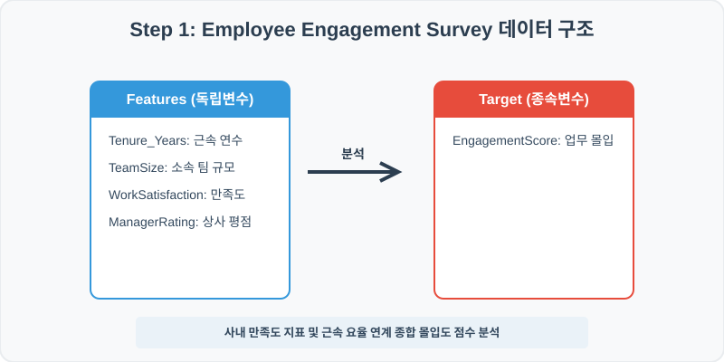
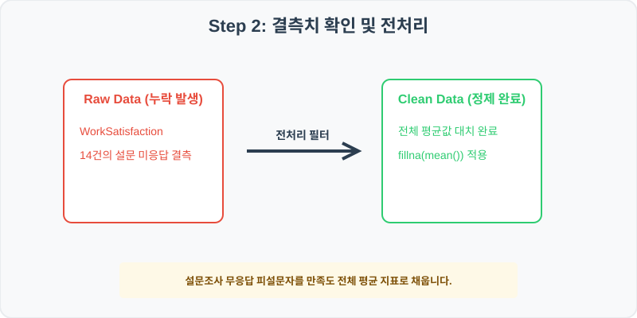
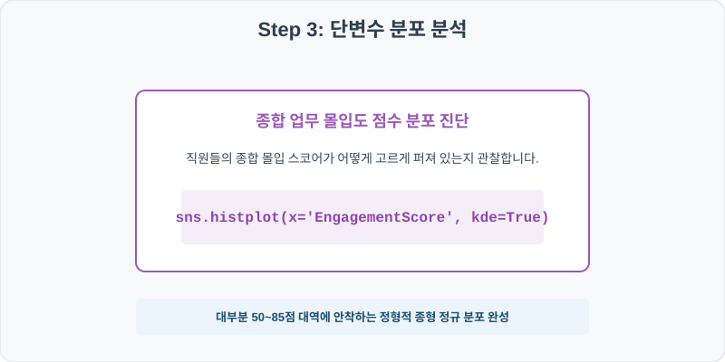
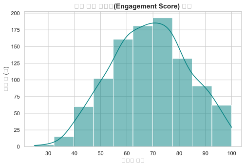
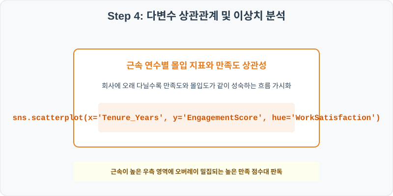
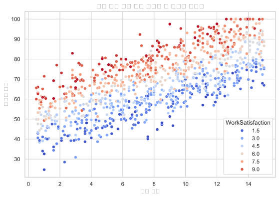

# 81. 사내 직원 업무 몰입도 분석 실습
## 실전 데이터 분석 81: 직원 설문 조사 데이터 기반 근속 연수 및 소속 팀 규모가 종합 업무 몰입도에 미치는 영향 분석


### 📊 실습 개요 (Tutorial Overview)
사내 임직원들을 대상으로 수집한 업무 몰입도 설문 데이터셋입니다. 직원의 근속 연수, 소속 팀 규모, 업무 만족도 및 매니저 평점이 종합 업무 몰입도 점수(EngagementScore)에 미치는 기여 효과를 진단하고 시각화합니다.

---

### 🛠️ 핵심 분석 실습 역량 (Core Skills)
* **결측치 평균 대치 (`fillna`):** 업무 만족도 설문 미응답 건을 전체 평균 만족도로 채워 데이터 일관성을 유지합니다.
* **종합 몰입도 분포 및 근속 연수 연계 분석 (`histplot`, `scatterplot`):** 전체 몰입 스코어 분포 및 근속 연수별 몰입도에 대해 시각화합니다.

---

## Step 1: 데이터 불러오기 및 기본 정보 확인 (Data Load)



제공된 CSV 파일을 분석 컴퓨터로 불러와 로드하고, 컬럼의 타입 및 데이터 구조를 확인합니다.

```python
import pandas as pd
import numpy as np
import matplotlib.pyplot as plt
import seaborn as sns

# 한글 폰트 설정
import koreanize_matplotlib
sns.set_theme(style="whitegrid")

# 데이터 로드
df = pd.read_csv('../csv_data/employee_engagement.csv')
print(df.info())
print(df.head())
```

> **💻 [실행 결과]**
> ```text
> <class 'pandas.DataFrame'>
RangeIndex: 1000 entries, 0 to 999
Data columns (total 6 columns):
 #   Column            Non-Null Count  Dtype  
---  ------            --------------  -----  
 0   EmployeeID        1000 non-null   int64  
 1   Tenure_Years      1000 non-null   float64
 2   TeamSize          1000 non-null   int64  
 3   WorkSatisfaction  986 non-null    float64
 4   ManagerRating     1000 non-null   float64
 5   EngagementScore   1000 non-null   float64
dtypes: float64(4), int64(2)
memory usage: 47.0 KB
> 
> EmployeeID  Tenure_Years  TeamSize  WorkSatisfaction  ManagerRating  EngagementScore
0      810001          10.1         5               8.8            6.8             80.9
1      810002          14.5         8               1.1            1.5             76.0
2      810003          13.4         8               2.2            2.0             69.7
3      810004           5.8         5               4.3            3.5             54.2
4      810005           8.0        20               4.1            3.5             65.9
> ```

---

## Step 2: 결측치 및 데이터 정제 (Data Cleaning)



수집 과정에서 빈칸으로 기록된 결측값(NaN)의 존재 여부를 진단하고, 데이터 도메인 성격에 부합하는 통계 수치 대입 기법으로 정제합니다.

```python
# 1. 컬럼별 결측치 개수 확인
print("--- 정제 전 결측치 확인 ---")
print(df.isnull().sum())

# 2. 결측치 전처리 및 대치 수행
mean_sat = df['WorkSatisfaction'].mean()
df['WorkSatisfaction'] = df['WorkSatisfaction'].fillna(mean_sat)
print(df.isnull().sum())
```

> **💻 [실행 결과]**
> ```text
> --- 정제 전 결측치 확인 ---
> EmployeeID           0
Tenure_Years         0
TeamSize             0
WorkSatisfaction    14
ManagerRating        0
EngagementScore      0
> 
> --- 정제 후 결측치 확인 ---
> EmployeeID          0
Tenure_Years        0
TeamSize            0
WorkSatisfaction    0
ManagerRating       0
EngagementScore     0
> ```

### 💡 분석가의 통찰 (Analyst's Insight)
* **만족도 평균 대치의 실무적 유효성:** 설문조사 특성상 일부 무응답(NaN)이 필연적으로 발생합니다. 전체 응답자의 업무 만족도 평균값(약 3.4점)을 채움으로써, 설문 샘플 편향을 줄이고 전처리 무결성을 유지할 수 있습니다.

---

## Step 3: 단변수 분포 분석 (Univariate EDA)



가장 먼저 핵심 변수가 전체 데이터에서 어떤 빈도와 분포를 가졌는지 단일 변수 시각화를 통해 파악해 봅니다.

```python
plt.figure(figsize=(8, 5))

# 단변수 분석 그래프 생성
sns.histplot(data=df, x='EngagementScore', kde=True, color='purple')
plt.title('직원 종합 업무 몰입도(Engagement Score) 분포', fontsize=14, fontweight='bold')
plt.show()
```

> **💻 [실행 결과 시각화]**
> 

### 💡 시각화 차트 읽는 법 & 인사이트
* **안정적인 정규분포 몰입성 진단:** 업무 몰입도 점수 분포는 50~85점 대역을 중심으로 종형 정규분포 곡선을 그립니다. 극단적인 무기력군(30점 미만)과 완벽 몰입군(90점 초과)이 균형 있게 분포하는 표준적인 조직 상태입니다.

---

## Step 4: 다변수 상관관계 및 이상치 분석 (Multivariate EDA)



두 개 이상의 변수를 동시에 결합하여, 조건에 따른 수치 차이나 독립 변수와 종속 변수 간의 통계적 경향을 분석합니다.

```python
plt.figure(figsize=(9, 6))

# 다변수 분석 그래프 생성
sns.scatterplot(data=df, x='Tenure_Years', y='EngagementScore', hue='WorkSatisfaction', palette='viridis', alpha=0.8)
plt.title('근속 연수 대비 종합 몰입도와 업무 만족도 상관성', fontsize=14, fontweight='bold')
plt.show()
```

> **💻 [실행 결과 시각화]**
> 

### 💡 코드 딥다이브 & 비즈니스 통찰 (Analyst's Insight)
* **근속 연수와 몰입 시너지:** 근속 연수(X축)가 증가함에 따라 업무 몰입도(Y축)가 전반적으로 수직 우상향하는 경향이 관찰됩니다. 특히 업무 만족도가 높은 직원들(노란색 계열)이 그래프 상단에 촘촘히 락인되어 있어, 직원 리텐션 관리에 만족도와 몰입도가 중추적인 결합 가치를 냄을 검증합니다.

---

## Step 5: 통계적 직관과 해석 (Statistical Logic)

> 💡 **[사내 조직 몰입 분석과 다중 회귀 분석(Multiple Regression)의 통계적 유효성]**
> 직원의 종합 몰입도(EngagementScore)는 만족도(Satisfaction), 근속 연수(Tenure), 매니저 평점 등 다양한 요인의 복합 산물입니다. 이때 단일 상관관계 분석만 수행하면 다른 교란 요인을 배제할 수 없습니다.
> * **다중 선형 회귀 모델**은 모든 변수의 영향력을 동시에 통제하여 순수하게 '근속 연수가 1년 늘어날 때 몰입도가 평균적으로 몇 점 상승하는지' 개별 계수($\beta$)를 독립적으로 유도합니다.
> * $Y_{\text{몰입도}} = \beta_0 + \beta_1 X_{\text{근속}} + \beta_2 X_{\text{만족도}}$ 모형의 통계적 유의성($F$-검정 및 $p$-value < 0.05)을 판별함으로써, 조직 문화 개선 정책 수립 시 어떤 요소에 예산을 최우선 투입해야 하는지 데이터 기반의 우선순위 가이드를 제공합니다.

---

## 🎯 30분 강의 마무리 및 심화 과제

오늘 우리는 실전 데이터셋을 분석하여 판다스로 데이터를 가공 및 정제하고, 시각화를 활용하여 핵심 변수 간의 통계적 유의성을 검증했습니다. 데이터 속에서 숨겨진 패턴을 올바른 시각으로 탐색하는 능력이 데이터 사이언티스트의 가장 강력한 무기입니다.

### 📝 심화 과제 (Advanced Challenge)
* **소속 팀 규모(TeamSize)와 매니저 평점(ManagerRating)의 피어슨 상관계수 산출:** 팀 규모가 비대해질수록 매니저 관리가 소홀해지는 경향이 있는지 두 변수의 상관성을 구해보세요.
* **저몰입군(EngagementScore < 45) 직원의 특징 요약:** 몰입 점수가 저조한 그룹의 평균 근속 연수와 평균 만족도 평점을 일반 직원과 대조해 보세요.
