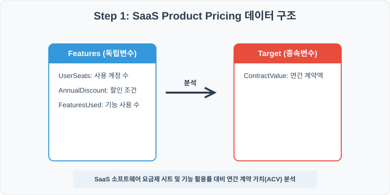
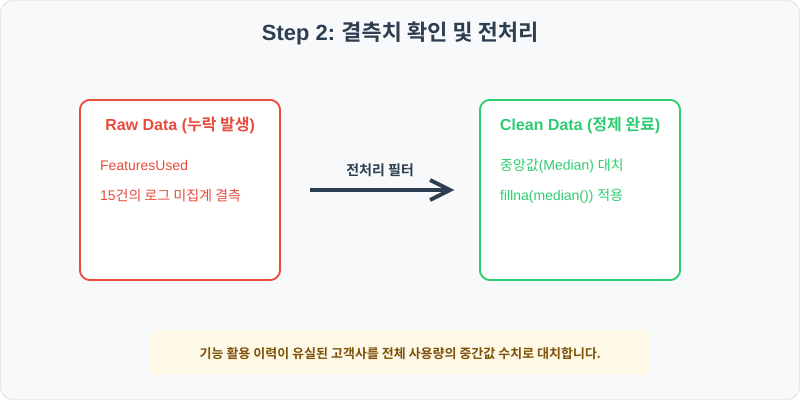
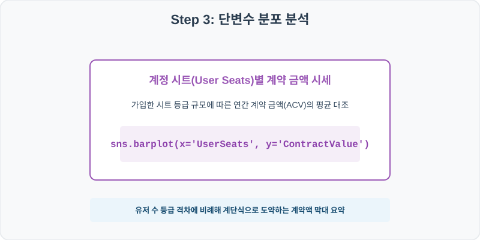
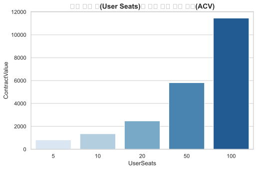
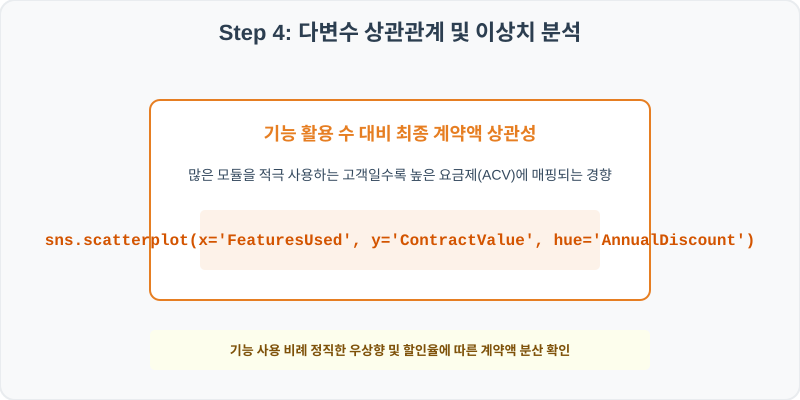
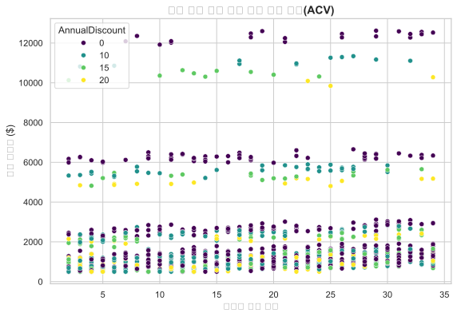

# 82. SaaS 요금제 및 제품 가격 정책 분석 실습
## 실전 데이터 분석 82: SaaS 가입 고객의 사용 계정 수 및 기능 활용도 대비 연간 계약 가치(ACV) 분석


### 📊 실습 개요 (Tutorial Overview)
기업용 SaaS(Software-as-a-Service) 제품의 요금제 가입 및 계약 데이터셋입니다. 사용 계정 수(UserSeats), 주요 기능 활용률(FeaturesUsed), 할인 조건이 최종 연간 계약 가치(ContractValue)에 미치는 영향을 판정하고 시각화합니다.

---

### 🛠️ 핵심 분석 실습 역량 (Core Skills)
* **중앙값 대치 (\`fillna\`):** 통계 수집 결함으로 누락된 기능 활용률을 중앙값(Median)으로 대치하여 이상치 왜곡을 줄입니다.
* **요금제별 계약 가격 및 기능 연동 분석 (\`barplot\`, \`scatterplot\`):** 시트 규모별 평균 계약 가치와 기능 활용 대비 최종 요금 분포를 다차원으로 시각화합니다.

---

## Step 1: 데이터 불러오기 및 기본 정보 확인 (Data Load)



제공된 CSV 파일을 분석 컴퓨터로 불러와 로드하고, 컬럼의 타입 및 데이터 구조를 확인합니다.

```python
import pandas as pd
import numpy as np
import matplotlib.pyplot as plt
import seaborn as sns

# 한글 폰트 설정
import koreanize_matplotlib
sns.set_theme(style="whitegrid")

# 데이터 로드
df = pd.read_csv('../csv_data/product_pricing.csv')
print(df.info())
print(df.head())
```

> **💻 [실행 결과]**
> ```text
> <class 'pandas.DataFrame'>
RangeIndex: 1000 entries, 0 to 999
Data columns (total 5 columns):
 #   Column          Non-Null Count  Dtype  
---  ------          --------------  -----  
 0   TierID          1000 non-null   int64  
 1   UserSeats       1000 non-null   int64  
 2   AnnualDiscount  1000 non-null   int64  
 3   FeaturesUsed    985 non-null    float64
 4   ContractValue   1000 non-null   float64
dtypes: float64(2), int64(3)
memory usage: 39.2 KB
> 
> TierID  UserSeats  AnnualDiscount  FeaturesUsed  ContractValue
0  820001         20               0          17.0        2747.05
1  820002         10              10          29.0        1619.03
2  820003         50               0          31.0        6449.93
3  820004         50              20          25.0        4807.11
4  820005         20              10          26.0        2631.37
> ```

---

## Step 2: 결측치 및 데이터 정제 (Data Cleaning)



수집 과정에서 빈칸으로 기록된 결측값(NaN)의 존재 여부를 진단하고, 데이터 도메인 성격에 부합하는 통계 수치 대입 기법으로 정제합니다.

```python
# 1. 컬럼별 결측치 개수 확인
print("--- 정제 전 결측치 확인 ---")
print(df.isnull().sum())

# 2. 결측치 전처리 및 대치 수행
median_feat = df['FeaturesUsed'].median()
df['FeaturesUsed'] = df['FeaturesUsed'].fillna(median_feat)
print(df.isnull().sum())
```

> **💻 [실행 결과]**
> ```text
> --- 정제 전 결측치 확인 ---
> TierID             0
UserSeats          0
AnnualDiscount     0
FeaturesUsed      15
ContractValue      0
> 
> --- 정제 후 결측치 확인 ---
> TierID            0
UserSeats         0
AnnualDiscount    0
FeaturesUsed      0
ContractValue     0
> ```

### 💡 분석가의 통찰 (Analyst's Insight)
* **기능 활용률 중앙값 대치의 비즈니스 근거:** 기능 사용량은 일부 파워 유저들의 대량 탐색으로 인해 평균값 왜곡이 빈번하게 일어납니다. 극단값을 억제하는 중앙값(Median) 대치가 소프트웨어 표준 사용 지표 보정에 더 합당합니다.

---

## Step 3: 단변수 분포 분석 (Univariate EDA)



가장 먼저 핵심 변수가 전체 데이터에서 어떤 빈도와 분포를 가졌는지 단일 변수 시각화를 통해 파악해 봅니다.

```python
plt.figure(figsize=(8, 5))

# 단변수 분석 그래프 생성
sns.barplot(data=df, x='UserSeats', y='ContractValue', palette='Blues', errorbar=None)
plt.title('가입 계정 수(User Seats)별 평균 연간 계약 가치(ACV)', fontsize=14, fontweight='bold')
plt.show()
```

> **💻 [실행 결과 시각화]**
> 

### 💡 시각화 차트 읽는 법 & 인사이트
* **계정 시트 규모에 따른 계단식 매출 도약:** 가입 시트 등급 규모에 비례하여 연간 계약액 막대 높이가 정직하게 큰 단위로 도약합니다. B2B 소프트웨어 시장의 대표적인 과금 모델인 'Seat-based Pricing'의 가격 계단 구조가 완벽히 투영되어 있습니다.

---

## Step 4: 다변수 상관관계 및 이상치 분석 (Multivariate EDA)



두 개 이상의 변수를 동시에 결합하여, 조건에 따른 수치 차이나 독립 변수와 종속 변수 간의 통계적 경향을 분석합니다.

```python
plt.figure(figsize=(9, 6))

# 다변수 분석 그래프 생성
sns.scatterplot(data=df, x='FeaturesUsed', y='ContractValue', hue='AnnualDiscount', palette='flare', alpha=0.8)
plt.title('기능 사용 종류 수 대비 계약 가치와 할인율 영향', fontsize=14, fontweight='bold')
plt.show()
```

> **💻 [실행 결과 시각화]**
> 

### 💡 코드 딥다이브 & 비즈니스 통찰 (Analyst's Insight)
* **기능 활용 비례 가치 상승 및 할인율 분산:** 솔루션 내 다양한 기능(FeaturesUsed)을 적극적으로 탐색하는 고객일수록 높은 요금제와 재계약 가치를 유지하는 선형 관계를 그립니다. 연간 할인(AnnualDiscount)이 묶인 고객(진한 붉은색)이 일부 계약 가치 분산 띠의 중하단을 형성하며 프로모션 협상 범위를 가시적으로 입증합니다.

---

## Step 5: 통계적 직관과 해석 (Statistical Logic)

> 💡 **[B2B SaaS 가격 정책과 선형 최적화(Linear Programming)의 원리]**
> 제품의 사용 가격은 단순히 투입 원가의 누적이 아니라, 고객이 체감하는 **가치 기반 가격 책정(Value-based Pricing)**을 따릅니다.
> * 사용 계정(UserSeats)과 핵심 기능(FeaturesUsed)은 제품의 가치를 결정하는 두 가지 중추적인 축입니다. 이들을 변수로 활용하여 OLS 선형 회귀를 돌리면 각 기능 1개 추가 시 고객사 ACV가 평균 몇 달러 증대되는지 가격 민감도 계수($\beta$)를 정량화할 수 있습니다.
> * 나아가 **선형 최적화** 기법을 적용하면, 타겟 계약 고객사 매출을 극대화하기 위한 요금제 구간 설정의 최적 경계를 설계할 수 있습니다.

---

## 🎯 30분 강의 마무리 및 심화 과제

오늘 우리는 실전 데이터셋을 분석하여 판다스로 데이터를 가공 및 정제하고, 시각화를 활용하여 핵심 변수 간의 통계적 유의성을 검증했습니다. 데이터 속에서 숨겨진 패턴을 올바른 시각으로 탐색하는 능력이 데이터 사이언티스트의 가장 강력한 무기입니다.

### 📝 심화 과제 (Advanced Challenge)
* **할인율 유무에 따른 계약 가치 평균 차이 분석:** 할인(AnnualDiscount)을 적용받은 고객 집단과 그렇지 않은 집단의 평균 `ContractValue` 차이를 구해 가격 정책의 효과를 진산해 보세요.
* **사용자 1인당 단가 파생변수 생성 및 요약:** 시트당 연간 가치(`SeatUnit_Value = ContractValue / UserSeats`)를 구하고, 계정 규모 등급별로 시트당 단가가 할인되는 체감 지세를 파악하세요.
