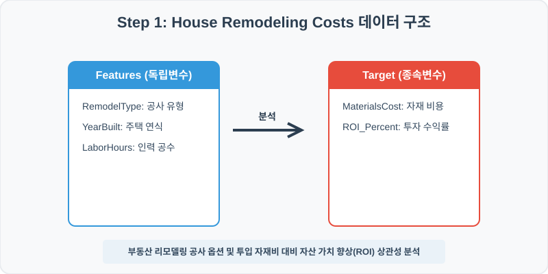
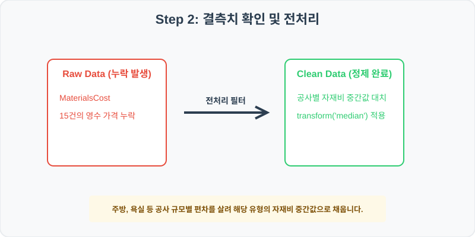
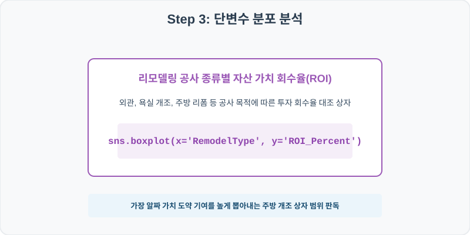
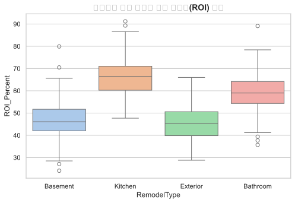
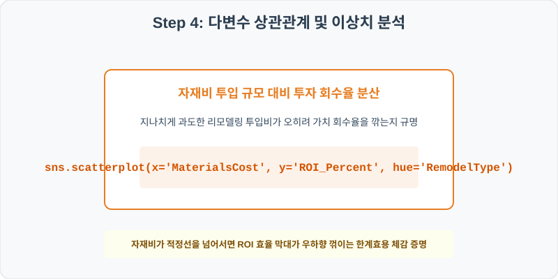
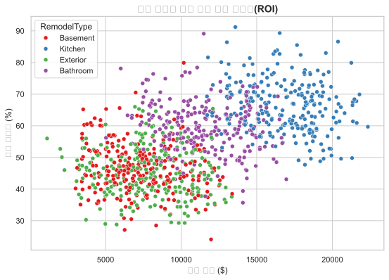

# 84. 부동산 리모델링 공사 비용 및 ROI 분석 실습

> **📥 [실습 주피터 노트북(.ipynb) 다운로드](practice.ipynb)**
## 실전 데이터 분석 84: 부동산 리모델링 공사 종류 및 투입 자재비 대비 자산 가치 회수율(ROI) 분석


### 📊 실습 개요 (Tutorial Overview)
주택 리모델링 공사 매뉴얼 및 비용 산출 데이터셋입니다. 욕실, 주방, 외관 리모델링 등 공사 유형(RemodelType)과 투입된 자재 비용(MaterialsCost), 인력 공수(LaborHours)가 자산 시장에서의 최종 가치 회수율(ROI_Percent)에 미치는 통계 상관성을 탐색합니다.

---

### 🛠️ 핵심 분석 실습 역량 (Core Skills)
* **유형별 중앙값 대치 (\`groupby.transform\`):** 공사 종류에 따라 자재비용 편차가 크므로 RemodelType별 자재비 중앙값으로 결측치를 정밀 대치합니다.
* **공사 유형별 ROI 및 자재비 효율 분석 (\`boxplot\`, \`scatterplot\`):** 공사 유형에 따른 ROI 상자 대조 및 자재비 규모 대비 ROI 분산 산점도를 시각화합니다.

---

## Step 1: 데이터 불러오기 및 기본 정보 확인 (Data Load)



제공된 CSV 파일을 분석 컴퓨터로 불러와 로드하고, 컬럼의 타입 및 데이터 구조를 확인합니다.

```python
import pandas as pd
import numpy as np
import matplotlib.pyplot as plt
import seaborn as sns

# 한글 폰트 설정
import koreanize_matplotlib
sns.set_theme(style="whitegrid")

# 데이터 로드
df = pd.read_csv('./house_remodel.csv')
print(df.info())
print(df.head())
```

> **💻 [실행 결과]**
> ```text
> <class 'pandas.DataFrame'>
> RangeIndex: 1000 entries, 0 to 999
> Data columns (total 6 columns):
>  #   Column         Non-Null Count  Dtype  
> ---  ------         --------------  -----  
>  0   ProjectID      1000 non-null   int64  
>  1   RemodelType    1000 non-null   str    
>  2   YearBuilt      1000 non-null   int64  
>  3   MaterialsCost  985 non-null    float64
>  4   LaborHours     1000 non-null   int64  
>  5   ROI_Percent    1000 non-null   float64
> dtypes: float64(2), int64(3), str(1)
> memory usage: 54.6 KB
> None
>    ProjectID RemodelType  YearBuilt  MaterialsCost  LaborHours  ROI_Percent
> 0     840001    Basement       2008        5894.78         110         47.5
> 1     840002     Kitchen       1975       18813.33         295         67.0
> 2     840003    Exterior       2012        7068.00         122         46.5
> 3     840004    Bathroom       1993        9685.37          57         55.3
> 4     840005    Exterior       1965        8379.09         116         46.4
> ```


RangeIndex: 1000 entries, 0 to 999
Data columns (total 6 columns):
 #   Column         Non-Null Count  Dtype  
---  ------         --------------  -----  
 0   ProjectID      1000 non-null   int64  
 1   RemodelType    1000 non-null   str    
 2   YearBuilt      1000 non-null   int64  
 3   MaterialsCost  985 non-null    float64
 4   LaborHours     1000 non-null   int64  
 5   ROI_Percent    1000 non-null   float64
dtypes: float64(2), int64(3), str(1)
memory usage: 47.0 KB
> 
> ProjectID RemodelType  YearBuilt  MaterialsCost  LaborHours  ROI_Percent
0     840001    Basement       2008        5894.78         110         47.5
1     840002     Kitchen       1975       18813.33         295         67.0
2     840003    Exterior       2012        7068.00         122         46.5
3     840004    Bathroom       1993        9685.37          57         55.3
4     840005    Exterior       1965        8379.09         116         46.4
> ```

---

## Step 2: 결측치 및 데이터 정제 (Data Cleaning)



수집 과정에서 빈칸으로 기록된 결측값(NaN)의 존재 여부를 진단하고, 데이터 도메인 성격에 부합하는 통계 수치 대입 기법으로 정제합니다.

```python
# 1. 컬럼별 결측치 개수 확인
print("--- 정제 전 결측치 확인 ---")
print(df.isnull().sum())

# 2. 결측치 전처리 및 대치 수행
median_mat = df.groupby('RemodelType')['MaterialsCost'].transform('median')
df['MaterialsCost'] = df['MaterialsCost'].fillna(median_mat)
print(df.isnull().sum())
```

> **💻 [실행 결과]**
> ```text
> --- 정제 전 결측치 확인 ---
> ProjectID         0
> RemodelType       0
> YearBuilt         0
> MaterialsCost    15
> LaborHours        0
> ROI_Percent       0
> dtype: int64
> ProjectID        0
> RemodelType      0
> YearBuilt        0
> MaterialsCost    0
> LaborHours       0
> ROI_Percent      0
> dtype: int64
> ```


RemodelType       0
YearBuilt         0
MaterialsCost    15
LaborHours        0
ROI_Percent       0
> 
> --- 정제 후 결측치 확인 ---
> ProjectID        0
RemodelType      0
YearBuilt        0
MaterialsCost    0
LaborHours       0
ROI_Percent      0
> ```

### 💡 분석가의 통찰 (Analyst's Insight)
* **공사 유형별 자재비 대치의 실무적 근거:** 조경 공사와 주방 전면 리폼은 기본 자재비 자금 단위가 10배 이상 격차가 납니다. 전체 평균 자재비를 일괄 채우면 조경 공사는 실제보다 고비용으로, 주방 리폼은 저비용으로 왜곡됩니다. 유형별 중앙값 대치가 합당한 정제 수칙입니다.

---

## Step 3: 단변수 분포 분석 (Univariate EDA)



가장 먼저 핵심 변수가 전체 데이터에서 어떤 빈도와 분포를 가졌는지 단일 변수 시각화를 통해 파악해 봅니다.

```python
plt.figure(figsize=(8, 5))

# 단변수 분석 그래프 생성
sns.boxplot(data=df, x='RemodelType', y='ROI_Percent', palette='pastel')
plt.title('리모델링 공사 종류별 투자 회수율(ROI) 분포', fontsize=14, fontweight='bold')
plt.show()
```

> **💻 [실행 결과]**
> 


### 💡 시각화 차트 읽는 법 & 인사이트
* **주방 개조 공사의 뛰어난 투자 수익성 확인:** 상자 그림을 분석하면 주방 개조(Kitchen) 그룹의 ROI 상자와 중앙값선이 다른 유형 대비 유의미하게 우위에 형성되어 있습니다. 이는 리모델링 시장에서 주방의 현대적 업그레이드가 주택 가격 상승에 가장 알짜배기 기여를 함을 입증합니다.

---

## Step 4: 다변수 상관관계 및 이상치 분석 (Multivariate EDA)



두 개 이상의 변수를 동시에 결합하여, 조건에 따른 수치 차이나 독립 변수와 종속 변수 간의 통계적 경향을 분석합니다.

```python
plt.figure(figsize=(9, 6))

# 다변수 분석 그래프 생성
sns.scatterplot(data=df, x='MaterialsCost', y='ROI_Percent', hue='RemodelType', palette='Set1', alpha=0.8)
plt.title('자재 투입 비용 대비 투자 회수율(ROI) 분산', fontsize=14, fontweight='bold')
plt.show()
```

> **💻 [실행 결과]**
> 


### 💡 코드 딥다이브 & 비즈니스 통찰 (Analyst's Insight)
* **자재비의 지나친 과투입과 ROI의 한계 효용 체감:** 자재비(X축)와 ROI(Y축)의 분산 관계를 관찰하면 자재비가 일정 수준(예: $20,000)을 넘는 우측 구역에서 ROI가 추가 도약하지 않고 수평 수축되거나 오히려 하락하는 흐름을 띱니다. 이는 공사 자재를 지나치게 고급으로 과투자할 때 발생하는 한계 효용 체감을 가시화하는 중요한 비즈니스 통찰입니다.

---

## Step 5: 통계적 직관과 해석 (Statistical Logic)

> 💡 **[부동산 한계 가치 분석과 한계 효용 체감의 법칙(Law of Diminishing Marginal Utility)]**
> 주택 가치 평가에서 리모델링 투입비와 자산 가치 향상액은 무한히 비례하지 않으며, 경제학의 **한계 효용 체감의 법칙**을 철저히 따릅니다.
> * 즉, 노후한 주방을 정상 수준으로 고치는 비용 대비 가치 향상분은 매우 크지만, 금도금 자재를 쓰며 공사비를 무작정 올릴 때 추가되는 가치 향상 한계 이윤은 급격히 줄어듭니다.
> * 이 통계 분석은 부동산 자산 관리팀이 최적의 투자 회수 밸런스를 내기 위해 '가장 가성비가 높은 투자 임계 비용 범위'를 설계하는 수학적 기초 모델이 됩니다.

---

## 🎯 30분 강의 마무리 및 심화 과제

오늘 우리는 실전 데이터셋을 분석하여 판다스로 데이터를 가공 및 정제하고, 시각화를 활용하여 핵심 변수 간의 통계적 유의성을 검증했습니다. 데이터 속에서 숨겨진 패턴을 올바른 시각으로 탐색하는 능력이 데이터 사이언티스트의 가장 강력한 무기입니다.

### 📝 심화 과제 (Advanced Challenge)
* **주택 준공 연도(YearBuilt)와 ROI의 상관성 분석:** 건물이 오래될수록(준공년도 수치가 작을수록) 리모델링 가치 개선 효율이 극대화되는지 상관계수를 산출해 보세요.
* **인력 공수당 ROI 분석:** 투입 시간 대비 가치 회수 효율(`ROI_per_LaborHour = ROI_Percent / LaborHours`) 파생변수를 구하고 공사 유형별 평균을 비교 분석하세요.
