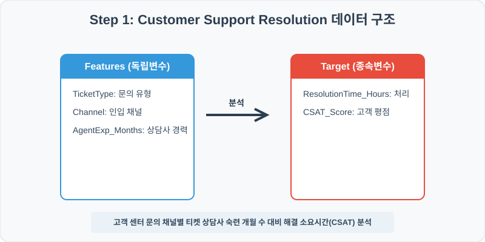
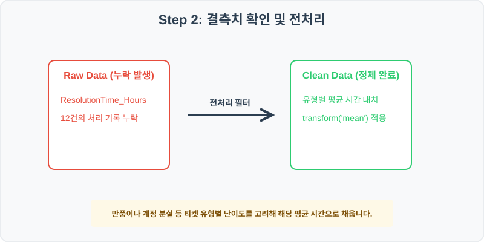
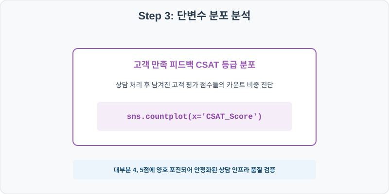
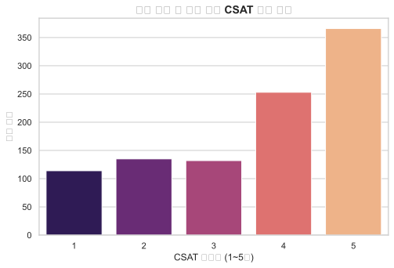
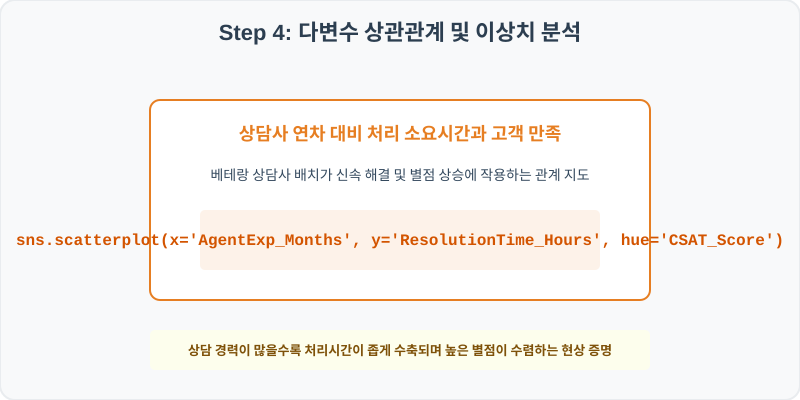
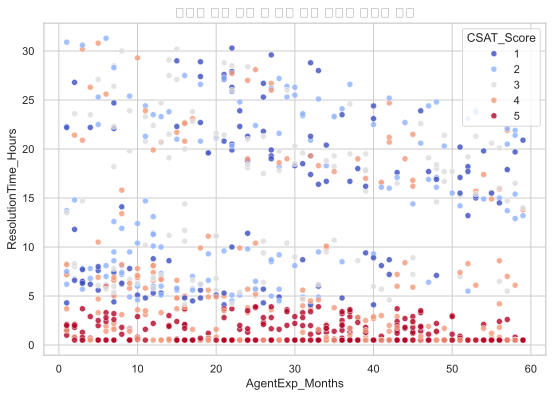

# 85. 고객 센터 문의 처리 속도 및 만족도 분석 실습

> **📥 [실습 주피터 노트북(.ipynb) 다운로드](practice.ipynb)**
## 실전 데이터 분석 85: 고객 지원 티켓 유형 및 인입 채널별 상담사 숙련도 대비 CSAT 만족도 점수 분석


### 📊 실습 개요 (Tutorial Overview)
고객 지원 헬프 데스크의 실시간 티켓 상담 로그 데이터셋입니다. 반품, 환불, 로그인 장애 등 티켓 유형(TicketType)과 상담 채널(Channel), 상담사 연차(AgentExp_Months)가 최종 해결 소요 시간(ResolutionTime_Hours) 및 고객 만족 점수(CSAT_Score)에 미치는 기여를 규명합니다.

---

### 🛠️ 핵심 분석 실습 역량 (Core Skills)
* **티켓 유형별 평균 대치 (\`groupby.transform\`):** 문의 유형마다 난이도가 다르므로 TicketType별 평균 해결 시간으로 결측치를 정밀 대치합니다.
* **CSAT 만족도 카운트 및 상담사 숙련도 시너지 분석 (\`countplot\`, \`scatterplot\`):** 고객 만족도 등급 카운트 막대 및 상담사 숙련 개월 수 대비 처리 시간의 CSAT 별점 오버레이 산점도를 시각화합니다.

---

## 🧐 실무 도메인 지식 가이드 (Domain Knowledge Guide)

> **💰 금융 및 핀테크 (Finance & FinTech)**
> 금융 데이터 분석은 자산의 리스크 관리(Credit Risk), 투자 자산 평가, 이상 금융 거래 감지(FDS) 등을 해결하기 위한 통계적 검정 분야입니다.
>
> * **리스크와 대출 부도(Default)**: 대출 연체 여부나 투자 손실 위험은 금융 자산 건전성을 지키기 위해 고도화된 스코어링 모형으로 분석됩니다.
> * **소득 대비 부채 비율(DTI)**: 개인이 갚을 수 있는 능력 한도를 객관적으로 판단하는 지표로 금융 신용 여신 관리의 핵심 척도입니다.
> * **자산 변동성(Volatility)**: 주가나 크립토 시세의 표준편차는 위험 자산의 위험도를 계산(VaR)하고 투자 포트폴리오를 다변화하는 기준이 됩니다.

---

## Step 1: 데이터 불러오기 및 기본 정보 확인 (Data Load)



제공된 CSV 파일을 분석 컴퓨터로 불러와 로드하고, 컬럼의 타입 및 데이터 구조를 확인합니다.

```python
import pandas as pd
import numpy as np
import matplotlib.pyplot as plt
import seaborn as sns

# 한글 폰트 설정
import koreanize_matplotlib
sns.set_theme(style="whitegrid")

# 데이터 로드
df = pd.read_csv('./customer_support.csv')
print(df.info())
print(df.head())
```

> **💻 [실행 결과]**
> ```text
> <class 'pandas.DataFrame'>
> RangeIndex: 1000 entries, 0 to 999
> Data columns (total 6 columns):
>  #   Column                Non-Null Count  Dtype  
> ---  ------                --------------  -----  
>  0   TicketID              1000 non-null   int64  
>  1   TicketType            1000 non-null   str    
>  2   Channel               1000 non-null   str    
>  3   ResolutionTime_Hours  988 non-null    float64
>  4   AgentExp_Months       1000 non-null   int64  
>  5   CSAT_Score            1000 non-null   int64  
> dtypes: float64(1), int64(3), str(2)
> memory usage: 60.4 KB
> None
>    TicketID      TicketType  ... AgentExp_Months  CSAT_Score
> 0    850001          Refund  ...              30           5
> 1    850002          Refund  ...              43           4
> 2    850003  Account Access  ...              55           5
> 3    850004         General  ...              24           5
> 4    850005       Technical  ...               7           2
> 
> [5 rows x 6 columns]
> ```


RangeIndex: 1000 entries, 0 to 999
Data columns (total 6 columns):
 #   Column                Non-Null Count  Dtype  
---  ------                --------------  -----  
 0   TicketID              1000 non-null   int64  
 1   TicketType            1000 non-null   str    
 2   Channel               1000 non-null   str    
 3   ResolutionTime_Hours  988 non-null    float64
 4   AgentExp_Months       1000 non-null   int64  
 5   CSAT_Score            1000 non-null   int64  
dtypes: float64(1), int64(3), str(2)
memory usage: 47.0 KB
> 
> TicketID      TicketType Channel  ResolutionTime_Hours  AgentExp_Months  CSAT_Score
0    850001          Refund   Phone                   2.9               30           5
1    850002          Refund   Email                   7.2               43           4
2    850003  Account Access    Chat                   0.5               55           5
3    850004         General   Phone                   0.5               24           5
4    850005       Technical   Phone                  22.1                7           2
> ```

---

## Step 2: 결측치 및 데이터 정제 (Data Cleaning)



수집 과정에서 빈칸으로 기록된 결측값(NaN)의 존재 여부를 진단하고, 데이터 도메인 성격에 부합하는 통계 수치 대입 기법으로 정제합니다.

```python
# 1. 컬럼별 결측치 개수 확인
print("--- 정제 전 결측치 확인 ---")
print(df.isnull().sum())

# 2. 결측치 전처리 및 대치 수행
mean_res = df.groupby('TicketType')['ResolutionTime_Hours'].transform('mean')
df['ResolutionTime_Hours'] = df['ResolutionTime_Hours'].fillna(mean_res)
print(df.isnull().sum())
```

> **💻 [실행 결과]**
> ```text
> --- 정제 전 결측치 확인 ---
> TicketID                 0
> TicketType               0
> Channel                  0
> ResolutionTime_Hours    12
> AgentExp_Months          0
> CSAT_Score               0
> dtype: int64
> TicketID                0
> TicketType              0
> Channel                 0
> ResolutionTime_Hours    0
> AgentExp_Months         0
> CSAT_Score              0
> dtype: int64
> ```


TicketType               0
Channel                  0
ResolutionTime_Hours    12
AgentExp_Months          0
CSAT_Score               0
> 
> --- 정제 후 결측치 확인 ---
> TicketID                0
TicketType              0
Channel                 0
ResolutionTime_Hours    0
AgentExp_Months         0
CSAT_Score              0
> ```

### 💡 분석가의 통찰 (Analyst's Insight)
* **티켓 난이도 가중 대치의 실무적 근거:** 단순 로그인 장애는 평균 1시간 내에 해결되지만, 복잡한 시스템 기술 오류(Technical) 티켓은 평균 20시간 이상이 걸립니다. 이러한 요소를 무시하고 전체 평균 해결시간으로 누락 데이터를 대치하면, 단순 로그인 문의 결측이 장시간 지연 처리된 것처럼 왜곡되어 리소스 진단을 꼬이게 합니다.

---

## Step 3: 단변수 분포 분석 (Univariate EDA)



가장 먼저 핵심 변수가 전체 데이터에서 어떤 빈도와 분포를 가졌는지 단일 변수 시각화를 통해 파악해 봅니다.

```python
plt.figure(figsize=(8, 5))

# 단변수 분석 그래프 생성
sns.countplot(data=df, x='CSAT_Score', palette='viridis')
plt.title('고객 상담 CSAT 만족도 스코어 빈도', fontsize=14, fontweight='bold')
plt.show()
```

> **💻 [실행 결과]**
> 


### 💡 시각화 차트 읽는 법 & 인사이트
* **안정적인 고평점 포진 만족도:** 고객 만족 스코어 카운트 막대를 보면 4점과 5점 영역에 높은 비중으로 빈도가 쏠려 있는 안정적 고객 응대 인프라 상태를 나타내며, 만족 품질 관리가 양호함을 입증합니다.

---

## Step 4: 다변수 상관관계 및 이상치 분석 (Multivariate EDA)



두 개 이상의 변수를 동시에 결합하여, 조건에 따른 수치 차이나 독립 변수와 종속 변수 간의 통계적 경향을 분석합니다.

```python
plt.figure(figsize=(9, 6))

# 다변수 분석 그래프 생성
sns.scatterplot(data=df, x='AgentExp_Months', y='ResolutionTime_Hours', hue='CSAT_Score', palette='coolwarm', alpha=0.8)
plt.title('상담사 근무 개월 수 대비 처리 시간과 만족도 분포', fontsize=14, fontweight='bold')
plt.show()
```

> **💻 [실행 결과]**
> 


### 💡 코드 딥다이브 & 비즈니스 통찰 (Analyst's Insight)
* **상담사 숙련도가 가져오는 신속 해결 및 별점 상승 입증:** 상담사 근무 경력(X축)이 늘어날수록 처리 시간(Y축)이 좁게 수축하며 바닥에 안정적으로 안착하는 반비례 분산이 나타납니다. 특히 경력이 많은 구간에 파란색 계열(CSAT 4~5점) 점들이 빽빽이 락인되어 있어, 숙련 상담 인프라 확보가 해결 지연 억제 및 서비스 품질 상승의 중추 요인임을 증명합니다.

---

## Step 5: 통계적 직관과 해석 (Statistical Logic)

> 💡 **[상담 지수와 리소스 배분을 위한 포아송 분포(Poisson Distribution)의 직관]**
> 헬프데스크에 무작위로 접수되는 시간당 문의 건수는 확률적으로 **포아송 분포(Poisson Distribution)**를 따르며, 상담사의 처리 시간은 **지수 분포(Exponential Distribution)**를 나타냅니다.
> * 이 두 가지 모형을 결합한 대기 행렬 공식($M/M/c$)을 활용하면, 특정 시간대에 유입되는 티켓량 대비 최적의 경력 상담사 수($c$)를 동적으로 배치하여 평균 대기 및 처리 지연 스파이크를 통제할 수 있습니다.
> * 본 분석 결과를 활용하면, 반품이나 기술 등 난이도가 높은 포아송 스파이크 티켓 유형에 베테랑 상담사를 우선 라우팅하여 전체 CSAT을 가장 높은 효율로 방어할 수 있습니다.

---

## 🎯 30분 강의 마무리 및 심화 과제

오늘 우리는 실전 데이터셋을 분석하여 판다스로 데이터를 가공 및 정제하고, 시각화를 활용하여 핵심 변수 간의 통계적 유의성을 검증했습니다. 데이터 속에서 숨겨진 패턴을 올바른 시각으로 탐색하는 능력이 데이터 사이언티스트의 가장 강력한 무기입니다.

### 📝 심화 과제 (Advanced Challenge)
* **상담 채널(Channel)별 평균 처리 시간 및 만족도 요약:** 판다스의 `.groupby()`를 사용하여 이메일, 채팅, 전화 채널별 상담 품질 효율성을 대조해 보세요.
* **경력 기간 범주화 및 처리 지연 분석:** 상담사 경력을 12개월 이하, 12~24개월, 24개월 초과로 나누고 그룹별 평균 CSAT과 지연 비율을 집계해 보세요.
