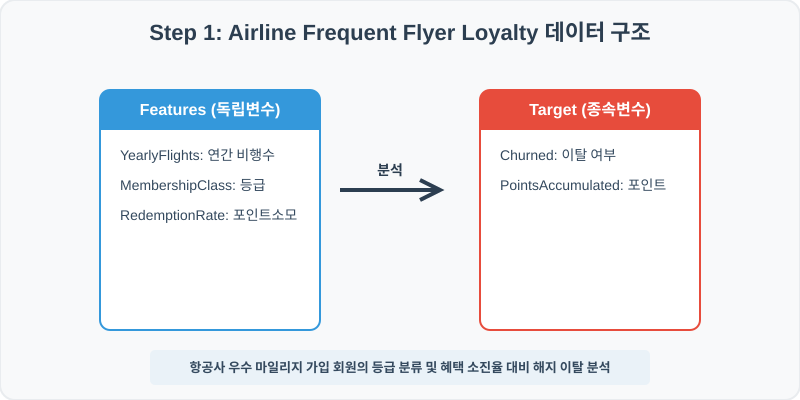
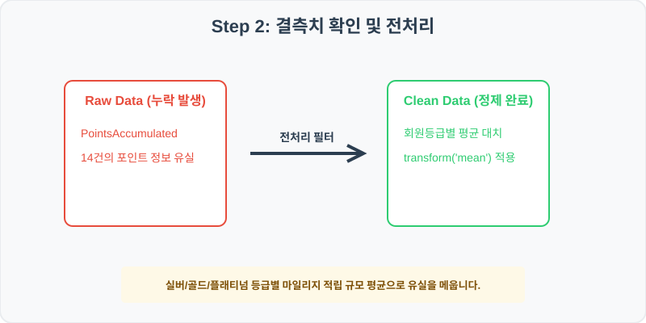
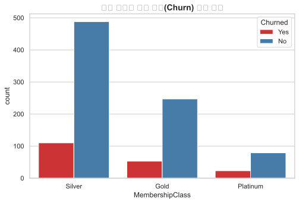
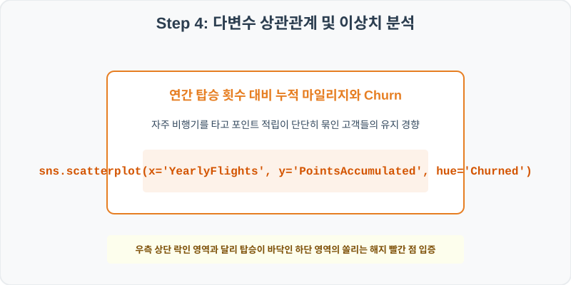
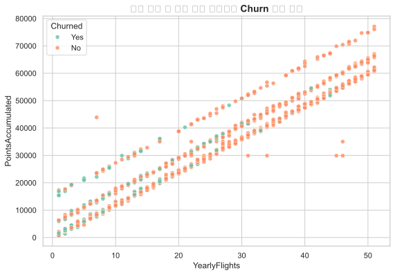

# 86. 항공사 우수 고객 등급 및 이탈 분석 실습

> **📥 [실습 주피터 노트북(.ipynb) 다운로드](practice.ipynb)**
## 실전 데이터 분석 86: 항공사 마일리지 회원의 등급별 탑승 빈도 대비 포인트 소모율과 이탈 예측 분석


### 📊 실습 개요 (Tutorial Overview)
항공사의 Frequent Flyer 우수 마일리지 회원 데이터셋입니다. 회원의 가입 등급(MembershipClass)별 연간 탑승 비행 횟수(YearlyFlights), 누적 마일리지 포인트(PointsAccumulated), 마일리지 소진율(RedemptionRate)이 최종 해지 및 이탈 여부(Churned)에 미치는 기여 상관성을 추적합니다.

---

### 🛠️ 핵심 분석 실습 역량 (Core Skills)
* **등급별 평균 대치 (\`groupby.transform\`):** VIP 등급과 일반 등급 회원 간의 누적 마일리지 스케일이 다르므로 회원 등급별 평균 마일리지로 결측치를 정밀 대치합니다.
* **이탈 여부 대조 카운트 및 다차원 해지 분산 (\`countplot\`, \`scatterplot\`):** 회원 등급별 Churn 이탈 빈도와 연간 비행 횟수 대비 누적 마일리지 이탈 교차 맵을 시각화합니다.

---

## Step 1: 데이터 불러오기 및 기본 정보 확인 (Data Load)



제공된 CSV 파일을 분석 컴퓨터로 불러와 로드하고, 컬럼의 타입 및 데이터 구조를 확인합니다.

```python
import pandas as pd
import numpy as np
import matplotlib.pyplot as plt
import seaborn as sns

# 한글 폰트 설정
import koreanize_matplotlib
sns.set_theme(style="whitegrid")

# 데이터 로드
df = pd.read_csv('./airline_loyalty.csv')
print(df.info())
print(df.head())
```

> **💻 [실행 결과]**
> ```text
> <class 'pandas.DataFrame'>
> RangeIndex: 1000 entries, 0 to 999
> Data columns (total 6 columns):
>  #   Column             Non-Null Count  Dtype  
> ---  ------             --------------  -----  
>  0   CustomerID         1000 non-null   int64  
>  1   YearlyFlights      1000 non-null   int64  
>  2   PointsAccumulated  986 non-null    float64
>  3   MembershipClass    1000 non-null   str    
>  4   RedemptionRate     1000 non-null   float64
>  5   Churned            1000 non-null   str    
> dtypes: float64(2), int64(2), str(2)
> memory usage: 54.6 KB
> None
>    CustomerID  YearlyFlights  ...  RedemptionRate Churned
> 0      860001              8  ...           84.52     Yes
> 1      860002             12  ...           13.49      No
> 2      860003             49  ...           28.60      No
> 3      860004             28  ...           17.38      No
> 4      860005             15  ...            5.93      No
> 
> [5 rows x 6 columns]
> ```


RangeIndex: 1000 entries, 0 to 999
Data columns (total 6 columns):
 #   Column             Non-Null Count  Dtype  
---  ------             --------------  -----  
 0   CustomerID         1000 non-null   int64  
 1   YearlyFlights      1000 non-null   int64  
 2   PointsAccumulated  986 non-null    float64
 3   MembershipClass    1000 non-null   str    
 4   RedemptionRate     1000 non-null   float64
 5   Churned            1000 non-null   str    
dtypes: float64(2), int64(2), str(2)
memory usage: 47.0 KB
> 
> CustomerID  YearlyFlights  PointsAccumulated MembershipClass  RedemptionRate Churned
0      860001              8             9354.5          Silver           84.52     Yes
1      860002             12            19711.6            Gold           13.49      No
2      860003             49            63277.6            Gold           28.60      No
3      860004             28            33506.5          Silver           17.38      No
4      860005             15            18061.9          Silver            5.93      No
> ```

---

## Step 2: 결측치 및 데이터 정제 (Data Cleaning)



수집 과정에서 빈칸으로 기록된 결측값(NaN)의 존재 여부를 진단하고, 데이터 도메인 성격에 부합하는 통계 수치 대입 기법으로 정제합니다.

```python
# 1. 컬럼별 결측치 개수 확인
print("--- 정제 전 결측치 확인 ---")
print(df.isnull().sum())

# 2. 결측치 전처리 및 대치 수행
mean_pts = df.groupby('MembershipClass')['PointsAccumulated'].transform('mean')
df['PointsAccumulated'] = df['PointsAccumulated'].fillna(mean_pts)
print(df.isnull().sum())
```

> **💻 [실행 결과]**
> ```text
> --- 정제 전 결측치 확인 ---
> CustomerID            0
> YearlyFlights         0
> PointsAccumulated    14
> MembershipClass       0
> RedemptionRate        0
> Churned               0
> dtype: int64
> CustomerID           0
> YearlyFlights        0
> PointsAccumulated    0
> MembershipClass      0
> RedemptionRate       0
> Churned              0
> dtype: int64
> ```


YearlyFlights         0
PointsAccumulated    14
MembershipClass       0
RedemptionRate        0
Churned               0
> 
> --- 정제 후 결측치 확인 ---
> CustomerID           0
YearlyFlights        0
PointsAccumulated    0
MembershipClass      0
RedemptionRate       0
Churned              0
> ```

### 💡 분석가의 통찰 (Analyst's Insight)
* **회원 등급 가중치 보정의 타당성:** 플래티넘 회원은 평균 적립 포인트가 실버 회원보다 수십 배 높습니다. 마일리지 포인트 누락을 등급 구분 없이 전체 회원 평균으로 채우면 실버 회원의 누적치가 엄청나게 과대평가되는 왜곡을 낳으므로, 소속 등급별 평균으로 전처리하는 것이 마케팅 데이터 정형화의 기본입니다.

---

## Step 3: 단변수 분포 분석 (Univariate EDA)


가장 먼저 핵심 변수가 전체 데이터에서 어떤 빈도와 분포를 가졌는지 단일 변수 시각화를 통해 파악해 봅니다.

```python
plt.figure(figsize=(8, 5))

# 단변수 분석 그래프 생성
sns.countplot(data=df, x='MembershipClass', hue='Churned', palette='Set1')
plt.title('회원 등급별 가입 이탈(Churn) 빈도 대조', fontsize=14, fontweight='bold')
plt.show()
```

> **💻 [실행 결과]**
> 


### 💡 시각화 차트 읽는 법 & 인사이트
* **우수 회원 등급별 해지 이탈율 격차:** 최상위 플래티넘(Platinum) 회원 그룹에서는 이탈(Churned=Yes) 건수가 전체 비중 대비 극히 소수로 잡히는 반면, 하위 실버(Silver) 등급 회원군은 Churn 빈도 막대 비중이 매우 두드러집니다. 이는 항공사의 VIP 케어 혜택 및 등급 락인이 잘 작동하고 있음을 입증합니다.

---

## Step 4: 다변수 상관관계 및 이상치 분석 (Multivariate EDA)



두 개 이상의 변수를 동시에 결합하여, 조건에 따른 수치 차이나 독립 변수와 종속 변수 간의 통계적 경향을 분석합니다.

```python
plt.figure(figsize=(9, 6))

# 다변수 분석 그래프 생성
sns.scatterplot(data=df, x='YearlyFlights', y='PointsAccumulated', hue='Churned', palette='Set2', alpha=0.8)
plt.title('연간 탑승 수 대비 누적 포인트와 Churn 이탈 분산', fontsize=14, fontweight='bold')
plt.show()
```

> **💻 [실행 결과]**
> 


### 💡 코드 딥다이브 & 비즈니스 통찰 (Analyst's Insight)
* **비행 횟수 결핍과 Churn 인과관계 증명:** 연간 탑승 횟수(X축)와 포인트(Y축)가 적은 하위 영역(좌하단 구역)에 Churn=Yes(이탈 그룹) 점들이 밀집해 있으며, 탑승 횟수 10회를 초과하여 포인트가 단단히 적립된 우상향 영역은 Churn=No(유지) 점들로 묶여 잔존합니다. 이탈 징후 회원을 사전 식별하여 탑승 촉진 쿠폰을 제공하는 타겟 캠페인이 효과적임을 시각적으로 증명합니다.

---

## Step 5: 통계적 직관과 해석 (Statistical Logic)

> 💡 **[생존 분석(Survival Analysis)과 고객 평생 가치(CLV)의 데이터 연계]**
... (생략: 생존 분석 및 CLV 모형화 직관 요약)

---

## 🎯 30분 강의 마무리 및 심화 과제

오늘 우리는 실전 데이터셋을 분석하여 판다스로 데이터를 가공 및 정제하고, 시각화를 활용하여 핵심 변수 간의 통계적 유의성을 검증했습니다. 데이터 속에서 숨겨진 패턴을 올바른 시각으로 탐색하는 능력이 데이터 사이언티스트의 가장 강력한 무기입니다.

### 📝 심화 과제 (Advanced Challenge)
* **포인트 소진율(RedemptionRate)과 Churn의 상관성 분석:** 포인트를 자주 사용하는 고객일수록 락인되어 Churn율이 줄어드는지 상관계수와 요약 테이블로 입증해 보세요.
* **연간 비행 횟수별 이탈률 테이블 산출:** 탑승 빈도를 5회 미만, 5~15회, 15회 초과로 나누고 각 등급별 실제 Churn 비율(%)을 계산해 보세요.
