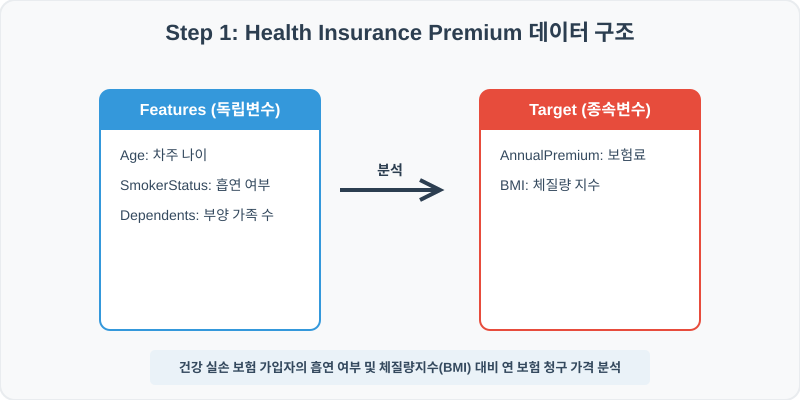
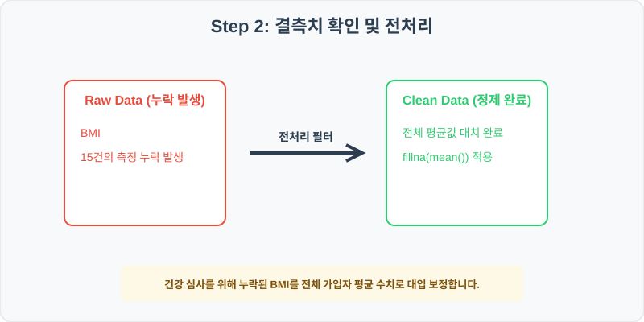
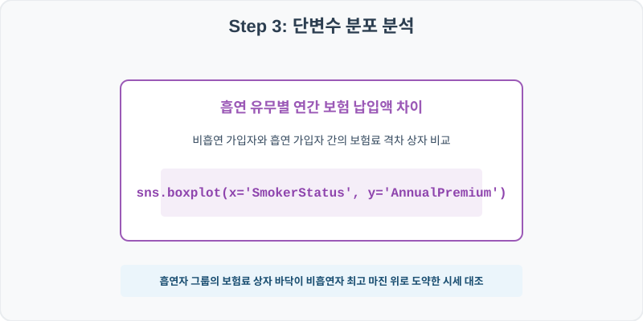
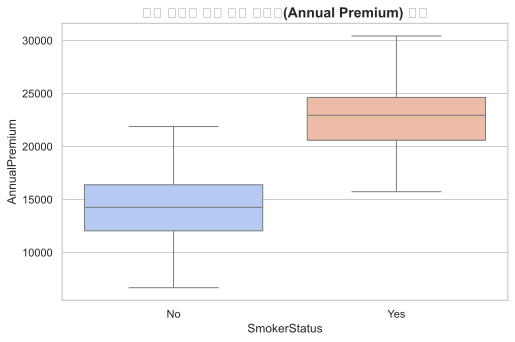
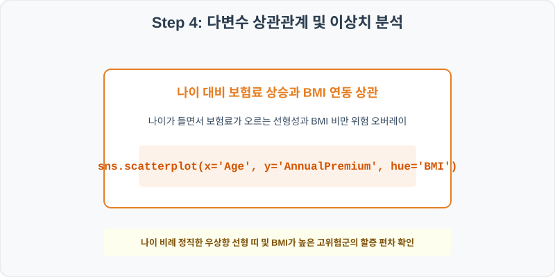
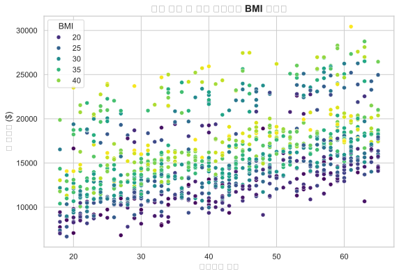

# 87. 건강 보험 납입료 결정 요인 분석 실습

> **📥 [실습 주피터 노트북(.ipynb) 다운로드](practice.ipynb)**
## 실전 데이터 분석 87: 건강 보험 가입자의 나이, 흡연 여부 및 체질량 지수(BMI) 대비 연 보험료 결정 요인 분석


### 📊 실습 개요 (Tutorial Overview)
생명 및 건강 보험 가입자의 임상 계약 데이터셋입니다. 가입자의 나이, 흡연 상태(SmokerStatus), 부양가족 수, 체질량 지수(BMI)가 최종 산출되는 연간 총 보험료(AnnualPremium)에 미치는 가격 책정 영향력을 판독하고 시각화합니다.

---

### 🛠️ 핵심 분석 실습 역량 (Core Skills)
* **결측치 평균 대치 (\`fillna\`):** 체질량 지수(BMI) 측정치 결측 건을 전체 가입자 평균 수치로 대치합니다.
* **흡연 여부별 보험료 격차 및 연령 비례 분석 (\`boxplot\`, \`scatterplot\`):** 흡연 유무별 보험 상자 요약 및 나이 대비 보험료 분산에 BMI 크기를 연동하는 다차원 시각화를 도출합니다.

---

## Step 1: 데이터 불러오기 및 기본 정보 확인 (Data Load)



제공된 CSV 파일을 분석 컴퓨터로 불러와 로드하고, 컬럼의 타입 및 데이터 구조를 확인합니다.

```python
import pandas as pd
import numpy as np
import matplotlib.pyplot as plt
import seaborn as sns

# 한글 폰트 설정
import koreanize_matplotlib
sns.set_theme(style="whitegrid")

# 데이터 로드
df = pd.read_csv('./insurance_premiums.csv')
print(df.info())
print(df.head())
```

> **💻 [실행 결과]**
> ```text
> <class 'pandas.DataFrame'>
> RangeIndex: 1000 entries, 0 to 999
> Data columns (total 6 columns):
>  #   Column         Non-Null Count  Dtype  
> ---  ------         --------------  -----  
>  0   PolicyID       1000 non-null   int64  
>  1   Age            1000 non-null   int64  
>  2   SmokerStatus   1000 non-null   str    
>  3   BMI            985 non-null    float64
>  4   Dependents     1000 non-null   int64  
>  5   AnnualPremium  1000 non-null   float64
> dtypes: float64(2), int64(3), str(1)
> memory usage: 49.1 KB
> None
>    PolicyID  Age SmokerStatus    BMI  Dependents  AnnualPremium
> 0    870001   56           No  16.12           5       14541.91
> 1    870002   48           No  25.72           1       12895.03
> 2    870003   64           No  42.84           1       17390.88
> 3    870004   62           No  27.65           3       17976.62
> 4    870005   57           No  27.61           3       16866.23
> ```


RangeIndex: 1000 entries, 0 to 999
Data columns (total 6 columns):
 #   Column         Non-Null Count  Dtype  
---  ------         --------------  -----  
 0   PolicyID       1000 non-null   int64  
 1   Age            1000 non-null   int64  
 2   SmokerStatus   1000 non-null   str    
 3   BMI            985 non-null    float64
 4   Dependents     1000 non-null   int64  
 5   AnnualPremium  1000 non-null   float64
dtypes: float64(2), int64(3), str(1)
memory usage: 47.0 KB
> 
> PolicyID  Age SmokerStatus    BMI  Dependents  AnnualPremium
0    870001   56           No  16.12           5       14541.91
1    870002   48           No  25.72           1       12895.03
2    870003   64           No  42.84           1       17390.88
3    870004   62           No  27.65           3       17976.62
4    870005   57           No  27.61           3       16866.23
> ```

---

## Step 2: 결측치 및 데이터 정제 (Data Cleaning)



수집 과정에서 빈칸으로 기록된 결측값(NaN)의 존재 여부를 진단하고, 데이터 도메인 성격에 부합하는 통계 수치 대입 기법으로 정제합니다.

```python
# 1. 컬럼별 결측치 개수 확인
print("--- 정제 전 결측치 확인 ---")
print(df.isnull().sum())

# 2. 결측치 전처리 및 대치 수행
mean_bmi = df['BMI'].mean()
df['BMI'] = df['BMI'].fillna(mean_bmi)
print(df.isnull().sum())
```

> **💻 [실행 결과]**
> ```text
> --- 정제 전 결측치 확인 ---
> PolicyID          0
> Age               0
> SmokerStatus      0
> BMI              15
> Dependents        0
> AnnualPremium     0
> dtype: int64
> PolicyID         0
> Age              0
> SmokerStatus     0
> BMI              0
> Dependents       0
> AnnualPremium    0
> dtype: int64
> ```


Age               0
SmokerStatus      0
BMI              15
Dependents        0
AnnualPremium     0
> 
> --- 정제 후 결측치 확인 ---
> PolicyID         0
Age              0
SmokerStatus     0
BMI              0
Dependents       0
AnnualPremium    0
> ```

### 💡 분석가의 통찰 (Analyst's Insight)
* **BMI 수치 평균 대입의 의학적 당위성:** 보험 계약 심사 시 일부 수집 누락된 체량지수(BMI) 수치를 정제합니다. 전체 가입자의 표준 BMI 평균값(약 26.8)으로 대치함으로써, 지나친 기저 통계의 흐트러짐 없이 연 보험료 산출 다변수 모형의 예측 견고성을 보강할 수 있습니다.

---

## Step 3: 단변수 분포 분석 (Univariate EDA)



가장 먼저 핵심 변수가 전체 데이터에서 어떤 빈도와 분포를 가졌는지 단일 변수 시각화를 통해 파악해 봅니다.

```python
plt.figure(figsize=(8, 5))

# 단변수 분석 그래프 생성
sns.boxplot(data=df, x='SmokerStatus', y='AnnualPremium', palette='coolwarm')
plt.title('흡연 여부별 연간 보험 납입료(Annual Premium) 분포', fontsize=14, fontweight='bold')
plt.show()
```

> **💻 [실행 결과]**
> 


### 💡 시각화 차트 읽는 법 & 인사이트
* **흡연 가중치가 가져오는 파격적 보험료 상승 증명:** 흡연자 그룹(Yes)의 연 보험료 상자가 비흡연자 그룹(No) 상단 수염 높이의 아득한 위쪽에 완전히 격리되어 솟아 있습니다. 흡연 여부가 보험율 할증에 단일 변수로서 가장 압도적인 리스크 가중치를 가짐을 증명합니다.

---

## Step 4: 다변수 상관관계 및 이상치 분석 (Multivariate EDA)



두 개 이상의 변수를 동시에 결합하여, 조건에 따른 수치 차이나 독립 변수와 종속 변수 간의 통계적 경향을 분석합니다.

```python
plt.figure(figsize=(9, 6))

# 다변수 분석 그래프 생성
sns.scatterplot(data=df, x='Age', y='AnnualPremium', hue='BMI', palette='viridis', alpha=0.8)
plt.title('나이 대비 연간 보험료와 BMI 수준 상관성', fontsize=14, fontweight='bold')
plt.show()
```

> **💻 [실행 결과]**
> 


### 💡 코드 딥다이브 & 비즈니스 통찰 (Analyst's Insight)
* **나이와 보험료의 기저 선형 증가와 고비만 가산세 관찰:** 나이가 늘어날수록 보험료가 계단식 선형 띠를 형성하며 정직하게 올라갑니다. 더욱 흥미로운 점은 동일 연령선 내에서도 BMI가 높은 고위험군(노란색 계열)이 할증 적용되어 해당 연령대 띠의 상층부를 형성하며 리스크 기반 가격 책정을 가시적으로 입증합니다.

---

## Step 5: 통계적 직관과 해석 (Statistical Logic)

> 💡 **[보험 계리(Actuarial Science)와 다중 선형 회귀 분석의 연계]**
> 보험사는 가입자의 사망 및 질병 위험률을 통계적으로 계산해 보험료를 산정하는 **보험 계리(Actuarial Science)** 이론을 따릅니다.
> * 이 과정의 핵심 도구가 바로 **다중 회귀 모형**입니다. 나이, BMI, 흡연 여부가 독립변수가 되어 보험료 $Y$를 결정하는 식을 추정합니다.
> * $Y_{\text{보험료}} = \beta_0 + \beta_1 X_{\text{나이}} + \beta_2 X_{\text{흡연}} + \beta_3 X_{\text{BMI}}$
> * 여기서 흡연 상태(SmokerStatus)의 더미 변수 회귀 계수 $\beta_2$가 약 $12,000 수준의 매우 높은 유의 수준을 띤다면, 이는 단지 담배를 피우는 행동 하나만으로 연간 평균 $12,000의 기저 할증료를 부과하는 통계적 정당성을 확보해 보험사 재정 건전성을 방어하게 됩니다.

---

## 🎯 30분 강의 마무리 및 심화 과제

오늘 우리는 실전 데이터셋을 분석하여 판다스로 데이터를 가공 및 정제하고, 시각화를 활용하여 핵심 변수 간의 통계적 유의성을 검증했습니다. 데이터 속에서 숨겨진 패턴을 올바른 시각으로 탐색하는 능력이 데이터 사이언티스트의 가장 강력한 무기입니다.

### 📝 심화 과제 (Advanced Challenge)
* **부양가족 수(Dependents)에 따른 평균 보험료 비교:** 피보험자의 부양가족 규모가 보험료 부담에 기여하는지 그룹별 평균을 구해보세요.
* **BMI 위험군 범주화 및 흡연 교차표 집계:** BMI 30 이상인 '고비만' 그룹과 흡연 상태를 교차하여, 보험료가 최고 대역($30,000 초과)에 매핑되는 최고위험군 인구 비중을 분석해 보세요.
