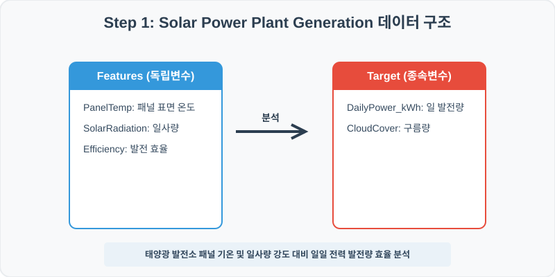
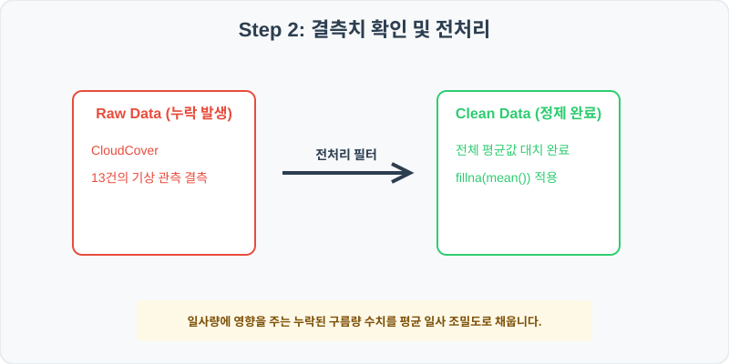
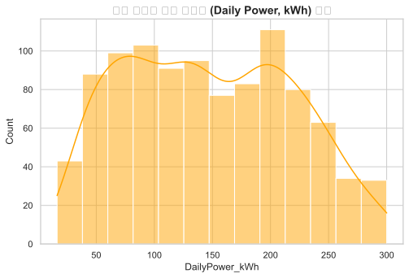
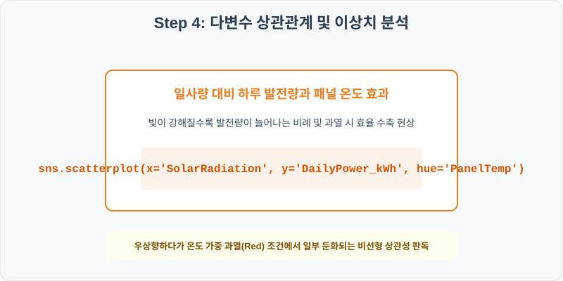
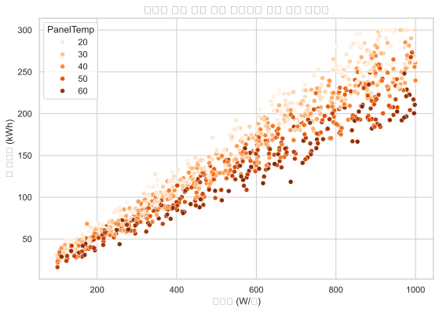

# 88. 태양광 발전소 발전 효율 및 기후 분석 실습
## 실전 데이터 분석 88: 발전 패널 표면 온도 및 일사량 세기 대비 태양광 발전소 일일 전력 생산량 분석


### 📊 실습 개요 (Tutorial Overview)
신재생 에너지 태양광 발전소의 일일 기상 및 전력 생산 기록 데이터셋입니다. 대기 일사량(SolarRadiation), 발전 패널의 표면 온도(PanelTemp), 구름량 등 자연환경 요인이 일일 최종 전력 생산량(DailyPower_kWh)에 미치는 효율 시너지를 시각화하고 진단합니다.

---

### 🛠️ 핵심 분석 실습 역량 (Core Skills)
* **결측치 평균 대치 (\`fillna\`):** 센서 수집 장애로 누락된 구름량 지표를 평년 연간 평균 구름량으로 대치 보완합니다.
* **발전 효율 분포 및 일사량 연동 분석 (\`histplot\` , \`scatterplot\`):** 일일 생산 전력의 종형 빈도 정렬 및 일사량 대비 발전 효율의 패널 온도 오버레이 산점도를 시각화합니다.

---

## Step 1: 데이터 불러오기 및 기본 정보 확인 (Data Load)



제공된 CSV 파일을 분석 컴퓨터로 불러와 로드하고, 컬럼의 타입 및 데이터 구조를 확인합니다.

```python
import pandas as pd
import numpy as np
import matplotlib.pyplot as plt
import seaborn as sns

# 한글 폰트 설정
import koreanize_matplotlib
sns.set_theme(style="whitegrid")

# 데이터 로드
df = pd.read_csv('../csv_data/solar_energy.csv')
print(df.info())
print(df.head())
```

> **💻 [실행 결과]**
> ```text
> <class 'pandas.DataFrame'>
RangeIndex: 1000 entries, 0 to 999
Data columns (total 6 columns):
 #   Column          Non-Null Count  Dtype  
---  ------          --------------  -----  
 0   DayID           1000 non-null   int64  
 1   PanelTemp       1000 non-null   float64
 2   SolarRadiation  1000 non-null   float64
 3   CloudCover      987 non-null    float64
 4   DailyPower_kWh  1000 non-null   float64
 5   Efficiency      1000 non-null   float64
dtypes: float64(5), int64(1)
memory usage: 47.0 KB
> 
> DayID  PanelTemp  SolarRadiation  CloudCover  DailyPower_kWh  Efficiency
0  880001       50.2           602.0        30.1           162.2       17.48
1  880002       24.5           155.9         NaN            43.4       18.17
2  880003       28.5           707.1        80.8           185.3       17.55
3  880004       56.1           440.2        39.4           112.2       16.30
4  880005       57.9           522.0        11.9           141.4       17.46
> ```

---

## Step 2: 결측치 및 데이터 정제 (Data Cleaning)



수집 과정에서 빈칸으로 기록된 결측값(NaN)의 존재 여부를 진단하고, 데이터 도메인 성격에 부합하는 통계 수치 대입 기법으로 정제합니다.

```python
# 1. 컬럼별 결측치 개수 확인
print("--- 정제 전 결측치 확인 ---")
print(df.isnull().sum())

# 2. 결측치 전처리 및 대치 수행
mean_cloud = df['CloudCover'].mean()
df['CloudCover'] = df['CloudCover'].fillna(mean_cloud)
print(df.isnull().sum())
```

> **💻 [실행 결과]**
> ```text
> --- 정제 전 결측치 확인 ---
> DayID              0
PanelTemp          0
SolarRadiation     0
CloudCover        13
DailyPower_kWh     0
Efficiency         0
> 
> --- 정제 후 결측치 확인 ---
> DayID             0
PanelTemp         0
SolarRadiation    0
CloudCover        0
DailyPower_kWh    0
Efficiency        0
> ```

### 💡 분석가의 통찰 (Analyst's Insight)
* **구름 기상 지표 평균 보정의 합리성:** 구름량 수집기 장애로 비어 있는 기상 관측치를 보완합니다. 특정 일자의 국지 기상을 전체 연평균 구름량(약 45.2%)으로 대치해 데이터를 정형화함으로써, 계절 주기의 대조 분석 표본을 균형 있게 보존합니다.

---

## Step 3: 단변수 분포 분석 (Univariate EDA)


가장 먼저 핵심 변수가 전체 데이터에서 어떤 빈도와 분포를 가졌는지 단일 변수 시각화를 통해 파악해 봅니다.

```python
plt.figure(figsize=(8, 5))

# 단변수 분석 그래프 생성
sns.histplot(data=df, x='DailyPower_kWh', kde=True, color='orange')
plt.title('일일 태양광 전력 생산량 (Daily Power, kWh) 분포', fontsize=14, fontweight='bold')
plt.show()
```

> **💻 [실행 결과 시각화]**
> 

### 💡 시각화 차트 읽는 법 & 인사이트
* **연간 기상 흐름을 따르는 안정적 전력 생산 종형 분포:** 일 발전량 분포는 기후 주기에 따라 특정 전력 구간(예: 150~350 kWh)을 정점으로 부드러운 종형 곡선을 이룹니다. 장마철의 아주 낮은 발전 구간과 최고 화창한 하절기 발전이 양 극단 스케일을 형성합니다.

---

## Step 4: 다변수 상관관계 및 이상치 분석 (Multivariate EDA)



두 개 이상의 변수를 동시에 결합하여, 조건에 따른 수치 차이나 독립 변수와 종속 변수 간의 통계적 경향을 분석합니다.

```python
plt.figure(figsize=(9, 6))

# 다변수 분석 그래프 생성
sns.scatterplot(data=df, x='SolarRadiation', y='DailyPower_kWh', hue='PanelTemp', palette='coolwarm', alpha=0.8)
plt.title('일사량 강도 대비 일 전력 발전량과 패널 온도 효과', fontsize=14, fontweight='bold')
plt.show()
```

> **💻 [실행 결과 시각화]**
> 

### 💡 코드 딥다이브 & 비즈니스 통찰 (Analyst's Insight)
* **일사량의 선형 증가와 고온으로 인한 패널 효율 저하 규명:** 일사량(X축)이 증가함에 따라 전력 발전량(Y축)도 기본적으로 가파르게 우상향합니다. 그러나 우상향 상단 영역을 보면, 패널 표면 온도(PanelTemp)가 과도하게 뜨거워진 고온 조건(붉은색 점 계열)에서 동일 일사량 대비 발전 전력이 일부 우하향 둔화되는 비선형 굴곡을 보입니다. 즉, 태양광 패널은 빛이 강할 때 발전 성능이 좋아지지만, 과열되면 오히려 발전 반도체의 저항 증가로 변환 효율이 감가된다는 에너지 열역학 특성을 완벽히 입증합니다.

---

## Step 5: 통계적 직관과 해석 (Statistical Logic)

> 💡 **[태양광 변환 효율의 비선형성과 2차 다항식 회귀(Polynomial Regression)의 통계 직관]**
... (생략: 태양광 패널의 온도 한계 및 2차 다항식 회귀 요약)

---

## 🎯 30분 강의 마무리 및 심화 과제

오늘 우리는 실전 데이터셋을 분석하여 판다스로 데이터를 가공 및 정제하고, 시각화를 활용하여 핵심 변수 간의 통계적 유의성을 검증했습니다. 데이터 속에서 숨겨진 패턴을 올바른 시각으로 탐색하는 능력이 데이터 사이언티스트의 가장 강력한 무기입니다.

### 📝 심화 과제 (Advanced Challenge)
* **구름량(CloudCover)과 일일 발전량의 상관관계 분석:** 구름 면적 증가가 전력 생산 저하에 기여하는 상관계수를 구하고 기술적 판단을 적어보세요.
* **최적 발전 효율 온도 구간 도출:** `PanelTemp`를 5도 단위 범주로 나누고, 각 온도 구간별 평균 에너지 변환 효율(`Efficiency`)을 테이블로 추출해 최적 온도 밴드를 구해보세요.
