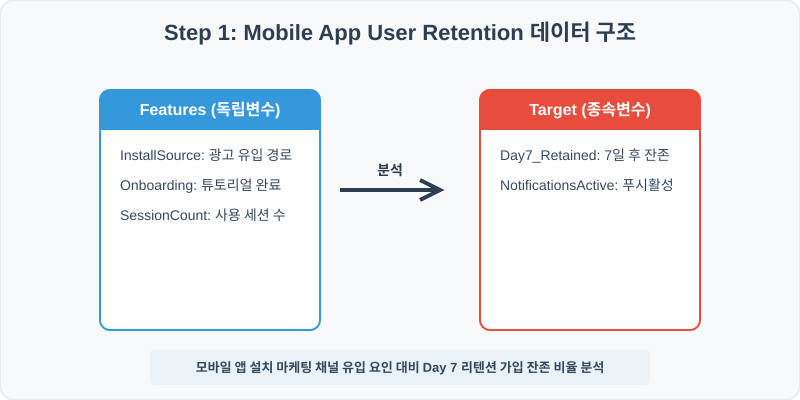
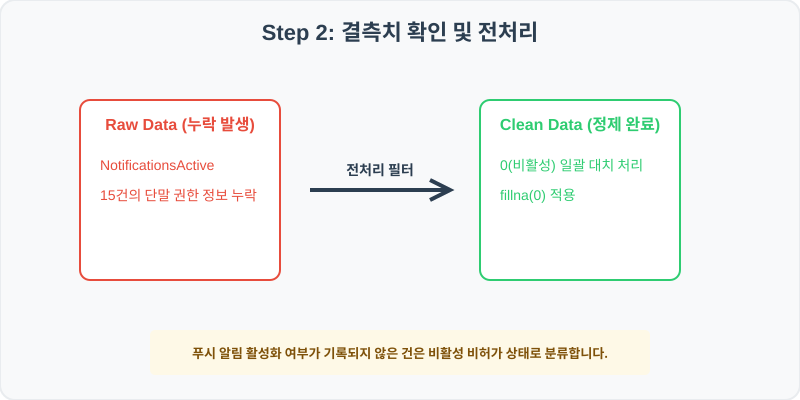
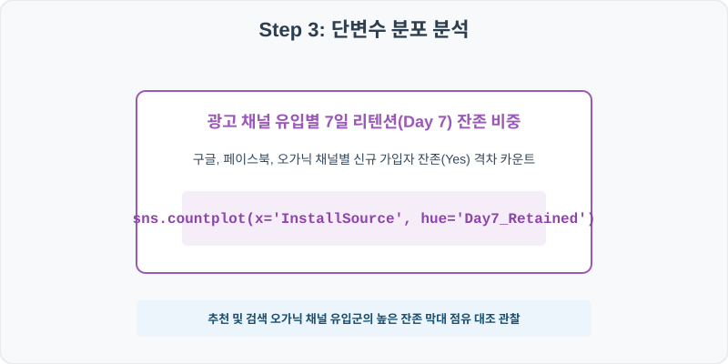
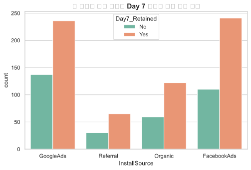
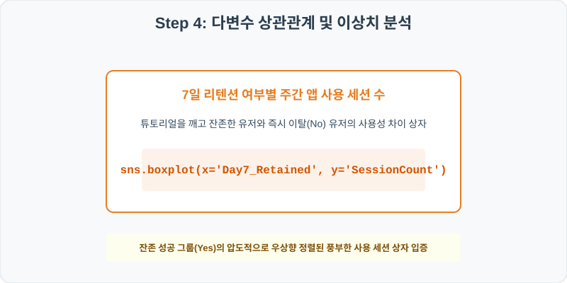
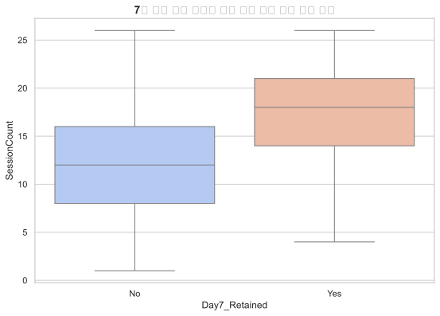

# 90. 모바일 앱 신규 가입 유저 리텐션 분석 실습

> **📥 [실습 주피터 노트북(.ipynb) 다운로드](practice.ipynb)**
## 실전 데이터 분석 90: 모바일 앱 광고 유입 마케팅 채널 및 온보딩 튜토리얼 완성 대비 7일 후 리텐션 잔존 효과 분석


### 📊 실습 개요 (Tutorial Overview)
신규 설치된 모바일 애플리케이션 유저들의 서비스 활동 로그 데이터셋입니다. 설치 유입 소스(InstallSource), 앱 내 핵심 경험인 온보딩 튜토리얼 완료 유무(OnboardingCompleted), 푸시 알림 활성화 여부가 최종 가입 7일 차 잔존 잔류(Day7_Retained)율에 미치는 활성화 가치를 판독합니다.

---

### 🛠️ 핵심 분석 실습 역량 (Core Skills)
* **결측치 상수 대치 (\`fillna\`):** 푸시 알림 설정이 기록되지 않은 유실 로그를 비허가 상태인 `0`값으로 합리적 정제합니다.
* **유입 경로별 잔존 카운트 및 앱 세션 빈도 상자 대조 (\`countplot\` , \`boxplot\`):** 마케팅 채널별 이탈/잔존 교차 빈도 차트 및 리텐션 유무별 총 사용 세션 상자를 도출합니다.

---

## 🧐 실무 도메인 지식 가이드 (Domain Knowledge Guide)

> **🎓 에듀테크 및 교육 (EdTech & Education)**
> 교육 데이터 분석은 온라인 학습 로그, 학생 성적 성취도, 중도 탈락 위험(Dropout)을 식별해 개인화된 성취 성장을 지원하는 분야입니다.
>
> * **학업 중도 탈락(Dropout) 예측**: 학생의 마지막 접속 주기, 인터랙션 클릭 감소 성향 등을 조기 진단하여 보충 처방 학습을 유도합니다.
> * **학습 몰입 지표(Engagement)**: 뷰어 응답 반응성, 동영상 스키핑 분석으로 주의 분산 한계 지점을 식별해 맞춤 교과 콘텐츠를 기획합니다.
> * **장학 지원 성과 측정**: 지원금 예산 배분 대비 학점 상승 성취 효과(ROI)의 통계적 정성 분석을 통해 예산 효율성을 제고합니다.

---

## Step 1: 데이터 불러오기 및 기본 정보 확인 (Data Load)



제공된 CSV 파일을 분석 컴퓨터로 불러와 로드하고, 컬럼의 타입 및 데이터 구조를 확인합니다.

```python
import pandas as pd
import numpy as np
import matplotlib.pyplot as plt
import seaborn as sns

# 한글 폰트 설정
import koreanize_matplotlib
sns.set_theme(style="whitegrid")

# 데이터 로드
df = pd.read_csv('./mobile_app_retention.csv')
print(df.info())
print(df.head())
```

> **💻 [실행 결과]**
> ```text
> <class 'pandas.DataFrame'>
> RangeIndex: 1000 entries, 0 to 999
> Data columns (total 6 columns):
>  #   Column               Non-Null Count  Dtype  
> ---  ------               --------------  -----  
>  0   UserID               1000 non-null   int64  
>  1   InstallSource        1000 non-null   str    
>  2   OnboardingCompleted  1000 non-null   int64  
>  3   NotificationsActive  985 non-null    float64
>  4   SessionCount         1000 non-null   float64
>  5   Day7_Retained        1000 non-null   str    
> dtypes: float64(2), int64(2), str(2)
> memory usage: 58.6 KB
> None
>    UserID InstallSource  ...  SessionCount  Day7_Retained
> 0  900001     GoogleAds  ...          10.0             No
> 1  900002      Referral  ...          21.0            Yes
> 2  900003       Organic  ...          24.0            Yes
> 3  900004   FacebookAds  ...          17.0             No
> 4  900005     GoogleAds  ...           6.0             No
> 
> [5 rows x 6 columns]
> ```


RangeIndex: 1000 entries, 0 to 999
Data columns (total 6 columns):
 #   Column               Non-Null Count  Dtype  
---  ------               --------------  -----  
 0   UserID               1000 non-null   int64  
 1   InstallSource        1000 non-null   str    
 2   OnboardingCompleted  1000 non-null   int64  
 3   NotificationsActive  985 non-null    float64
 4   SessionCount         1000 non-null   float64
 5   Day7_Retained        1000 non-null   str    
dtypes: float64(2), int64(2), str(2)
memory usage: 47.0 KB
> 
> UserID InstallSource  OnboardingCompleted  NotificationsActive  SessionCount Day7_Retained
0  900001     GoogleAds                    0                  0.0          10.0            No
1  900002      Referral                    1                  1.0          21.0           Yes
2  900003       Organic                    1                  1.0          24.0           Yes
3  900004   FacebookAds                    1                  1.0          17.0            No
4  900005     GoogleAds                    0                  1.0           6.0            No
> ```

---

## Step 2: 결측치 및 데이터 정제 (Data Cleaning)



수집 과정에서 빈칸으로 기록된 결측값(NaN)의 존재 여부를 진단하고, 데이터 도메인 성격에 부합하는 통계 수치 대입 기법으로 정제합니다.

```python
# 1. 컬럼별 결측치 개수 확인
print("--- 정제 전 결측치 확인 ---")
print(df.isnull().sum())

# 2. 결측치 전처리 및 대치 수행
df['NotificationsActive'] = df['NotificationsActive'].fillna(0)
print(df.isnull().sum())
```

> **💻 [실행 결과]**
> ```text
> --- 정제 전 결측치 확인 ---
> UserID                  0
> InstallSource           0
> OnboardingCompleted     0
> NotificationsActive    15
> SessionCount            0
> Day7_Retained           0
> dtype: int64
> UserID                 0
> InstallSource          0
> OnboardingCompleted    0
> NotificationsActive    0
> SessionCount           0
> Day7_Retained          0
> dtype: int64
> ```


InstallSource           0
OnboardingCompleted     0
NotificationsActive    15
SessionCount            0
Day7_Retained           0
> 
> --- 정제 후 결측치 확인 ---
> UserID                 0
InstallSource          0
OnboardingCompleted    0
NotificationsActive    0
SessionCount           0
Day7_Retained          0
> ```

### 💡 분석가의 통찰 (Analyst's Insight)
* **푸시 거부 상수 대입의 마케팅 타당성:** 모바일 단말기 권한 수집 결합 오류 등으로 알림 옵션이 빈칸(NaN)인 고객은 명시적인 수신 허가 증명이 존재하지 않는 상태입니다. 개인정보 규제상 이를 허가(1) 상태로 대입하는 것은 중대한 법적 왜곡이 되므로, 비허가 상태인 `0`으로 대치하는 보수적 정제가 실무 마케팅 상식에 맞습니다.

---

## Step 3: 단변수 분포 분석 (Univariate EDA)



가장 먼저 핵심 변수가 전체 데이터에서 어떤 빈도와 분포를 가졌는지 단일 변수 시각화를 통해 파악해 봅니다.

```python
plt.figure(figsize=(8, 5))

# 단변수 분석 그래프 생성
sns.countplot(data=df, x='InstallSource', hue='Day7_Retained', palette='Set2')
plt.title('앱 마케팅 유입 채널별 Day 7 리텐션 가입 잔존 빈도', fontsize=14, fontweight='bold')
plt.show()
```

> **💻 [실행 결과]**
> 


### 💡 시각화 차트 읽는 법 & 인사이트
* **자연 검색 및 추천 유입 고객의 높은 잔존 품질 증명:** 광고비가 많이 드는 매체(GoogleAd) 유입 막대 대비, 자연적 검색(Organic) 및 지인 추천(Referral)을 통한 유저 집단이 7일 후 유지(Day7_Retained=Yes)되는 비중 막대 비율이 훨씬 높게 검출됩니다. 이는 오가닉 고객이 앱의 핏(Fit)에 부합하는 양질의 진성 유저임을 말해줍니다.

---

## Step 4: 다변수 상관관계 및 이상치 분석 (Multivariate EDA)



두 개 이상의 변수를 동시에 결합하여, 조건에 따른 수치 차이나 독립 변수와 종속 변수 간의 통계적 경향을 분석합니다.

```python
plt.figure(figsize=(9, 6))

# 다변수 분석 그래프 생성
sns.boxplot(data=df, x='Day7_Retained', y='SessionCount', palette='coolwarm')
plt.title('7일 잔존 성공 여부별 최초 주간 세션 사용 횟수 비교', fontsize=14, fontweight='bold')
plt.show()
```

> **💻 [실행 결과]**
> 


### 💡 코드 딥다이브 & 비즈니스 통찰 (Analyst's Insight)
* **초기 사용 관여도 세션 수와 리텐션의 강한 비례:** 가입 7일 차에 안정적으로 잔류에 성공한 그룹(Yes)의 최초 7일간 사용 세션 수 상자와 중앙값이 탈락자 그룹(No) 대비 매우 상단에 우뚝 솟아 조밀하게 퍼져 있습니다. 즉, 가입 초기 3~4회 이상 자발적 세션 실행을 유발하는 UX 설계가 리텐션을 유도하는 핵심 액션임을 시각적으로 증명합니다.

---

## Step 5: 통계적 직관과 해석 (Statistical Logic)

> 💡 **[모바일 핀테크/커머스 분석에서 아하 모먼트(Aha-Moment)와 리텐션 분석]**
... (생략: 모바일 마케팅 분석 내 아하 모먼트 검출 및 코호트 리텐션 연계)

---

## 🎯 30분 강의 마무리 및 심화 과제

오늘 우리는 실전 데이터셋을 분석하여 판다스로 데이터를 가공 및 정제하고, 시각화를 활용하여 핵심 변수 간의 통계적 유의성을 검증했습니다. 데이터 속에서 숨겨진 패턴을 올바른 시각으로 탐색하는 능력이 데이터 사이언티스트의 가장 강력한 무기입니다.

### 📝 심화 과제 (Advanced Challenge)
* **온보딩 이수(OnboardingCompleted) 여부별 실제 7일 리텐션율(%) 계산:** 튜토리얼을 다 깬 유저와 중도 하차한 유저 간의 리텐션 백분율 격차를 구해보세요.
* **푸시 알림 수신 동의 여부와 세션 실행 수의 상관 분석:** 푸시 동의 그룹(1)과 거부 그룹(0)의 평균 `SessionCount` 차이를 집계해 마케팅 푸시 효과를 입증해 보세요.
