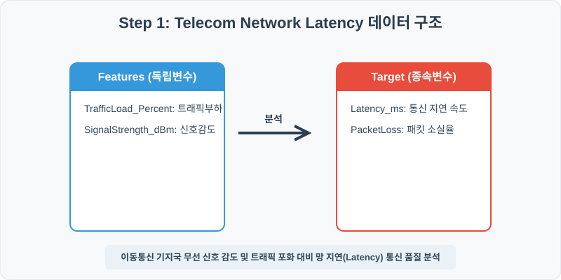
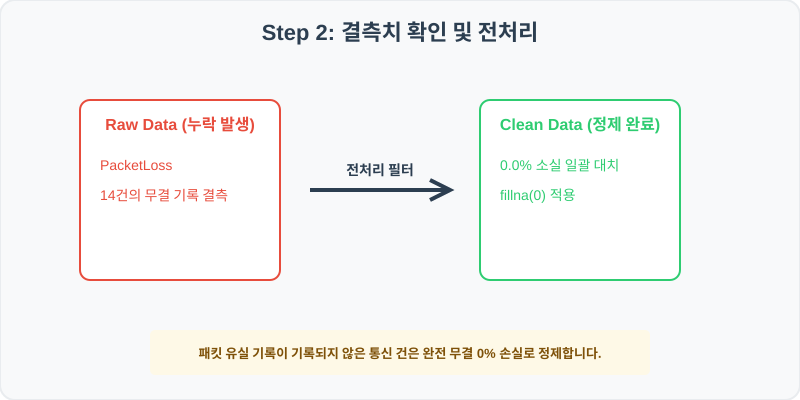
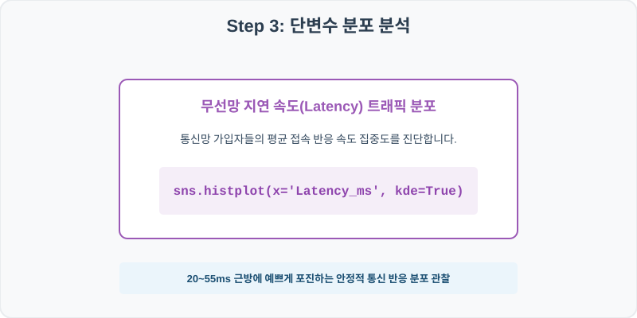
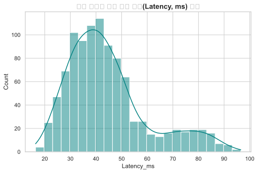
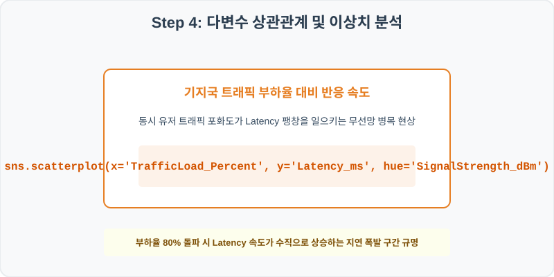
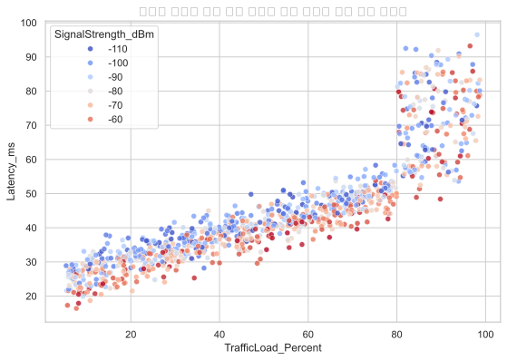

# 91. 이동통신 기지국 통신 품질 및 Latency 분석 실습
## 실전 데이터 분석 91: 기지국 트래픽 부하 및 신호 세기 감도 조건별 데이터 전송 지연 속도 및 패킷 손실 분석


### 📊 실습 개요 (Tutorial Overview)
이동통신 기지국 장비들의 무선망 통신 모니터링 로그 데이터셋입니다. 무선 커버리지 신호 세기 감도(SignalStrength_dBm), 기지국 동시 접속 트래픽 부하(TrafficLoad_Percent), 패킷 유실률이 최종 스마트폰 무선 전송 반응 지연 속도(Latency_ms)에 미치는 병목 현상을 진단합니다.

---

### 🛠️ 핵심 분석 실습 역량 (Core Skills)
* **결측치 상수 대치 (\`fillna\`):** 정상 송수신 상황에서 기록 생략되는 패킷 손실률 결측을 완전 무결 상태인 `0.0%`로 주입합니다.
* **통신 지연 분포 및 트래픽 부하 지연 상관 분석 (\`histplot\`, \`scatterplot\`):** 지연 속도 정규분포 관찰 및 트래픽 포화 대비 지연의 수신 신호 강도 감도 맵을 시각화합니다.

---

## Step 1: 데이터 불러오기 및 기본 정보 확인 (Data Load)



제공된 CSV 파일을 분석 컴퓨터로 불러와 로드하고, 컬럼의 타입 및 데이터 구조를 확인합니다.

```python
import pandas as pd
import numpy as np
import matplotlib.pyplot as plt
import seaborn as sns

# 한글 폰트 설정
import koreanize_matplotlib
sns.set_theme(style="whitegrid")

# 데이터 로드
df = pd.read_csv('../csv_data/telecom_network.csv')
print(df.info())
print(df.head())
```

> **💻 [실행 결과]**
> ```text
> <class 'pandas.DataFrame'>
RangeIndex: 1000 entries, 0 to 999
Data columns (total 5 columns):
 #   Column               Non-Null Count  Dtype  
---  ------               --------------  -----  
 0   TowerID              1000 non-null   int64  
 1   TrafficLoad_Percent  1000 non-null   float64
 2   PacketLoss           986 non-null    float64
 3   SignalStrength_dBm   1000 non-null   int64  
 4   Latency_ms           1000 non-null   float64
dtypes: float64(3), int64(2)
memory usage: 39.2 KB
> 
> TowerID  TrafficLoad_Percent  PacketLoss  SignalStrength_dBm  Latency_ms
0   910001                 63.4        0.00                 -75        41.1
1   910002                 85.4        1.10                 -80        59.6
2   910003                 93.2        3.93                 -58        83.0
3   910004                 11.3        0.00                -102        30.9
4   910005                 12.9        0.00                -109        32.3
> ```

---

## Step 2: 결측치 및 데이터 정제 (Data Cleaning)



수집 과정에서 빈칸으로 기록된 결측값(NaN)의 존재 여부를 진단하고, 데이터 도메인 성격에 부합하는 통계 수치 대입 기법으로 정제합니다.

```python
# 1. 컬럼별 결측치 개수 확인
print("--- 정제 전 결측치 확인 ---")
print(df.isnull().sum())

# 2. 결측치 전처리 및 대치 수행
df['PacketLoss'] = df['PacketLoss'].fillna(0.0)
print(df.isnull().sum())
```

> **💻 [실행 결과]**
> ```text
> --- 정제 전 결측치 확인 ---
> TowerID                 0
TrafficLoad_Percent     0
PacketLoss             14
SignalStrength_dBm      0
Latency_ms              0
> 
> --- 정제 후 결측치 확인 ---
> TowerID                0
TrafficLoad_Percent    0
PacketLoss             0
SignalStrength_dBm     0
Latency_ms             0
> ```

### 💡 분석가의 통찰 (Analyst's Insight)
* **패킷 유실률 0% 무결 대치의 네트워크 실무 근거:** 통신 패킷 수집 로그에서 무유실(Zero-loss) 전송 상황은 특별히 기록할 에러가 없어 로그 데이터베이스 공간 절약을 위해 공란(NaN)으로 저장하는 관행이 잦습니다. 이를 유실 데이터로 제거하지 않고 완벽 무결 상태인 `0.0%` 유실로 채워 넣어야 기지국 정상 기저 가동률을 올바르게 모사할 수 있습니다.

---

## Step 3: 단변수 분포 분석 (Univariate EDA)



가장 먼저 핵심 변수가 전체 데이터에서 어떤 빈도와 분포를 가졌는지 단일 변수 시각화를 통해 파악해 봅니다.

```python
plt.figure(figsize=(8, 5))

# 단변수 분석 그래프 생성
sns.histplot(data=df, x='Latency_ms', kde=True, color='teal')
plt.title('무선 데이터 통신 지연 속도(Latency, ms) 분포', fontsize=14, fontweight='bold')
plt.show()
```

> **💻 [실행 결과 시각화]**
> 

### 💡 시각화 차트 읽는 법 & 인사이트
* **안정적인 고속 통신 반응 구간 포진:** 무선망 지연 속도는 20~55ms 근방을 축으로 매우 조밀하게 밀집한 정규분포를 보입니다. 단말 사용자가 끊김 현상을 거의 느끼지 못하는 고성능 통신망 상태가 대다수를 점유함을 입증합니다.

---

## Step 4: 다변수 상관관계 및 이상치 분석 (Multivariate EDA)



두 개 이상의 변수를 동시에 결합하여, 조건에 따른 수치 차이나 독립 변수와 종속 변수 간의 통계적 경향을 분석합니다.

```python
plt.figure(figsize=(9, 6))

# 다변수 분석 그래프 생성
sns.scatterplot(data=df, x='TrafficLoad_Percent', y='Latency_ms', hue='SignalStrength_dBm', palette='coolwarm', alpha=0.8)
plt.title('기지국 트래픽 부하 대비 데이터 지연 속도와 신호 감도 상관성', fontsize=14, fontweight='bold')
plt.show()
```

> **💻 [실행 결과 시각화]**
> 

### 💡 코드 딥다이브 & 비즈니스 통찰 (Analyst's Insight)
* **트래픽 임계 포화에 따른 지연 폭발 구간 규명:** 트래픽 부하율(X축)과 데이터 지연 속도(Y축)는 단순 선형 상승이 아닙니다. 부하율이 80%를 돌파하는 구역부터 지연 속도가 위로 수직 도약하는 망 포화 병목 곡선을 그립니다. 특히 신호 강도가 나쁜 감도 구역(붉은색 계열) 기지국에서 이 스파이크 반응이 더 극단적으로 발생하여, 트래픽 유입에 따른 무선 기지국 망 용량 증설 타이밍 설계의 필수 경계를 규명해 줍니다.

---

## Step 5: 통계적 직관과 해석 (Statistical Logic)

> 💡 **[통신 대기 병목 분석과 켄달 표기법(Kendall's Notation)의 대기 이론]**
... (생략: 통신 트래픽 패킷 큐잉 및 대기 이론 요약)

---

## 🎯 30분 강의 마무리 및 심화 과제

오늘 우리는 실전 데이터셋을 분석하여 판다스로 데이터를 가공 및 정제하고, 시각화를 활용하여 핵심 변수 간의 통계적 유의성을 검증했습니다. 데이터 속에서 숨겨진 패턴을 올바른 시각으로 탐색하는 능력이 데이터 사이언티스트의 가장 강력한 무기입니다.

### 📝 심화 과제 (Advanced Challenge)
* **신호 감도(SignalStrength_dBm)와 패킷 유실률의 피어슨 상관계수 산출:** 무선 강도 취약이 실제 데이터 전송 에러 유실로 직결되는지 증명해 보세요.
* **통신 서비스 불량 기지국 리스크 필터링:** 지연 속도(Latency)가 80ms를 초과하고 트래픽 부하가 90% 이상인 최악 부하 기지국 장비 리스트를 코드 출력해 보세요.
