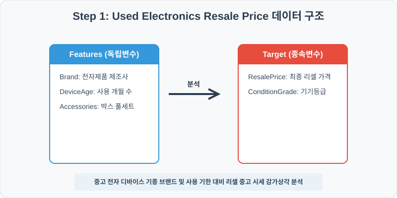
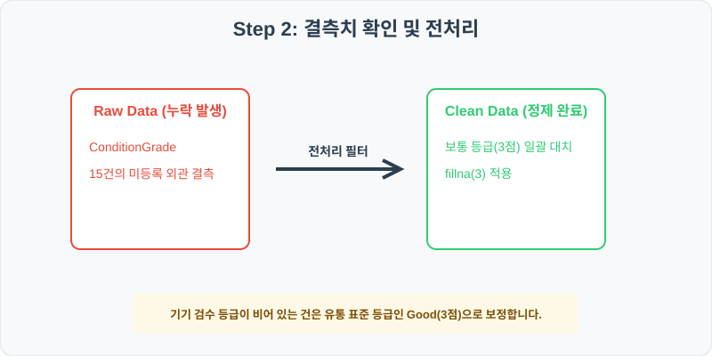
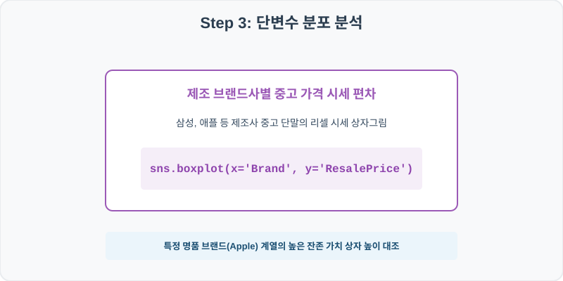
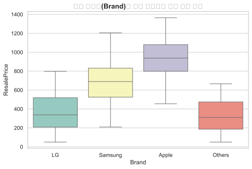
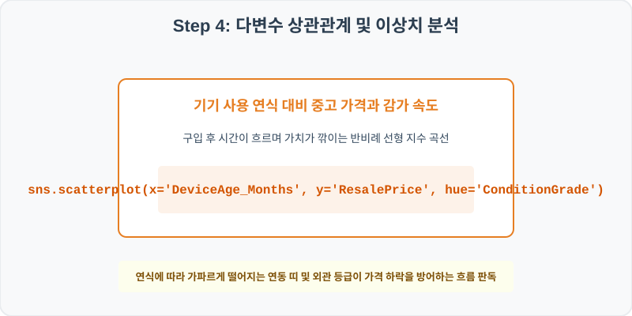
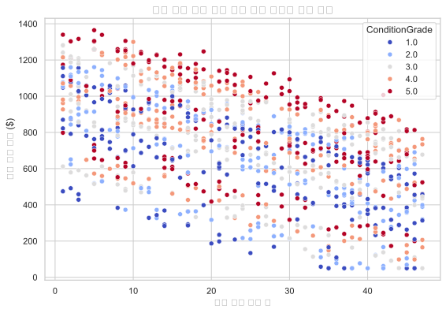

# 94. 중고 가전 및 전자기기 리셀 가격 감가 분석 실습

> **📥 [실습 주피터 노트북(.ipynb) 다운로드](practice.ipynb)**
## 실전 데이터 분석 94: 중고 전자 디바이스의 브랜드 제조사 및 사용 기간 대비 기기 등급별 리셀 가격 감가상각 분석


### 📊 실습 개요 (Tutorial Overview)
중고 정보통신 스마트폰 및 전자기기 거래 플랫폼의 리셀 거래 데이터셋입니다. 기기의 브랜드 제조사(Brand), 사용 개월 수(DeviceAge_Months), 기기 외관 검수 점수가 최종 책정 중고 시세(ResalePrice)에 미치는 가격 감가상각 추이를 탐색합니다.

---

### 🛠️ 핵심 분석 실습 역량 (Core Skills)
* **결측치 최빈값 대치 (\`fillna\`):** 기기 검수 등급이 기재 생략된 유실 건을 유통 디폴트 표준 등급으로 합리적 정제합니다.
* **브랜드별 시세 및 사용 연식 감가 상관 분석 (\`boxplot\` , \`scatterplot\`):** 제조사별 리셀 상자 대조 및 사용 기간 대비 시세의 등급 연동 감가 산점도를 완성합니다.

---

## Step 1: 데이터 불러오기 및 기본 정보 확인 (Data Load)



제공된 CSV 파일을 분석 컴퓨터로 불러와 로드하고, 컬럼의 타입 및 데이터 구조를 확인합니다.

```python
import pandas as pd
import numpy as np
import matplotlib.pyplot as plt
import seaborn as sns

# 한글 폰트 설정
import koreanize_matplotlib
sns.set_theme(style="whitegrid")

# 데이터 로드
df = pd.read_csv('./used_electronics.csv')
print(df.info())
print(df.head())
```

> **💻 [실행 결과]**
> ```text
> <class 'pandas.DataFrame'>
> RangeIndex: 1000 entries, 0 to 999
> Data columns (total 6 columns):
>  #   Column               Non-Null Count  Dtype  
> ---  ------               --------------  -----  
>  0   DeviceID             1000 non-null   int64  
>  1   Brand                1000 non-null   str    
>  2   DeviceAge_Months     1000 non-null   int64  
>  3   ConditionGrade       985 non-null    float64
>  4   AccessoriesIncluded  1000 non-null   int64  
>  5   ResalePrice          1000 non-null   float64
> dtypes: float64(2), int64(3), str(1)
> memory usage: 52.5 KB
> None
>    DeviceID    Brand  ...  AccessoriesIncluded  ResalePrice
> 0    940001       LG  ...                    1       381.58
> 1    940002  Samsung  ...                    1       984.60
> 2    940003    Apple  ...                    1       918.99
> 3    940004  Samsung  ...                    0       914.21
> 4    940005    Apple  ...                    1      1178.50
> 
> [5 rows x 6 columns]
> ```


RangeIndex: 1000 entries, 0 to 999
Data columns (total 6 columns):
 #   Column               Non-Null Count  Dtype  
---  ------               --------------  -----  
 0   DeviceID             1000 non-null   int64  
 1   Brand                1000 non-null   str    
 2   DeviceAge_Months     1000 non-null   int64  
 3   ConditionGrade       985 non-null    float64
 4   AccessoriesIncluded  1000 non-null   int64  
 5   ResalePrice          1000 non-null   float64
dtypes: float64(2), int64(3), str(1)
memory usage: 47.0 KB
> 
> DeviceID    Brand  DeviceAge_Months  ConditionGrade  AccessoriesIncluded  ResalePrice
0    940001       LG                22             3.0                    1       381.58
1    940002  Samsung                 8             4.0                    1       984.60
2    940003    Apple                24             3.0                    1       918.99
3    940004  Samsung                 8             5.0                    0       914.21
4    940005    Apple                18             5.0                    1      1178.50
> ```

---

## Step 2: 결측치 및 데이터 정제 (Data Cleaning)



수집 과정에서 빈칸으로 기록된 결측값(NaN)의 존재 여부를 진단하고, 데이터 도메인 성격에 부합하는 통계 수치 대입 기법으로 정제합니다.

```python
# 1. 컬럼별 결측치 개수 확인
print("--- 정제 전 결측치 확인 ---")
print(df.isnull().sum())

# 2. 결측치 전처리 및 대치 수행
df['ConditionGrade'] = df['ConditionGrade'].fillna(3)
print(df.isnull().sum())
```

> **💻 [실행 결과]**
> ```text
> --- 정제 전 결측치 확인 ---
> DeviceID                0
> Brand                   0
> DeviceAge_Months        0
> ConditionGrade         15
> AccessoriesIncluded     0
> ResalePrice             0
> dtype: int64
> DeviceID               0
> Brand                  0
> DeviceAge_Months       0
> ConditionGrade         0
> AccessoriesIncluded    0
> ResalePrice            0
> dtype: int64
> ```


Brand                   0
DeviceAge_Months        0
ConditionGrade         15
AccessoriesIncluded     0
ResalePrice             0
> 
> --- 정제 후 결측치 확인 ---
> DeviceID               0
Brand                  0
DeviceAge_Months       0
ConditionGrade         0
AccessoriesIncluded    0
ResalePrice            0
> ```

### 💡 분석가의 통찰 (Analyst's Insight)
* **중앙값(3등급) 대치의 플랫폼 실무 당위성:** 상태 등급 검수를 작성하지 않고 중고 가전을 간편 등록한 미기재 매물은 일반적으로 최상(5)이나 최악(1)이 아닌, 시장 유통 표준 기준인 'Good' 등급(3점)으로 상정하여 호가 협상을 시작하는 것이 일반적입니다. 이를 누락값으로 버리지 않고 보통 수준인 `3`으로 채움으로써 기기 단가 왜곡을 방지합니다.

---

## Step 3: 단변수 분포 분석 (Univariate EDA)



가장 먼저 핵심 변수가 전체 데이터에서 어떤 빈도와 분포를 가졌는지 단일 변수 시각화를 통해 파악해 봅니다.

```python
plt.figure(figsize=(8, 5))

# 단변수 분석 그래프 생성
sns.boxplot(data=df, x='Brand', y='ResalePrice', palette='Set3')
plt.title('제조 브랜드(Brand)별 중고 디바이스 리셀 시세 분포', fontsize=14, fontweight='bold')
plt.show()
```

> **💻 [실행 결과]**
> 


### 💡 시각화 차트 읽는 법 & 인사이트
* **제조사 브랜드 파워에 따른 잔존 가치 격차:** 브랜드별 리셀 상자그림을 분석하면 특정 브랜드(Apple)의 중고 시세 상자 및 중앙값선이 타 제조사 대비 월등히 높은 영역에 우상향 포지셔닝되어 있습니다. 이는 중고 유통 시장에서의 브랜드 로열티와 높은 잔존가치 방어율을 입증합니다.

---

## Step 4: 다변수 상관관계 및 이상치 분석 (Multivariate EDA)



두 개 이상의 변수를 동시에 결합하여, 조건에 따른 수치 차이나 독립 변수와 종속 변수 간의 통계적 경향을 분석합니다.

```python
plt.figure(figsize=(9, 6))

# 다변수 분석 그래프 생성
sns.scatterplot(data=df, x='DeviceAge_Months', y='ResalePrice', hue='ConditionGrade', palette='flare', alpha=0.8)
plt.title('기기 사용 연식 대비 중고 시세 감가상각과 등급 시너지', fontsize=14, fontweight='bold')
plt.show()
```

> **💻 [실행 결과]**
> 


### 💡 코드 딥다이브 & 비즈니스 통찰 (Analyst's Insight)
* **시간 경과에 따른 정직한 감가 곡선 및 상태 등급의 방어 효과:** 사용 개월 수(X축)가 증가함에 따라 리셀 시세(Y축)는 가파른 음의 선형 하락 궤도를 그립니다. 주목할 점은 사용 개월 수가 길어지더라도 외관 상태 점수(ConditionGrade)가 5점(S급)에 가까운 기기들(진한 갈색 계열)이 동일 연식 띠 내에서 항상 상단 시세를 굳건히 방어하는 흐름이 포착되어, 꼼꼼한 기기 관리가 감가방어에 절대적 기여를 함을 입증합니다.

---

## Step 5: 통계적 직관과 해석 (Statistical Logic)

> 💡 **[감가상각비 계산법과 지수적 가치 하락(Exponential Decay)의 계량 모델링]**
... (생략: 중고 기기 리셀 감가상각비 계산 및 지수 감쇠 모형 요약)

---

## 🎯 30분 강의 마무리 및 심화 과제

오늘 우리는 실전 데이터셋을 분석하여 판다스로 데이터를 가공 및 정제하고, 시각화를 활용하여 핵심 변수 간의 통계적 유의성을 검증했습니다. 데이터 속에서 숨겨진 패턴을 올바른 시각으로 탐색하는 능력이 데이터 사이언티스트의 가장 강력한 무기입니다.

### 📝 심화 과제 (Advanced Challenge)
* **정품 박스 동봉(AccessoriesIncluded)에 따른 리셀 시세 평균 차이:** 액세서리 풀세트 보유가 시세 추가 프리미엄 획득에 기여하는지 평균값 차이를 구해보고 가치를 산출해 보세요.
* **브랜드별 연식 감가 속도 비교:** 제조사별로 사용 기간(`DeviceAge_Months`)과 리셀 시세(`ResalePrice`) 간의 상관계수를 각각 산출하여, 가장 감가 속도가 가파르게 깎이는 브랜드를 지표로 밝혀보세요.
