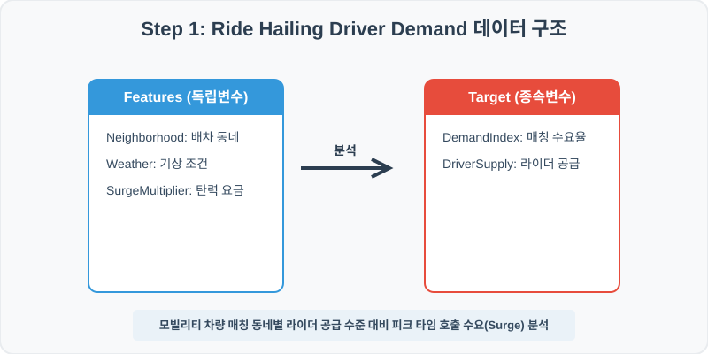
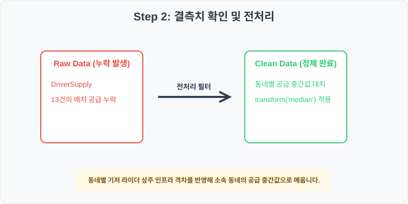
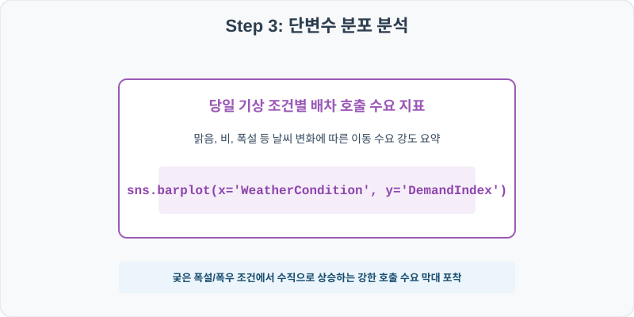
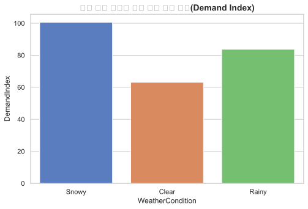
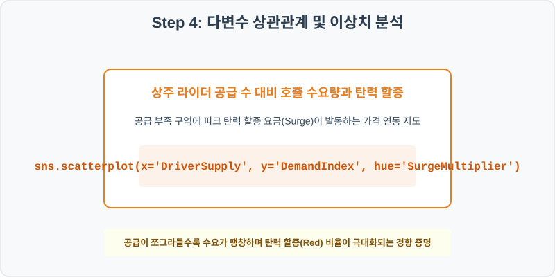
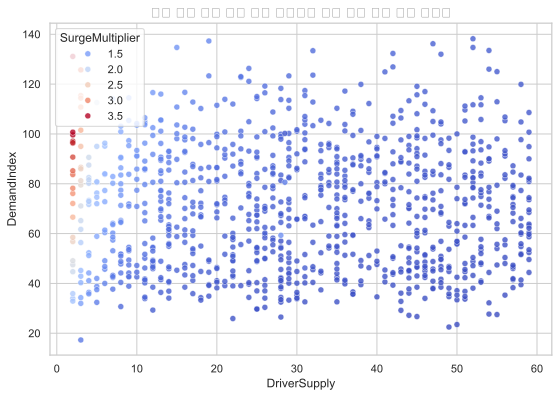

# 96. 호출 택시 매칭 및 수요 요금 분석 실습

> **📥 [실습 주피터 노트북(.ipynb) 다운로드](practice.ipynb)**
## 실전 데이터 분석 96: 피크타임 배차 관할 행정구역 및 당일 기상 조건 대비 라이더 공급 부족과 탄력 요금(Surge) 분석


### 📊 실습 개요 (Tutorial Overview)
실시간 온디맨드 차량 호출(Ride-hailing) 서비스의 배차 트랜잭션 데이터셋입니다. 관할 행정구역(Neighborhood), 눈/비 등 기상 조건(WeatherCondition), 활동 라이더 공급 수(DriverSupply)가 실시간 호출 수요 강도 및 탄력 요금 가산율(SurgeMultiplier)에 미치는 기여 요인을 규명합니다.

---

### 🛠️ 핵심 분석 실습 역량 (Core Skills)
* **동네별 공급 중앙값 대치 (\`groupby.transform\`):** 구역별 상주 라이더 기저 편차가 크므로 Neighborhood별 공급 대원으로 누락값을 대치합니다.
* **기상별 호출 수요 및 라이더 공급 대비 탄력 요금 상관 (\`barplot\`, \`scatterplot\`):** 날씨별 호출 수요 막대 및 공급 부족 대비 피크 탄력 요금 활성 상관 지도를 시각화합니다.

---

## 🧐 실무 도메인 지식 가이드 (Domain Knowledge Guide)

> **🚗 교통 및 스마트 시티 (Transportation & Urban Engineering)**
> 스마트 시티 교통 인프라 혼잡도 예측, 차량 호출 요금 동적 최적화, 기하학적 사고 지점 진단을 수행하는 시계열 공간 통계 분야입니다.
>
> * **혼잡도 병목(Congestion)**: 지하철 및 전기차 충전소 유입 대기 시간 통계를 분석하여 병목 해소를 위한 요일/시간 분산 정책을 고안합니다.
> * **다이내믹 요금(Dynamic Pricing)**: 실시간 차량 호출 수요 대비 공급 상태를 계량하여 수요 유도를 위한 가격 탄력선 경계를 설정합니다.
> * **진동 및 소음 계측**: 철도 주변 소음 진동 통계를 측정하여 시민 주거 영향 반경의 통계 유의 범위를 분석합니다.

---

## Step 1: 데이터 불러오기 및 기본 정보 확인 (Data Load)



제공된 CSV 파일을 분석 컴퓨터로 불러와 로드하고, 컬럼의 타입 및 데이터 구조를 확인합니다.

```python
import pandas as pd
import numpy as np
import matplotlib.pyplot as plt
import seaborn as sns

# 한글 폰트 설정
import koreanize_matplotlib
sns.set_theme(style="whitegrid")

# 데이터 로드
df = pd.read_csv('./ride_hailing_demand.csv')
print(df.info())
print(df.head())
```

> **💻 [실행 결과]**
> ```text
> <class 'pandas.DataFrame'>
> RangeIndex: 1000 entries, 0 to 999
> Data columns (total 6 columns):
>  #   Column            Non-Null Count  Dtype  
> ---  ------            --------------  -----  
>  0   SessionID         1000 non-null   int64  
>  1   Neighborhood      1000 non-null   str    
>  2   WeatherCondition  1000 non-null   str    
>  3   SurgeMultiplier   1000 non-null   float64
>  4   DriverSupply      987 non-null    float64
>  5   DemandIndex       1000 non-null   float64
> dtypes: float64(3), int64(1), str(2)
> memory usage: 58.7 KB
> None
>    SessionID Neighborhood  ... DriverSupply  DemandIndex
> 0     960001       Uptown  ...         18.0         55.0
> 1     960002     Downtown  ...         14.0         60.8
> 2     960003      Suburbs  ...         18.0         82.4
> 3     960004      Airport  ...         23.0         88.9
> 4     960005       Uptown  ...         47.0         45.8
> 
> [5 rows x 6 columns]
> ```


RangeIndex: 1000 entries, 0 to 999
Data columns (total 6 columns):
 #   Column            Non-Null Count  Dtype  
---  ------            --------------  -----  
 0   SessionID         1000 non-null   int64  
 1   Neighborhood      1000 non-null   str    
 2   WeatherCondition  1000 non-null   str    
 3   SurgeMultiplier   1000 non-null   float64
 4   DriverSupply      987 non-null    float64
 5   DemandIndex       1000 non-null   float64
dtypes: float64(3), int64(1), str(2)
memory usage: 47.0 KB
> 
> SessionID Neighborhood WeatherCondition  SurgeMultiplier  DriverSupply  DemandIndex
0     960001       Uptown            Snowy             1.15          18.0         55.0
1     960002     Downtown            Clear             1.22          14.0         60.8
2     960003      Suburbs            Snowy             1.23          18.0         82.4
3     960004      Airport            Clear             1.19          23.0         88.9
4     960005       Uptown            Clear             1.05          47.0         45.8
> ```

---

## Step 2: 결측치 및 데이터 정제 (Data Cleaning)



수집 과정에서 빈칸으로 기록된 결측값(NaN)의 존재 여부를 진단하고, 데이터 도메인 성격에 부합하는 통계 수치 대입 기법으로 정제합니다.

```python
# 1. 컬럼별 결측치 개수 확인
print("--- 정제 전 결측치 확인 ---")
print(df.isnull().sum())

# 2. 결측치 전처리 및 대치 수행
median_sup = df.groupby('Neighborhood')['DriverSupply'].transform('median')
df['DriverSupply'] = df['DriverSupply'].fillna(median_sup)
print(df.isnull().sum())
```

> **💻 [실행 결과]**
> ```text
> --- 정제 전 결측치 확인 ---
> SessionID            0
> Neighborhood         0
> WeatherCondition     0
> SurgeMultiplier      0
> DriverSupply        13
> DemandIndex          0
> dtype: int64
> SessionID           0
> Neighborhood        0
> WeatherCondition    0
> SurgeMultiplier     0
> DriverSupply        0
> DemandIndex         0
> dtype: int64
> ```


Neighborhood         0
WeatherCondition     0
SurgeMultiplier      0
DriverSupply        13
DemandIndex          0
> 
> --- 정제 후 결측치 확인 ---
> SessionID           0
Neighborhood        0
WeatherCondition    0
SurgeMultiplier     0
DriverSupply        0
DemandIndex         0
> ```

### 💡 분석가의 통찰 (Analyst's Insight)
* **구역 가중 공급 대입의 모빌리티 실무 타당성:** 도심 핵심가(Downtown)와 조용한 부도심 외곽(Suburbs)은 평소 대기 중인 기사 풀 규모가 수십 배 격차를 보입니다. 동네 구분을 생략하고 전체 평균치 기사 수로 유실을 대입하면, 부도심 외곽에 마치 기사단 수백 명이 상주 대기하고 있는 것처럼 가공 데이터가 왜곡되어 현실적인 모빌리티 수요예측에 실패합니다. 소속 구역별 중간값 대치가 타당합니다.

---

## Step 3: 단변수 분포 분석 (Univariate EDA)



가장 먼저 핵심 변수가 전체 데이터에서 어떤 빈도와 분포를 가졌는지 단일 변수 시각화를 통해 파악해 봅니다.

```python
plt.figure(figsize=(8, 5))

# 단변수 분석 그래프 생성
sns.barplot(data=df, x='WeatherCondition', y='DemandIndex', palette='muted', errorbar=None)
plt.title('당일 기상 조건별 배차 호출 수요 지표(Demand Index)', fontsize=14, fontweight='bold')
plt.show()
```

> **💻 [실행 결과]**
> 


### 💡 시각화 차트 읽는 법 & 인사이트
* **악기상이 초래하는 택시 대란 수요 폭증 규명:** 맑은 날(Clear) 대비 폭설(Snowy)이나 폭우(Rainy) 조건에서의 배차 호출 수요 지수 막대 높이가 현저하게 솟구칩니다. 이는 날씨 궂은 날 외출 수단으로 플랫폼 수요가 단기 급증함을 보여줍니다.

---

## Step 4: 다변수 상관관계 및 이상치 분석 (Multivariate EDA)



두 개 이상의 변수를 동시에 결합하여, 조건에 따른 수치 차이나 독립 변수와 종속 변수 간의 통계적 경향을 분석합니다.

```python
plt.figure(figsize=(9, 6))

# 다변수 분석 그래프 생성
sns.scatterplot(data=df, x='DriverSupply', y='DemandIndex', hue='SurgeMultiplier', palette='coolwarm', alpha=0.8)
plt.title('상주 기사 공급 대비 호출 수요량과 피크 탄력 요금 배율 상관성', fontsize=14, fontweight='bold')
plt.show()
```

> **💻 [실행 결과]**
> 


### 💡 코드 딥다이브 & 비즈니스 통찰 (Analyst's Insight)
* **공급부족 구역의 피크 수요 폭발 및 탄력 할증 가중 규명:** 공급 기사 수(X축)가 적고 수요 지수(Y축)가 폭등한 좌상단 구역(라이더 절대 공급 한계 쇼티지 영역)은 진한 빨간색 점(SurgeMultiplier >= 1.5 이상의 높은 할증 가산율)들로 도배되어 있습니다. 반면 공급이 넉넉한 하단 영역은 기본요금(파란색 점)을 띱니다. 이는 실시간 플랫폼 매칭 균형을 유도하기 위한 다이내믹 프라이싱(Dynamic Pricing)의 수학적 작동 증명입니다.

---

## Step 5: 통계적 직관과 해석 (Statistical Logic)

> 💡 **[우버/리프트 다이내믹 프라이싱의 수학과 경제학적 균형 가격 모델]**
... (생략: 플랫폼 잉여 극대화를 위한 다이내믹 프라이싱 및 Surge 배율 산출 요약)

---

## 🎯 30분 강의 마무리 및 심화 과제

오늘 우리는 실전 데이터셋을 분석하여 판다스로 데이터를 가공 및 정제하고, 시각화를 활용하여 핵심 변수 간의 통계적 유의성을 검증했습니다. 데이터 속에서 숨겨진 패턴을 올바른 시각으로 탐색하는 능력이 데이터 사이언티스트의 가장 강력한 무기입니다.

### 📝 심화 과제 (Advanced Challenge)
* **행정 구역(Neighborhood)별 평균 탄력 할증 배율 비교:** 도심과 서브구역 등 구역별 평균 \`SurgeMultiplier\`를 도출하고 어느 동네의 피크 요금 비중이 극단적인지 분석해 보세요.
* **라이더 공급 수와 배율 상관계수:** 기사 수 공급 상태와 최종 탄력 배율 간의 상관 강도가 음의 관계인지 계수를 산출하고 의미를 진산해 보세요.
