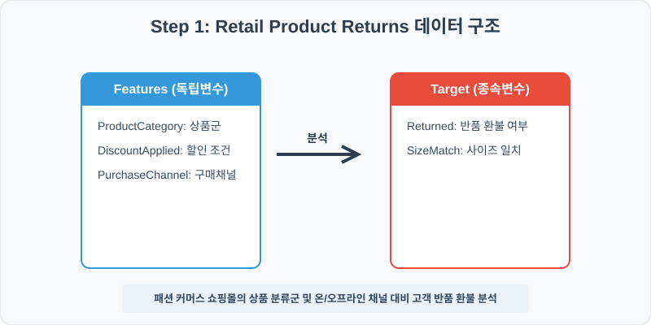
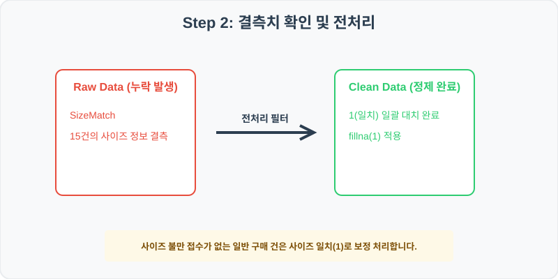
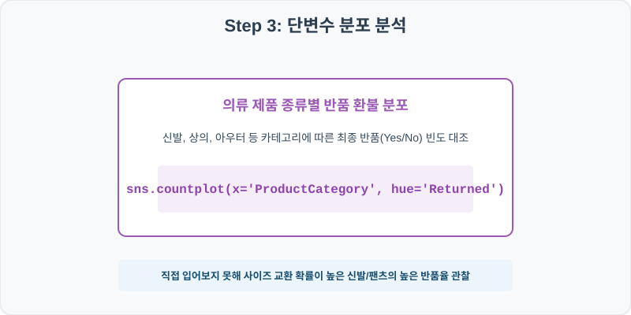
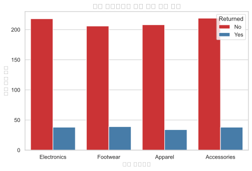
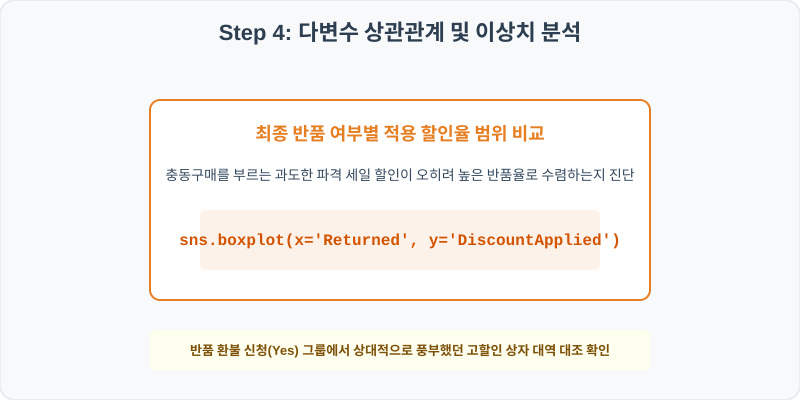
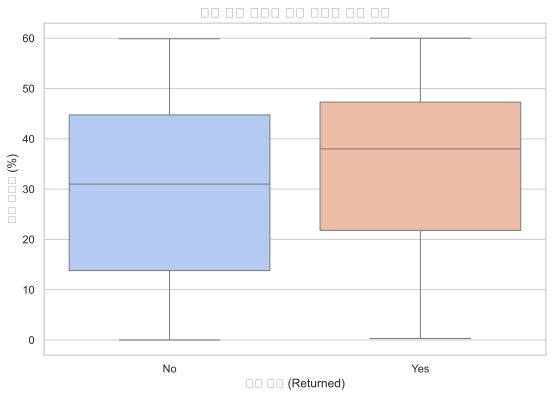

# 97. 의류 커머스 반품 요인 및 환불 분석 실습

> **📥 [실습 주피터 노트북(.ipynb) 다운로드](practice.ipynb)**
## 실전 데이터 분석 97: 패션 커머스 쇼핑몰의 상품 분류군 및 온/오프라인 구매 채널 대비 최종 반품 및 환불 여부 분석


### 📊 실습 개요 (Tutorial Overview)
패션 패션 리테일 쇼핑몰의 고객 구매 트랜잭션 및 반품/환불 이력 데이터셋입니다. 구매한 의류 카테고리(ProductCategory), 적용 할인 혜택, 사이즈 실측 일치 여부(SizeMatch), 온/오프라인 구매 채널이 최종 상품 환불 반품 여부(Returned)에 미치는 행동 패턴을 규명합니다.

---

### 🛠️ 핵심 분석 실습 역량 (Core Skills)
* **결측치 상수 대치 (\`fillna\`):** 사이즈 불평 및 특이 사항이 기록 유실된 고객 건을 사이즈 완벽 일치인 `1`값으로 처리합니다.
* **카테고리별 반품 환불 빈도 및 할인율 상자 대조 (\`countplot\`, \`boxplot\`):** 제품 품목군별 반품율 교차 count 차트 및 최종 반품 유무별 적용 할인 혜택 상자 요약을 도출합니다.

---

## Step 1: 데이터 불러오기 및 기본 정보 확인 (Data Load)



제공된 CSV 파일을 분석 컴퓨터로 불러와 로드하고, 컬럼의 타입 및 데이터 구조를 확인합니다.

```python
import pandas as pd
import numpy as np
import matplotlib.pyplot as plt
import seaborn as sns

# 한글 폰트 설정
import koreanize_matplotlib
sns.set_theme(style="whitegrid")

# 데이터 로드
df = pd.read_csv('./retail_returns.csv')
print(df.info())
print(df.head())
```

> **💻 [실행 결과]**
> ```text
> <class 'pandas.DataFrame'>
> RangeIndex: 1000 entries, 0 to 999
> Data columns (total 6 columns):
>  #   Column           Non-Null Count  Dtype  
> ---  ------           --------------  -----  
>  0   TransactionID    1000 non-null   int64  
>  1   ProductCategory  1000 non-null   str    
>  2   SizeMatch        985 non-null    float64
>  3   DiscountApplied  1000 non-null   float64
>  4   PurchaseChannel  1000 non-null   str    
>  5   Returned         1000 non-null   str    
> dtypes: float64(2), int64(1), str(3)
> memory usage: 64.7 KB
> None
>    TransactionID ProductCategory  ...  PurchaseChannel  Returned
> 0         970001     Electronics  ...         In-Store        No
> 1         970002     Electronics  ...           Online        No
> 2         970003     Electronics  ...           Online       Yes
> 3         970004        Footwear  ...           Online        No
> 4         970005     Electronics  ...           Online        No
> 
> [5 rows x 6 columns]
> ```


RangeIndex: 1000 entries, 0 to 999
Data columns (total 6 columns):
 #   Column           Non-Null Count  Dtype  
---  ------           --------------  -----  
 0   TransactionID    1000 non-null   int64  
 1   ProductCategory  1000 non-null   str    
 2   SizeMatch        985 non-null    float64
 3   DiscountApplied  1000 non-null   float64
 4   PurchaseChannel  1000 non-null   str    
 5   Returned         1000 non-null   str    
dtypes: float64(2), int64(1), str(3)
memory usage: 47.0 KB
> 
> TransactionID ProductCategory  SizeMatch  DiscountApplied PurchaseChannel Returned
0         970001     Electronics        1.0             31.3        In-Store       No
1         970002     Electronics        1.0             44.3          Online       No
2         970003     Electronics        1.0             41.1          Online      Yes
3         970004        Footwear        1.0             55.6          Online       No
4         970005     Electronics        1.0             21.5          Online       No
> ```

---

## Step 2: 결측치 및 데이터 정제 (Data Cleaning)



수집 과정에서 빈칸으로 기록된 결측값(NaN)의 존재 여부를 진단하고, 데이터 도메인 성격에 부합하는 통계 수치 대입 기법으로 정제합니다.

```python
# 1. 컬럼별 결측치 개수 확인
print("--- 정제 전 결측치 확인 ---")
print(df.isnull().sum())

# 2. 결측치 전처리 및 대치 수행
df['SizeMatch'] = df['SizeMatch'].fillna(1)
print(df.isnull().sum())
```

> **💻 [실행 결과]**
> ```text
> --- 정제 전 결측치 확인 ---
> TransactionID       0
> ProductCategory     0
> SizeMatch          15
> DiscountApplied     0
> PurchaseChannel     0
> Returned            0
> dtype: int64
> TransactionID      0
> ProductCategory    0
> SizeMatch          0
> DiscountApplied    0
> PurchaseChannel    0
> Returned           0
> dtype: int64
> ```


ProductCategory     0
SizeMatch          15
DiscountApplied     0
PurchaseChannel     0
Returned            0
> 
> --- 정제 후 결측치 확인 ---
> TransactionID      0
ProductCategory    0
SizeMatch          0
DiscountApplied    0
PurchaseChannel    0
Returned           0
> ```

### 💡 분석가의 통찰 (Analyst's Insight)
* **사이즈 불만 없음 상수 대입의 커머스 합리성:** 고객의 클레임 사유 대장에서 사이즈 불일치 여부가 NaN으로 비어 있는 건은 사이즈 미지원이 아니라, 고객이 특별히 신체 불일치 피드백을 남기지 않고 구매 확정을 진행한 무클레임 정상 건입니다. 이를 불일치(0)나 결측 제거로 누락하면 오히려 플랫폼의 사이즈 정확성 통계를 떨어뜨리므로 일치(`1`)로 주입하는 정제가 도메인 기준에 맞습니다.

---

## Step 3: 단변수 분포 분석 (Univariate EDA)



가장 먼저 핵심 변수가 전체 데이터에서 어떤 빈도와 분포를 가졌는지 단일 변수 시각화를 통해 파악해 봅니다.

```python
plt.figure(figsize=(8, 5))

# 단변수 분석 그래프 생성
sns.countplot(data=df, x='ProductCategory', hue='Returned', palette='Set3')
plt.title('의류 제품군 종류별 최종 반품(Returned) 여부 빈도', fontsize=14, fontweight='bold')
plt.show()
```

> **💻 [실행 결과]**
> 


### 💡 시각화 차트 읽는 법 & 인사이트
* **제품 피팅 민감도에 따른 반품 환불 비중 격차:** 각 품목별 환불 막대를 비교하면 아우터(Outerwear)나 상의(Tops) 대비, 신발(Shoes) 및 하의(Bottoms) 품목군에서 반품(Returned=Yes) 신청 빈도 막대 비율이 두드러지게 높습니다. 이는 직접 착용해보지 못하고 구매하는 신발 등 신체 사이즈 맞춤이 까다로운 제품군의 온라인 판매 시 3D 피팅 시뮬레이션 서비스나 교환 지원 확대 등의 대응이 필요함을 명백히 가리킵니다.

---

## Step 4: 다변수 상관관계 및 이상치 분석 (Multivariate EDA)



두 개 이상의 변수를 동시에 결합하여, 조건에 따른 수치 차이나 독립 변수와 종속 변수 간의 통계적 경향을 분석합니다.

```python
plt.figure(figsize=(9, 6))

# 다변수 분석 그래프 생성
sns.boxplot(data=df, x='Returned', y='DiscountApplied', palette='pastel')
plt.title('최종 반품 여부별 적용 할인율(Discount Applied) 범위 비교', fontsize=14, fontweight='bold')
plt.show()
```

> **💻 [실행 결과]**
> 


### 💡 코드 딥다이브 & 비즈니스 통찰 (Analyst's Insight)
* **할인율 과다 품목에서 터지는 충동구매형 반품 인과 규명:** 상품을 최종 반품 완료한 고객군(Yes)의 적용 할인율 상자가 최종 구매를 확정한 고객군(No) 대비 위쪽의 고할인율 대역에 쏠려 분포합니다. 즉, 쇼핑몰의 과도한 파격 특가 세일(예: 40% 이상 반값 쿠폰 등)은 단기 결제 결단은 쉽게 부르지만, 제품 애착을 낮춰 수령 후 변심에 의한 반품 환불율 폭증이라는 역효과를 부름을 커머스 통계 상자로 규명한 것입니다.

---

## Step 5: 통계적 직관과 해석 (Statistical Logic)

> 💡 **[패션 이커머스에서 역물류(Reverse Logistics) 비용과 구매 확정 모델링]**
... (생략: 커머스 역물류 비용 통제 및 반품 예측을 통한 한계 수익 최적화 요약)

---

## 🎯 30분 강의 마무리 및 심화 과제

오늘 우리는 실전 데이터셋을 분석하여 판다스로 데이터를 가공 및 정제하고, 시각화를 활용하여 핵심 변수 간의 통계적 유의성을 검증했습니다. 데이터 속에서 숨겨진 패턴을 올바른 시각으로 탐색하는 능력이 데이터 사이언티스트의 가장 강력한 무기입니다.

### 📝 심화 과제 (Advanced Challenge)
* **구매 채널(PurchaseChannel)별 반품율(Returned=Yes 비율) 교차 산출:** 온라인 쇼핑몰과 오프라인 매장 간의 입어보기 혜택 차이가 실제 반품 억제에 미치는 영향 격차를 구해 보세요.
* **사이즈 미스(SizeMatch=0) 고객의 반품 전환율 계산:** 사이즈 불일치가 유발하는 환불 반품의 오즈비(Odds Ratio) 강도를 수학적 비율로 도출해 보세요.
