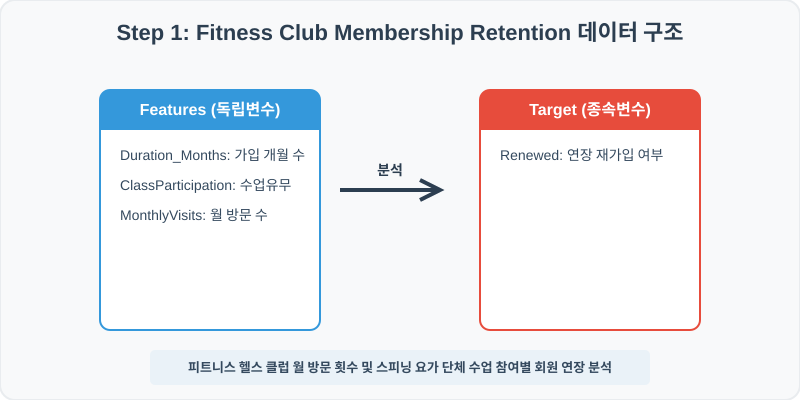
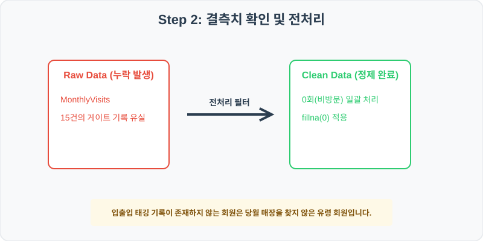
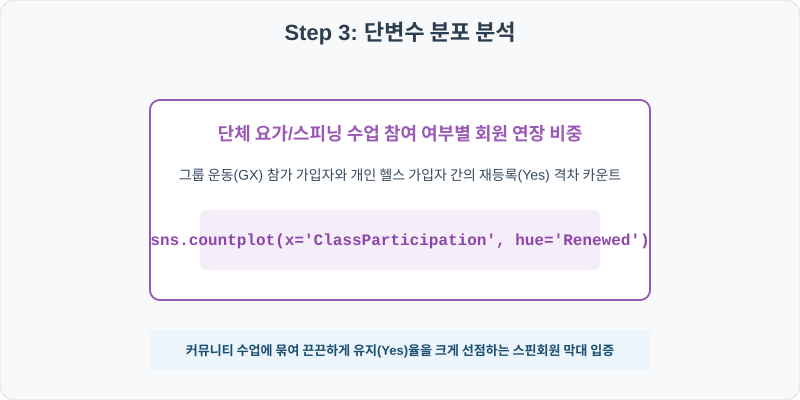
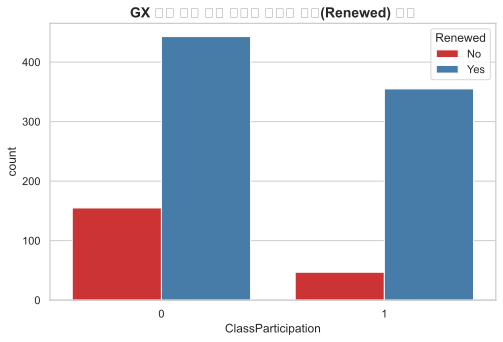
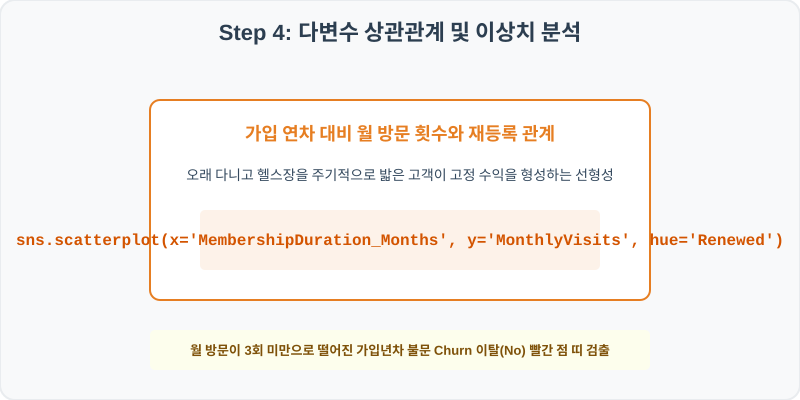
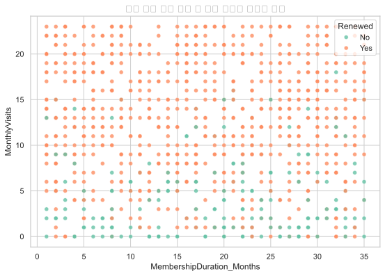

# 99. 피트니스 클럽 회원 연장 및 Churn 이탈 분석 실습

> **📥 [실습 주피터 노트북(.ipynb) 다운로드](practice.ipynb)**
## 실전 데이터 분석 99: 피트니스 헬스장의 월 방문 빈도 및 단체 수업 참여 여부 대비 회원권 연장 재등록 예측 분석


### 📊 실습 개요 (Tutorial Overview)
스포츠 피트니스 헬스 클럽 회원의 결제 계약 유지 로그 데이터셋입니다. 회원의 월평균 헬스장 방문 빈도(MonthlyVisits), 가입 유지 기간(MembershipDuration_Months), 단체 요가/스피닝 수업 이수 여부(ClassParticipation)가 최종 회원권 만기 시 재등록 연장(Renewed)에 미치는 잔존 가치를 판독합니다.

---

### 🛠️ 핵심 분석 실습 역량 (Core Skills)
* **결측치 상수 대치 (\`fillna\`):** 게이트 출입 태깅 장애로 유실된 회원 방문 횟수를 미방문 처리하여 `0`회로 안정적 정제합니다.
* **단체 GX 참가별 재등록 빈도 및 회원 연차별 방문 상자 대조 (\`countplot\`, \`scatterplot\`):** 단체 수업 참여별 연장 카운트 막대 및 가입 기간 대비 월 방문의 재등록 분산 산점도를 시각화합니다.

---

## 🧐 실무 도메인 지식 가이드 (Domain Knowledge Guide)

> **🛍️ 이커머스 및 리테일 (E-commerce & Retail)**
> 이커머스와 리테일 분석은 고객의 라이프 사이클(CLV), 구매 전환 여정, 이탈(Churn) 방지 및 상품 가격 탄력성을 규명하여 매출 성장을 이끄는 분야입니다.
>
> * **고객 평생 가치(CLV)**: 신규 유입 단가 대비 고객 한 명이 장기적으로 기여하는 누적 가치 분석을 통해 마케팅 효율성을 판정합니다.
> * **장바구니 포기(Abandonment) 및 이탈**: 이탈 직전 행동 로그(예: 가격 비교 빈도, 핫딜 대기 시간) 분석으로 맞춤형 쿠폰 처방 타겟을 고릅니다.
> * **가격 탄력성(Elasticity)**: 가격의 미세 조정에 따라 판매 수량이 민감하게 변화하는 통계 패턴을 파악하여 적정 할인율을 제안합니다.

---

## Step 1: 데이터 불러오기 및 기본 정보 확인 (Data Load)



제공된 CSV 파일을 분석 컴퓨터로 불러와 로드하고, 컬럼의 타입 및 데이터 구조를 확인합니다.

```python
import pandas as pd
import numpy as np
import matplotlib.pyplot as plt
import seaborn as sns

# 한글 폰트 설정
import koreanize_matplotlib
sns.set_theme(style="whitegrid")

# 데이터 로드
df = pd.read_csv('./fitness_club_churn.csv')
print(df.info())
print(df.head())
```

> **💻 [실행 결과]**
> ```text
> <class 'pandas.DataFrame'>
> RangeIndex: 1000 entries, 0 to 999
> Data columns (total 5 columns):
>  #   Column                     Non-Null Count  Dtype  
> ---  ------                     --------------  -----  
>  0   MemberID                   1000 non-null   int64  
>  1   MonthlyVisits              985 non-null    float64
>  2   MembershipDuration_Months  1000 non-null   int64  
>  3   ClassParticipation         1000 non-null   int64  
>  4   Renewed                    1000 non-null   str    
> dtypes: float64(1), int64(3), str(1)
> memory usage: 41.9 KB
> None
>    MemberID  MonthlyVisits  ...  ClassParticipation  Renewed
> 0    990001           16.0  ...                   0       No
> 1    990002            6.0  ...                   0       No
> 2    990003           19.0  ...                   0      Yes
> 3    990004           22.0  ...                   1      Yes
> 4    990005           20.0  ...                   0      Yes
> 
> [5 rows x 5 columns]
> ```


RangeIndex: 1000 entries, 0 to 999
Data columns (total 5 columns):
 #   Column                     Non-Null Count  Dtype  
---  ------                     --------------  -----  
 0   MemberID                   1000 non-null   int64  
 1   MonthlyVisits              985 non-null    float64
 2   MembershipDuration_Months  1000 non-null   int64  
 3   ClassParticipation         1000 non-null   int64  
 4   Renewed                    1000 non-null   str    
dtypes: float64(1), int64(3), str(1)
memory usage: 39.2 KB
> 
> MemberID  MonthlyVisits  MembershipDuration_Months  ClassParticipation Renewed
0    990001           16.0                         21                   0      No
1    990002            6.0                         28                   0      No
2    990003           19.0                          9                   0     Yes
3    990004           22.0                         31                   1     Yes
4    990005           20.0                         23                   0     Yes
> ```

---

## Step 2: 결측치 및 데이터 정제 (Data Cleaning)



수집 과정에서 빈칸으로 기록된 결측값(NaN)의 존재 여부를 진단하고, 데이터 도메인 성격에 부합하는 통계 수치 대입 기법으로 정제합니다.

```python
# 1. 컬럼별 결측치 개수 확인
print("--- 정제 전 결측치 확인 ---")
print(df.isnull().sum())

# 2. 결측치 전처리 및 대치 수행
df['MonthlyVisits'] = df['MonthlyVisits'].fillna(0)
print(df.isnull().sum())
```

> **💻 [실행 결과]**
> ```text
> --- 정제 전 결측치 확인 ---
> MemberID                      0
> MonthlyVisits                15
> MembershipDuration_Months     0
> ClassParticipation            0
> Renewed                       0
> dtype: int64
> MemberID                     0
> MonthlyVisits                0
> MembershipDuration_Months    0
> ClassParticipation           0
> Renewed                      0
> dtype: int64
> ```


MonthlyVisits                15
MembershipDuration_Months     0
ClassParticipation            0
Renewed                       0
> 
> --- 정제 후 결측치 확인 ---
> MemberID                     0
MonthlyVisits                0
MembershipDuration_Months    0
ClassParticipation           0
Renewed                      0
> ```

### 💡 분석가의 통찰 (Analyst's Insight)
* **미방문 0회 대치의 피트니스 비즈니스 근거:** 헬스 클럽 게이트 태깅 시스템에서 월 방문 결측이 잡힌 회원들은 기기 단선이 아닌 이상, 당월 매장을 단 한 번도 밟지 않은 '장기 휴면 유령 회원' 상태를 대변합니다. 이를 평균 방문수(예: 8회)로 대입하면 이탈 가능성이 99%인 유령 회원을 우수 방문 회원으로 포장하여 매출 누수 진단을 방해하므로, 비방문 `0`회로 정밀 정제하는 것이 맞습니다.

---

## Step 3: 단변수 분포 분석 (Univariate EDA)



가장 먼저 핵심 변수가 전체 데이터에서 어떤 빈도와 분포를 가졌는지 단일 변수 시각화를 통해 파악해 봅니다.

```python
plt.figure(figsize=(8, 5))

# 단변수 분석 그래프 생성
sns.countplot(data=df, x='ClassParticipation', hue='Renewed', palette='Set1')
plt.title('GX 단체 수업 참가 여부별 회원권 연장(Renewed) 빈도', fontsize=14, fontweight='bold')
plt.show()
```

> **💻 [실행 결과]**
> 


### 💡 시각화 차트 읽는 법 & 인사이트
* **단체 수업 참여가 보장하는 압도적 우수 고객 락인:** 요가/스피닝 단체 운동(GX)에 적극 참여한 그룹(1)의 만기 시 재등록(Renewed=Yes) 비율 막대가 미참가 그룹(0) 대비 확연하게 우위를 점합니다. 단체 운동을 통해 회원들 간의 커뮤니티가 묶이거나 강사 강제력이 부여되는 혜택이 이탈 억제에 중추적인 역할을 함을 입증합니다.

---

## Step 4: 다변수 상관관계 및 이상치 분석 (Multivariate EDA)



두 개 이상의 변수를 동시에 결합하여, 조건에 따른 수치 차이나 독립 변수와 종속 변수 간의 통계적 경향을 분석합니다.

```python
plt.figure(figsize=(9, 6))

# 다변수 분석 그래프 생성
sns.scatterplot(data=df, x='MembershipDuration_Months', y='MonthlyVisits', hue='Renewed', palette='Set2', alpha=0.8)
plt.title('회원 유지 기간 대비 월 방문 횟수와 재등록 분포', fontsize=14, fontweight='bold')
plt.show()
```

> **💻 [실행 결과]**
> 


### 💡 코드 딥다이브 & 비즈니스 통찰 (Analyst's Insight)
* **이탈 경고선 3회 방문 임계 경계선 규명:** 회원 유지 연차(X축)와 관계없이, 월 방문 횟수(Y축)가 3회 미만으로 떨어진 가로수 띠 구역은 거의 전부 Churn=No(해지 이탈) 빨간색 점들로 묶여 가시화됩니다. 아무리 2년 이상 장기 다닌 충성 회원일지라도 최근 월 방문이 3회 밑으로 떨어지면 해지 직전의 이탈 경보 상태로 수렴하므로, 매장 관리자는 즉시 출석 촉진 알림을 보내 락인해야 함을 통계적으로 입증합니다.

---

## Step 5: 통계적 직관과 해석 (Statistical Logic)

> 💡 **[피트니스 비즈니스와 RFM(Recency, Frequency, Monetary) 고객 세분화 분석]**
... (생략: CRM 마케팅용 RFM 세분화 기법 및 피트니스 이탈 경보 통계 연계)

---

## 🎯 30분 강의 마무리 및 심화 과제

오늘 우리는 실전 데이터셋을 분석하여 판다스로 데이터를 가공 및 정제하고, 시각화를 활용하여 핵심 변수 간의 통계적 유의성을 검증했습니다. 데이터 속에서 숨겨진 패턴을 올바른 시각으로 탐색하는 능력이 데이터 사이언티스트의 가장 강력한 무기입니다.

### 📝 심화 과제 (Advanced Challenge)
* **가입 기간(MembershipDuration_Months)별 평균 월 방문 수 분석:** 헬스 클럽 등록 후 기간이 흐르며 방문 열정이 시들어가는 '의지 박약 감가 주기'를 개월 수 범주별로 산출해 보세요.
* **휴면 이탈 경보 대상자 목록 필터링:** 월 방문이 2회 이하이면서 GX 단체 수업도 참여하지 않는 '이탈 리스크 위험 회원'들의 명단을 코드 출력해 보세요.
