# 3.1.2 파이썬 언어 기초
이제 기초적인 파이썬 언어에 대해서 알아 보겠습니다.

## 학습목표
본 장에서는 파이썬 코드 안에서 실행되지 않고 사람을 위해 남기는 설명문인 **'주석(Comment)'**의 역할과 작성법을 익히고, 프로그램 내부에서 변하지 않는 고정된 값인 **'리터럴(상수)'**의 개념과 종류를 명확히 이해합니다.

> 📥 **파이썬 언어 기초 실습용 노트북 다운로드 및 실행**: 
> - [로컬 환경용 다운로드](./source/example.ipynb) (VS Code 등에서 실행)
> - <a href="https://colab.research.google.com/github/jinydev/datas/blob/master/src/python/01_basic/02_comments_constants/source/example.ipynb" target="_blank"></a> (웹 브라우저에서 바로 실습)

## 3.1.2 주석
프로그램은 동작을 지시하는 코드와 설명이나 동작을 잠시 배제하는 주석으로 구분됩니다. 
주석은 프로그램의 동작에 영향을 주지 않으며, 코드의 가독성을 높이기 위해 사용합니다.


*(컴퓨터(로봇)는 주석으로 적힌 포스트잇 메모를 쿨하게 무시하고 지나가지만, 개발자(학생)는 메모를 읽으며 복잡한 코드를 쉽게 이해할 수 있습니다!)*

### 주석기호
파이썬에서 주석은 `#` 기호로 시작하며, `#` 이후부터 줄 마지막까지 주석(comment)이다.

```python
# 3.1.2 comments
```
> 다른 언어에서는 주석을 `//`나 `/* */`로 표시하기도 합니다.

### 여러 줄 주석과 독스트링(Docstring)
파이썬에는 Java의 `Javadoc`이나 PHP의 `PHPDoc`처럼 여러 줄에 걸쳐 공식적인 API 문서나 함수 설명을 담당하는 전용 주석 문법이 존재합니다. 이를 **독스트링(Docstring, 문서화 문자열)**이라고 부릅니다. 

독스트링은 큰따옴표 3개(`"""`) 또는 작은따옴표 3개(`'''`)로 작성하며, 모듈이나 클래스, 함수의 바로 첫 번째 줄에 위치해야 합니다. 파이썬의 여러 자동 문서화 도구(예: Sphinx)들은 이 독스트링을 추출하여 공식 매뉴얼 웹페이지를 자동으로 생성해 줍니다. 

```python
def calculate_area(radius):
    """
    원의 넓이를 계산하는 함수입니다.

    Args:
        radius (float): 원의 반지름 값
        
    Returns:
        float: 계산된 원의 넓이 단위
    """
    result = 3.14 * radius * radius
    return result
```

## 상수(Constant)와 리터럴(Literal)의 차이점

프로그래밍 초보자들이 가장 헷갈려하는 개념 중 하나가 **상수**와 **리터럴**의 구분입니다. 


*(웹툰 비유: 허공에 빛나는 원시 데이터 원석 덩어리가 '리터럴', 그것을 가져와 안전하게 담아 보관하며 'MAX_USERS'라는 큰 이름표를 붙인 튼튼한 금고 상자가 '상수'를 상징합니다.)*

### 1) 리터럴(Literal)이란?
리터럴은 코드 상에 **'직접 입력을 해서 문자 그대로 적혀 있는 고정된 값 자체'**를 의미합니다. 즉, 데이터의 본질적인 `원형`입니다.

예를 들어 `age = 25` 라는 코드에서, 눈에 보이는 숫자 `25` 그 자체가 바로 정수 리터럴입니다. 

`"Hello"`라는 글자 자체도 문자열 리터럴입니다.

### 2) 상수(Constant)란?
상수는 리터럴(고정된 값)을 담아두고 **'프로그램이 끝날 때까지 절대 변하지 않기로 약속한 그릇(변수)'**을 의미합니다. 

파이썬에는 사실 Java의 `final`이나 C의 `const`처럼 문법적으로 값을 완벽하게 잠가버리는 진짜 상수 키워드는 없습니다. 

하지만 파이썬 개발자들은 관례적으로 **"모든 글자를 대대문자(UPPERCASE)로 적은 변수는 상수로 취급하니 절대 수정하지 말자!"**라고 약속하여 사용합니다.

```python
#  PI, MAX_USERS는 '상수(Constant) 역할을 하는 변수'입니다.
# 3.14159, 100은 코드에 직접 적힌 '리터럴(Literal)'입니다.
PI = 3.14159 
MAX_USERS = 100 
```


*(다이어그램: 리터럴(값)이 이름표가 붙은 상수 상표(그릇) 안으로 들어가는 과정을 보여줍니다.)*

### 리터럴 실습
다음처럼 대화형 모드에서 정수나 실수를 콘솔에 입력하고 Enter를 누르면 그 값을 바로 출력해 준다. 

예시
```python
3.4 # numeric literals
```
**출력:**
```
3.4
```

### 리터럴 종류

파이썬에서 지원하는 리터럴 종류에는 정수, 실수, 문자열, 불리언 등이 있다. 10은 정수(int) 상수이며, 3.4는 실수(float) 상수(literal)이다.

### 정수 리터럴
정수 뒤에 `L`을 붙이면 에러(error, 오류)가 발생한다. 오류는 발생 위치를 `^`로 표시하고 다음 줄에 오류 이름 `SyntaxError`와 오류 메시지 `invalid decimal literal`을 보여준다.

```python
7L
```
**출력:**
```
  File "<stdin>", line 1
    7L
     ^
SyntaxError: invalid decimal literal
```

> 오류가 나는 이유: 파이썬에서 정수 뒤에 `L`을 붙이면 에러가 발생한다. 이는 파이썬에서 정수 뒤에 `L`을 붙이면 에러가 발생하기 때문이다.


## 여러 상수 나열
다음처럼 여러 값을 나열하면 에러가 발생한다.

```python
-5 4.5
```
**출력:**
```
  File "<stdin>", line 1
    -5 4.5
         ^
SyntaxError: invalid syntax
```

> 기본적으로 하나의 리터럴만 출력할 수 있다

## 튜플

다음처럼 상수를 쉼표(또는 콤마) `,`로 구분해 나열하면 값을 둘러싼 수의 나열이 표시된다. 이를 파이썬에서 튜플(tuple)이라 한다.

```python
10, -3
```
**출력:**
```
(10, -3)
```

## 정리
이번 장에서는 다른 프로그래머나 미래의 나를 위해 코드에 친절한 설명을 달아주는 주석(`#`)과, 공식 문서 자동화의 꽃인 **독스트링(Docstring)**의 사용법을 배웠습니다. 

또한 코드 내부에서 변하지 않는 고정된 데이터 값 자체를 의미하는 **리터럴(Literal)**과, 그 리터럴을 담아두고 영원히 변치 않기로 굳게 약속한 대문자 이름표인 **상수(Constant)**의 근본적인 차이에 대해서 직관적인 그래픽과 함께 명확하게 짚고 넘어감으로써 프로그래머로서의 단단한 시야를 확보했습니다.

---

## ☕ Java vs 🐘 PHP vs 🐍 Python 스나이퍼 비교

### 1. 주석 (Comments)
*   **Java & PHP**: 한 줄 주석은 `//`를 사용하고, 여러 줄 주석은 `/* ... */`를 사용합니다. 공식 문서 생성용 주석(Javadoc, PHPDoc)은 `/** ... */` 형식을 취합니다.
*   **Python**: 한 줄 주석은 `#`만 사용합니다. 여러 줄은 `#`을 여러 번 쓰거나, 따옴표 세 개(`"""`)로 이루어진 **독스트링(Docstring)**을 공식 인터페이스 문서화의 표준으로 사용합니다.

### 2. 진짜 상수의 존재 유무
*   **Java**: `final` 키워드를 변수 앞에 붙이면 값을 변경하려 할 때 빌드 에러를 뿜어내며 시스템적으로 방어합니다. (`final int MAX_SIZE = 100;`)
*   **PHP**: `define('MAX_SIZE', 100);` 혹은 `const MAX_SIZE = 100;` 문법을 지원하여 한 번 설정된 상수는 프로그램 실행 도중 절대 바꿀 수 없도록 강제합니다. (인터프리터 언어이지만 상수 문법이 존재함)
*   **Python**: 매우 독특하게도, 문법적으로 값을 완벽히 잠가버리는 진짜 상수 키워드나 기능은 존재하지 않습니다! 대신 변수 이름을 모두 **대문자(UPPERCASE)**로 적으면 "이건 상수니까 약속하고 절대 건드리지 맙시다!" 라고 개발자들끼리 굳게 **약속(관례)**하는 방식을 씁니다. (`MAX_SIZE = 100`)

---

## 📊 Matplotlib 맛보기: 데이터 값의 시각화

가장 단순한 리터럴 값들도 파이썬의 꽃 `matplotlib`을 만나면 직관적인 그래프가 됩니다.

```python
import matplotlib.pyplot as plt

# 고정된 상수들(리터럴) 설정
HP = 100
MP = 50
EXP = 75

# 간단한 막대 그래프 그리기
labels = ["Health", "Mana", "Experience"]
values = [HP, MP, EXP]
colors = ['red', 'blue', 'green']

plt.bar(labels, values, color=colors)
plt.title("Character Status (Constants)")
plt.show()
```

---

## 🎧 Vibe Coding

파이썬에서는 아무리 길고 복잡한 공식 문서(Docstring)도 AI가 순식간에 자동으로 예쁘게 만들어줄 수 있습니다.

> **🗣️ 학생 프롬프트 (AI에게 이렇게 명령해 보세요):**
> "파이썬으로 두 숫자를 곱해서 반환하는 `multiply_two_numbers` 함수를 하나 짜 줘. 단, 파이썬의 표준 `Docstring` 양식을 아주 상세하게 포함해서 작성해 줘."

---

## 코딩 영단어 학습 📝

*   **`Comment`**: 논평, 의견, 식별표. (코드 안에서 컴퓨터는 무시하고 사람만 읽으라고 달아두는 메모나 주석을 뜻합니다.)
*   **`Syntax`**: 구문, 문법. (`SyntaxError`는 파이썬 문법의 철자나 기호를 틀렸을 때 발생하는 에러입니다.)
*   **`Tuple`**: 여러 개의 데이터 요소로 이뤄진 묶음 자체를 뜻하는 수학/컴퓨터공학 용어입니다. (파이썬에서는 `(10, 20)` 처럼 소괄호로 묶인 데이터 구조를 의미합니다.)
