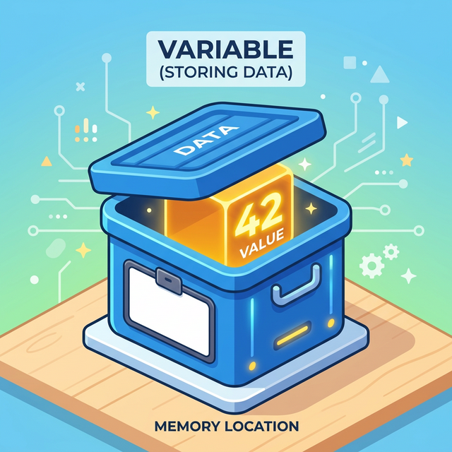

# 3.1.3 변수와 대입
모든 프로그래밍을 학습할때 먼저 배우는 것이 변수입니다.

## 학습목표
본 장에서는 데이터를 담아두는 이름표 붙은 상자인 **'변수(Variable)'**의 개념을 확실히 잡고, 수학과 다른 **'대입 연산자(=)'**의 진짜 의미를 이해합니다. 또한 데이터 타입을 스스로 알아채는 파이썬의 **동적 타이핑(Dynamic Typing)** 특징과 변수의 값을 손쉽게 바꾸는 **다중 대입(Swap)** 테크닉을 익힙니다.


## 변수 개념 이해하기

파이썬에서 변수(variable)는 데이터를 저장하는 컨테이너(상자)와 같습니다. 변수를 사용하면 코드 내에서 `데이터`를 더 쉽게 `관리`하고 참조할 수 있습니다. 

> 변수와 리터럴의 차이는 무엇일까요?
> 리터럴은 값 그 자체를 의미하며, 변수는 값을 저장하는 컨테이너(상자)와 같습니다.



### 변수에 값 할당하기
다음 코드에서 다양하게 변하는 값을 저장하는 변수 `a`에 값 3을 저장해 출력합니다. 

변수에 값을 저장(할당)하려면 대입 연산자 `=`을 사용합니다. 
수학에서의 '같다'는 의미가 아니라, 오른쪽의 값을 왼쪽의 변수에 '넣는다'는 의미입니다.

<div style="text-align: center; margin: 2rem 0;">
  
  <p style="text-align: center; font-size: 0.9em; color: #6c757d; margin-top: 10px; margin-bottom:30px;">
    ▲ 값 <b>3</b>이 변수 <b>a</b>의 공간에 할당(대입)되는 과정
  </p>
</div>

### 실습
실습을 통하여 변수에 값을 할당해 봅시다.

```python
# 3.1.3 변수 선언과 값 할당
a = 3 
greeting = "안녕하세요!"

print(a)
print(greeting)
```
**출력:**
```
3
안녕하세요!
```

### 내용을 확인하는 `print()` 함수

위 실습 코드에서 `print(a)`와 같이 쓰인 **`print()`**는 파이썬에서 가장 많이 사용되는 **기본 출력 함수**입니다. 
변수 안에 들어있는 값을 화면(콘솔)에 보여주거나, 문자열을 직접 출력할 때 사용합니다.

```python
# 3.1.3 print() 함수의 다양한 활용
print("텍스트 직접 출력")
print(a)           # 변수 안의 값 출력
print("값은:", a)  # 문자열과 변수를 쉼표로 연결하여 한 줄에 출력
```
쉼표(`,`)를 사용하여 여러 개의 변수나 문자열을 나열하면, 파이썬이 알아서 띄어쓰기(공백)를 하나씩 넣어주면서 한 줄로 예쁘게 출력해 줍니다.


## 파이썬의 동적 타이핑 (Dynamic Typing) 원리

파이썬은 **동적 타입(Dynamic Typing) 언어**입니다. 
이는 변수를 선언할 때 데이터의 타입(정수, 문자열 등)을 미리 지정할 필요가 없다는 의미입니다. 변수의 타입은 할당되는 값에 따라 **런타임(프로그램 실행 중)**에 자동으로 결정되고 언제든지 바뀔 수 있습니다.

### PHP나 JavaScript와의 차이점 (내부 구현 방식의 차이)

웹 개발에 자주 쓰이는 PHP나 JavaScript 역시 동적 타이핑을 지원하지만, 그 내부 동작 원리(엔진 구조)는 파이썬과 다릅니다.

*   **PHP의 동적 타이핑 (zval 공용체 방식)**: 
    PHP 엔진(Zend Engine) 내부에서 변수는 `zval` (Zend Value)이라는 거대한 C언어 **구조체이자 공용체(Union)**로 관리됩니다. 하나의 `zval` 메모리 블록 안에 정수를 저장하는 공간, 문자열 포인터를 저장하는 공간, 실수를 저장하는 공간이 모두 겹쳐서(Union) 선언되어 있습니다. 변수의 타입이 바뀌면 단순히 내부 플래그(Type Flag)만 변경하고, 공용체 안의 다른 메모리 영역을 읽는 방식으로 작동합니다.
*   **JavaScript (V8 엔진 등)**:
    자바스크립트 엔진 역시 내부적으로 JSValue 형태의 태그된 포인터(Tagged Pointer)나 구조체를 통해 값이 정수인지, 객체인지 등을 메타 정보로 들고 다니며 런타임에 타입을 평가합니다. 

### 파이썬은 내부적으로 이를 어떻게 구현하고 있을까? (Everything is an Object)

파이썬(CPython 기준)은 공용체로 변수의 크기를 고정해 두는 방식이 아니라, 철저하게 **"모든 것은 객체(Object)다"**라는 철학으로 동적 타이핑을 구현합니다.

파이썬 내부(C 코드)에서 모든 데이터는 `PyObject`라는 기본 구조체를 상속받아 만들어진 독립적인 메모리 객체입니다.

```c
// CPython 내부의 PyObject 뼈대 (개념적 표현)
typedef struct _object {
    int ob_refcnt;               // 가비지 컬렉터를 위한 참조 횟수 카운터
    struct _typeobject *ob_type; // 이 객체의 진짜 타입표(Type)를 가리키는 포인터
} PyObject;
```

1. **변수는 그저 '이름표(포인터)'일 뿐입니다:** 파이썬에서 우리가 선언하는 변수 `a`는 값 그 자체가 아니라, 특정 `PyObject`가 있는 메모리 주소를 가리키는 **포인터(참조) 화살표** 역할만 합니다. 변수 자체에는 아무런 타입 정보가 없습니다.
2. **타입은 객체가 들고 다닌다:** 데이터의 진짜 타입(int, str, list 등)표는 변수 이름표에 적혀 있는 것이 아니라, 메모리 어딘가에 허공에 떠 있는 객체(`PyObject`) 본체 안에 지워지지 않는 꼬리표(`ob_type`)로 단단하게 붙어 있습니다.
3. **타입이 변하는 마법:** `number = 10`을 했다가 `number = "hello"`로 변경하면, 기존의 10 객체를 뜯어고쳐 문자열로 바꾸는 것이 아닙니다. 메모리 어딘가에 새롭게 "hello"라는 문자열 객체를 만들고, `number`라는 이름표(포인터 화살표)가 가리키는 방향을 뚝 끊어서 새로운 "hello" 객체로 향하게 묶어버리는 것입니다.

이처럼 **'변수는 그저 화살표일 뿐, 모든 데이터는 각자의 타입 신분증을 든 독립된 객체'**라는 구조적 차이 덕분에, 파이썬은 완벽한 순수 객체지향 언어로서의 동적 환경을 우아하고 유연하게 제공할 수 있습니다.


### 예제 실습

```python
# 3.1.3 변수의 타입이 실행 중에 변경됨
number = 10
print(number)

number = "이제 문자열입니다"
print(number)
```
**출력:**
```
10
이제 문자열입니다
```

## 다중 대입과 값 교환 (Swap)

파이썬은 다른 언어에서는 지원하지 않는 고유하고 편리한 형 대입 방식인 **다중 대입(Multiple Assignment)**을 지원합니다. 


### 예제 실습

대입연산자 `=` 왼쪽에 `m, n`처럼 값을 저장할 여러 변수를 쉼표로 구분해 나열하고, 오른쪽에도 대응하는 값을 나열합니다.

```python
# 3.1.3 복수의 변수에 한결같이 값을 할당
m, n = 10, 20
print(m, n)
```
**출력:**
```
10 20
```

다중 대입을 응용하면 `m`과 `n`의 값을 서로 교환(Swap)하는 것도 임시 변수 없이 한 줄의 코드로 우아하게 처리할 수 있습니다. 우측은 튜플 `(n, m)`의 값 `(20, 10)`이 평가되고, 이 값이 왼쪽 변수 그룹 `(m, n)`에 다시 할당되는 원리입니다.

```python
# 3.1.3 변수 값 서로 바꾸기 (Swap)
m, n = n, m
print(m, n)
```
**출력:**
```
20 10
```

### 다른 언어와 비교
다른 언어에서는 변수 값을 서로 바꾸려면 임시 변수를 사용해야 한다.

```python
# 3.1.3 변수 값 서로 바꾸기 (Swap)
tmp = m
m = n
n = tmp
print(m, n)
```
**출력:**
```
20 10
```

## 정리
이 장을 통해 우리는 파이썬이 어떻게 데이터를 기억장치에 저장하고, 우리가 붙여준 이름(변수)으로 그 데이터를 다루는지 원리를 완벽히 파악했습니다. 특히 번거롭게 자료형을 미리 지정하지 않아도 되는 파이썬의 똑똑한 '동적 타이핑' 기술과 임시 변수 없이도 두 개의 데이터를 순식간에 맞바꾸는 '다중 대입' 기능은 앞으로 여러분의 파이썬 코딩을 훨씬 우아하고 간결하게 만들어 줄 핵심 무기입니다.
