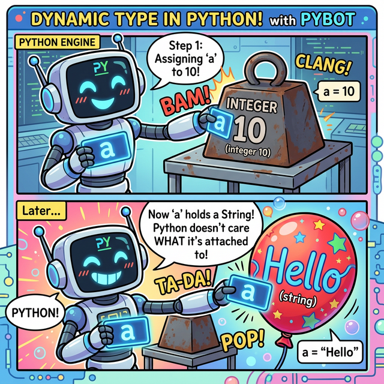
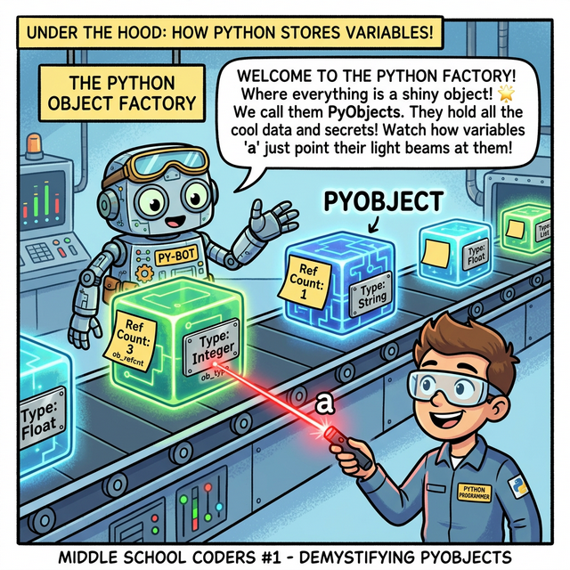

# 3.1.3 변수와 대입
모든 프로그래밍을 학습할때 먼저 배우는 것이 변수입니다.

## 학습목표
본 장에서는 데이터를 담아두는 이름표 붙은 상자인 **'변수(Variable)'**의 개념을 확실히 잡고, 수학과 다른 **'대입 연산자(=)'**의 진짜 의미를 이해합니다. 또한 데이터 타입을 스스로 알아채는 파이썬의 **동적 타입(Dynamic Type)** 특징과 변수의 값을 손쉽게 바꾸는 **다중 대입(Swap)** 테크닉을 익힙니다.


> 📥 **변수와 대입 실습용 노트북 다운로드 및 실행**: 
> - [로컬 환경용 다운로드](./source/example.ipynb) (VS Code 등에서 실행)
> - <a href="https://colab.research.google.com/github/jinydev/datas/blob/master/src/python/01_basic/03_variables_assignment/source/example.ipynb" target="_blank"></a> (웹 브라우저에서 바로 실습)

## 1. 변수의 기원: 파이썬 코딩은 결국 수학이다!

코딩에서 말하는 **'변수(Variable)'**라는 개념은 갑자기 하늘에서 뚝 떨어진 것이 아닙니다. 
여러분이 중학교 수학 시간(대수학)에 배우는 **"문자를 사용한 식"**에서 알파벳 $x$나 $y$를 가져와 대입하는 행위와 파이썬 프로그래밍의 변수 선언은 정확히 100% 똑같은 메커니즘을 가집니다.


*(웹툰 비유: 16세기 프랑스의 수학 영웅 '프랑수아 비에트'. 그는 500개가 넘는 적군의 복잡한 스페인 암호를 해독하기 위해 역사상 최초로 계산식에 값이 변할 수 있는 **알파벳 문자($x$, $y$)라는 '투명 상자'**를 도입했습니다. 이 위대한 수학적 상상력이 오늘날 컴퓨터 프로그래밍 '변수(Variable)'의 기원이 되었습니다.)*

파이썬에서 변수란 데이터를 담아두는 **'이름표가 붙은 투명 상자'**와 같습니다. 길이를 모르는 값을 수학에서 $x$ 상자로 두듯, 코드 내에서도 아직 정해지지 않거나 계속해서 변할 수 있는 데이터를 손쉽게 관리하기 위해 이 상자(변수)를 사용합니다.

> 💡 **리터럴(Literal)과 변수(Variable)의 차이는?**
> 리터럴은 변하지 않는 값 그 자체(`3`, `"Hello"`)를 의미하며, 변수는 그 리터럴 값을 안전하게 저장하고 들고 다니는 컨테이너 상자를 뜻합니다.

---

## 2. 변수에 값 할당하기: 대입(Substitution)의 마법

수학에서 기계 식 $2x + 5$ 의 $x$ 자리에 숫자 $3$을 쏙 집어넣는 것을 **대입(Substitution)**이라고 배웠을 것입니다. 파이썬 프로그래밍에서는 이를 **할당(Assignment)**이라고 부르며, 그 위대한 마법의 지팡이 역할을 하는 것이 바로 **`=` (대입 연산자)** 입니다.


*(다이어그램: 수학에서 수식의 $x$ 구멍 안에 숫자 $3$을 떨어뜨리는 행위가, 파이썬 코드 `x = 3`에서 오른쪽의 숫자 $3$이 왼쪽의 변수 $x$ 상자 안으로 쏙 들어가는 과정과 완전히 동일함을 보여주는 흐름 비교)*

*   **주의할 점:** 파이썬 코드에서 `=` 은 수학 시간의 "왼쪽과 오른쪽이 똑같다"라는 뜻표시가 **절대로 아닙니다!** 
*   **오른쪽의 데이터(값)를, 왼쪽의 투명 상자(변수) 안에 쏙 집어넣어라!** 라는 강력한 '명령어'입니다.

### 실습: 변수 상자에 데이터 대입하기
다음 코드를 통해 정수형 숫자를 상자에 넣기도 하고, 문자열 텍스트를 상자에 넣기도 해봅시다.

### 실습
실습을 통하여 변수에 값을 할당해 봅시다.

```python
# 3.1.3 변수 선언과 값 할당
a = 3 
greeting = "안녕하세요!"

print(a)
print(greeting)
```
**출력:**
```
3
안녕하세요!
```

### 내용을 확인하는 `print()` 함수

위 실습 코드에서 `print(a)`와 같이 쓰인 **`print()`**는 파이썬에서 가장 많이 사용되는 **기본 출력 함수**입니다. 
변수 안에 들어있는 값을 화면(콘솔)에 보여주거나, 문자열을 직접 출력할 때 사용합니다.

```python
# 3.1.3 print() 함수의 다양한 활용
print("텍스트 직접 출력")
print(a)           # 변수 안의 값 출력
print("값은:", a)  # 문자열과 변수를 쉼표로 연결하여 한 줄에 출력
```
쉼표(`,`)를 사용하여 여러 개의 변수나 문자열을 나열하면, 파이썬이 알아서 띄어쓰기(공백)를 하나씩 넣어주면서 한 줄로 예쁘게 출력해 줍니다.


## 파이썬의 동적 타입 (Dynamic Type) 원리


*(파이썬 로봇은 값이 바뀔 때마다 상자를 새로 짜지 않습니다. 그저 이름표 스티커를 무거운 정수 블록에서 가벼운 문자열 풍선으로 휙 옮겨 붙일 뿐이죠!)*

파이썬은 **동적 타입(Dynamic Type) 언어**입니다. 
이는 변수를 선언할 때 데이터의 타입(정수, 문자열 등)을 미리 지정할 필요가 없다는 의미입니다. 변수의 타입은 할당되는 값에 따라 **런타임(프로그램 실행 중)**에 자동으로 결정되고 언제든지 바뀔 수 있습니다.

### PHP나 JavaScript와의 차이점 (내부 구현 방식의 차이)

웹 개발에 자주 쓰이는 PHP나 JavaScript 역시 동적 타입을 지원하지만, 그 내부 동작 원리(엔진 구조)는 파이썬과 다릅니다.

*   **PHP의 동적 타입 (zval 공용체 방식)**: 
    PHP 엔진(Zend Engine) 내부에서 변수는 `zval` (Zend Value)이라는 거대한 C언어 **구조체이자 공용체(Union)**로 관리됩니다. 하나의 `zval` 메모리 블록 안에 정수를 저장하는 공간, 문자열 포인터를 저장하는 공간, 실수를 저장하는 공간이 모두 겹쳐서(Union) 선언되어 있습니다. 변수의 타입이 바뀌면 단순히 내부 플래그(Type Flag)만 변경하고, 공용체 안의 다른 메모리 영역을 읽는 방식으로 작동합니다.
*   **JavaScript (V8 엔진 등)**:
    자바스크립트 엔진 역시 내부적으로 JSValue 형태의 태그된 포인터(Tagged Pointer)나 구조체를 통해 값이 정수인지, 객체인지 등을 메타 정보로 들고 다니며 런타임에 타입을 평가합니다. 

### 파이썬은 내부적으로 이를 어떻게 구현하고 있을까? (Everything is an Object)

파이썬(CPython 기준)은 공용체로 변수의 크기를 고정해 두는 방식이 아니라, 철저하게 **"모든 것은 객체(Object)다"**라는 철학으로 동적 타입을 구현합니다.


*(웹툰 비유: 파이썬 엔진 공장 라인에 떠 있는 에너지 큐브(`PyObject`)들은 각자 자기 타입(`ob_type`)표를 목에 걸고 있습니다. 그리고 변수 `a`는 그저 큐브를 향해 쏘는 레이저 포인터일 뿐입니다!)*

파이썬 내부(C 코드)에서 모든 데이터는 `PyObject`라는 기본 구조체를 상속받아 만들어진 독립적인 메모리 객체입니다.

```c
// CPython 내부의 PyObject 뼈대 (개념적 표현)
typedef struct _object {
    int ob_refcnt;               // 가비지 컬렉터를 위한 참조 횟수 카운터
    struct _typeobject *ob_type; // 이 객체의 진짜 타입표(Type)를 가리키는 포인터
} PyObject;
```

1. **변수는 그저 '이름표(포인터)'일 뿐입니다:** 파이썬에서 우리가 선언하는 변수 `a`는 값 그 자체가 아니라, 특정 `PyObject`가 있는 메모리 주소를 가리키는 **포인터(참조) 화살표** 역할만 합니다. 변수 자체에는 아무런 타입 정보가 없습니다.
2. **타입은 객체가 들고 다닌다:** 데이터의 진짜 타입(int, str, list 등)표는 변수 이름표에 적혀 있는 것이 아니라, 메모리 어딘가에 허공에 떠 있는 객체(`PyObject`) 본체 안에 지워지지 않는 꼬리표(`ob_type`)로 단단하게 붙어 있습니다.
3. **타입이 변하는 마법:** `number = 10`을 했다가 `number = "hello"`로 변경하면, 기존의 10 객체를 뜯어고쳐 문자열로 바꾸는 것이 아닙니다. 메모리 어딘가에 새롭게 "hello"라는 문자열 객체를 만들고, `number`라는 이름표(포인터 화살표)가 가리키는 방향을 뚝 끊어서 새로운 "hello" 객체로 향하게 묶어버리는 것입니다.

이처럼 **'변수는 그저 화살표일 뿐, 모든 데이터는 각자의 타입 신분증을 든 독립된 객체'**라는 구조적 차이 덕분에, 파이썬은 완벽한 순수 객체지향 언어로서의 동적 환경을 우아하고 유연하게 제공할 수 있습니다.


### 예제 실습

```python
# 3.1.3 변수의 타입이 실행 중에 변경됨
number = 10
print(number)

number = "이제 문자열입니다"
print(number)
```
**출력:**
```
10
이제 문자열입니다
```

## 다중 대입과 값 교환 (Swap)

파이썬은 다른 언어에서는 지원하지 않는 고유하고 편리한 형 대입 방식인 **다중 대입(Multiple Assignment)**을 지원합니다. 


*(다이어그램: 임시 변수 상자 없이, 두 변수의 값이 X자 형태로 교차하며 한 번에 바뀌는 역동적인 과정을 보여줍니다.)*


### 예제 실습

대입연산자 `=` 왼쪽에 `m, n`처럼 값을 저장할 여러 변수를 쉼표로 구분해 나열하고, 오른쪽에도 대응하는 값을 나열합니다.

```python
# 3.1.3 복수의 변수에 한결같이 값을 할당
m, n = 10, 20
print(m, n)
```
**출력:**
```
10 20
```

다중 대입을 응용하면 `m`과 `n`의 값을 서로 교환(Swap)하는 것도 임시 변수 없이 한 줄의 코드로 우아하게 처리할 수 있습니다. 우측은 튜플 `(n, m)`의 값 `(20, 10)`이 평가되고, 이 값이 왼쪽 변수 그룹 `(m, n)`에 다시 할당되는 원리입니다.

```python
# 3.1.3 변수 값 서로 바꾸기 (Swap)
m, n = n, m
print(m, n)
```
**출력:**
```
20 10
```

### 다른 언어와 비교
다른 언어에서는 변수 값을 서로 바꾸려면 임시 변수를 사용해야 한다.

```python
# 3.1.3 변수 값 서로 바꾸기 (Swap)
tmp = m
m = n
n = tmp
print(m, n)
```
**출력:**
```
20 10
```

## 정리
이 장을 통해 우리는 파이썬이 어떻게 데이터를 기억장치에 저장하고, 우리가 붙여준 이름(변수)으로 그 데이터를 다루는지 원리를 완벽히 파악했습니다. 특히 번거롭게 자료형을 미리 지정하지 않아도 되는 파이썬의 똑똑한 '동적 타입' 기술과 임시 변수 없이도 두 개의 데이터를 순식간에 맞바꾸는 '다중 대입' 기능은 앞으로 여러분의 파이썬 코딩을 훨씬 우아하고 간결하게 만들어 줄 핵심 무기입니다.

---

## ☕ Java vs 🐍 Python 스나이퍼 비교


*(자바의 기본 타입은 4byte 짜리 철저한 물리적 상자를 만들어 값을 쑤셔 넣지만, 파이썬은 변수라는 이름표(포인터 화살표)를 허공에 둥둥 떠 있는 객체에 밧줄처럼 연결합니다.)*

### 1. 변수의 본질 (Primitive Box vs Object Reference)
*   **Java**: 데이터를 다루는 방식이 크게 두 가지로 나뉩니다. 기본 타입(`int`, `double` 등)은 메모리(Stack)에 정해진 크기의 실제 '방(상자)'을 만들고 그 안에 이진수 값을 직접 집어넣습니다. 반면 배열이나 String 같은 참조 타입은 주솟값을 저장합니다. (`int a = 3;`)
*   **Python**: 파이썬에는 자바와 같은 기본형(Primitive) 물리 상자가 아예 존재하지 않습니다. **"모든 것이 객체(Object)"**입니다. `a = 3`을 하면 `3`이라는 객체가 메모리(Heap) 어딘가에 생성되고, `a`라는 이름은 그저 그 객체를 가리키는 **참조 화살표(포인터, Name Binding)** 역할만 수행합니다. 즉 파이썬의 모든 변수는 자바의 '참조 타입(Reference Type)' 변수와 동작 원리가 똑같습니다!

### 2. 다중 대입과 Swap
*   **Java**: 두 변수의 값을 바꿀 때 반드시 물을 잠시 담아둘 '빈 컵(임시 변수 `temp`)'이 필요합니다.
*   **Python**: `a, b = b, a` 처럼 튜플 언패킹을 이용해 마술처럼 한 줄 기차로 맞바꿀 수 있습니다.

---

## 📊 Matplotlib 맛보기: 동적 타입 검증하기

파이썬의 변수 타입이 실행 중에 어떻게 유연하게 변하는지(동적 타입) 시각적으로 확인해 봅시다.

```python
import matplotlib.pyplot as plt

# 같은 변수(data)에 여러 타입을 번갈아 대입
data_timeline = [
    (1, type(100).__name__),         # 정수
    (2, type(3.14).__name__),        # 실수
    (3, type("Hello").__name__),     # 문자열
    (4, type([1, 2, 3]).__name__)    # 리스트
]

x_time = [item[0] for item in data_timeline]
y_types = [item[1] for item in data_timeline]

plt.figure(figsize=(8, 4))
plt.plot(x_time, y_types, marker='o', linestyle='-', color='purple')
plt.title("Dynamic Type in Python (Same Variable, Different Types)")
plt.xlabel("Time Step (Assignment)")
plt.ylabel("Data Type (Class)")
plt.grid(True)
plt.show()
```

---

## 🎧 Vibe Coding

파이썬의 '모든 것이 객체'라는 철학을 AI를 통해 깊게 파고들어 보세요.

> **🗣️ 학생 프롬프트 (AI에게 이렇게 명령해 보세요):**
> "파이썬에서 `a = 257`과 `b = 257`을 한 뒤에 `print(a is b)`를 하면 왜 False가 나올까? 파이썬의 메모리 구조와 '정수 캐싱(Integer Caching)' 원리를 중학교 과학 시간에 빗대어 설명해 줘."

---

## 코딩 영단어 학습 📝

*   **`Variable`**: 변하기 쉬운, 변수. (코드 실행 중에 값이 계속 변할 수 있는 데이터 저장 공간입니다.)
*   **`Assignment`**: 할당, 대입. (오른쪽의 계산된 결과나 값을 왼쪽의 변수라는 상각에 쏙 집어넣는 동작입니다. 프로그래밍에서 `=` 기호는 '같다'가 아니라 바로 이 '대입'을 뜻합니다.)
*   **`Dynamic Type`**: 동적 타입. (코드 작성 시점에 데이터의 종류를 고정해버리는 정적 타입(Java의 int, String)과 달리, 파이썬이 실행되는 도중에 알아서 값에 맞춰 변수의 형태를 유연하게 결정하는 방식을 뜻합니다.)
