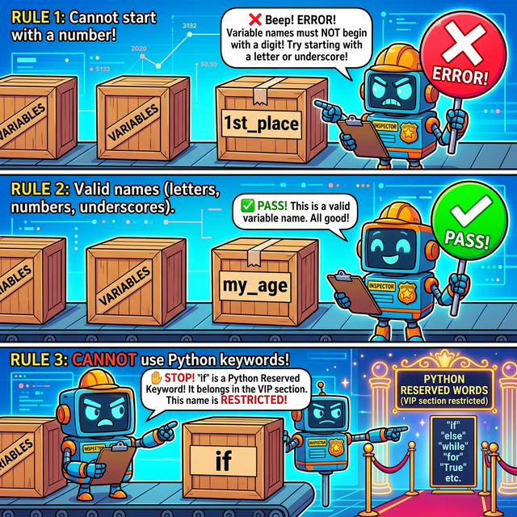

# 3.1.4 변수 이름 조건

## 학습목표
본 장에서는 파이썬 프로그램 내에서 객체의 이름(식별자)을 지을 때 반드시 지켜야 하는 필수 강제 규칙을 배웁니다. 나아가 코드를 읽기 쉽고 직관적으로 만들기 위해 개발자들 사이에서 권장되는 암묵적인 변수명 작성 관례(코딩 컨벤션)를 이해합니다.

프로그래밍 언어에서 개발자가 직접 만드는 변수, 함수, 클래스 등의 이름을 **식별자(Identifier)**라 합니다. 

파이썬에서 변수 이름을 지을 때는 시스템이 강제하는 **규칙(Rules)**과, 개발자들 사이에서 권장되는 **관례(Conventions)**를 모두 숙지해야 합니다. 이러한 규칙들은 코드의 가독성과 유지보수성을 극적으로 높여줍니다.


> 📥 **변수 이름 조건 실습용 노트북 다운로드 및 실행**: 
> - [로컬 환경용 다운로드](./source/example.ipynb) (VS Code 등에서 실행)
> - <a href="https://colab.research.google.com/github/jinydev/datas/blob/master/src/python/01_basic/04_variable_naming/source/example.ipynb" target="_blank"></a> (웹 브라우저에서 바로 실습)

## 1. 이름 짓기, 도대체 왜 중요할까?


*(웹툰 비유: 수학책에서는 식별할 데이터가 한두 개뿐이라 $x, y, z$ 로 충분했지만, 수십만 줄의 코드를 다루는 프로그래머에게 $x=100$은 도무지 알 수 없는 암호입니다. 대신 `player_health = 100` 이라고 길게 적어두면 누구나 체력 게이지임을 단번에 알아차릴 수 있습니다.)*

이전 장에서 우리는 수학의 대수학(문자 $x, y$)에서 프로그래밍의 변수 개념이 유래했다고 배웠습니다. 
하지만 한 가지 거대한 차이점이 있습니다. 수학 문제에서는 대입할 변수가 기껏해야 2~3개뿐이어서 알파벳 한 글자로 퉁쳐도 머릿속에서 구분이 가능했습니다. 그러나 실제 상용 프로그램이나 거대한 AI 모델에는 수천 개가 넘는 변수(투명 상자)들이 돌아다닙니다.

상자가 수천 개인데 이름표를 모두 $a, b, c, aa, bb$ 로 대충 붙여두면, 한 달 뒤에 코드를 연 자신조차 그 상자 안에 몬스터의 체력이 들었는지, 아니면 회사의 매출액이 들었는지 까맣게 잊어버리게 됩니다. **그래서 프로그래머들은 변수 이름을 지을 때 단어들을 결합하여 상자 안의 데이터(의미)를 명확하게 묘사하는 길고 구체적인 단어(영단어)를 사용합니다.**

---

## 2. 변수 이름 짓기 (필수 문법 규칙)


*(웹툰 비유: 깐깐한 파이썬 로봇 검사관이 변수 이름 상자들을 검사합니다. 숫자로 시작하거나 내부 예약 명령어를 이름으로 쓰면 가차 없이 SyntaxError 도장을 찍습니다.)*

파이썬의 식별자는 다음의 강제 규칙을 따라야 하며, 이를 위반할 경우 시스템 문법 오류(`SyntaxError`)가 발생하여 프로그램이 즉각 기절합니다.

1. **사용 가능 문자**: 영문 알파벳(대소문자 구별됨), 숫자, 밑줄(`_`)로만 구성해야 합니다. (`%`, `$`, `#` 등의 특수문자와 공백은 절대 사용할 수 없습니다.)
2. **숫자로 시작 금지**: 첫 글자는 반드시 알파벳이나 밑줄(`_`)로 시작해야 하며, **숫자로는 절대로 시작할 수 없습니다.** (이유는 아래쪽의 컴퓨터 공학 TMI에서 설명합니다!)
3. **대소문자 구분**: `data`와 `Data`는 서로 완전히 다른 변수 상자로 취급됩니다.
4. **마침표 연산자 금지**: 마침표 `.`는 소속을 나타내는 객체 탐색용 특수 연산자(`object.method()`)이므로 상자 이름표에 포함할 수 없습니다.
5. **예약어 사용 금지**: 파이썬 문법 대장정에 이미 찜(예약)해놓은 키워드(`if`, `for`, `class`, `while`, `True` 등)는 변수 이름으로 지정할 수 없습니다.

### 💡 (CS TMI) 왜 전 세계 컴퓨터 언어들은 변수명이 숫자로 시작하는 것을 극혐할까?

파이썬(인터프리터)이든 자바(컴파일러)든, 코드를 실행할 때 컴퓨터 내부에서는 인간의 코드를 기계어로 번역하는 **파서(Parser, 구문 분석기)** 로봇이 미친 듯이 코드를 스캔합니다.

이 파서 로봇은 속도가 생명입니다. 그래서 글자를 보자마자 **"첫 번째 딱 한 글자"**만 보고 이 덩어리의 정체를 0.001초 만에 유추해(Lexical Analysis) 냅니다.


*(다이어그램: 번역기 로봇이 텍스트의 첫 글자를 스캔합니다. 첫 글자가 '알파벳'이면 "아, 얘는 이름표(변수)구나!" 하고 변수 창고로 보내고, 첫 글자가 '숫자'이면 "아, 얘는 데이터 값(정수/실수)이구나!" 하고 계산기 창고로 보냅니다.)*

만약 변수 이름을 `1st_place` 라고 지을 수 있게 허락해버리면 어떻게 될까요?
파서 로봇이 코드를 훑다가 첫 글자 `1`을 봅니다. 로봇은 즉시 숫자 데이터(Literal)라고 확신하고 처리 준비를 하는데, 바로 뒤에 알파벳 `st_place`가 튀어나오면 로봇은 엄청난 혼란에 빠져 시스템이 마비(`SyntaxError`)되고 맙니다. 번역 로봇의 초고속 쾌적한 업무 처리를 지켜주기 위해, 인류의 모든 메이저 프로그래밍 언어들은 **"변수의 첫 글자는 무조건 알파벳 또는 밑줄로 시작하라!"**라는 강력한 법을 제정하게 된 것입니다.

### 파이썬의 예약어(Keyword)란?

**예약어**란 파이썬 언어 자체의 문법적인 용도로 이미 찜해두어(예약되어), 프로그래머가 임의의 변수명이나 함수명으로 사용할 수 없는 특별한 단어들을 뜻합니다.

*   제어문 관련: `if`, `elif`, `else`, `for`, `while`, `break`, `continue`
*   논리/불리언 관련: `True`, `False`, `None`, `and`, `or`, `not`
*   객체/함수 관련: `def`, `class`, `return`, `lambda`, `pass`

만약 파이썬에서 현재 사용 중인 전체 예약어 목록을 직접 확인하고 싶다면, 파이썬 내장 모듈인 `keyword`를 통해 출력해 볼 수 있습니다.

```python
# 3.1.4 파이썬의 현재 버전 예약어 목록 확인하기
import keyword
print(keyword.kwlist)
```

### 실습
실습을 통하여 변수의 규칙을 익혀봅시다.

```python
# 3.1.4 올바른 변수명 작성 예시
age = 19
my_age = 20
_height = 172.3
year_2026_asian = True   # 첫 글자가 숫자가 아니므로 통과!

# 3.1.4 잘못된 변수명 작성 예시 (주석을 풀고 실행하면 SyntaxError 기절 발생)
# 26worldcup = 2026 # 에러: 로봇이 첫 글자 '2'를 보고 숫자인 줄 알았다가 속았음!
# my.age = 21       # 에러: 마침표(.)는 객체의 속성을 파고드는 삽 모양 특수기호임
# my credits = 18   # 에러: 변수명 한 개인데 띄어쓰기를 하면 2개의 지시어로 착각함
# if = 10           # 에러: 파이썬이 문법용으로 아껴둔 예약어는 손대면 안 됨
```


## 3. 파이썬 코딩 컨벤션 (PEP 8): 착한 어른이들의 암묵적 룰

오류가 나지 않는다고 해서 모두 멋진 코드는 아닙니다. 가독성을 높이고 여러 사람과 협업하기 위해서는 모두가 공통으로 지키는 약속된 스타일 가이드가 필요한데, 이를 **코딩 컨벤션(Coding Convention)**이라고 부릅니다. 

파이썬의 공식적이고 절대적인 코딩 컨벤션 문서는 **'PEP 8 (Python Enhancement Proposal 8)'**입니다. 이는 파이썬 창시자 귀도 반 로섬이 직접 참여하여 만든 가이드라인으로, 전 세계 모든 파이썬 개발자들이 코드 작성 시 일차적으로 참고하는 표준입니다.

PEP 8에서 기본적으로 권장하는 식별자 명명 규칙은 다음과 같습니다.

1. **의미 있는 명명**: 그 용도나 저장된 데이터를 명확히 설명하도록 의미 있는 단어를 사용해야 합니다.
    - 좋은 예시: `user_age`, `total_price`, `is_active`
    - 나쁜 예시: `a`, `b`, `x1`, `temp2`

2. **스네이크 케이스 (snake_case)**: 파이썬에서 **변수명, 함수명, 모듈명**을 지을 때 가장 강력하게 권장되는 표준입니다. 
   - **모든 글자를 영문 소문자**로 작성하며, 
   - 단어와 단어 사이를 **밑줄(`_`)**로 이어붙여 가독성을 확보합니다.
   - 예시: `student_name`, `calculate_sum`, `max_value`

3. **파스칼 케이스 (PascalCase 또는 UpperCamelCase)**: 단어의 **첫 글자마다 늘 대문자**로 시작하고 밑줄 없이 딱 붙여 적는 방법입니다. 파이썬에서는 오직 **클래스(Class)**의 이름을 지을 때만 제한적으로 사용합니다.
    - 예시: `DataProcessor`, `UserAccount`, `MachineLearningModel`
    - *(※첫 글자를 소문자로 시작하는 일반 카멜 케이스(camelCase)는 파이썬에서 공식적으로 권장하지 않습니다.)*

4. **대문자 스네이크 케이스 (UPPER_SNAKE_CASE)**: 앞서 배운 **상수(Constant)**를 선언할 때는 모든 알파벳을 대문자로 적고 밑줄로 단어를 구분하여, 이 파일 내에서 값이 변하지 않을 것임을 널리 알립니다.
    - 예시: `MAX_OVERFLOW`, `TOTAL_COUNT`

이러한 약속(PEP 8)을 엄격하게 따르는 것은 내 코드를 깔끔하게 만들 뿐만 아니라, `다른 개발자들과 협업 시 서로 원활하게 코드를 읽고 소통`하기 위한 필수적인 기본기입니다.

## 정리
이번 장에서는 에러를 뿜어내는 '절대 피해야 할 잘못된 이름 짓기 규칙'과, 개발자들 간의 원활한 소통을 위한 '스네이크 케이스(snake_case)' 등의 올바른 이름 짓기 스타일을 배웠습니다. 좋은 프로그램은 기계뿐만 아니라 사람도 읽기 쉬워야 한다는 기본 철학을 반드시 명심해야 합니다.

---

## ☕ Java vs 🐍 Python 스나이퍼 비교

### 1. 코딩 컨벤션 (이름 짓기 관례)


*(다이어그램: 코딩 컨벤션의 차이를 보여줍니다. 뱀처럼 언더바로 이어가는 파이썬과 낙타 등처럼 대문자로 솟아오르는 자바의 스타일 차이를 확인하세요.)*

*   **Java**: 변수와 메서드(함수)의 이름을 지을 때 첫 글자는 소문자, 이어지는 단어의 첫 글자는 대문자로 쓰는 **카멜 케이스(camelCase)**를 절대적인 표준으로 사용합니다. (예: `calculateTotalSum()`)
*   **Python**: 변수, 함수, 모듈의 이름은 무조건 모두 소문자로 작성하고 단어 사이를 밑줄로 이어주는 **스네이크 케이스(snake_case)**를 표준(`PEP 8`)으로 삼습니다. (예: `calculate_total_sum()`)

> 🚨 **자바 개발자 주의점!**: 파이썬 개발팀에 합류해서 `getUserInfo()`처럼 카멜 케이스로 함수를 만들면, 파이썬 동료들은 매우 어색해하며 `PEP 8` 위반이라고 지적할 것입니다. 파이썬에서는 무조건 `get_user_info()`입니다!

---

## 🎧 Vibe Coding

코딩 컨벤션, 헷갈린다면 AI에게 코드 리뷰를 맡겨 교정해 보세요.

> **🗣️ 학생 프롬프트 (AI에게 이렇게 명령해 보세요):**
> "내가 짠 파이썬 코드인데 변수 이름들이 엉망진창이야. 파이썬 공식 코딩 스타일 가이드인 **PEP 8** 규칙에 완벽하게 맞도록 모든 변수명과 함수명을 수정해 주고, 왜 그렇게 고쳤는지 이유를 설명해 줘. (여기에 자유롭게 코드를 붙여넣으세요)"

---

## 코딩 영단어 학습 📝

*   **`Identifier`**: 식별자. (수많은 데이터와 함수들 사이에서, 내가 만든 대상을 콕 집어 구별해 내기 위해 프로그래머가 붙여준 고유한 '이름'입니다.)
*   **`Keyword` (Reserved Word)**: (파이썬 언어가) 찜해놓은 예약어. (언어 자체의 문법을 구성하기 위해 시스템이 꽉 쥐고 놓지 않는 단어들입니다. `if`, `for` 등을 변수 이름으로 쓰면 즉각 체포(에러)됩니다.)
*   **`Convention`**: 관습, 관례, 암묵적 약속. (문법적으로 틀리진 않지만, 전 세계 수백만 명의 파이썬 개발자들이 코드를 예쁘고 일관성 있게 짜자고 다 같이 굳게 한 약속(= PEP 8)입니다.)
