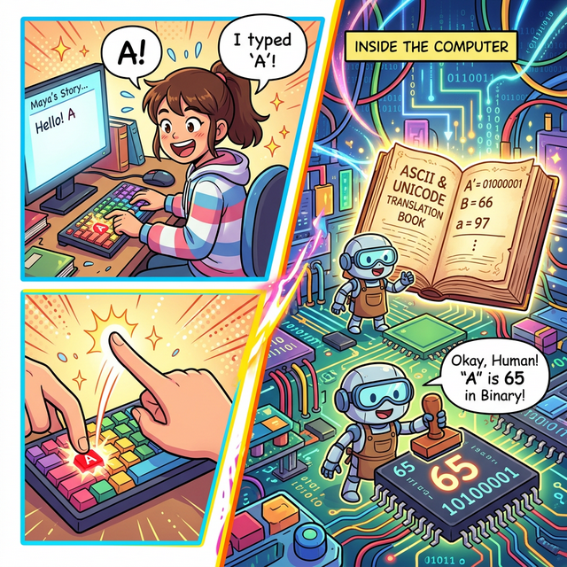

# 3.1.5.5 문자형과 인코딩: 컴퓨터에게 문자는 결국 숫자다

## 학습목표
눈앞에 보이는 수많은 언어의 '글자'들이 컴퓨터 내부에서는 어떻게 처리되는지 살펴봅니다. 문자는 결국 **고유한 번호가 매겨진 숫자(ASCII, Unicode)**라는 핵심 진리를 깨닫고, 파이썬에서 문자를 숫자로, 숫자를 문자로 상호 변환(`ord()`, `chr()`)하는 강력한 기능을 실습합니다.

---

## 1. 컴퓨터는 글자를 모른다 (ASCII & Unicode)


*(웹툰 비유: 인간이 키보드로 'A'라는 그림(문자)을 입력하면, 컴퓨터 내부의 번역가 로봇이 거대한 비밀 사전(ASCII)을 뒤적여 'A'에 매칭된 고유 번호 '65'를 찾아내어 반도체에 새겨넣는 모습)*

우리가 키보드를 두드려 텍스트를 입력할 때, 컴퓨터(CPU와 RAM)는 이 글자의 모양이나 뜻을 전혀 알지 못합니다. 컴퓨터는 오로지 $0$과 $1$의 전기 스위치로 이루어진 기계 덩어리입니다. 

그래서 전 세계의 천재 과학자들은 큰 테이블표(사전)를 하나 만들었습니다. "우리가 키보드에서 'A'를 누르면 컴퓨터야 너는 그것을 전기 신호 숫자 '65'로 외워라!", "알겠어!" 
이렇게 글자와 숫자를 1:1로 매칭시킨 전 세계적인 약속표를 **문자 인코딩(Character Encoding)** 체계라고 부릅니다.

### 1단계: 1Byte 우물 안 개구리 (ASCII)
**아스키코드(ASCII)**는 아주 옛날 미국에서 만든 표준 코드입니다. 오직 알파벳 대소문자, 숫자, 키보드 특수기호 등 $128(2^7)$개의 문자만을 $0$번부터 $127$번까지 숫자로 1:1 매칭시킨 가장 기초적인 비밀 사전입니다. 이 시절에는 불과 `1 Byte(8 비트)` 메모리만으로도 세상(미국)의 모든 글자를 담기에 충분했습니다.
*(예: 알파벳 대문자 `A` = `65`, 대문자 `B` = `66`, 소문자 `a` = `97`, 엔터키 = `10`)*


*(다이어그램: 수학 역사에서 $x^2 = -1$ 이라는 한계를 뚫기 위해 1차원 수직선에서 2차원 허수 평면으로 차원이 확장된 것처럼, 컴퓨터 구조 또한 수만 개의 다국어와 이모지를 담기 위해 메모리 한계를 부수고 4Byte 우주로 차원을 폭발적으로 확장한 흐름)*

### 2단계: 다차원 우주의 개막 (Unicode)
시간이 흘러 컴퓨터가 전 세계로 퍼졌지만, 1Byte짜리 아스키코드로는 한국어, 일본어, 아랍어, 심지어 😀이모지까지 세상의 모든 글자를 표현하기 턱없이 부족했습니다. 

마치 실수에서 복소수로 차원을 넓히듯, 컴퓨터 과학자들은 글자를 담는 메모리의 차원을 **최대 4 Bytes** 공간까지 폭발적으로 늘려 용량을 넉넉하게 확보했습니다. 전 세계의 모든 글자에 수십만 개의 고유 번호를 넉넉히 부여한 이 거대한 우주방위군 사전이 바로 **유니코드(Unicode)**와 그의 표현방식인 **UTF-8**입니다.

결론적으로 프로그래머의 시선에서 **문자(Character)는 눈에 보이는 그림 껍데기일 뿐, 본질은 철저하게 숫자(Number)**입니다.

---

## 2. 문자 $\leftrightarrow$ 숫자 양방향 변환 애니메이션

파이썬은 문자를 숫자로, 숫자를 문자로 상호 번역해주는 내장 함수(`ord()`, `chr()`)를 강력하게 지원합니다.


*(다이어그램: `ord()` 함수를 통과하면 인간의 문자가 컴퓨터 고유의 십진법 숫자로 번역되고, 그 숫자가 다시 `bin()`이나 `hex()`를 거쳐 컴퓨터 반도체의 2/16진법 전기 신호로 저장되는 데이터 파이프라인 흐름도)*

---

## 3. 파이썬 `ord()`와 `chr()` 실습

데이터 크롤링(웹 수집), 텍스트 자연어 처리(NLP), 암호학(Cryptography)에서는 이 변환 기술이 가장 기본이 됩니다. 파이썬의 변환 함수들은 유니코드 체계를 기반으로 하여 전 세계 모든 언어와 기호를 오차 없이 완벽히 지원합니다.

```python
# 1. ord() 함수 (Ordinal): 문자를 넣으면 컴퓨터 고유 번호(숫자)로 변환
print("--- [ ord(): 문자 -> 숫자 ] ---")
print("'A'의 번호 (ASCII 구역):", ord('A'))
print("'a'의 번호 (ASCII 구역):", ord('a'))
print("'가'의 번호 (Unicode 구역):", ord('가'))
print("'😀' 이모지의 번호 (Unicode 구역):", ord('😀'))

# 2. chr() 함수 (Character): 숫자를 넣으면 매칭되는 문자로 번환
print("\n--- [ chr(): 숫자 -> 문자 ] ---")
print("번호 66 에 맵핑된 글자 껍데기:", chr(66))
print("번호 44033 에 맵핑된 글자 껍데기:", chr(44033))

# 3. 암호화 원리 (시저 암호, Caesar Cipher 흉내내기)
# 문자를 숫자로 바꾼 뒤, 숫자 연산(수학)을 하고, 다시 문자로 덮어씌우는 완벽한 해킹(Hacking)
my_letter = 'H'
secret_code_number = ord(my_letter) + 3  # 'H'(72) 번호에서 3을 더해 75로 조작!
print(f"\n원본 '{my_letter}' 를 암호화하여 3칸 뒤로 밀면? -> '{chr(secret_code_number)}'")
```

**예측 출력:**
```text
--- [ ord(): 문자 -> 숫자 ] ---
'A'의 번호 (ASCII 구역): 65
'a'의 번호 (ASCII 구역): 97
'가'의 번호 (Unicode 구역): 44032
'😀' 이모지의 번호 (Unicode 구역): 128512

--- [ chr(): 숫자 -> 문자 ] ---
번호 66 에 맵핑된 글자 껍데기: B
번호 44033 에 맵핑된 글자 껍데기: 각

원본 'H' 를 암호화하여 3칸 뒤로 밀면? -> 'K'
```

---

## 4. 파이썬의 문자열형 데이터 타입 (`str`)

*   C나 Java 같은 언어는 문자 딱 하나만 담는 `char` 자료형과, 여러 글자를 기차처럼 엮은 문자열 `String` 자료형을 엄격하게 구분합니다.
*   하지만 유연함을 추구하는 데이터 분석용 **파이썬에는 `char` 자료형 자체가 없습니다.** 문자 1개이든, 100만 줄짜리 엄청난 길이의 뉴스 소설이든 모두 하나의 **문자열형(`str`)** 타입으로 퉁쳐서 관리합니다.

#### 간단한 결합과 반복
`str` 객체는 `+` 연산자로 문장들을 이어 붙이고, `*` 연산자로 특정 글자를 반복하여 프린트할 수 있는 편의 기능을 제공합니다.

```python
# 파이썬은 한 글자도, 여러 글자도 모두 <class 'str'>
c = 'A'
s = "Hello World"
print("타입 확인:", type(c), type(s))

# 빠른 문자열 수식
laugh = "하"
print(laugh * 5)  # 하하하하하
```

---

## 5. 텍스트 버그: 문자열 안의 숫자 꺼내기 (형변환)

데이터 분석이나 웹 크롤링을 하다 보면, 화면에는 분명히 숫자로 보이지만 파이썬 내부에서는 **따옴표로 묶인 문자열 글자(String)**인 경우가 허다합니다. 이 글자들을 그대로 더하면 수학적 덧셈이 아니라, 기차처럼 문자가 옆으로 이어붙는 대참사가 발생합니다.

반드시 파이썬의 형변환 캐스팅(Type Casting) 함수인 `int()`와 `float()`를 사용하여 **글자 껍데기를 벗겨내고 순수한 수학 숫자로 구출**해야 합니다.

```python
str_num1 = "10"
str_num2 = "20"

print("--- [ 1. 문자열 덧셈의 대참사 ] ---")
print("문자 병합 (+):", str_num1 + str_num2)  # 출력: 1020 (글자가 이어짐)

print("\n--- [ 2. 구출! 문자를 진짜 숫자로 (Type Casting) ] ---")
# int() 로 정수 구출
real_int1 = int(str_num1)
real_int2 = int(str_num2)
print("진짜 수학 덧셈 (int):", real_int1 + real_int2)  # 출력: 30

# float() 로 실수(소수점) 구출
str_float = "99.9"
real_float = float(str_float)
print("진짜 실수 연산 (float):", real_float + 0.1)  # 출력: 100.0
```

**예측 출력:**
```text
--- [ 1. 문자열 덧셈의 대참사 ] ---
문자 병합 (+): 1020

--- [ 2. 구출! 문자를 진짜 숫자로 (Type Casting) ] ---
진짜 수학 덧셈 (int): 30
진짜 실수 연산 (float): 100.0
```

---

## 6. 코딩 영단어 학습 📝

*   **`Char` (Character)**: 글자, 기호, 성질. (프로그래밍에서는 하나의 글자 껍데기를 지칭합니다.)
*   **`String` (str)**: 줄, 끈. (개별 글자들이 구슬처럼 끈으로 엮여서 만들어진 의미 있는 문장 데이터를 뜻합니다.)
*   **`Type Casting`**: 자료 형변환. (마치 금속을 녹여 다른 틀(캐스트)에 붓듯이, 문자열 `"10"`을 정수 `10` 모양틀(`int()`)로 부어 강제로 형태를 바꾸는 진화 마법입니다.)
*   **`ASCII`**: American Standard Code for Information Interchange. (세상에서 가장 유명한 128짜리 문자-숫자 변환 매칭 테이블표입니다.)
*   **`ord()`**: Ordinal (서수, 순서). (문자가 전체 백과사전에서 몇 번째 순서(고유 숫자)인지 꺼내오는 파이썬 함수입니다.)
*   **`chr()`**: Character. (순서 번호를 주면 그 자리에 매칭되어 있는 문자 껍데기를 꺼내오는 파이썬 함수입니다.)
