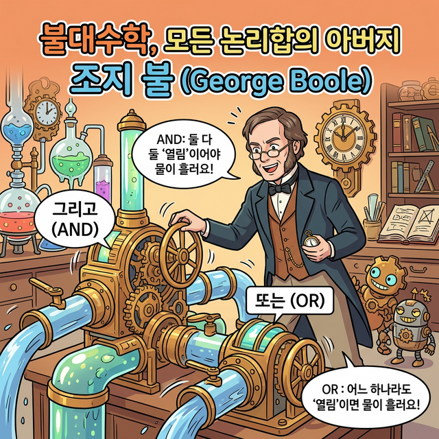
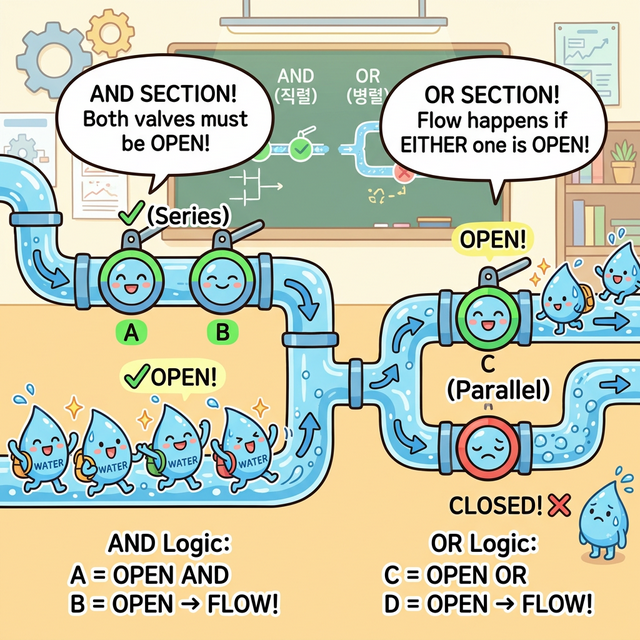

# 3.1.6.4 논리 연산자

## 논리 연산자

### 논리 연산자와 조지 불(George Boole)


*(웹툰 비유: 영국의 거장 수학자 조지 불은 철학의 '참/거짓 구조'를 수학 방정식 기호로 재창조했습니다. 그의 '불리언(Boolean)' 수학 모델은 수십 대 뒤 오늘날 컴퓨터 파이프라인의 핵심인 논리 밸브(`AND`, `OR`)의 뿌리가 되었습니다.)*

논리 연산은 1930년대에 일찍이 천재 수학자 조지 불이 완성한 **불대수학(Boolean Algebra)**에서 시작되었습니다. 불대수학은 철학의 명제가 '참(1)'인지 '거짓(0)'인지를 더하고(OR) 곱하여(AND) 수학적으로 연산하는 방법을 다루며, 이것이 오늘날 그대로 파이썬의 연산자로 이식되었습니다.

### 논리 연산 처리 원리 (수도관 밸브 모델)

논리 연산자는 위에서 배운 불리언 값(`True`, `False`)들을 재조합하여 더 거대한 조건을 설계할 때 사용됩니다. AND, OR, NOT 세 가지의 핵심 연산자가 있으며, 물이 통과하는 수도관의 최첨단 밸브(`True`=열림, `False`=닫힘)를 상상해 보세요!


*`AND`는 논리 파이프라인에 밸브 2개가 직렬로 묶여 있어 무조건 둘 다 열려야(True) 물이 통과하지만, `OR` 연산자는 파이프가 2갈래의 병렬로 찢어져 하나만 열려 있어도 물이 통과하는 수도관 모양의 웹툰입니다.*

- **`and` 연산자 (직렬 연결)**: 좌/우측의 평가 값이 **모두 참(`True`)일 때만** 안전문이 열려 `True`를 뱉어냅니다 (수학에서의 교집합/곱).
- **`or` 연산자 (병렬 연결)**: 좌/우측의 평가 값 중 **단 하나라도 참(`True`)이면** 언제나 쿨하게 `True`로 통과시킵니다 (수학에서의 합집합).
- **`not` 연산자 (신호 반전)**: 원래의 진리 값을 거꾸로 뒤집는 인버터 역할을 합니다. (참$\to$거짓, 거짓$\to$참)

### 논리 연산자 실습
실습을 통하여 논리 연산자 데이터 타입을 확인해 봅시다.

```python
# 3.1.6 기본 논리 연산
a = True
b = False
print("a and b (둘 다 참이어야 True) :", a and b)   # False
print("a or b  (하나라도 참이면 True) :", a or b)   # True
print("not a   (a 값을 반전)          :", not a)    # False

# 3.1.6 실무 응용: 복합 논리 평가 (할인 대상자 판별기)
# 조건: 총 구매 금액이 5만 원 이상이거나, VIP 등급 회원이어야 할인 적용
total_price = 45000
is_vip_member = True

# OR 연산자를 통해 둘 중 하나만 만족해도 True 반환
is_discount_eligible = (total_price >= 50000) or is_vip_member
print("할인 대상자 입니까? :", is_discount_eligible)

# 3.1.6 실무 응용: 유효한 범위 논리 평가
# 조건: 점수가 0점 이상 100점 이하의 정상적인 값인지 확인
score = 85
is_valid_score = (score >= 0) and (score <= 100)
print(f"입력된 점수 {score}는 정상 범위 통과 여부: {is_valid_score}")
```
**출력 예측 결과:**
```
a and b (둘 다 참이어야 True) : False
a or b  (하나라도 참이면 True) : True
not a   (a 값을 반전)          : False
할인 대상자 입니까? : True
입력된 점수 85는 정상 범위 통과 여부: True
```

---

## 코딩 영단어 학습 📝

*   **Logical**: 논리적. (두 개 이상의 조건이 맞물려서 돌아갈 때 판단하는 방식을 뜻합니다.)
*   **Boolean (bool)**: 불리언. (참/거짓 구조를 창시한 천재 수학자 조지 불(George Boole)의 이름에서 따온 수학 용어입니다. 파이썬에서는 ool이라고 줄여 씁니다.)
