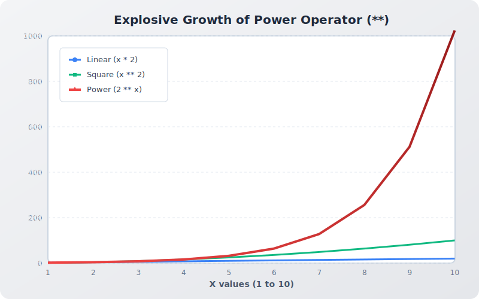

# 3.1.6.7 시각화 실습 및 코딩 영단어

## 📊 Matplotlib 맛보기: 거듭제곱 연산자(`**`)의 무서움 시각화

지수 성장을 일으키는 파이썬의 `**` 연산자가 얼마나 폭발적으로 증가하는지 그래프로 확인해 보겠습니다.


*파이썬의 지수 연산자(`**`)가 선형, 혹은 제곱 연산에 비해 얼마나 무서운 속도로 치솟는지 보여주는 시각화 자료입니다.*

```python
import matplotlib.pyplot as plt

# 시간(x)에 따른 세 종류의 성장 곡선 (y)
x_values = range(1, 11)   # 1부터 10까지
y_linear = [x * 2 for x in x_values]     # 2배씩 선형 증가 (x * 2)
y_square = [x ** 2 for x in x_values]    # 제곱 증가 (x^2)
y_power = [2 ** x for x in x_values]     # 2의 거듭제곱 (지수 증가, 2^x)

plt.figure(figsize=(8, 5))
plt.plot(x_values, y_linear, label='Linear (x * 2)', marker='o')
plt.plot(x_values, y_square, label='Square (x ** 2)', marker='s')
plt.plot(x_values, y_power, label='Power (2 ** x)', marker='^', color='red')

plt.title("Explosive Growth of Power Operator (**)")
plt.xlabel("X values")
plt.ylabel("Y values")
plt.legend()
plt.grid(True)
plt.show()
```

---

## 🎧 Vibe Coding

단락 평가(Short-Circuit Evaluation)라는 고급 프로그래밍 스킬을 AI에게 물어봅시다.


*OR 논리 게이트에서 첫 번째 방어문이 True로 열리자, 뒷길은 아예 무시해버리고 신나게 논리 미로를 탈출하는 파이썬 로봇 웹툰입니다.*

> **🗣️ 학생 프롬프트 (AI에게 이렇게 명령해 보세요):**
> "파이썬의 논리 연산자 `and`와 `or`를 쓸 때 발생하는 '단락 평가(Short-Circuit)'라는 특징이 뭐야? 이게 왜 프로그램의 성능(속도)을 높여주고 에러를 방지해 주는지 쉬운 예제 코드 2개랑 같이 설명해 줘."


