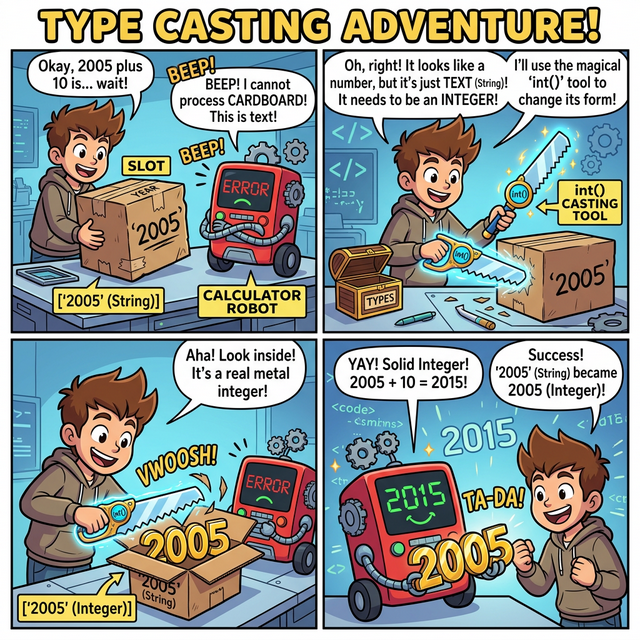

# 3.1.7 내장 함수와 기본 메서드 활용

## 학습목표
본 장에서는 별도의 무거운 파일 설치나 복잡한 코드 작성 없이 파이썬이 기꺼이 무료로 제공하는 강력한 기본 도구들인 **'내장 함수'**의 핵심 종류를 살펴봅니다. 또한, 데이터의 타입을 상황에 맞게 자유자재로 바꾸는 **'형 변환(Casting)'** 기술과 문자열, 리스트 등 각 자료형이 고유하게 품고 있는 특수 스킬인 **'메서드(Method)'**의 기본 활용법을 익힙니다.


> 📥 **내장 함수와 기본 메서드 활용 실습용 노트북 다운로드 및 실행**: 
> - [로컬 환경용 다운로드](./source/example.ipynb) (VS Code 등에서 실행)
> - <a href="https://colab.research.google.com/github/jinydev/datas/blob/master/src/python/01_basic/07_built_in_functions/source/example.ipynb" target="_blank"></a> (웹 브라우저에서 바로 실습)

## 내장 함수와 메서드
파이썬은 무거운 패키지나 모듈을 별도로 설치하지 않아도, 데이터를 쉽게 다루고 형 변환을 할 수 있게 도와주는 수많은 **내장 함수(Built-in Function)**와 **메서드(Method)**를 기본으로 제공합니다. 


*(AI가 그린 개념도: 파이썬이 기본으로 제공하는 특별한 공구 상자들(`print()`, `len()`, `type()`)이 개발자의 책상 위에 즉시 사용 가능하도록 준비된 모습을 보여줍니다.)*
빈번히 사용되는 기본 내장 함수는 다음과 같습니다.
- **입출력**: `input()`, `print()`
- **연산 및 통계**: `min()`, `max()`, `abs()`, `round()`
- **자료구조 생성/변환**: `list()`, `tuple()`, `set()`, `dict()`, `type()`
- **자료형 캐스팅(형 변환)**: `int()`, `float()`, `str()`, `bool()`

## 입출력과 데이터 형 변환(Casting)

`input()` 함수를 통해 사용자의 키보드 입력을 처리할 수 있습니다. 입력된 값은 기본적으로 **문자열(`str`)** 형태로 반환됩니다.

```python
year = input('당신이 태어난 년도는 ? ')
# 사용자가 2005를 입력
print("저장된 타입:", type(year)) # <class 'str'>
```

위의 경우 `year` 변수가 숫자 2005가 아닌 문자열 `"2005"`로 저장되어 있기 때문에 2026 - "2005" 같은 수학적 연산을 시도하면 즉각 에러가 발생합니다. 종이 상자("2005")와 쇳덩어리 숫자(2026)는 연산이 불가능하기 때문입니다.

### 마법의 껍질 벗기기: 형 변환 (Casting)


*(웹툰 비유: 계산기 로봇이 종이 박스("2005")를 보고 계산을 거부합니다. 그러자 주인공이 `int()`라는 마법의 칼로 종이 박스를 북북 찢어버리자, 그 안에서 진짜 쇳덩어리 숫자 `2005`가 등장하여 로봇이 기뻐하며 계산을 시작합니다!)*


*(다이어그램: 연산이 불가능한 점선 문자열 상자 `"2005"`가 `int()` 용광로 기계를 통과하자, 단단하고 덧셈 뺄셈이 가능한 정수 쇳덩어리 `2005`로 캐스팅(주조)되어 나오는 팩토리 애니메이션입니다.)*

이를 해결하기 위해 파이썬이 기본 제공하는 **형 변환(Casting)** 주문을 외워야 합니다.

**필수 형 변환 내장 함수 요약**
- **글자를 숫자로 (`str` $\to$ `int`/`float`)**: `int()`나 `float()`을 사용해 숫자 형태의 문자열 껍데기를 벗겨내고 진짜 계산 가능한 수치(정수/실수)로 제련합니다.
- **숫자를 글자로 (`int`/`float` $\to$ `str`)**: `str()`을 사용해 계산이 끝난 숫자를 다시 문자열 종이 박스에 포장합니다. (문장 더하기 `+`를 할 때 필수적입니다.)
- **논리 조작 (`bool`)**: `bool()`은 특정 값을 무조건 참(`True`)이나 거짓(`False`)으로 우격다짐 변환합니다. 빈 문자열(`""`)이나 `0`은 `False`가 되지만, 그 외의 텍스트("Hello")나 숫자(15)는 모두 `True`로 판별됩니다.

```python
# 입력과 동시에 숫자로 캐스팅(형 변환) 처리
year_num = int(input('당신이 태어난 년도는 ? '))
age = 2026 - year_num
print('선생님의 나이는:', age) # 이제 정상적으로 뺄셈 가능

# 문자열 변환 예제
temperature = 36.5
status = "현재 체온은 " + str(temperature) + "도 입니다."
print(status)
```

## 컬렉션 데이터들의 형 변환 

데이터 분석 과정에서는 리스트를 튜플로, 배열을 집합으로 자유롭게 변경해야 할 때가 많습니다. 역시 내장 함수를 사용합니다.

```python
# 리스트 ↔ 튜플
lst = [1, 2, 3]
tup = tuple(lst)

# 리스트, 튜플 → 집합 변환 (중복을 쉽게 제거하는 테크닉)
repeated_list = [5, 10, 10, 15]
unique_set = set(repeated_list) # {5, 10, 15}로 중복 파괴
```

## 산술 내장 함수 활용

기초적인 사칙연산 외에도 파이썬은 여러 수학 내장 함수를 제공하여 통계와 숫자 가공을 돕습니다.

```python
print("최댓값:", max(10, 100, 1))
print("최소값:", min([10, 11, 12]))
print("절댓값:", abs(-3))
print("반올림:", round(3.1415, 3)) # 소수점 셋째 자리까지 3.142
```


## 자주 쓰이는 자료형별 내장 메서드 (Method)

모든 객체는 내부에 고유한 동작을 수행하는 **메서드(Method)**를 갖추고 있습니다. 객체에 점(`.`)을 찍어 호출하며 데이터의 변형과 추출을 이끕니다.

## ① 문자열(str) 메서드
| 메서드 | 설명 |
| --- | --- |
| `upper()`, `lower()` | 모든 문자를 일괄 대/소문자로 변환합니다. |
| `replace(old, new)` | 문자열 안에 존재하는 특정 패턴 `old`를 찾아 `new` 텍스트로 치환합니다. |
| `split(sep)` | 구분자(`sep`)를 기준으로 하나의 거대한 문자열을 쪼개어 리스트 형태로 반환합니다. |
| `strip()` | 텍스트의 양쪽 끝에 붙어있는 불필요한 공백과 줄바꿈을 깔끔하게 제거합니다. |

## ② 리스트(list) 메서드
| 메서드 | 설명 |
| --- | --- |
| `append(item)` | 리스트 데이터의 맨 끝 라인에 새로운 요소를 밀어 넣습니다. 추가/확장에 가장 많이 쓰입니다. |
| `remove(item)` | 리스트 안에 존재하는 특정 값을 검색해 삭제합니다. |
| `pop(index)` | 원하는 인덱스 요소를 완전히 도려내어 반환합니다. 기본값은 맨 뒷 요소입니다. |
| `sort()` | 리스트 안의 모든 요소를 오름차순(기본값) 혹은 내림차순으로 예쁘게 정렬해 줍니다. |

## ③ 딕셔너리(dict) 메서드
| 메서드 | 설명 |
| --- | --- |
| `keys()`, `values()` | 딕셔너리에 존재하는 순수 키 목록, 혹은 순수 값 목록만 추출하여 반환합니다. |
| `items()` | (키, 값)의 구조를 튜플 조합으로 일괄 반복 생성합니다. `for`문과 함께 매우 폭넓게 사용됩니다. |
| `get(key)` | 해당하는 값(Value)을 안전하게 찾아서 반환합니다. 없으면 에러 발생 대신 `None`을 뱉어냅니다. |

## ④ 집합(set) 벤 다이어그램 연산
| 메서드 | 설명 |
| --- | --- |
| `add(item)` / `remove(item)` | 집합 전용 추가/삭제 메서드입니다. |
| `union()` / `intersection()` | 서로 다른 두 집합 간의 합집합(`A∪B`), 교집합(`A∩B`) 데이터를 새롭게 도출해 냅니다. |

## 정리
우리는 파이썬 코어 엔진이 기본으로 품고 있는 `input()`, `max()` 같은 훌륭한 내장 도구 공구 상자와, `int()`, `str()`을 통해 데이터 형태를 마음대로 찰흙처럼 구부려 맞추는 캐스팅(형 변환) 기술을 습득했습니다. 나아가, 각 자료형 자체가 몰래 숨기고 있는 자신만의 마법 주문서(`method`: `.upper()`, `.append()` 등)를 어떻게 꺼내 쓰는지 살펴봄으로써 데이터 조작의 새로운 장에 진입 완료했습니다.
