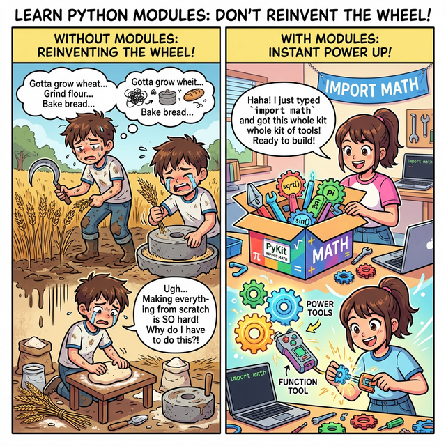

# 3.1.7 모듈과 라이브러리 (내장 모듈 math 활용)

## 학습목표
본 장에서는 남들이 피땀 흘려 만들어 놓은 코드를 재사용하는 **'모듈(Module)'**과 **'라이브러리(Library)'**의 짜릿한 개념을 비유를 통해 아주 직관적으로 확립합니다. 그리고 파이썬 기본 탑재 모듈 중 하나인 `math`를 내 코드로 당겨와(`import`), 직접 짜기 힘든 강력한 수학 공식들을 손쉽게 가져다 쓰는 방법을 익힙니다.


> 📥 **모듈과 라이브러리 (내장 모듈 math 활용) 실습용 노트북 다운로드 및 실행**: 
> - [로컬 환경용 다운로드](./source/example.ipynb) (VS Code 등에서 실행)
> - <a href="https://colab.research.google.com/github/jinydev/datas/blob/master/src/python/01_basic/07_math_module/source/example.ipynb" target="_blank"></a> (웹 브라우저에서 바로 실습)

## 바퀴를 다시 발명하지 마라 (Don't reinvent the wheel)


*(웹툰 비유: 빵을 만들기 위해 밀농사부터 짓는 고생스러운 방법과, 훌륭하게 구성된 조립/요리 세트(`import math`) 밀키트 상자를 주문해서 바로 완성하는 편안함을 대비시켜 보여줍니다. 모듈은 바로 이 '조립 밀키트'입니다!)*

이미 전 세계의 엄청난 개발자들이 만들어 놓은 훌륭한 도구들이 있습니다. 우리는 직접 복잡한 수식이나 알고리즘을 전부 구현할 필요 없이 `import` 키워드로 불러오기만 하면 됩니다.
마치 요리사가 식재료 농사부터 소스 제조까지 전부 다 수작업 하는 대신, 잘 손질된 훌륭한 **'밀키트'**를 사 와서 조리만 하는 것과 같습니다.
파이썬 생태계에서는 이런 변수, 함수, 클래스를 모아놓은 파이썬 스크립트 파일(.py)을 **모듈(Module)**이라 부르며, 이런 모듈의 집합체를 **라이브러리(Library) 또는 패키지(Package)**라고 부릅니다.

## 내장 모듈 (Standard Library): math 와 random 등

파이썬을 설치하면 기본적으로 포함된 '무료 밀키트'입니다. 내장 모듈은 따로 설치할 필요 없이 즉시 사용할 수 있습니다. 파이썬의 대표적인 내장 수학 모듈이 `math`로 다음의 수학 관련 상수와 함수가 내부에 정의되어 있습니다. (반대로, 누군가가 만들어 무료로 공개한 강력한 외부 도구들은 '외부 라이브러리'라 부르며 `pip install`로 다운로드해 써야 합니다. 예: `numpy`, `pandas`)

먼저 모듈 `math`를 메모리에 적재(load)하기 위해 구문 `import math as m`을 사용합니다. 여기서 `m`을 별명(alias)으로 지정해 `m.함수()`를 사용합니다. 

```python
import math as m

# 원주율 pi와 자연 상수 e 참조
print(m.pi, m.e)
```
**출력:**
```
(3.141592653589793, 2.718281828459045)
```

## math 모듈의 함수들

`math` 모듈은 다음과 같이 용도별로 수많은 강력한 수학 함수들을 빈틈없이 제공합니다. 파이썬 공식 문서를 보면 전체 목록을 확인할 수 있습니다만, 데이터 분석이나 프로그래밍 로직을 설계할 때 가장 빈번하게 쓰이는 핵심 함수들은 아래 표와 같습니다.

### 1. 기본 산술 및 통계 함수 (숫자 다듬기)

| 함수명 | 설명 | 예시 / 활용법 |
| --- | --- | --- |
| `ceil(x)` | **올림**: 값을 크거나 같은 가장 작은 정수로 만듭니다. | `math.ceil(3.2)` $\to$ `4`|
| `floor(x)` | **내림**: 값을 작거나 같은 가장 큰 정수로 만듭니다. | `math.floor(3.7)` $\to$ `3`|
| `trunc(x)` | **버림(절사)**: 방향 무시 소수점을 무조건 날려버립니다. | `math.trunc(-3.7)` $\to$ `-3` |
| `fabs(x)` | 실수 형태의 **절댓값**을 반환합니다. (음수를 양수로) | `math.fabs(-5.5)` $\to$ `5.5` |
| `factorial(x)`| **팩토리얼(계승)** `x!`을 계산합니다. (경우의 수) | `math.factorial(5)` $\to$ `120`|
| `gcd(a, b)` | 두 수의 **최대공약수(GCD)**를 구합니다. | `math.gcd(12, 16)` $\to$ `4`|
| `lcm(a, b)` | 두 수의 **최소공배수(LCM)**를 구합니다. (3.9+) | `math.lcm(4, 5)` $\to$ `20`|
| `prod(iterable)`| 리스트 등 데이터 집합 안의 모든 요소를 **곱합니다**. | `math.prod([2, 3, 4])` $\to$ `24`|
| `isclose(a, b)`| 두 실수가 연산 오차 범위 내에서 **거의 같은지** 판별합니다. | `math.isclose(0.1+0.2, 0.3)` $\to$ `True` |

### 2. 거듭제곱 및 로그 함수 (스케일 조절)

| 함수명 | 설명 | 예시 / 활용법 |
| --- | --- | --- |
| `pow(x, y)` | `x`의 `y` 거듭제곱을 계산합니다. ($x^y$) | `math.pow(2, 3)` $\to$ `8.0` |
| `sqrt(x)` | `x`의 **제곱근(루트)**을 구합니다. | `math.sqrt(16)` $\to$ `4.0` |
| `exp(x)` | 자연상수 $e$의 `x` 거듭제곱을 구합니다. ($e^x$) | 자연 지수 성장 계산 |
| `log(x, base)`| 지정된 밑(`base`)으로 **로그** 값을 구합니다. (기본은 자연로그)| `math.log(100, 10)` $\to$ `2.0` |
| `log10(x)` | 밑이 10인 상용로그 값을 빠르게 구합니다. | 과학 스케일 조절, 자릿수 계산 |

### 3. 기하학 및 삼각함수 (공간 및 파동)

| 함수명 | 설명 | 예시 / 활용법 |
| --- | --- | --- |
| `pi`, `e`, `tau`| 상수 **원주율 $\pi$**, **자연대수 $e$**, 상수 $\tau$ ($2\pi$) | `math.pi` |
| `sin`, `cos`, `tan`| **삼각함수** (라디안 단위 입력 기준 동작) | 사인, 코사인 파동 애니메이션 생성 |
| `radians(x)` | 평범한 **각도(Degree)** 값을 라디안으로 변환 | `math.radians(180)` $\to$ `3.14159...`|
| `degrees(x)` | **라디안(Radian)** 값을 평범한 360 각도로 변환 | `math.degrees(math.pi)` $\to$ `180.0`|
| `hypot(x, y)` | 피타고라스 정리로 원점에서 점까지의 **유클리드 거리**(대각선)| 빗변 길이 최적 계산 |
| `dist(p, q)` | 두 점(튜플 기반 다차원 좌표) 사이의 공간 거리를 계산 | `math.dist((0,0), (3,4))` $\to$ `5.0` |

---

### 제곱근(`sqrt`)과 강력한 거듭제곱(`pow`)

`math.sqrt()`(Square Root) 함수는 어떤 숫자의 제곱근(√)을 무조건 실수(`float`) 형태로 정확히 반환합니다. 파이썬 문법 자체에 거듭제곱(`**`) 기호가 이미 있지만, 전체적인 계산식의 형식을 수학적으로 일관성 있게 통일하기 위해 `math.pow(x, y)` 함수도 세트로 자주 쓰입니다.

**실전 응용: 피타고라스의 정리 (Pythagorean Theorem) 계산기**
게임에서 캐릭터와 몬스터 사이의 대각선 거리를 구하거나, 통계 데이터의 유클리드 거리를 잴 때 가장 많이 쓰이는 기하학 공식입니다. 직각삼각형의 두 변의 길이(`A`, `B`)를 알고 있을 때, 빗변 대각선(`C`)의 길이를 $C = \sqrt{A^2 + B^2}$ 수식을 통해 단숨에 구할 수 있습니다. 

```python
import math as m

side_a = 3
side_b = 4

# 피타고라스 정리 적용: 빗변 C = √(a^2 + b^2)
hypotenuse_c = m.sqrt(m.pow(side_a, 2) + m.pow(side_b, 2))

print(f"가로 {side_a}, 세로 {side_b} 일 때, 대각선(빗변) 길이는 {hypotenuse_c} 입니다.")
```

### 천장, 바닥, 그리고 무자비한 절단 (올림/내림/버림)

수많은 소수점 데이터들을 통계적으로 단정하게 다듬기(Rounding) 위해 세 가지 함수를 사용합니다.


*(다이어그램: 1. `ceil()`은 숫자를 엘리베이터 천장 층으로 강제로 끌어올립니다. 2. `floor()`는 숫자를 무거운 중력으로 바닥 층으로 끌어내립니다. 3. `trunc()`는 소수점 이하의 자잘한 숫자들을 칼로 무자비하게 단칼에 베어 버립니다.)*

1. **`math.ceil(x)` (올림)**: Ceiling(천장)의 약자로, 입력된 소수점 값보다 크거나 같은 **최소의 정수**(가장 가까운 위층)로 강제로 끌어올립니다.
2. **`math.floor(x)` (내림)**: Floor(바닥)의 약자로, 입력된 값보다 작거나 같은 **최대 정수**(가장 가까운 아래층)로 무겁게 끌어내립니다.
3. **`math.trunc(x)` (버림)**: Truncate(자르다)의 약자로, 향하는 방향(위/아래) 따위는 신경 쓰지 않고 무작정 소수점 부분을 날려버리고 정수 부분만 시원하게 취합니다.

```python
import math as m

# 1. math.ceil (올림: 상승!)
print(f"3.1의 올림: {m.ceil(3.1)}")    # 4
print(f"-3.7의 올림: {m.ceil(-3.7)}")  # -3 

# 2. math.floor (내림: 하강!)
print(f"3.7의 내림: {m.floor(3.7)}")   # 3
print(f"-3.1의 내림: {m.floor(-3.1)}") # -4 

# 3. math.trunc (절사: 방향 무시 소수점 삭제)
print(f"3.999의 절사: {m.trunc(3.999)}")    # 3
print(f"-3.999의 절사: {m.trunc(-3.999)}")  # -3
```

## 정리
프로그래머의 가장 위대한 덕목은 역설적이게도 '게으름(중복되는 코딩 수고로움을 거부하는 것)'입니다. 이미 발명된 둥근 바퀴를 처음부터 다시 깎아내려 하지 말고, 단 한 줄의 `import` 주문을 통해 수만 명의 선배 천재 개발자들이 미리 검증해 놓은 훌륭한 부품(모듈/라이브러리)을 조립식 장난감처럼 합치는 거인의 어깨 위에 서는 방법을 배웠습니다. 파이썬 기본 제공 `math` 모듈은 그 무한한 외부 생태계(Pandas, Scikit-Learn 등)로 들어가는 짜릿한 첫 경험이자 발판에 불과합니다.

---

## ☕ Java vs 🐍 Python 스나이퍼 비교

### 1. 외부 기능 불러오기 (Import)
*   **Java**: `import java.util.Scanner;` 처럼 클래스나 패키지 경로를 선언해 주고 빌드 시 포함시킵니다. 수학 관련 내장 클래스인 `Math`는 `import` 없이 `Math.sqrt()` 형태로 전역적으로 기본 제공됩니다.
*   **Python**: `import math` 명령어 하나로 별도의 파이썬 파일(.py)에 있는 모든 기능을 현재 내 도화지 위로 쏟아붓습니다. 

### 2. 별명(Alias) 지정하기
*   **Java**: 파일명 중복을 피하기 위한 별명 지정 모듈 임포트 기능이 자체적으로 존재하지 않으며, 전체 경로를 명시해야 합니다.
*   **Python**: `import math as m` 처럼 `as 별명` 키워드를 써서 타이핑 길이를 획기적으로 줄일 수 있습니다. 데이터 과학의 국룰인 `import numpy as np`, `import pandas as pd`가 모두 이 문법에서 나옵니다.

---

## 📊 Matplotlib 맛보기: 삼각함수 파동 그리기


*(다이어그램: `math.sin()`과 `math.cos()` 함수가 각도에 따라 만들어내는 규칙적이고 부드러운 교차 파동 곡선의 형태를 애니메이션으로 확인하세요.)*

`math` 모듈에서 제공하는 `sin`과 `cos` 함수를 이용해 소리로 들리거나 빛으로 보이는 파동(Wave) 그래프를 멋지게 그려 봅시다.

```python
import math
import matplotlib.pyplot as plt

# 0도부터 360도까지 점찍을 X 좌표 (라디안 변환)
x_angles = range(0, 360, 5)  # 5도 간격으로 촘촘히 
x_radians = [math.radians(deg) for deg in x_angles]

# Y 좌표 (sin과 코sin 파동 계산)
y_sin = [math.sin(rad) for rad in x_radians]
y_cos = [math.cos(rad) for rad in x_radians]

plt.figure(figsize=(10, 4))
plt.plot(x_angles, y_sin, label='Sine Wave (sin)', color='blue', linestyle='-')
plt.plot(x_angles, y_cos, label='Cosine Wave (cos)', color='orange', linestyle='--')

plt.title("Trigonometric Waves using math module")
plt.xlabel("Angle (Degrees)")
plt.ylabel("Amplitude")
plt.axhline(0, color='black', linewidth=0.5, linestyle='--') # 중앙선 가이드 라인
plt.legend()
plt.grid(True)
plt.show()
```

---

## 🎧 Vibe Coding

이제는 라이브러리를 직접 만들고 배포하는 생산자가 되어 보세요.

> **🗣️ 학생 프롬프트 (AI에게 이렇게 명령해 보세요):**
> "파이썬에서 내가 직접 `my_calculator.py`라는 모듈(파일)을 만들고, 거기에 덧셈/뺄셈 함수를 넣은 뒤, 메인 실행 파일에서 `import`해서 사용하는 방법을 중학생 수준에서 스텝바이스텝으로 그림 그리듯 자세히 알려줘."

---

## 코딩 영단어 학습 📝

*   **`Module`**: 모듈, 교체 가능한 독립적인 부품. (레고 블록 하나하나를 뜻합니다. 파이썬에서는 남이 만들어 놓은 `.py` 텍스트 코드 파일 한 장을 의미합니다.)
*   **`Library`**: 도서관. (파이썬에서는 쓸만한 모듈(책)들을 용도별로 잘 모아놓은 상자(도서관)를 뜻합니다.)
*   **`Import`**: 수입하다, 밖에서 안으로 가져오다. (외부에 있는 모듈이나 라이브러리의 기능들을 현재 내 코드 화면 안으로 끌어당겨 오는 역할을 하는 필수 마법 주문입니다.)