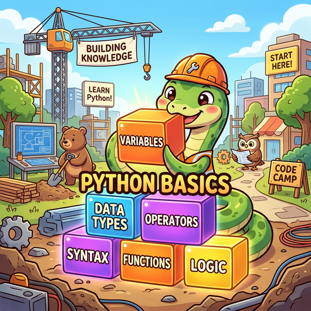

# 3.1 파이썬 언어 기초 (Python Basics)

## 학습목표
건물을 올리기 위해 가장 먼저 튼튼한 지반을 다지는 기초 공사 단계입니다. 수학의 $x$, $y$와 같은 데이터 보관함인 **변수(Variable)**, 상자에 담기는 내용물의 종류를 규정하는 **자료형(Data Type)**, 그리고 이 데이터들을 지지고 볶아 새로운 결과를 낳는 **연산자(Operator)**의 핵심 철학을 내재화합니다. 이 과정에서 C/Java와 같은 정통 언어와 차별화되는 파이썬만의 '유연한 객체 지향 동적 타입' 메커니즘을 명확히 이해합니다.

## 세부 학습 목차

### [3.1.1 데이터 분석 언어와 파이썬의 미래](./01_python_intro/)
수많은 프로그래밍 언어 중 왜 하필 "파이썬(Python)"이 4차 산업혁명과 인공지능 시대의 표준 링구아 프랑카(Lingua Franca)가 되었는지, 그 비전과 철학을 거시적인 관점에서 살펴봅니다.

### [3.1.2 주석과 상수](./02_comments_constants/)
컴퓨터가 아닌 사람을 위한 메모리표인 주석(Comment) 작성법과, 변하지 않는 고정된 값 자체를 나타내는 리터럴/상수(Literal/Constant)의 개념을 짚고 넘어갑니다.

### [3.1.3 변수와 대입](./03_variables_assignment/)
오른쪽의 값을 왼쪽의 이름표 상자에 집어넣는 '대입 연산자(=)'의 진정한 의미를 깨닫고, 런타임에 스스로 형태를 바꾸는 파이썬의 놀라운 '동적 타입(Dynamic Type)' 기술과 다중 대입을 통한 값 교환(Swap) 테크닉을 배웁니다.

### [3.1.4 변수 이름 조건](./04_variable_naming/)
코드의 가독성을 결정짓는 8할은 제대로 된 이름 짓기입니다. 식별자(Identifier)를 지을 때 파이썬이 강제하는 문법적 규칙과, 전 세계 개발자들이 암묵적으로 합의한 코딩 컨벤션(Naming Convention)을 숙지합니다.

### [3.1.5 자료형(Data Types)의 이해](./05_data_types_operators/)
정수(int), 실수(float), 문자열(str), 논리형(bool) 등 파이썬이 세상을 인식하는 기본 데이터 구조와 수의 체계를 낱낱이 파헤칩니다.

### [3.1.6 다양한 연산자](./06_various_operators/)
단순한 덧셈, 뺄셈을 넘어 파이썬 몫(`//`)과 거듭제곱(`**`) 연산을 다루며, 추후 조건문을 통제할 비교 연산자와 논리 연산자(and, or, not) 파이프라인의 원리를 마스터합니다.

### [3.1.7 내장 함수와 메서드 활용](./07_built_in_functions/)
설치 직후부터 무상으로 제공되는 파이썬의 든든한 기본 장비들, 즉 화면에 글씨를 띄우는 `print()`, 입력을 받는 `input()` 등 핵심 내장 함수의 활약상을 알아봅니다.

### [3.1.8 내장 모듈 math 활용](./07_math_module/)
기본 산술 연산을 넘어 삼각함수, 로그, 파이(π) 등 복잡한 수학 공식이 필요할 때 든든한 아군이 되어줄 `math` 모듈의 소환법(`import`)을 맛봅니다.

---

## 🎉 정리
축하합니다! 프로그래밍의 가장 기본적이면서도 가장 중요한 3대장, 즉 **"어디에 담을 것인가(변수), 무엇을 담을 것인가(자료형), 어떻게 가공할 것인가(연산자)"**에 대한 완전한 해답을 얻었습니다. 이제 이 기초 벽돌들을 자유자재로 다루는 법을 깨달았으니, 다음 장(3.2 제어 흐름)에서는 이 벽돌들이 무식하게 일직선으로만 놓이지 않도록 길을 비틀고 돌려세우는 '교통정리' 기술을 배워보겠습니다!