# 3.2.1 제어 흐름과 함수

## 조건문 if


*(조건문 개념도: 데이터 점이 조건식의 평가(참/거짓) 결과에 따라 서로 다른 블록으로 분기 처리되는 과정을 시각화한 애니메이션)*

데이터의 분기를 나누고 전처리를 하다 보면, 특정 조건에 맞게 값이나 그룹을 변경하는 일이 빈번합니다. 파이썬의 꽃이라고 할 수 있는 제어 흐름의 기본기, 조건문 `if`에 대해 알아봅니다.

### 조건문 흐름도 (Mermaid)

파이썬의 조건문이 실행되는 논리적인 흐름을 아래의 다이어그램으로 살펴볼 수 있습니다. 조건이 참(True)인지 거짓(False)인지에 따라 프로그램의 판별 경로가 엇갈리게 됩니다.

```mermaid
graph TD
    A([Start]) --> B{조건식 평가<br/>(예: n % 2 == 0)}
    B -- True --> C[if 블록 실행<br/>(예: 짝수 출력)]
    B -- False --> D[else/elif 블록 확인<br/>또는 건너뜀]
    C --> E([End])
    D --> E
```

### 블록 문장 조건문 if

파이썬은 C, Java와 같은 블록 구조 언어지만 **중괄호 `{}` 대신 들여쓰기(Indentation)**를 사용하여 블록을 구분합니다. 관례적으로 스페이스 4칸을 사용합니다. 반드시 콜론 `:`으로 헤더를 마무리해야 합니다.

```python
n = 20

# 조건이 참이므로 들여쓰기 된 블록이 실행됨
if n % 2 == 0:
    print("짝수")
```
**출력:**
```
짝수
```
*(참고: 만약 `n = 21`이었다면 거짓이 되어 아무 일도 일어나지 않습니다.)*

### 양자택일 조건문 if ... else ...

특정 조건을 만족하는 경우와 만족하지 않는 경우에 다른 연산을 지정하는 구문입니다. 조건이 거짓이면 자동으로 `else:` 내부의 블록이 실행됩니다.

```python
x = 3

if x > 4:
    y = 1
else:
    y = 2

print(y)
```
**출력:**
```
2
```

### 삼항 연산자를 이용한 한 줄 조건문 (One-line if)

단순한 값 할당을 위한 `if ~ else` 구문은 한 줄로 합쳐서 매우 간결하게 표현할 수 있습니다. `참일때의값 if 조건식 else 거짓일때의값` 형태입니다.

```python
age = 18

# 간결한 한 줄 표현
status = '성인' if age >= 20 else '미성년자'
print(status)
# 출력: 미성년자
```

**[심화 활용: 리스트 내포와 결합]**
데이터 분석 시 리스트 내포(List Comprehension) 안에 한 줄 조건문을 넣어 벡터처럼 각 원소 단위로 조건을 검사하고 변경할 수 있습니다.

```python
x = [1, -2, 3, -4, 5]
# 모든 원소를 순회하며 0을 기준으로 양/음수 라벨링
result = ["양수" if value > 0 else "음수" for value in x]
print(result)
```
**출력:**
```
['양수', '음수', '양수', '음수', '양수']
```

### 반복된 다중 조건문 if ... elif ... else

Python에서는 조건 판단이 3갈래 이상으로 나뉘는 경우 `elif` (else if의 줄임말) 구문을 사용합니다. 첫 조건부터 순차적으로 검사하며, 한 번이라도 참을 달성하면 하위 조건들은 건너뜁니다.

```python
point = 85

if 90 <= point:
    print('A')
elif 80 <= point:
    print('B')
elif 70 <= point:
    print('C')
else:
    print('F')
```
**출력:**
```
B
```

### 논리 연산자(and, or, not)를 활용한 다중 조건문

여러 조건을 동시에 평가해야 할 때는 논리 연산자를 사용합니다.
- `and`: 모든 조건이 참일 때 블록을 실행합니다.
- `or`: 하나라도 조건이 참이면 블록을 실행합니다.
- `not`: 조건의 참/거짓 값을 반대로 뒤집습니다.

```python
age = 25
has_ticket = True

# 두 조건을 모두 만족해야 입장 가능
if age >= 19 and has_ticket:
    print("관람이 가능합니다.")
else:
    print("입장할 수 없습니다.")
# 출력: 관람이 가능합니다.
```

### 포함 여부를 검사하는 멤버십 연산자 (in, not in)

리스트, 튜플, 문자열 등 연속형 자료 안에 특정 값이 들어 있는지 확인할 때 `in`과 `not in` 연산자를 활용하면 매우 직관적인 조건 처리가 가능합니다.

```python
allowed_users = ["Alice", "Bob", "Charlie"]
user = "David"

if user not in allowed_users:
    print(f"경고: {user}는 허가되지 않은 사용자입니다.")
```

### 중첩 조건문 (Nested if)

`if` 블록 안에 또 다른 `if` 블록을 중첩시켜, 조건 판별을 단계적으로 깊숙하게 들어갈 수도 있습니다. 단, 너무 많은 중첩 조건문은 코드의 가독성을 해치므로 적절히 분리하는 것이 좋습니다.

```python
score = 85
attendance = 100

if score >= 80:
    print("성적 평가는 통과했습니다.")
    
    # 1차 조건을 통과한 경우에만 내부 if문을 검사
    if attendance == 100:
        print("최종 합격: 장학금 지급 대상입니다!")
    else:
        print("최종 합격: 하지만 결석이 있어 장학금은 제외됩니다.")
else:
    print("성적 미달로 불합격입니다.")
```

### 파이썬의 암묵적인 참/거짓 (Truthy & Falsy)

파이썬에서는 굳이 세부적인 비교 연산자(`==`, `>`, `<`)를 쓰지 않아도 데이터 자체가 문맥에 따라 `True`나 `False`로 판별되는 **암묵적인 논리 평가** 특징이 있습니다. 데이터가 "비어 있느냐, 값이 없느냐"를 가장 파이썬답고 세련되게 검사하는 패턴입니다.

- **Falsy 평가 (거짓 처리)**: `0`, `0.0`, `""`(빈 문자열), `[]`(빈 리스트), `()`, `{}`, `None`, `False`
- **Truthy 평가 (참 처리)**: 위를 제외한, 값이 채워져 있는 모든 데이터

```python
user_name = ""  # 빈 문자열은 Falsy로 평가됨
items = []      # 빈 리스트도 Falsy로 평가됨

# user_name이 비어있으면 if문 조건은 False가 되어 else 블록으로 떨어짐
if user_name:
    print(f"환영합니다, {user_name}님.")
else:
    print("이름이 입력되지 않았습니다.")
    
# 리스트에 데이터가 있는지 없는지 직관적으로 확인
if not items:
    print("장바구니가 비어 있습니다.")
```

### [실전 예제] 게임 체력(HP) 상태 경고 시스템

조건 판단이 여러 갈래로 나뉘는 `if ~ elif ~ else` 구문은 실제 프로그래밍 로직을 분기하는 데 매우 흔하게 쓰입니다. 예를 들어 게임 캐릭터의 체력 상태에 따른 경고 시스템을 다음과 같이 설계할 수 있습니다.

```python
hp = 30

# 조건 1: 체력이 20 이하니?
if hp <= 20:
    print("⚠️ 위험! 포션을 사용하세요!") # 참일 때 실행
    
# 조건 2: (위 조건이 아니고) 체력이 50 이하니?
elif hp <= 50:
    print("주의! 체력을 관리하세요.")   # 조건 1은 거짓, 조건 2는 참일 때 실행
    
# 그 외 모든 경우
else:
    print("상태 양호. 전투를 계속합니다.") # 위 모든 조건이 거짓일 때 실행
```

### [데이터 분석] np.select() 조건 처리

Python 기본 제어문을 넘어 Pandas 등 대용량 데이터 전처리를 할 때, `numpy.select()`를 응용하면 중첩된 `if else` 없이 여러 조건을 깔끔하게 처리할 수 있습니다. 각 조건에 대한 결과 배열을 매핑합니다.

```python
import numpy as np

arr = np.array([1, -2, 3, -4, 0])

# 분기될 조건들의 리스트
conditions = [arr > 0, arr == 0, arr < 0]
# 조건에 매칭되어 반환될 값 리스트
choices = ["양수", "0", "음수"]

result = np.select(conditions, choices)
print(result)
```
**출력:**
```
['양수' '음수' '양수' '음수' '0']
```
