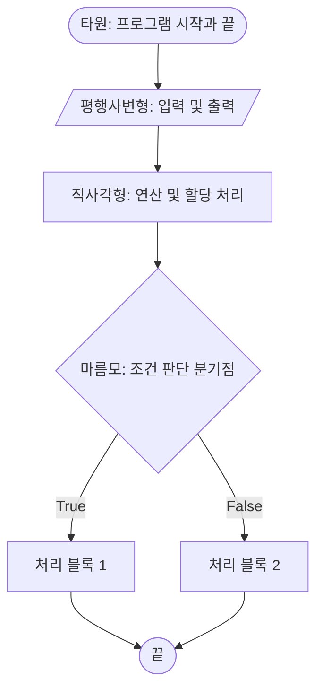
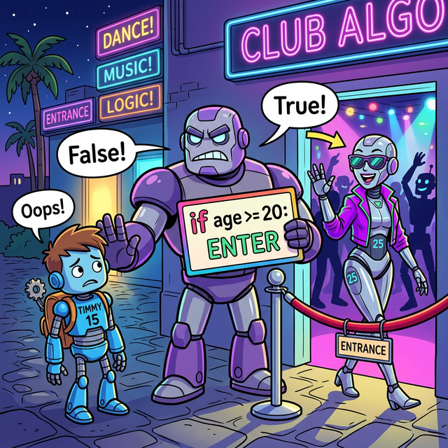
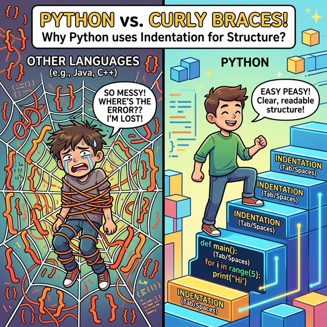
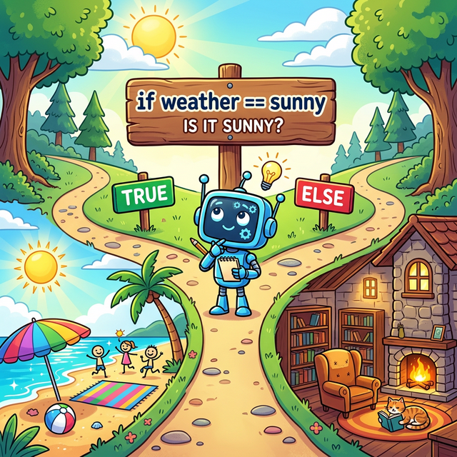
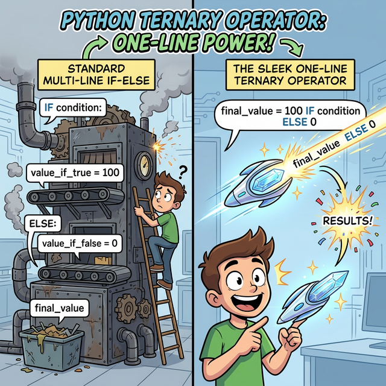

# 3.2.1 조건문 기초: 분기 이론과 if/else

## 1. 제어 흐름과 분기(Branching) 이론

컴퓨터 프로그램은 기본적으로 소스 코드를 위에서 아래로 한 줄씩 순차적으로(Sequential) 실행합니다. 하지만 현실 세계의 복잡한 로직을 처리하려면, 특정 조건에 따라 프로그램의 흐름을 쪼개서 서로 다른 길로 보내는 **분기(Branching)** 작업이 필수적입니다.

### 순서도(Flowchart)의 기본 기호

알고리즘을 시각적으로 설계할 때 전 세계적으로 통용되는 **표준 순서도(Flowchart)** 기호들을 먼저 알아봅시다.



*   **타원 (Terminal)**: 프로그램의 시작(Start)과 종료(End)를 알립니다.
*   **평행사변형 (Input/Output)**: 사용자로부터 데이터를 받거나(`input()`) 화면에 출력(`print()`)합니다.
*   **직사각형 (Process)**: 변수에 값을 대입(`=`)하거나 덧셈 뺄셈 등 수학적 계산을 처리합니다.
*   **마름모 (Decision)**: 오늘 배울 가장 중요한 기호입니다. 내부에 조건식(예: `나이 >= 20`)을 담고 있으며, 그 결과가 참(True)인지 거짓(False)인지에 따라 나가는 화살표 길이 달라집니다.

---

## 2. 조건문 if (단일 분기)


*(웹툰 비유: 클럽 입구에 선 무서운 가드 로봇이 '나이가 20살 이상인가?'라는 조건식 표지판을 들고 있습니다. 15살 로봇은 '거짓(False)' 판정을 받아 쫓겨나고, 25살 로봇은 '참(True)' 판정을 받아 문 안으로 통과하는 재미있는 분기(Branching) 상황입니다.)*

데이터의 분기를 나누고 전처리를 하다 보면, 특정 조건에 맞게 값이나 그룹을 변경하는 일이 빈번합니다. 파이썬의 꽃이라고 할 수 있는 제어 흐름의 기본기, 조건문 `if`에 대해 알아봅니다.

### 블록 문장 조건문 if (왜 중괄호 대신 들여쓰기를 쓸까?)

파이썬은 C, Java와 같은 기존 언어들과 달리 **중괄호 `{}` 대신 오직 '들여쓰기(Indentation)'**만을 사용하여 코드 블록을 묶고 구분합니다.


*(웹툰 비유: 왼쪽의 다른 언어 프로그래머는 수많은 중괄호 `{}` 거미줄에 갇혀 코드의 논리를 잃고 괴로워하고 있습니다. 하지만 오른쪽의 파이썬 프로그래머는 자로 잰 듯 완벽하게 정렬된 '들여쓰기 블록 계단'을 가뿐하게 오르며 여유롭게 코드를 식별합니다!)*

#### "가독성이 왕이다" (Readability Counts)
파이썬 창시자 귀도 반 로섬(Guido van Rossum)은 **"코드는 작성되는 시간보다 다른 사람에 의해서 읽히는 시간이 훨씬 길다"**고 굳게 믿었습니다. 

자바나 C에서는 중괄호만 맞으면 띄어쓰기를 엉망으로 섞어 써도 컴퓨터는 군말 없이 코드를 실행해 줍니다. 하지만 파이썬은 **"사람의 눈에 보이는 시각적 들여쓰기 구조가 곧 실제 컴퓨터가 인식하는 논리 구조와 100% 동일하도록"** 프로그래머에게 규칙을 강제합니다. 

관례적으로 **스페이스 4칸**을 사용합니다. 블록을 시작하기 전(예: `if` 조건식 끝)에는 반드시 콜론 `:`을 찍어 "이제부터 새로운 블록 계단이 시작된다"고 변환기에게 예고해야 합니다.

> [!WARNING]
> **난간 없는 계단의 공포: `IndentationError`**
> 중괄호 지옥에서 해방된 대가는 **'엄격한 줄 맞춤'**입니다. 난간이 없는 계단과 같아서 발을 헛디디면 바로 추락합니다. 단 하나의 스페이스 결함이나 탭(Tab) 혼용이 에러를 발생시킵니다.

```python
n = 20

# 조건이 참이므로 들여쓰기 된 블록이 실행됨
if n % 2 == 0:
    print("짝수")
```

---

## 3. 양자택일 조건문 if ... else ...


*(웹툰 비유: 갈림길에 선 로봇이 표지판을 보고 있습니다. `날씨 == 맑음`이라는 조건이 참(True)이면 밝은 해변으로 가는 길을 택하고, 거짓(False)이면, 즉 그 외의 모든 날씨에는 아늑한 도서관으로 가는 다른 길을 택하게 됩니다!)*

특정 조건을 만족하는 경우와 만족하지 않는 경우에 다른 연산을 지정하는 구문입니다. 조건이 처음부터 거짓(False)이거나, 중간에 판별을 실패하면 자동으로 마지막 보루인 `else:` 내부의 블록이 무조건 실행됩니다.


*(다이어그램: `x > 4`라는 스위치를 만나, 조건을 통과한 참(True) 데이터 수레는 위쪽 철로(`y = 1`)를 타고, 거짓(False) 데이터 수레는 튕겨져서 아래쪽 철로(`y = 2`)로 우회하는 애니메이션입니다.)*

```python
x = 3

if x > 4:
    y = 1
else:
    y = 2

print(y) # 결과: 2
```

---

## 4. 삼항 연산자를 이용한 한 줄 조건문 (One-line if)


*(웹툰 비유: 거대한 다층 공장 기계(`if...else` 블록) 앞에서 멍하니 서 있던 프로그래머가, 똑같은 작업을 한 줄로 압축해 내는 초소형 마법 지팡이(한 줄 조건문)를 보고 감탄하는 모습입니다.)*

단순한 값 할당을 위한 `if ~ else` 구문은 한 줄로 합쳐서 매우 간결하게 표현할 수 있습니다. 


```python
age = 18
# 간결한 한 줄 표현
status = '성인' if age >= 20 else '미성년자'
print(status)
# 출력: 미성년자
```

---

## ☕ Java vs 🐍 Python 스나이퍼 비교

### 1. 블록 구조 (중괄호 vs 들여쓰기)
*   **Java**: 블록을 정의할 때 중괄호 `{ }` 를 사용합니다. 들여쓰기(Indentation)는 사람의 눈을 위해 정렬하는 것일 뿐, 논리에는 영향을 미치지 않습니다.
*   **Python**: 중괄호가 아예 없습니다! 오직 **스페이스 4칸 들여쓰기**만으로 코드 블록을 인식합니다.

### 2. 조건부 괄호
*   **Java**: `if (n % 2 == 0) {` 와 같이 논리식을 반드시 **소괄호 `( )`** 로 감싸야 합니다.
*   **Python**: `if n % 2 == 0:` 처럼 소괄호를 생략하는 것이 기본이자 파이썬다움(Pythonic)입니다. 대신 문장 끝에 반드시 콜론(`:`)을 찍습니다.

---

## 🎧 Vibe Coding

> **🗣️ 학생 프롬프트 (AI에게 이렇게 명령해 보세요):**
> "파이썬에서 스페이스바(Space)와 탭(Tab) 키를 섞어서 들여쓰기(Indentation)를 했을 때, 눈에는 안 보이는데 파이썬이 TabError나 IndentationError를 뱉어내는 이유를 기술적으로 설명해 주고, 내가 VS Code 같은 에디터에서 이걸 어떻게 한 번에 고칠 수 있는지 알려줘."

---

## 코딩 영단어 학습 📝

*   **`Flowchart`**: 순서도. (물이 흐르듯 알고리즘의 실행 순서를 표준화된 기호로 그려놓은 지도입니다.)
*   **`Branch`**: 나뭇가지, 분기점. (프로그램이 일직선으로 실행되다 둥치에서 나뭇가지가 갈라지는 것처럼 갈림길을 형성하는 것을 의미합니다.)
*   **`if`**: 만약 ~라면. (코드 세계에서 선택의 기로를 만듭니다.)
*   **`else`**: 그 밖의, 다른. (모든 `if`의 검증을 통과하지 못한 '나머지 찌꺼기' 값들이 모조리 들어가는 최후의 보루입니다.)
*   **`Indent (Indentation)`**: 들여쓰다. (콜론 뒤에 스페이스바 4번을 쳐서 코드를 우측으로 파이게 만드는 행위를 말합니다.)
